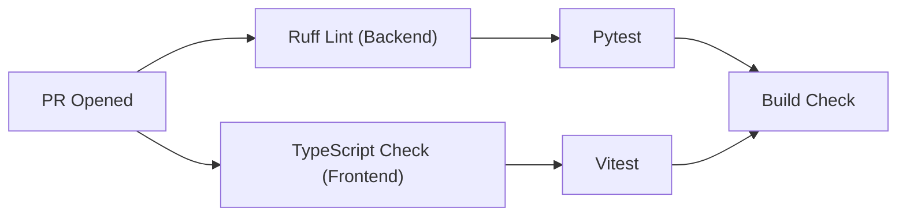
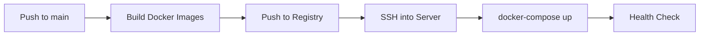

# AegisIQ — GitHub Configuration

> CI/CD workflows, issue templates, and community guidelines.

---

## Structure

```
.github/
├── workflows/           GitHub Actions CI/CD pipelines
│   ├── ci.yml           Lint, typecheck, test on PR
│   ├── deploy.yml       Build and deploy to production
│   └── backup.yml       Scheduled database backup
├── ISSUE_TEMPLATE/      Issue templates
│   ├── bug_report.md
│   ├── feature_request.md
│   └── config.yml
├── PULL_REQUEST_TEMPLATE/  PR templates
│   └── pull_request_template.md
├── CODE_OF_CONDUCT.md   Community guidelines
├── CONTRIBUTING.md      Contribution guide
└── SECURITY.md          Security policy
```

---

## CI/CD Workflows

### `ci.yml` — Continuous Integration

Triggers on: `push` to `develop`, `pull_request` to `develop`



### `deploy.yml` — Deployment

Triggers on: `push` to `main`



---

## Issue Templates

- **Bug Report** — Environment, steps to reproduce, expected vs actual behavior, logs
- **Feature Request** — Problem, proposed solution, alternatives, acceptance criteria

---

## Contributing

See [CONTRIBUTING.md](CONTRIBUTING.md) for:
- Branch naming conventions
- Commit message format
- PR review process
- Code style guidelines
- Testing requirements
