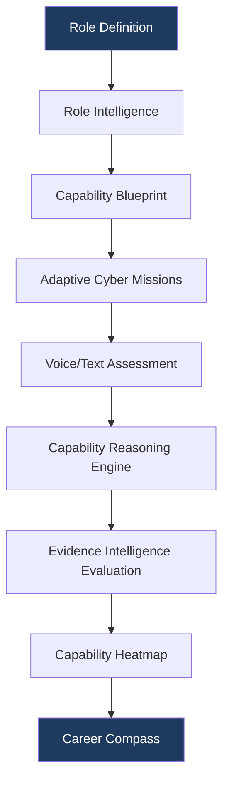
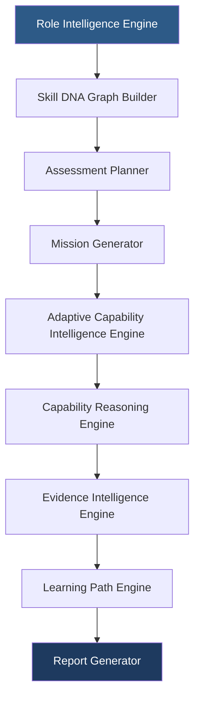
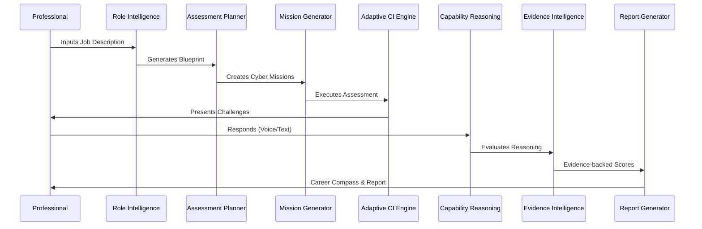

# PWNDORA SkillScan X — Project Overview

| | |
|---|---|
| **Document Version** | 1.0 |
| **Status** | Published |
| **Classification** | Public |
| **Last Updated** | 2026-07-08 |
| **Owner** | Product Team |

## Revision History

| Version | Date | Author | Changes |
|---|---|---|---|
| 1.0 | 2026-07-08 | PWNDORA SkillScan X Team | Initial release |

---

## 1. Executive Summary

### Project Name

PWNDORA SkillScan X

### Category

Adaptive Cybersecurity Capability Intelligence Platform

### Version

1.0

### Authors

PWNDORA SkillScan X Team

### Repository

PWNDORA SkillScan X

### Summary

PWNDORA SkillScan X is an Adaptive Cybersecurity Capability Intelligence Platform that transforms how cybersecurity professionals are assessed, trained, and prepared for real-world security roles. Unlike traditional capability assessment platforms that rely on static questions and subjective evaluations, PWNDORA SkillScan X generates adaptive cybersecurity assessment missions from real role definitions, evaluates professionals using structured cybersecurity reasoning and incident-response workflows, and produces explainable, evidence-backed assessments.

**We do not assess resumes. We assess cybersecurity capability.**

PWNDORA SkillScan X answers a fundamentally different question than existing tools. Instead of *"Can this professional answer interview questions?"*, it answers:

- Can this professional investigate real security incidents?
- Can they prioritize correctly under pressure?
- Can they justify security decisions with evidence?
- Can they communicate technical reasoning clearly?
- Are they operationally ready for a cybersecurity role?

The result is a transparent, evidence-backed assessment experience for professionals, capability analysts, trainers, and organizations.

---

## 2. About PWNDORA SkillScan X

PWNDORA SkillScan X is an intelligent cybersecurity capability platform that combines artificial intelligence with cybersecurity knowledge models to evaluate practical decision-making instead of memorized answers.

The platform creates adaptive capability assessment missions tailored to specific cybersecurity roles, analyzes professional responses through structured reasoning pipelines, maps knowledge against recognized industry frameworks (NICE NIST SP 800-181, MITRE ATT&CK), and produces explainable reports with actionable learning recommendations.

Assessment is one capability of the platform — not its identity. The broader vision encompasses training, certification, workforce analytics, capability intelligence, and enterprise workforce planning.

---

## 3. Vision

To become the global standard for evaluating cybersecurity talent through explainable AI, adaptive capability assessment, and evidence-based reasoning — a platform that trains, evaluates, and places the next generation of cyber defenders.

---

## 4. Mission

To replace subjective cybersecurity capability assessments with transparent, repeatable, and technically grounded evaluations that help organizations hire better professionals and help professionals continuously improve their skills through actionable feedback and guided learning paths.

---

## 5. Problem Overview

### 5.1 The Hiring Gap

Modern cybersecurity recruitment faces systemic failures:

| Problem | Impact |
|---|---|
| Technical capability assessments vary significantly between assessors | Inconsistent professional experience and evaluation standards |
| Professional evaluation is highly subjective | Hiring decisions driven by opinion, not evidence |
| Assessment preparation encourages memorization | Professionals learn answers, not reasoning |
| Capability analysts lack deep cybersecurity expertise | Technical signal is lost in translation |
| AI assessment tools provide generic feedback | Language quality scores do not measure cyber capability |

### 5.2 The Training Gap

| Problem | Impact |
|---|---|
| No realistic practice environment | Learners cannot assess readiness for real incidents |
| Generic feedback from online courses | Scores without explanation offer no improvement path |
| No skill benchmarking against standards | Professionals cannot measure where they stand |

### 5.3 The Assessment Gap

| Problem | Impact |
|---|---|
| No platform combines adaptivity, domain depth, and explainability | Organizations use multiple disjointed tools |
| Most AI evaluation is black-box | Scores cannot be defended or audited |
| Framework alignment is manual or absent | No standardized capability language |

---

## 6. Proposed Solution

PWNDORA SkillScan X transforms cybersecurity hiring into a structured, evidence-based capability assessment process:

---

## 7. Why PWNDORA SkillScan X?

The platform is built around three core ideas that distinguish it from every alternative:

### Explainability

Every score includes natural language rationale with evidence citations from the professional's own responses. No black boxes. No opaque formulas. Professionals and capability analysts alike can see exactly why a score was assigned.

### Adaptability

Assessments evolve in real-time based on professional performance. Questions get harder or easier within a ±2 sigma range. Missions branch based on decisions made. This measures the true skill ceiling, not performance on a fixed set of questions.

### Cybersecurity Awareness

Evaluation is grounded in cybersecurity frameworks (NICE, MITRE ATT&CK) rather than generic language models. The platform understands the difference between good incident response and great incident response — a distinction general AI tools cannot make.

---

## 8. Core Principles

| Principle | Description |
|---|---|
| **Explainable by Design** | Every output must be traceable to evidence |
| **Cybersecurity First** | Domain-specific ontology, not generic language evaluation |
| **Evidence Over Resume** | Scores grounded in professional statements, not AI intuition |
| **Decision-Oriented Assessment** | Measure reasoning process, not answer recall |
| **Capability over Certification** | Practical skill demonstration over paper credentials |
| **Learning over Testing** | Every assessment is a teaching opportunity |
| **Modular AI Architecture** | Replaceable agents with clear interfaces |
| **Human-in-the-Loop** | Platform supports human decisions, does not replace them |
| **Transparent Evaluation** | Every score is auditable and defensible |

---

## 9. Platform Overview

The platform consists of several interconnected modules that form a complete assessment pipeline:

Each module has a clearly defined responsibility, input contract, and output contract. Modules communicate through typed interfaces, not shared state. This design enables independent development, testing, and future extraction to microservices.

---

## 10. Key Features

| Feature | Description |
|---|---|
| Role Intelligence | Parse any cybersecurity JD to extract role, skills, responsibilities, and seniority |
| Adaptive Cyber Missions | Generate realistic incident scenarios that evolve with professional decisions |
| Voice-Based Assessments | Capture spoken responses through browser speech recognition |
| Dynamic Follow-up Questions | Probe reasoning depth with context-aware follow-ups |
| Capability Reasoning Analysis | Evaluate decisions against domain-specific rubrics |
| Explainable AI Evaluation | Every score includes evidence citations and natural language rationale |
| MITRE ATT&CK Mapping | Automatically tag responses with relevant adversary techniques |
| Capability Heatmap | Multi-dimensional visualization of skill strengths and gaps |
| Personalized Career Compass | Prioritized study plan with curated resources |
| Cyber Twin Profile | Persistent digital representation of verified capability |
| Evidence-Based Reports | Complete audit trail with transcript, scores, and rationale |

---

## 11. Core Components

| Component | Responsibility |
|---|---|
| Role Intelligence Engine | Analyze job descriptions, extract capabilities, determine assessment level |
| Skill DNA Graph Builder | Construct hierarchical skill maps from extracted requirements |
| Assessment Planner | Determine mission count, topics, difficulty range, evaluation criteria |
| Mission Generator | Create realistic incident scenarios with sufficient operational context |
| Adaptive Capability Intelligence Engine | Control turn-by-turn assessment flow, manage difficulty adjustment |
| Capability Reasoning Engine | Extract concepts, validate workflow, analyze decisions, evaluate risk |
| MITRE Mapper | Tag responses with relevant ATT&CK technique IDs |
| Evidence Intelligence Engine | Produce evidence-backed score rationale in natural language |
| Learning Path Engine | Identify skill gaps, rank topics by impact, associate resources |
| Report Generator | Build capability heatmap, assessment reports, and Career Compass |

---

## 12. System Workflow

### Flow Description

1. Professional uploads or selects a cybersecurity job description
2. Role Intelligence Engine analyzes the JD and extracts capability requirements
3. Assessment Planner creates a blueprint: mission count, topics, difficulty, duration, evaluation criteria
4. Mission Generator creates realistic incident scenarios
5. Adaptive Capability Intelligence Engine conducts the conversational assessment
6. Professional responds via voice or text
7. Capability Reasoning Engine evaluates each response against structured rubrics
8. Evidence Intelligence Engine produces scores with evidence citations
9. Report Generator builds the capability report and Career Compass

---

## 13. Technology Stack — 7-Layer Architecture

### Layer 1: Presentation Layer

| Technology | Purpose |
|---|---|
| React + TypeScript | Component-based UI with type safety |
| Tailwind CSS | Utility-first responsive styling |
| React Router | Client-side navigation |
| TanStack Query | Server state management and caching |
| Web Speech API | Browser-based voice capture |

### Layer 2: API Gateway Layer

| Technology | Purpose |
|---|---|
| FastAPI (Python 3.12+) | Async REST API with auto-OpenAPI docs |
| Uvicorn | ASGI server |

### Layer 3: Adaptive Intelligence Layer

| Technology | Purpose |
|---|---|
| Adaptive Assessment Pipeline | Real-time difficulty calibration (±2 sigma) |
| Session Orchestrator | Turn-by-turn conversation management |
| Skill DNA Analyzer | Capability fingerprint extraction |

### Layer 4: AI Decision Engine

| Technology | Purpose |
|---|---|
| OpenAI GPT-4o | LLM inference for all AI agents |
| Structured JSON Outputs | Type-safe agent communication |
| Custom Agent Pipeline | 6 specialized agents with typed interfaces |

### Layer 5: Learning Orchestration Layer

| Technology | Purpose |
|---|---|
| Career Compass Engine | Personalized learning path generation |
| Learning Path Engine | Gap-ranked topic recommendation |
| Resource Curator | Article, lab, and course association |

### Layer 6: Community Intelligence Layer

| Technology | Purpose |
|---|---|
| Benchmarking Engine | Cross-professional capability comparison |
| Skill DNA Aggregator | Anonymous trend analysis |
| Role Market Insights | Demand-driven skill gap identification |

### Layer 7: Data Platform

| Technology | Purpose |
|---|---|
| SQLAlchemy 2.x | Database ORM with async support |
| Pydantic 2.x | Request/response validation and settings management |
| SQLite (MVP) | Zero-config, file-based, WAL mode for concurrency |
| PostgreSQL (Production) | Scalable, concurrent, managed database |

### Infrastructure

| Technology | Purpose |
|---|---|
| Docker Compose | Single-command local deployment |
| Nginx | Reverse proxy and static file serving |
| GitHub Actions | CI/CD pipeline |

---

## 14. Target Users

### Primary Users

| Persona | Description | Primary Need |
|---|---|---|
| Cybersecurity Student | Age 18-24, preparing for first role | Realistic practice with actionable feedback |
| Fresh Graduate | Age 22-26, seeking first cybersecurity job | Capability validation and skill preparation |
| SOC Analyst | 1-3 years experience, seeking advancement | Skill benchmarking and gap analysis |

### Secondary Users

| Persona | Description | Primary Need |
|---|---|---|
| Capability Analyst | Screens technical professionals | Standardized, defensible evaluation |
| SOC Manager | Leads security operations team | Reasoning assessment and consistent process |
| Cybersecurity Trainer | Bootcamp or university instructor | Cohort progress measurement |
| University | Cybersecurity program administrator | Outcome demonstration and placement improvement |

---

## 15. Value Proposition

### For Professionals

| Value | Detail |
|---|---|
| Realistic role-specific assessments | Practice with scenarios that mirror actual job challenges |
| Transparent feedback | Understand exactly why you scored what you did |
| Continuous improvement guidance | Clear learning path from current skill to target role |

### For Capability Analysts

| Value | Detail |
|---|---|
| Standardized evaluations | Every professional assessed against the same rubric |
| Reduced screening effort | AI conducts deep technical screening at scale |
| Evidence-based reports | Defensible scores with transcript citations |

### For Organizations

| Value | Detail |
|---|---|
| Better hiring consistency | Same standard applied to every professional |
| Technical capability benchmarking | Clear visibility into professional capabilities |
| Reduced assessor bias | Standardized rubric removes subjectivity |

---

## 16. Product Differentiators

| Traditional AI Assessment Tools | PWNDORA SkillScan X |
|---|---|
| Static questions | Adaptive cyber missions that evolve |
| Generic language evaluation | Cybersecurity-specific reasoning assessment |
| Black-box scoring | Explainable evidence for every score |
| Single overall score | Multi-dimensional capability profile |
| Generic recommendations | Personalized Career Compass with resources |
| Language quality focused | Operational decision-making focused |
| No framework alignment | NICE + MITRE ATT&CK integrated |
| No audit trail | Complete transcript with per-response scoring |

---

## 17. Business Value

| Stakeholder | Value Created |
|---|---|
| Professionals | Assessment readiness, skill gap visibility, confidence building |
| Capability Analysts | 10x screening efficiency, standardized process, defensible decisions |
| SOC Managers | Transparent reasoning assessment, reduced bad hires |
| Universities | Measurable student readiness, placement rate improvement |
| Trainers | Cohort analytics, curriculum gap identification |
| Organizations | Higher quality hiring, reduced time-to-fill, standardized capability data |

---

## 18. Development Strategy

### Phase 1 — MVP

| Focus | Deliverables |
|---|---|
| Core assessment pipeline | JD analysis → adaptive assessment → reasoning evaluation → report |
| Chat-based interface | Conversational UI with streaming AI responses |
| Framework scoring | NICE domain scores with explainable rationale |
| MITRE mapping | Automatic technique tagging |
| Career Compass | Personalized topic recommendations with resources |

### Phase 2 — Post-MVP

| Focus | Deliverables |
|---|---|
| Enterprise features | Cohort management, batch invites, custom rubrics |
| Analytics | Aggregate reporting, trend analysis, curriculum insights |
| Voice assessment | Browser speech recognition integration |

### Phase 3 — Scale

| Focus | Deliverables |
|---|---|
| Integration | REST API, ATS connectors, SSO/SAML |
| Platform depth | Hands-on labs, SIEM log replay, cloud scenarios |
| Intelligence | Multi-model AI routing, team analytics, workforce planning |

---

## 19. Future Vision

PWNDORA SkillScan X will evolve from a capability intelligence platform into a complete Adaptive Cybersecurity Capability Intelligence Platform:

| Capability | Description |
|---|---|
| ATS Integration | Direct submission to Greenhouse, Lever, Workday, LinkedIn |
| Enterprise Analyst Dashboard | Batch invites, cohort analytics, comparison views |
| SIEM Log Replay Missions | Real log data for investigation scenarios |
| Cloud Security Assessments | AWS/Azure/GCP incident response scenarios |
| Active Directory Attack Simulations | AD-specific compromise and defense missions |
| Hands-on Lab Integration | Browser-based terminal for live environment tasks |
| Team Capability Analytics | Aggregate readiness benchmarking for entire SOC teams |
| Multi-Model AI Orchestration | Route to best LLM per agent for cost/quality optimization |
| Certification Pathways | Continuous skills tracking and recertification support |
| Workforce Planning Intelligence | Predictive gap analysis for team composition |

---

## 20. Conclusion

PWNDORA SkillScan X reimagines cybersecurity assessment by replacing static capability assessment preparation with adaptive, explainable, and evidence-based capability evaluation. It is designed not merely as an assessment assistant, but as an **Adaptive Cybersecurity Capability Intelligence Platform** that measures operational readiness, supports continuous learning, and provides organizations with transparent insights into cybersecurity talent.

The platform stands at the intersection of three growing markets — cybersecurity workforce development, AI-powered HR technology, and technical skills assessment — and occupies a space no existing product cleanly fills. By focusing on reasoning quality rather than answer recall, and by making every score explainable and defensible, PWNDORA SkillScan X delivers value to professionals, capability analysts, and organizations alike.

## Related Documents

- [Problem Statement](02-problem-statement.md)
- [Solution Overview](03-solution-overview.md)
- [Vision & Mission](04-vision-mission.md)
- [Product Requirements](05-product-requirements.md)
- [System Architecture](../docs/04-architecture/16-system-architecture.md)
- [Glossary](../docs/reference/glossary.md)
