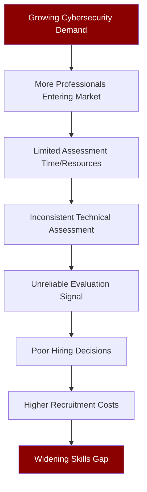

# PWNDORA SkillScan X — Problem Statement

| | |
|---|---|
| **Document Version** | 1.0 |
| **Status** | Published |
| **Classification** | Public |
| **Last Updated** | 2026-07-08 |
| **Owner** | Product Team |

## Revision History

| Version | Date | Author | Changes |
|---|---|---|---|
| 1.0 | 2026-07-08 | PWNDORA SkillScan X Team | Initial release |

---

## 1. Executive Summary

Cybersecurity has become one of the fastest-growing technology domains, yet organizations worldwide continue to struggle with identifying qualified security professionals. Despite significant growth in cybersecurity education, certifications, and online training platforms, companies consistently report difficulties in determining whether professionals possess practical incident-response skills or simply theoretical knowledge.

The challenge is no longer attracting applicants. The challenge is accurately evaluating them.

This document defines the systemic problems in cybersecurity hiring and assessment, establishes the root causes, and provides the foundation for PWNDORA SkillScan X's solution design.

---

## 2. Industry Background

### 2.1 The Growing Demand

The cybersecurity industry is evolving rapidly. Organizations now require professionals capable of:

| Capability | Criticality |
|---|---|
| Incident Detection and Response | Critical |
| Threat Hunting | High |
| Security Monitoring (SIEM) | Critical |
| Digital Forensics | High |
| Malware Analysis | Medium |
| Cloud Security | Critical |
| Identity and Access Management | High |
| Security Automation | Medium |
| Risk Analysis | High |

### 2.2 Stagnant Recruitment Methods

Despite the evolution of cybersecurity roles, recruitment methods have changed very little. Most capability assessments still rely on:

- Resume screening based on keywords and certifications
- Generic technical questions that measure recall
- Subjective assessor opinions with no standardized rubric
- Inconsistent evaluation criteria across professionals and assessors

The gap between what cybersecurity roles require and how professionals are evaluated widens every year.

---

## 3. Current Hiring Landscape

### 3.1 The Standard Process

```
Resume Submission
      │
      ▼
Resume Screening (keyword match, years of experience, certifications)
      │
      ▼
Phone Screen (HR generalist, behavioral questions)
      │
      ▼
Technical Assessment (varies wildly by company and assessor)
      │
      ▼
Hiring Decision (subjective, no standardized framework)
```

### 3.2 Where It Breaks

Problems emerge during the technical assessment stage because evaluation depends entirely on the individual assessor's expertise, preparation, and bias. There is no standardized methodology for assessing cybersecurity capability.

| Stage | Problem |
|---|---|
| Resume screening | Keywords and certifications do not measure practical ability |
| Phone screen | Non-technical capability analysts cannot assess technical depth |
| Technical assessment | No standard rubric; quality varies by assessor |
| Hiring decision | Subjective perception drives outcomes, not evidence |

---

## 4. Existing Recruitment Process

### 4.1 Resume Evaluation

Professionals are shortlisted based on education, certifications, and previous experience. This approach systematically filters out self-taught talent and overvalues paper credentials.

### 4.2 Technical Questions

Assessors ask theoretical questions such as:

- "What is SIEM?"
- "Explain the CIA Triad."
- "What is MITRE ATT&CK?"
- "Describe a recent security vulnerability."

These questions measure recall of definitions, not the ability to apply concepts in real incidents.

### 4.3 Scenario Questions

Some organizations ask hypothetical incident-response questions. However:

- Scenarios are inconsistent across assessors
- Evaluation criteria differ between professionals
- Feedback is rarely structured or actionable
- No two professionals receive the same assessment

### 4.4 Hiring Decision

Final decisions are based on assessor perception rather than standardized capability measurement. There is no audit trail for why one professional was chosen over another.

---

## 5. Core Problems

### Problem 1: Subjective Evaluation

Different assessors evaluate the same professional differently. A professional who impresses one assessor may be dismissed by another. There is no calibration across evaluators.

### Problem 2: Memorization over Reasoning

Professionals prepare by memorizing common capability assessment questions instead of learning how to investigate real incidents. The assessment rewards recall, not thinking.

### Problem 3: Lack of Explainability

Professionals receive feedback such as:
- "Needs improvement."
- "Not technically strong enough."
- "Good communication but lacks depth."

These statements explain nothing. Professionals leave without understanding what they did wrong or how to improve.

### Problem 4: Inconsistent Assessment

There is no standardized assessment framework across organizations — or even across assessors within the same organization. The same professional may be rated highly by one company and rejected by another for the same responses.

### Problem 5: Capability Analyst Dependency

Non-technical capability analysts are expected to assess cybersecurity professionals before forwarding them to technical teams. They lack the domain knowledge to make accurate initial assessments.

### Problem 6: Limited Feedback

Most professionals leave capability assessments without actionable guidance. The assessment is a pass/fail gate, not a learning experience. This is a missed opportunity — every assessment could help a professional improve.

---

## 6. Root Cause Analysis



The root cause is not a lack of professionals. It is unreliable evaluation. Organizations cannot distinguish between professionals who have memorized answers and professionals who can actually respond to a security incident.

---

## 7. Stakeholders

### 7.1 Professionals

| Need | Current State |
|---|---|
| Fair evaluation | Evaluation quality depends on luck of the assessor draw |
| Transparent feedback | Scores without explanation; no actionable guidance |
| Practical improvement path | No connection between assessment performance and learning plan |

### 7.2 Capability Analysts

| Need | Current State |
|---|---|
| Faster screening | Deep technical screening requires hours per professional |
| Standardized reports | No consistent format for professional technical evaluation |
| Domain-appropriate assessment | Cannot personally evaluate cybersecurity depth |

### 7.3 Hiring Managers (SOC Managers, Security Directors)

| Need | Current State |
|---|---|
| Reliable technical evaluation | Assessment signal is noisy and inconsistent |
| Decision support | No evidence-based rationale to support hiring decisions |
| Reduced assessment effort | Senior team members spend hours on initial screens |

### 7.4 Universities and Bootcamps

| Need | Current State |
|---|---|
| Placement preparation | Cannot provide realistic assessment practice at scale |
| Objective skill measurement | Grades and certifications do not predict assessment success |
| Outcome demonstration | Cannot prove graduate readiness to employer partners |

### 7.5 Training Providers

| Need | Current State |
|---|---|
| Assessment tools | Limited to multiple-choice quizzes |
| Progress tracking | Cannot measure practical skill improvement |
| Practical evaluation | No way to assess incident response capability |

---

## 8. Current Solutions

### 8.1 AI Assessment Platforms

| Aspect | Assessment |
|---|---|
| Strengths | Automated question generation, voice assessment support, broad coverage |
| Limitations | Generic scoring models, minimal cybersecurity domain awareness, black-box evaluation, limited explainability |

### 8.2 Coding Assessment Platforms

| Aspect | Assessment |
|---|---|
| Strengths | Rigorous technical evaluation for programming roles |
| Limitations | Limited cybersecurity coverage, no incident reasoning evaluation, no framework alignment |

### 8.3 Manual Assessments

| Aspect | Assessment |
|---|---|
| Strengths | Human expertise, adaptive questioning, contextual understanding |
| Limitations | Time-consuming, expensive, subjective, impossible to standardize at scale |

### 8.4 Certification Exams

| Aspect | Assessment |
|---|---|
| Strengths | Standardized content, industry recognition |
| Limitations | Theoretical focus, infrequent scheduling, no practical reasoning assessment |

---

## 9. Gaps in Existing Solutions

Current tools fail to evaluate:

| Gap | Why It Matters |
|---|---|
| Operational thinking | Can the professional work through an incident step by step? |
| Decision prioritization | Does the professional know what to do first? |
| Incident workflow | Does the professional follow proper IR methodology? |
| Risk trade-offs | Does the professional understand the consequences of their decisions? |
| Evidence preservation | Does the professional know how to handle forensic evidence? |
| Cybersecurity-specific reasoning | Does the professional think like a security professional, not a general IT generalist? |

Most systems evaluate **answers**. Very few evaluate **thinking**. This is the fundamental gap PWNDORA SkillScan X addresses.

---

## 10. Impact Analysis

### 10.1 Impact on Professionals

| Impact | Consequence |
|---|---|
| Poor assessment preparation | Repeated rejection without understanding why |
| Limited growth feedback | Same mistakes across multiple assessments |
| Confidence erosion | Good professionals leave the field due to opaque rejection |

### 10.2 Impact on Capability Analysts

| Impact | Consequence |
|---|---|
| High screening effort | Hours per professional for unreliable signal |
| Inconsistent evaluation | Cannot defend hiring decisions with evidence |
| High false positive/negative rate | Wrong hires cost 6-12 months of salary |

### 10.3 Impact on Organizations

| Impact | Consequence |
|---|---|
| Poor hiring decisions | Teams staffed with underqualified personnel |
| Longer recruitment cycles | Positions unfilled for 60-90 days on average |
| Increased onboarding costs | New hires require extensive remediation training |
| Security posture weakened | Underqualified teams miss or mishandle incidents |

---

## 11. Opportunity

The cybersecurity industry requires a capability intelligence platform capable of:

| Requirement | Current State |
|---|---|
| Understanding cybersecurity job roles | Manual analysis by capability analysts |
| Generating adaptive assessments | Static question banks |
| Evaluating reasoning instead of memorization | Not available |
| Producing explainable reports | Black-box scores |
| Supporting continuous learning | No feedback loop |
| Aligning with industry frameworks | Manual mapping or absent |

This gap represents a significant market opportunity at the intersection of cybersecurity workforce development, AI-powered assessment, and HR technology.

---

## 12. Why Existing AI Falls Short

### 12.1 The Simple AI Assessment Model

Most AI assessment systems use a naive workflow:

```
Question
    │
    ▼
Professional Answer
    │
    ▼
LLM Evaluation
    │
    ▼
Score
```

### 12.2 Why This Fails for Cybersecurity

| Issue | Consequence |
|---|---|
| Scores are difficult to justify | No audit trail for why a score was assigned |
| Domain expertise varies | General LLMs lack deep cybersecurity knowledge |
| Feedback lacks consistency | Same answer scored differently across sessions |
| Hallucinations reduce trust | LLMs invent criteria or misattribute evidence |
| No framework grounding | Scores do not map to NICE, MITRE, or any standard |

Cybersecurity assessment requires structured reasoning evaluation, not free-form LLM scoring. The difference between a good incident response answer and a great one requires domain-specific rubrics, not general language understanding.

---

## 13. Design Goals

A successful solution must satisfy these design goals:

| Goal | Description |
|---|---|
| Standardize assessments | Every professional evaluated against the same rubric and framework |
| Adapt to job roles | Assessment parameters derived from the specific role, not a generic template |
| Evaluate operational reasoning | Measure how professionals think through incidents, not what they recall |
| Explain every score | Natural language rationale with evidence citations from professional responses |
| Support all stakeholders | Serve professionals, capability analysts, hiring managers, and educators equally |
| Remain modular | Each component independently replaceable and testable |
| Augment human judgment | Platform supports hiring decisions, does not automate them |

---

## 14. Final Problem Statement

> Organizations lack a standardized, explainable, and cybersecurity-aware capability intelligence platform capable of evaluating practical incident-response reasoning, technical capability, and operational decision-making across diverse cybersecurity roles. Existing tools either measure recall instead of reasoning, evaluate language instead of cyber domain knowledge, or provide scores without explanation — leaving capability analysts without defensible evidence and professionals without actionable feedback.

## Related Documents

- [Project Overview](01-project-overview.md)
- [Solution Overview](03-solution-overview.md)
- [Market Analysis](../docs/02-research/06-market-analysis.md)
- [Competitor Analysis](../docs/02-research/07-competitor-analysis.md)
- [User Personas](../docs/02-research/08-user-personas.md)

---

## 15. Expected Outcome

A successful solution will demonstrate:

| Outcome | Measure |
|---|---|
| Improved assessment consistency | Same rubric applied to every professional |
| Reduced capability analyst screening time | Technical evaluation automated, reports generated instantly |
| Transparent professional evaluations | Every score includes evidence citation and rationale |
| Actionable professional feedback | Personalized Career Compass from skill gap analysis |
| Informed hiring decisions | Multi-dimensional capability profile, not a single score |
| Framework-aligned assessment | Scores mapped to NICE and MITRE ATT&CK |

PWNDORA SkillScan X is positioned as a **decision-support platform** that augments human capability analysts and assessors — not as a replacement for human judgment. This distinction is critical: the platform standardizes and explains, but hiring decisions remain with qualified human evaluators.

---

## 16. Success Criteria

| Criterion | Target |
|---|---|
| Adaptive assessment generation | From job description to first mission in < 15 seconds |
| Cybersecurity-specific evaluation | Scores based on domain rubrics, not general language quality |
| Evidence-backed scoring | Every score cites specific professional statements |
| Explainable reports | Natural language rationale for each assessment dimension |
| Personalized learning | Career Compass with 3+ prioritized topics and resources |
| Reliable demo operation | Complete assessment flow without errors |

---

## References

- ISC² Cybersecurity Workforce Study 2025
- NIST NICE Framework SP 800-181 Rev 1
- MITRE ATT&CK v15
- LinkedIn Talent Solutions Hiring Reports
- Gartner Market Guide for Skills Assessment Platforms
