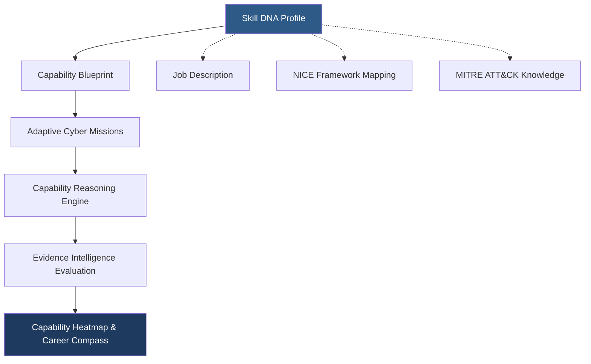
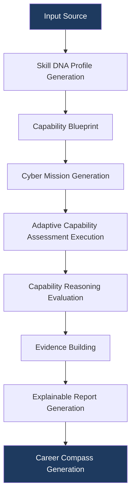

# PWNDORA SkillScan X — Solution Overview

| | |
|---|---|
| **Document Version** | 1.0 |
| **Status** | Published |
| **Classification** | Public |
| **Last Updated** | 2026-07-08 |
| **Owner** | Product Team |

## Revision History

| Version | Date | Author | Changes |
|---|---|---|---|
| 1.0 | 2026-07-08 | PWNDORA SkillScan X Team | Initial release |

---

## 1. Executive Summary

### Product Name

PWNDORA SkillScan X

### Product Category

Adaptive Cybersecurity Capability Intelligence Platform

### Description

PWNDORA SkillScan X is an Explainable AI platform designed to evaluate cybersecurity capability through adaptive incident-driven assessments. Instead of measuring memorized answers, the platform measures technical reasoning, operational decision-making, incident response workflow, communication, and cybersecurity knowledge using structured AI pipelines and evidence-backed evaluation.

**We do not assess resumes. We assess cybersecurity capability.**

PWNDORA SkillScan X acts as a **decision-support platform** for capability analysts while simultaneously providing professionals with personalized learning recommendations. It augments human hiring decisions — it does not replace them.

---

## 2. Solution Philosophy

Traditional assessment platforms evaluate **what a professional says**. PWNDORA SkillScan X evaluates **how a professional thinks**.

Instead of asking isolated questions, PWNDORA SkillScan X creates realistic cybersecurity missions where every decision influences the next stage of the assessment. The objective is to measure operational readiness rather than theoretical recall.

| Traditional Approach | PWNDORA SkillScan X Approach |
|---|---|
| Question → Answer → Score | Mission → Decision → Reasoning → Evidence → Profile |
| Measures recall | Measures thinking |
| Static difficulty | Adaptive ±2 sigma |
| Single score | Multi-dimensional capability profile |
| Black box | Explainable with evidence citations |

---

## 3. Product Overview

PWNDORA SkillScan X combines multiple intelligent modules into one integrated platform. The system performs job description analysis, capability identification, assessment planning, mission generation, adaptive capability assessment, capability reasoning evaluation, explainable AI analysis, and learning recommendation generation.

All assessments are grounded in cybersecurity concepts rather than generic language evaluation. The platform aligns with NICE NIST SP 800-181 and MITRE ATT&CK frameworks.

---

## 4. High-Level Solution

### 4.1 Architecture Overview



### 4.2 Why the Skill DNA Profile?

A Job Description is just **one input** into a richer role model. By making the **Skill DNA Profile** the primary artifact, PWNDORA SkillScan X can:

- Accept input from multiple sources (JD, framework, manual configuration)
- Support universities assessing against curriculum standards, not just job descriptions
- Enable certification bodies to map assessments to their own capability models
- Allow enterprise customers to define proprietary role templates

The Role Intelligence Engine parses job descriptions into the Skill DNA Profile format. Other input sources can do the same, making the system extensible beyond recruitment.

---

## 5. Core Principles

| Principle | Description |
|---|---|
| **Explainability** | Every assessment result must include supporting evidence in natural language |
| **Adaptability** | Assessments dynamically evolve based on professional performance (±2 sigma) |
| **Cybersecurity Awareness** | Evaluation uses cybersecurity-specific knowledge models, not generic AI scoring |
| **Transparency** | Professionals understand why scores were assigned, with evidence citations |
| **Consistency** | Every professional is evaluated using the same structured methodology and rubrics |
| **Continuous Learning** | Assessments end with actionable improvement plans and prioritized Career Compass |
| **Capability over Certification** | Practical skill demonstration over paper credentials |
| **Evidence over Resume** | Scores grounded in demonstrated capability, not listed experience |
| **Learning over Testing** | Every assessment leaves the professional better equipped |
| **Explainability over Black-Box AI** | Every score is traceable to specific evidence |
| **Human Decision Support** | Platform supports hiring decisions but does not replace human assessors |

---

## 6. Platform Workflow



---

## 7. Platform Modules

### Module 1: Role Intelligence Engine

| Input | Output |
|---|---|
| Job description text | Extracted role title, seniority, skills, certifications, responsibilities, domain |

Extracts structured capability requirements from unstructured job description text. Uses LLM-based parsing with schema-enforced extraction to ensure consistent output.

### Module 2: Skill DNA Graph Builder

| Input | Output |
|---|---|
| Extracted role requirements | Hierarchical graph of skills, concepts, frameworks, and their relationships |

Builds relationships between skills, concepts, frameworks, responsibilities, and learning objectives. The graph informs mission generation and evaluation scope.

### Module 3: Assessment Planner

| Input | Output |
|---|---|
| Skill DNA graph + Skill DNA Profile | Mission count, question difficulty, scenario complexity, assessment duration, NICE domains to evaluate |

Determines the optimal assessment structure based on role seniority, required capabilities, and evaluation depth requirements.

### Module 4: Mission Generator (Practical Challenges)

| Input | Output |
|---|---|
| Capability Blueprint | Realistic cybersecurity incident scenarios with operational context |

Creates adaptive cybersecurity scenarios — phishing investigations, PowerShell attacks, credential theft, ransomware response — each with sufficient context for informed decision-making.

### Module 5: Adaptive Capability Intelligence Engine

| Input | Output |
|---|---|
| Mission definitions + professional responses | Turn-by-turn conversation management with difficulty adjustment |

Controls mission progression, difficulty adjustment (±2 sigma), and dynamic follow-up questions that probe reasoning depth.

### Module 6: Capability Reasoning Engine

| Input | Output |
|---|---|
| Professional responses | Evaluated concepts, workflow validation, decision quality, risk assessment, MITRE techniques |

The heart of the platform. Evaluates technical reasoning, incident workflow, decision quality, risk awareness, and cybersecurity concept coverage against structured rubrics.

### Module 7: Evidence Intelligence Engine

| Input | Output |
|---|---|
| Capability reasoning results | Supporting evidence, strengths, weaknesses, missing concepts, score justification |

Generates natural language explanations for every score dimension, citing specific professional statements as evidence and identifying gaps in coverage.

### Module 8: Learning Path Engine

| Input | Output |
|---|---|
| Skill gaps from assessment | Prioritized learning topics with curated resources |

Creates personalized learning recommendations ranked by gap impact and prerequisite order, with associated labs, articles, and courses.

### Module 9: Report Generator

| Input | Output |
|---|---|
| All assessment data | Capability heatmap, assessment report, Career Compass in capability-analyst-friendly and professional-friendly formats |

Produces the final output artifacts consumed by professionals, capability analysts, and trainers.

---

## 8. User Workflows

### 8.1 Professional Workflow

```
Upload or select job description
      │
      ▼
Review identified capabilities
      │
      ▼
Start adaptive capability assessment
      │
      ▼
Complete cyber missions (voice or text)
      │
      ▼
Receive explainable capability report
      │
      ▼
Review personalized Career Compass
      │
      ▼
Practice on weak areas
      │
      ▼
Reassess to measure improvement
```

### 8.2 Capability Analyst Workflow

```
Upload job description or select role template
      │
      ▼
Capability Blueprint generated automatically
      │
      ▼
Invite professional(s) via email link
      │
      ▼
Professional completes assessment
      │
      ▼
Receive capability report with evidence
      │
      ▼
Review readiness profile and assessment focus areas
      │
      ▼
Schedule final technical interview with targeted questions
```

### 8.3 Trainer/Educator Workflow

```
Define assessment based on curriculum
      │
      ▼
Assign to cohort of students
      │
      ▼
Monitor completion progress
      │
      ▼
Review cohort analytics and skill distribution
      │
      ▼
Identify curriculum gaps from aggregate data
      │
      ▼
Adjust teaching focus based on evidence
```

---

## 9. Professional Journey (Detailed)

| Stage | Activity | System Action | Duration |
|---|---|---|---|
| 1 | Selects target role | Loads Skill DNA Profile from library | 1 min |
| 2 | Reviews assessment overview | Generates mission briefing | 1 min |
| 3 | Mission 1: Phishing Investigation | Presents email analysis scenario | 5-7 min |
| 4 | Mission 2: PowerShell Attack | Adapts based on Mission 1 performance | 5-7 min |
| 5 | Mission 3: Credential Theft | Adjusts difficulty ±2 sigma | 5-7 min |
| 6 | Mission 4: Ransomware | Concludes assessment | 5-7 min |
| 7 | Reviews results | Generates full report | Instant |
| 8 | Studies Career Compass | Produces prioritized learning plan | On-demand |

---

## 10. Capability Analyst Journey (Detailed)

| Stage | Activity | System Action | Duration |
|---|---|---|---|
| 1 | Uploads JD | Role Intelligence parses requirements | 5 sec |
| 2 | Reviews blueprint | Assessment Planner proposes structure | 1 min |
| 3 | Invites professional | System generates unique assessment link | 30 sec |
| 4 | Waits for completion | System monitors progress | Variable |
| 5 | Reviews report | Report Generator produces full assessment | Instant |
| 6 | Decides next steps | Report includes assessment focus recommendations | 15 min |

---

## 11. AI Workflow

```mermaid
flowchart LR
    RI[Role Input] --> PS[Parse & Structure]
    PS --> CM[Capability Mapping]
    CM --> AP[Assessment Planning]
    AP --> MG[Mission Generation]
    MG --> ACA[Adaptive Capability Assessment]
    ACA --> CRE[Capability Reasoning]
    CRE --> EIE[Evidence Intelligence]
    EIE --> CC[Career Compass]
    CC --> RA[Report Assembly]

    style RI fill:#1e3a5f,color:#fff
    style RA fill:#1e3a5f,color:#fff
```



---

## 12. Cyber Assessment Workflow

```
Mission Scenario Presented
      │
      ▼
Professional Response (voice or text)
      │
      ▼
Concept Extraction — What cybersecurity concepts did the professional address?
      │
      ▼
Workflow Validation — Did the response follow proper IR methodology?
      │
      ▼
Decision Analysis — Was the decision justified? Were alternatives considered?
      │
      ▼
Risk Evaluation — Did the professional identify operational trade-offs?
      │
      ▼
MITRE ATT&CK Mapping — Which techniques does the response address?
      │
      ▼
Rubric Matching — Score against NICE framework criteria
      │
      ▼
Evidence Generation — Specific statements that support each score
      │
      ▼
Assessment Dimension Score
```

---

## 13. Evidence Intelligence Workflow

```
Raw Assessment Scores
      │
      ▼
Identify Supporting Evidence — Find specific professional statements that justify the score
      │
      ▼
Catalog Covered Concepts — List cybersecurity concepts the professional addressed
      │
      ▼
Identify Missing Concepts — List relevant concepts the professional did not address
      │
      ▼
Generate Reasoning Summary — Natural language explanation of the assessment
      │
      ▼
Produce Recommendations — Actionable guidance based on gaps
      │
      ▼
Explainable Report Section
```

### Example Evidence Intelligence Output

```
Domain: Incident Response (IR-001)
Score: 72/100
Confidence: High

Covered:
  - IOC collection methodology
  - SIEM log analysis
  - Host containment procedures

Missing:
  - Memory acquisition (volatility)
  - Chain of custody documentation
  - Root cause analysis depth

Impact: Professional demonstrates solid triage capability but
would benefit from forensic procedure training. Evidence
preservation gaps could compromise incident investigation.

Evidence: "I would isolate the host from the network"
indicates containment awareness (IR-001-03). However,
no mention of forensic imaging before isolation suggests
gap in evidence preservation workflow.
```

---

## 14. Learning Workflow

```
Assessment Results
      │
      ▼
Skill Classification — Map scores to NICE framework categories
      │
      ▼
Weak Area Identification — Domains below defined threshold
      │
      ▼
Gap Prioritization — Rank by impact on overall capability
      │
      ▼
Resource Association — Curated labs, articles, courses per topic
      │
      ▼
Prerequisite Ordering — Ensure foundational topics precede advanced
      │
      ▼
Personalized Career Compass — Prioritized list with time estimates
      │
      ▼
Practice Assessment — Targeted mini-assessment on weak areas
      │
      ▼
Full Reassessment — Measure improvement across all domains
```

---

## 15. Platform Outputs

### Professional-Facing Outputs

| Output | Format | Purpose |
|---|---|---|
| Capability Profile | Overall readiness level + domain scores | Know where you stand |
| Cyber Readiness Dashboard | Radar chart, trend lines, gap indicators | Visual strength/weakness map |
| Capability Heatmap | 6-8 dimension radar chart | At-a-glance capability view |
| Assessment Timeline | Per-mission scores and progression | Granular performance breakdown |
| Career Compass | Prioritized topics with resources and time estimates | Know what to study next |
| Cyber Twin Profile | Persistent digital representation of verified capability | Portable credential |

### Capability Analyst-Facing Outputs

| Output | Format | Purpose |
|---|---|---|
| Assessment Summary | One-page overview with key metrics | Quick decision support |
| Capability Matrix | Detailed domain and sub-domain scores | Deep technical evaluation |
| Technical Strengths | Top 3-5 areas of demonstrated capability | Hiring justification |
| Improvement Areas | Specific gaps with evidence citations | Assessment focus guidance |
| Assessment Focus Recommendations | Topics to probe in follow-up human interview | Human-AI collaboration |

### Trainer/Educator Outputs

| Output | Format | Purpose |
|---|---|---|
| Cohort Performance | Aggregate scores across students | Class-level capability view |
| Skill Distribution | Per-domain distribution charts | Curriculum gap identification |
| Progress Tracking | Score changes across multiple assessments | Individual improvement measurement |

---

## 16. Product Benefits

### For Professionals

| Benefit | Detail |
|---|---|
| Realistic preparation | Practice with scenarios that mirror actual job challenges |
| Transparent evaluation | Understand exactly why you scored what you scored |
| Personalized improvement | Career Compass from current skill to target capability |

### For Capability Analysts

| Benefit | Detail |
|---|---|
| Consistent technical screening | Same rubric and methodology for every professional |
| Reduced assessment workload | AI conducts deep technical assessment at scale |
| Structured assessment reports | Evidence-backed candidate profiles for hiring decisions |

### For Organizations

| Benefit | Detail |
|---|---|
| Standardized hiring | Same evaluation framework across all professionals and roles |
| Better capability visibility | Granular view of candidate capabilities beyond a single score |
| Improved recruitment quality | Data-driven hiring decisions with explainable rationale |

---

## 17. Technical Advantages

| Advantage | PWNDORA SkillScan X | Conventional Tools |
|---|---|---|
| Assessment type | Adaptive incident missions | Static Q&A or multiple choice |
| AI approach | Domain-specific reasoning pipeline | Generic language model scoring |
| Explainability | Evidence citations + natural language | Black-box score |
| Framework alignment | NICE + MITRE ATT&CK integrated | Manual or absent |
| Evaluation target | Reasoning quality and workflow | Answer correctness |
| Architecture | Modular, replaceable agents | Monolithic or opaque pipeline |
| Output dimensionality | Multi-dimensional profile | Single score or pass/fail |
| Learning integration | Built-in Career Compass generation | Separate or absent |

---

## 18. Future Vision

| Capability | Description | Phase |
|---|---|---|
| Enterprise capability analyst portal | Batch invites, cohort management, comparison views | 2 |
| ATS integration | Direct submission to Greenhouse, Lever, Workday | 2 |
| Hands-on cyber labs | Browser-based terminal for live environment tasks | 2 |
| SIEM log replay missions | Real log data for investigation scenarios | 3 |
| Cloud security assessments | AWS/Azure/GCP incident response scenarios | 3 |
| Purple team assessments | Combined offensive/defensive evaluation | 3 |
| Workforce capability analytics | Aggregate team readiness benchmarking | 3 |
| Organization-wide readiness | Cross-team skill gap analysis | 3 |

---

## 19. Conclusion

PWNDORA SkillScan X is not an interview chatbot. It is an **Adaptive Cybersecurity Capability Intelligence Platform** that combines adaptive assessments, explainable AI, and structured cybersecurity reasoning to provide organizations with reliable decision support and professionals with meaningful, actionable feedback.

By centering on the **Skill DNA Profile** as its primary artifact rather than a single job description, the platform is extensible across recruitment, training, certification, and workforce planning use cases — today and as the product evolves.

## Related Documents

- [Project Overview](01-project-overview.md)
- [Problem Statement](02-problem-statement.md)
- [Vision & Mission](04-vision-mission.md)
- [Product Requirements](05-product-requirements.md)
- [AI Cognitive Architecture](../docs/04-architecture/17-ai-cognitive-architecture.md)
- [Skill DNA Engine](../docs/06-ai-engines/26-skill-dna-engine.md)
