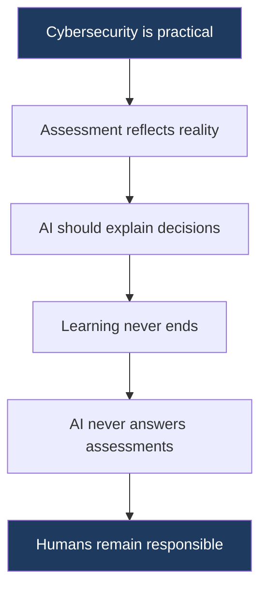
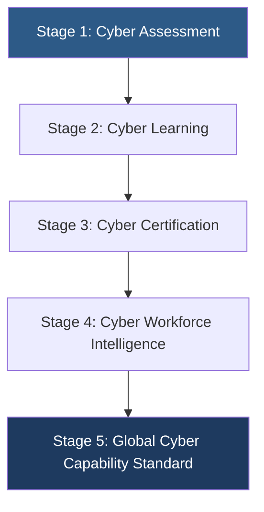
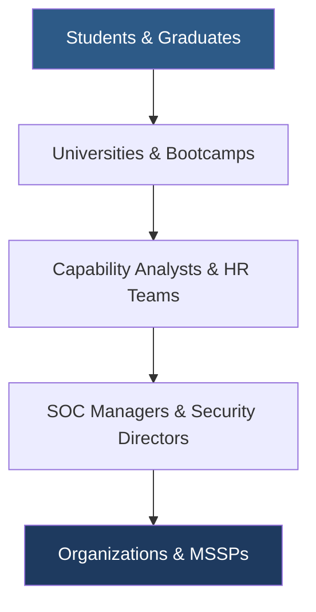

# PWNDORA SkillScan X — Vision & Mission

| | |
|---|---|
| **Document Version** | 1.0 |
| **Status** | Published |
| **Classification** | Public |
| **Last Updated** | 2026-07-08 |
| **Owner** | Product Team |

## Revision History

| Version | Date | Author | Changes |
|---|---|---|---|
| 1.0 | 2026-07-08 | PWNDORA SkillScan X Team | Initial release |

---

## 1. Executive Summary

### Product

PWNDORA SkillScan X

### Category

Adaptive Cybersecurity Capability Intelligence Platform

### Version

1.0

### Vision

Build the world's most trusted platform for measuring cybersecurity capability through explainable artificial intelligence, adaptive cyber missions, and evidence-based technical evaluation.

---

## 2. Vision Statement

A future where cybersecurity professionals are evaluated by their ability to think, investigate, communicate, and make operational decisions instead of their ability to memorize interview questions. PWNDORA SkillScan X aims to become the industry standard for cybersecurity capability assessment across education, recruitment, training, certification, and workforce development.

The measure of a cybersecurity professional should not be how many certifications they hold or how many interview answers they have memorized. It should be how they respond to an active incident, how they prioritize under pressure, and how they justify their decisions with evidence. PWNDORA SkillScan X exists to make that vision a reality.

---

## 3. Mission Statement

To empower organizations with transparent and standardized cybersecurity assessments while enabling professionals to continuously improve through adaptive, explainable, and practical evaluation.

---

## 4. Product Philosophy

Every decision inside PWNDORA SkillScan X is guided by one principle:

> **Assess cybersecurity reasoning, not memorization.**

The platform exists to evaluate how professionals:

| Dimension | What We Measure |
|---|---|
| Investigate incidents | Can the professional follow proper incident response methodology? |
| Prioritize actions | Does the professional know what to do first under pressure? |
| Manage risk | Does the professional identify operational trade-offs? |
| Communicate findings | Can the professional explain technical decisions clearly? |
| Justify decisions | Does the professional provide evidence for their choices? |
| Learn from mistakes | Can the professional identify and close skill gaps? |

---

## 5. Core Beliefs



### Belief 1: Cybersecurity Is Practical

The difference between a certified professional and an effective one is the ability to apply knowledge under pressure. Assessments must measure application, not recall.

### Belief 2: Assessment Should Reflect Reality

Static questions measure preparation, not capability. Adaptive missions that evolve with professional responses measure true skill ceilings.

### Belief 3: AI Should Explain Decisions

Black-box scoring undermines trust. Every score must include evidence, rationale, and context so professionals and capability analysts understand what was evaluated and why.

### Belief 4: Learning Never Ends

An assessment that does not produce a learning path is a missed opportunity. Every evaluation should leave the professional better equipped than before.

### Belief 5: AI Must Never Answer Assessments

The platform's AI acts as an AI Mentor — guiding, explaining, and providing feedback without ever answering assessments on behalf of the professional. This ensures integrity of capability measurement.

### Belief 6: Humans Remain Responsible

The platform augments human judgment. Hiring decisions remain with qualified professionals who use PWNDORA SkillScan X outputs as one input among many.

---

## 6. Long-Term Vision

PWNDORA SkillScan X evolves through five stages, each building on the previous:



---

## 7. Product Objectives

### Short-Term (Hackathon MVP)

| Objective | Success Criteria |
|---|---|
| Adaptive cybersecurity assessments | 5+ turn conversational assessment with real-time difficulty adjustment |
| Explainable AI evaluation | Every score includes evidence citation and natural language rationale |
| Analyst-ready reports | Capability profile with capability heatmap, domain scores, and transcript |
| Personalized Career Compass | 3+ prioritized topics with curated resources |
| Cyber Twin generation | Persistent digital representation of verified capability |

### Medium-Term (Post-MVP)

| Objective | Success Criteria |
|---|---|
| Enterprise dashboards | Batch candidate management, cohort analytics, comparison views |
| University partnerships | Curriculum-aligned assessment templates, outcome reporting |
| Multi-role assessments | 10+ predefined Skill DNA Profiles with framework mappings |
| Team analytics | Aggregate skill distribution, readiness benchmarking |

### Long-Term (Platform)

| Objective | Success Criteria |
|---|---|
| Global capability benchmarking | Cross-organization skill comparisons |
| Certification pathways | Assessment-to-certification mapping |
| Workforce planning | Gap analysis for team composition and hiring strategy |
| Skills intelligence | Predictive analytics for emerging skill needs |

---

## 8. Guiding Principles

| Principle | Description | Application |
|---|---|---|
| **Explainable** | Every decision must be understandable in natural language | Scores include evidence citations and rationale |
| **Adaptive** | Assessments evolve with professional performance in real-time | Difficulty adjusts ±2 sigma; missions branch on decisions |
| **Evidence-Based** | Scores require supporting evidence from professional responses | Every dimension cites specific statements |
| **Cybersecurity-First** | Domain knowledge drives evaluation, not generic language models | Rubrics are cyber-specific; ontology maps to NICE and MITRE |
| **Human-Centered** | AI supports, not replaces, human decision-makers | Platform produces decision-support outputs, not automated decisions |
| **Modular** | Components remain independently extensible and replaceable | Agents have typed interfaces; pipeline is configurable |
| **Ethical** | Fairness and transparency are mandatory, not optional | Bias monitoring, explainability, human-in-the-loop |

---

## 9. Target Ecosystem



Each tier in the ecosystem benefits from the one below it. Students improve their skills through assessment. Universities measure readiness. Capability analysts screen efficiently. Managers hire confidently. Organizations build stronger teams.

---

## 10. Value Creation

### For Professionals

| Value | Mechanism |
|---|---|
| Practice realistic scenarios | Missions based on actual incident types |
| Understand strengths and weaknesses | Domain-level scoring with explainable rationale |
| Improve role readiness | Career Compass from identified skill gaps |
| Build confidence | Repeated assessment with measurable progress |

### For Capability Analysts

| Value | Mechanism |
|---|---|
| Standardized assessments | Same rubric for every professional |
| Transparent reports | Evidence-backed scores with transcript citations |
| Better screening | Technical evaluation that does not require personal cyber expertise |
| Faster pipeline | Parallel assessments with instant results |

### For Organizations

| Value | Mechanism |
|---|---|
| Better hiring consistency | Standardized evaluation across all professionals and roles |
| Reduced assessment effort | AI conducts deep technical screening autonomously |
| Higher confidence in evaluations | Explainable scores that can be audited and defended |
| Workforce visibility | Aggregate capability data for team planning |

---

## 11. Success Definition

PWNDORA SkillScan X succeeds when:

| Stakeholder | Success Signal |
|---|---|
| Professionals | Trust the feedback and use it to improve |
| Capability Analysts | Trust the reports and rely on them for screening decisions |
| Organizations | Improve hiring quality and reduce time-to-competency for new hires |
| Universities | Improve graduate placement rates through readiness measurement |

### Measurable Success Criteria

| Metric | Target | Timeframe |
|---|---|---|
| Professional score improvement across attempts | +15% by 3rd assessment | Per user |
| Capability analyst screening time reduction | 60% decrease | Per cycle |
| Assessment completion rate | > 80% | Per session |
| Score correlation with expert human evaluator | r > 0.7 | Calibration study |
| User satisfaction (CSAT) | > 4.0 / 5.0 | Per assessment |

---

## 12. Strategic Roadmap

```
Hackathon MVP
    │
    ▼
Pilot Deployments (universities, bootcamps)
    │
    ▼
University Adoption (assessment + outcome reporting)
    │
    ▼
Enterprise Adoption (hiring teams, SOC managers)
    │
    ▼
Platform Ecosystem (certifications, workforce intelligence)
```

| Phase | Timeline | Focus |
|---|---|---|
| Hackathon MVP | 16 days | Core assessment pipeline, explainable scoring, Career Compass |
| Pilot deployments | Post-hackathon | 3-5 university and bootcamp partners |
| University adoption | 3 months | Curriculum-aligned assessments, cohort analytics |
| Enterprise adoption | 6 months | Batch management, custom rubrics, ATS integration |
| Platform ecosystem | 12 months | Certification pathways, workforce intelligence, API marketplace |

---

## 13. Future Evolution

### Adjacent Markets

| Market | Entry Point | Strategic Value |
|---|---|---|
| Cybersecurity training | Assessment → learning path integration | Completes the assess-learn-reassess cycle |
| Professional certification | Capability credentialing | Creates industry-recognized standard |
| Workforce analytics | Team-level skill intelligence | Expands buyer from team to organization |
| Government / defense | Clearance-aligned assessment | High-value, high-barrier market |

### Capability Expansion

| Capability | Description | Phase |
|---|---|---|
| Hands-on cyber ranges | Live environment assessment with browser-based terminal | 2 |
| SIEM log replay | Real log data for investigation scenarios | 3 |
| Cloud security missions | AWS/Azure/GCP incident response | 3 |
| Purple team exercises | Combined offensive/defensive evaluation | 3 |
| Team benchmarking | Organizational readiness scoring | 3 |

---

## 14. Conclusion

PWNDORA SkillScan X is designed as a long-term cybersecurity capability platform rather than a single-purpose interview application. Every architectural decision should support explainability, adaptability, and measurable skill development across the entire talent lifecycle — from education through recruitment and into continuous professional growth.

The vision is ambitious by design. The immediate focus is a working MVP that demonstrates the core loop: adaptive assessment → reasoning evaluation → explainable score → Career Compass. Each subsequent phase builds toward the broader vision of becoming the global standard for cybersecurity capability measurement.

## Related Documents

- [Project Overview](01-project-overview.md)
- [Problem Statement](02-problem-statement.md)
- [Solution Overview](03-solution-overview.md)
- [Product Requirements](05-product-requirements.md)
- [Future Roadmap](../docs/08-delivery/39-future-roadmap.md)
