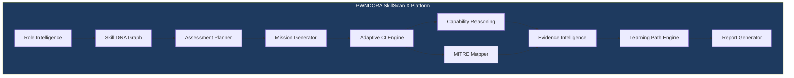
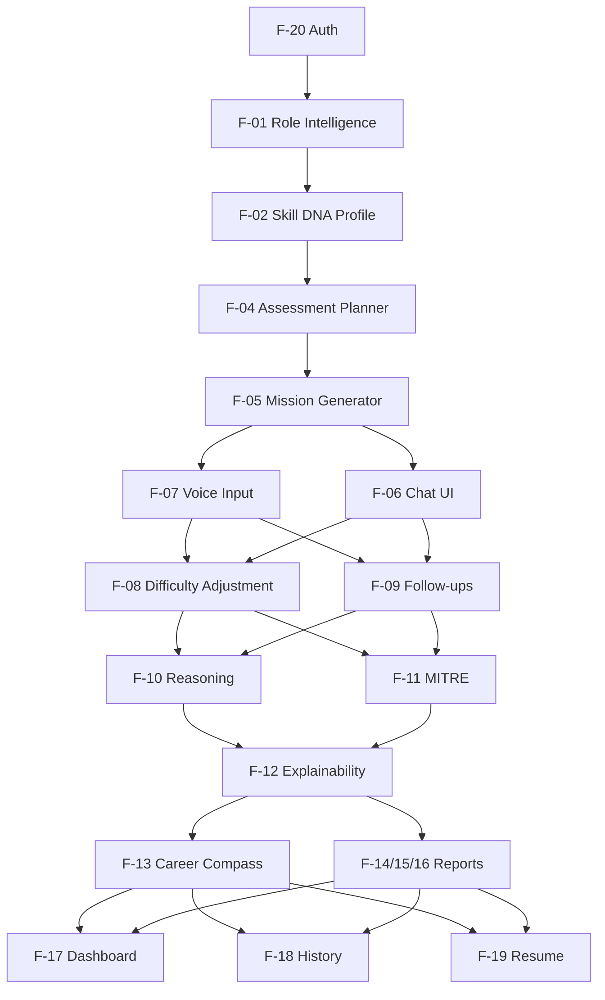

# PWNDORA SkillScan X — Product Requirements

| | |
|---|---|
| **Document Version** | 1.0 |
| **Status** | Published |
| **Classification** | Internal |
| **Last Updated** | 2026-07-08 |
| **Owner** | Engineering Team |

## Revision History

| Version | Date | Author | Changes |
|---|---|---|---|
| 1.0 | 2026-07-08 | PWNDORA SkillScan X Team | Initial release |

---

## 1. Executive Summary

### Product Name

PWNDORA SkillScan X

### Product Type

Adaptive Cybersecurity Capability Intelligence Platform

### Version

1.0

### Document Owner

PWNDORA SkillScan X Engineering Team

### Purpose

This document defines the complete functional and technical requirements for PWNDORA SkillScan X. It acts as the single source of truth for designers, developers, testers, and stakeholders throughout the product lifecycle. Every architecture decision, API endpoint, database table, UI screen, AI prompt, and feature should trace back to a requirement in this document.

---

## 2. Product Overview

PWNDORA SkillScan X is an Explainable AI platform that evaluates cybersecurity capability through adaptive, incident-driven assessments. Instead of measuring memorized interview answers, the platform measures:

| Dimension | Description |
|---|---|
| Technical reasoning | Can the professional work through a problem step by step? |
| Incident investigation | Does the professional follow proper IR methodology? |
| Decision quality | Are the professional's decisions justified and well-reasoned? |
| Communication clarity | Can the professional explain technical concepts clearly? |
| Risk awareness | Does the professional identify operational trade-offs? |
| Operational readiness | Would this professional be effective in a real security role? |

The platform supports capability analysts, hiring managers, universities, trainers, and cybersecurity professionals as a decision-support system — it augments human judgment, not replaces it.

---

## 3. Product Vision

To establish a globally trusted platform for measuring cybersecurity capability using explainable AI and adaptive cyber missions — becoming the standard for cybersecurity assessment across education, recruitment, training, and workforce development.

---

## 4. Business Objectives

### 4.1 Primary Objectives

| Objective | Success Measure |
|---|---|
| Standardize cybersecurity assessments | Every professional evaluated against the same rubric and framework |
| Reduce subjectivity in technical screening | Score correlation with human expert evaluator > 0.7 |
| Provide explainable assessment reports | Every score includes evidence citation and natural language rationale |
| Improve professional readiness | Score improvement of +15% by 3rd assessment attempt |

### 4.2 Secondary Objectives

| Objective | Success Measure |
|---|---|
| Reduce capability analyst workload | Screening time per professional reduced by 60% |
| Support universities and bootcamps | Cohort analytics with per-student and aggregate views |
| Build reusable capability frameworks | Skill DNA Profile model supports JD, framework, and manual inputs |

---

## 5. Problem Statement

Organizations struggle to evaluate practical cybersecurity skills consistently. Current challenges include:

| Problem | Impact |
|---|---|
| Subjective assessments | Quality varies by assessor; no standardized rubric |
| Memorization-focused preparation | Professionals learn answers, not reasoning |
| Inconsistent technical evaluation | Same professional rated differently by different assessors |
| Limited capability analyst expertise | Non-technical capability analysts cannot assess cybersecurity depth |
| Poor professional feedback | Scores without explanation offer no improvement path |

PWNDORA SkillScan X addresses these issues through structured, explainable, and adaptive assessments that measure reasoning quality rather than answer recall.

---

## 6. Product Scope

### 6.1 In Scope (MVP)

| Module | Capabilities |
|---|---|
| Role Intelligence | Parse job descriptions, extract role parameters, build capability profiles |
| Skill DNA Profile | Canonical role representation decoupled from individual JDs |
| Assessment Planner | Determine mission count, topics, difficulty, evaluation criteria |
| Mission Generator | Create realistic incident scenarios with operational context |
| Adaptive Capability Intelligence Engine | Conduct conversational assessment with real-time difficulty adjustment |
| Capability Reasoning Engine | Extract concepts, validate workflow, analyze decisions, evaluate risk |
| MITRE Mapper | Tag responses with relevant ATT&CK technique IDs |
| Evidence Intelligence Engine | Produce evidence-backed score rationale in natural language |
| Learning Path Engine | Identify gaps, rank topics, associate learning resources |
| Report Generator | Build capability heatmap, assessment report, Career Compass |

### 6.2 Out of Scope (Hackathon)

| Item | Rationale |
|---|---|
| Payment and billing systems | Not required for MVP demonstration |
| Enterprise RBAC with multiple roles | Single user type sufficient for demo |
| ATS integration | API-first design; integrations deferred to Phase 3 |
| Mobile native applications | Responsive web sufficient for MVP |
| Multi-language support | English-only for MVP |
| Video interview recording | Voice and text capture sufficient |
| Team collaboration features | Cohort management deferred to Phase 2 |
| Anti-cheating detection | Deferred to Phase 3 |

---

## 7. Stakeholders

| Stakeholder | Role | Primary Interest |
|---|---|---|
| Professional | Completes assessments | Fair evaluation, actionable feedback, improvement path |
| Capability Analyst | Reviews professional reports | Standardized screening, defensible scores, reduced effort |
| Hiring Manager (SOC Manager) | Makes hiring decisions | Technical reasoning assessment, evidence for decisions |
| Trainer / Educator | Tracks learner progress | Cohort analytics, skill gap visibility, outcome measurement |
| University Administrator | Measures program outcomes | Placement rate improvement, accreditation alignment |
| Engineering Team | Builds and maintains the platform | Clear requirements, modular architecture, testability |

---

## 8. User Personas

### 8.1 Primary Personas

| Persona | Background | Primary Goal |
|---|---|---|
| Cybersecurity Student | Age 18-24, CS/IT degree or bootcamp | Get assessment-ready, identify skill gaps |
| Fresh Graduate | Age 22-26, Security+ or equivalent | Secure first SOC or security role |
| SOC Analyst | 1-3 years experience | Benchmark skills, advance career |

### 8.2 Secondary Personas

| Persona | Background | Primary Goal |
|---|---|---|
| Capability Analyst | Non-technical, high hiring volume | Screen professionals consistently |
| SOC Manager | 5-15 years cybersecurity experience | Evaluate technical reasoning, reduce bad hires |
| Cybersecurity Trainer | Bootcamp instructor, university lecturer | Measure student progress, identify curriculum gaps |
| University Administrator | Program director, department head | Improve placement rates, demonstrate outcomes |

---

## 9. User Goals

### 9.1 Professional Goals

| Goal | Success Signal |
|---|---|
| Demonstrate capability accurately | Score reflects actual capability |
| Improve reasoning under pressure | Score improvement across multiple attempts |
| Identify strengths and weaknesses | Clear visibility into domain-level performance |
| Receive actionable feedback | Career Compass with specific next steps |

### 9.2 Capability Analyst Goals

| Goal | Success Signal |
|---|---|
| Reduce screening effort per professional | Under 30 minutes to review and decide |
| Standardize assessments across professionals | Same rubric applied to every professional |
| Improve hiring quality | Correlation between score and on-job performance > 0.7 |
| Defend hiring decisions | Evidence-backed rationale for every professional |

### 9.3 Organizational Goals

| Goal | Success Signal |
|---|---|
| Improve workforce quality | Higher average capability scores over time |
| Benchmark skills against industry | Cross-organization comparison data |
| Support continuous development | Learning paths that close identified gaps |

---

## 10. Functional Requirements

### 10.1 Role Intelligence

| ID | Requirement | Priority |
|---|---|---|
| FR-JD-001 | System shall accept unstructured job description text as input | P0 |
| FR-JD-002 | System shall extract role title from the job description | P0 |
| FR-JD-003 | System shall extract required skills list from the job description | P0 |
| FR-JD-004 | System shall extract responsibilities from the job description | P0 |
| FR-JD-005 | System shall extract experience level requirements | P0 |
| FR-JD-006 | System shall extract preferred certifications | P1 |
| FR-JD-007 | System shall produce a structured capability profile from extracted data | P0 |

### 10.2 Skill DNA Profile

| ID | Requirement | Priority |
|---|---|---|
| FR-RB-001 | System shall maintain a Skill DNA Profile as the canonical representation of role requirements | P0 |
| FR-RB-002 | Skill DNA Profile shall include: skills, NICE framework roles, MITRE knowledge areas, capabilities, responsibilities, and assessment objectives | P0 |
| FR-RB-003 | System shall accept input from job descriptions, framework mappings, or manual configuration | P1 |
| FR-RB-004 | Skill DNA Profile shall be the input to the Assessment Planner | P0 |

### 10.3 Assessment Planning

| ID | Requirement | Priority |
|---|---|---|
| FR-AP-001 | System shall generate a Capability Blueprint from the Skill DNA Profile | P0 |
| FR-AP-002 | Capability Blueprint shall define: mission count, topic areas, difficulty range, estimated duration | P0 |
| FR-AP-003 | Capability Blueprint shall define evaluation criteria aligned to NICE framework | P0 |
| FR-AP-004 | Capability Blueprint shall complete generation within 15 seconds | P0 |

### 10.4 Mission Generation

| ID | Requirement | Priority |
|---|---|---|
| FR-MG-001 | System shall generate realistic cybersecurity incident scenarios | P0 |
| FR-MG-002 | Each mission shall include sufficient operational context for informed decision-making | P0 |
| FR-MG-003 | Missions shall cover diverse incident types: phishing, malware, credential theft, ransomware, network intrusion | P0 |
| FR-MG-004 | Mission content shall be role-appropriate (junior vs. senior differentiation) | P0 |

### 10.5 Adaptive Capability Assessment

| ID | Requirement | Priority |
|---|---|---|
| FR-AA-001 | System shall conduct a turn-by-turn conversational assessment | P0 |
| FR-AA-002 | Minimum assessment length shall be 5 conversational turns | P0 |
| FR-AA-003 | System shall adjust question difficulty based on previous response quality (±2 sigma) | P0 |
| FR-AA-004 | System shall generate follow-up questions that probe reasoning depth | P0 |
| FR-AA-005 | System shall support text input for professional responses | P0 |
| FR-AA-006 | System shall support browser speech recognition for voice input | P1 |
| FR-AA-007 | System shall provide manual text fallback when voice input fails | P1 |
| FR-AA-008 | System shall persist session state after each message | P0 |
| FR-AA-009 | System shall timeout idle sessions after 30 minutes | P0 |
| FR-AA-010 | System shall allow resume of timed-out sessions within 24 hours | P1 |

### 10.6 Capability Reasoning

| ID | Requirement | Priority |
|---|---|---|
| FR-CR-001 | System shall extract cybersecurity concepts from professional responses | P0 |
| FR-CR-002 | System shall validate whether responses follow proper incident response workflow | P0 |
| FR-CR-003 | System shall evaluate decision quality including justification strength | P0 |
| FR-CR-004 | System shall assess risk awareness including identification of operational trade-offs | P0 |
| FR-CR-005 | System shall map responses to MITRE ATT&CK technique IDs | P0 |
| FR-CR-006 | System shall evaluate communication clarity and technical precision | P1 |
| FR-CR-007 | Each evaluation dimension shall produce a score (0-100) | P0 |

### 10.7 MITRE Mapping

| ID | Requirement | Priority |
|---|---|---|
| FR-MM-001 | System shall tag professional responses with relevant MITRE ATT&CK technique IDs | P0 |
| FR-MM-002 | System shall classify techniques by tactic (Initial Access, Execution, Persistence, etc.) | P0 |
| FR-MM-003 | System shall generate a coverage matrix showing assessed vs. unassessed techniques | P0 |

### 10.8 Explainability

| ID | Requirement | Priority |
|---|---|---|
| FR-EX-001 | System shall produce natural language rationale for each score dimension | P0 |
| FR-EX-002 | System shall cite specific professional statements as evidence for each score | P0 |
| FR-EX-003 | System shall identify cybersecurity concepts the professional addressed | P0 |
| FR-EX-004 | System shall identify relevant concepts the professional did not address | P0 |
| FR-EX-005 | System shall produce a confidence level alongside each assessment dimension | P0 |

### 10.9 Career Compass

| ID | Requirement | Priority |
|---|---|---|
| FR-LR-001 | System shall identify skill gaps from assessment scores | P0 |
| FR-LR-002 | System shall rank learning topics by gap impact and prerequisite order | P0 |
| FR-LR-003 | System shall associate curated learning resources with each topic | P0 |
| FR-LR-004 | System shall generate a minimum of 3 recommended topics | P0 |

### 10.10 Reporting

| ID | Requirement | Priority |
|---|---|---|
| FR-RP-001 | System shall display a Capability Heatmap chart showing domain scores | P0 |
| FR-RP-002 | System shall display per-domain score breakdown with explanations | P0 |
| FR-RP-003 | System shall display MITRE ATT&CK coverage matrix | P0 |
| FR-RP-004 | System shall display session transcript with per-response scoring annotations | P0 |
| FR-RP-005 | System shall display Career Compass with prioritized topics | P0 |
| FR-RP-006 | System shall display a capability analyst summary view with overall readiness level and key findings | P0 |

---

## 11. Non-Functional Requirements

### 11.1 Performance

| ID | Requirement | Target |
|---|---|---|
| NFR-PERF-001 | Capability Blueprint generation | < 15 seconds |
| NFR-PERF-002 | Per-response AI evaluation (P95) | < 10 seconds (target 3s) |
| NFR-PERF-003 | Report generation | < 5 seconds |
| NFR-PERF-004 | Page load time (initial) | < 2 seconds |
| NFR-PERF-005 | Page load time (subsequent) | < 500ms |
| NFR-PERF-006 | Concurrent session support | 50 simultaneous |

### 11.2 Reliability

| ID | Requirement | Approach |
|---|---|---|
| NFR-REL-001 | Graceful API failure handling | Partial results on agent failure; retry logic |
| NFR-REL-002 | Session recovery on network interruption | Auto-save per message; resume on reconnect |
| NFR-REL-003 | Voice input fallback | Manual text input always available |
| NFR-REL-004 | Data persistence | No data loss on crash; write-ahead logging |

### 11.3 Security

| ID | Requirement | Approach |
|---|---|---|
| NFR-SEC-001 | API key protection | Environment variables only; never exposed to client |
| NFR-SEC-002 | Prompt injection mitigation | Input validation, prompt isolation, output sanitization |
| NFR-SEC-003 | Authentication | JWT with 24-hour expiry; bcrypt password hashing |
| NFR-SEC-004 | Rate limiting | 5 attempts/minute on auth endpoints |
| NFR-SEC-005 | HTTPS communication | TLS termination at reverse proxy |

### 11.4 Scalability

| ID | Requirement | Approach |
|---|---|---|
| NFR-SCALE-001 | Modular services | Each agent independently deployable |
| NFR-SCALE-002 | Stateless API | Session state in database, not in memory |
| NFR-SCALE-003 | Horizontal deployment readiness | Docker Compose → Kubernetes migration path |

### 11.5 Maintainability

| ID | Requirement | Approach |
|---|---|---|
| NFR-MAINT-001 | Layered architecture | Clear separation: API → service → data |
| NFR-MAINT-002 | Strong typing | TypeScript strict mode; Python type hints throughout |
| NFR-MAINT-003 | API versioning | URL-based versioning (/v1/, /v2/) |
| NFR-MAINT-004 | Automated testing | > 70% backend coverage; > 50% frontend coverage |
| NFR-MAINT-005 | Structured logging | JSON format with correlation IDs |

---

## 12. Product Modules



| Module | Input | Output |
|---|---|---|
| Role Intelligence | Job description text | Structured role requirements |
| Skill DNA Graph | Role requirements | Hierarchical skill relationship map |
| Assessment Planner | Skill DNA Graph + Skill DNA Profile | Capability Blueprint |
| Mission Generator | Capability Blueprint | Incident scenarios with context |
| Adaptive Capability Intelligence Engine | Missions + professional responses | Turn-by-turn conversation management |
| Capability Reasoning Engine | Professional responses | Evaluated dimensions with scores |
| MITRE Mapper | Professional responses | Technique IDs and coverage matrix |
| Evidence Intelligence Engine | Evaluation results | Evidence-backed score rationale |
| Learning Path Engine | Score gaps | Prioritized learning topics |
| Report Generator | All assessment data | Capability report + Career Compass |

---

## 13. System Workflow

### 13.1 Professional Assessment Flow

```
Job Description Input
      │
      ▼
Skill DNA Profile Generation (Role Intelligence + Skill DNA Graph)
      │
      ▼
Capability Blueprint (Assessment Planner)
      │
      ▼
Mission Generation (Mission Generator)
      │
      ▼
  ┌────────────────────────────────────────────┐
  │         Adaptive Assessment Loop           │
  │                                            │
  │  Present Mission → Professional Responds → │
  │  Capability Reasoning → Adjust Difficulty →│
  │  Next Turn                                 │
  │                                            │
  └────────────────────────────────────────────┘
      │
      ▼
Final Evaluation Aggregation (Capability Reasoning + MITRE Mapper)
      │
      ▼
Explainable Report Generation (Evidence Intelligence Engine + Report Generator)
      │
      ▼
Career Compass Generation (Learning Path Engine)
      │
      ▼
Results Display (Frontend)
```

### 13.2 Processing Details

| Stage | Responsible Module | Output |
|---|---|---|
| Input | Frontend | Raw job description text |
| Parse | Role Intelligence | Structured role parameters |
| Build graph | Skill DNA Graph | Hierarchical skill tree |
| Plan | Assessment Planner | Blueprint with mission specs |
| Generate | Mission Generator | Scenario briefings |
| Assess | Adaptive Capability Intelligence Engine | Message history |
| Evaluate | Capability Reasoning Engine | Per-turn scores |
| Map | MITRE Mapper | Technique tags |
| Explain | Evidence Intelligence Engine | Evidence citations |
| Learn | Learning Path Engine | Topic rankings |
| Report | Report Generator | Final display data |

---

## 14. User Workflows

### 14.1 Professional Workflow

```
1. Register / Log In
   │
2. Select Role or Upload Job Description
   │
3. Review Assessment Overview (mission count, estimated time)
   │
4. Begin Assessment
   │
5. Mission Loop:
   ├── 5a. Read mission briefing
   ├── 5b. Respond via text or voice
   ├── 5c. Receive follow-up question
   └── 5d. Repeat for N missions
   │
6. Assessment Complete
   │
7. View Results:
   ├── 7a. Capability Heatmap chart
   ├── 7b. Domain score breakdown
   ├── 7c. MITRE coverage matrix
   ├── 7d. Session transcript with annotations
   └── 7e. Career Compass
   │
8. Return to Dashboard
```

### 14.2 Capability Analyst Workflow

```
1. Register / Log In (employer role)
   │
2. Upload Job Description or Select Role Template
   │
3. Review Generated Capability Blueprint
   │
4. Invite Professional via Email
   │
5. Wait for Completion (system notifies)
   │
6. Review Professional Report:
   ├── Overall readiness level
   ├── Domain scores with explanations
   ├── MITRE coverage matrix
   ├── Technical strengths and improvement areas
   └── Assessment focus recommendations
   │
7. Schedule or Decline Follow-up Interview
```

### 14.3 Trainer / Educator Workflow

```
1. Register / Log In (educator role)
   │
2. Create Assessment Based on Curriculum
   │
3. Assign to Cohort
   │
4. Monitor Completion Progress
   │
5. Review Analytics:
   ├── Cohort average scores
   ├── Skill distribution per domain
   ├── Individual student reports
   └── Curriculum gap analysis
```

---

## 15. Features

### 15.1 Feature Catalog

| ID | Feature | Persona | Priority |
|---|---|---|---|
| F-01 | Job Description Intelligence | Professional, Capability Analyst | P0 |
| F-02 | Skill DNA Profile Generation | All | P0 |
| F-03 | Skill DNA Graph Builder | All | P0 |
| F-04 | Assessment Planner | All | P0 |
| F-05 | Adaptive Cyber Mission Generator | Professional | P0 |
| F-06 | Conversational Assessment UI | Professional | P0 |
| F-07 | Voice Input (Speech Recognition) | Professional | P1 |
| F-08 | Real-Time Difficulty Adjustment | Professional | P0 |
| F-09 | Dynamic Follow-up Questions | Professional | P0 |
| F-10 | Capability Reasoning Evaluation | All | P0 |
| F-11 | MITRE ATT&CK Mapping | All | P0 |
| F-12 | Explainable Score Generation | All | P0 |
| F-13 | Career Compass Generation | Professional | P0 |
| F-14 | Capability Heatmap Visualization | Professional, Capability Analyst | P0 |
| F-15 | Session Transcript with Annotations | All | P0 |
| F-16 | Capability Analyst Report View | Capability Analyst | P0 |
| F-17 | Professional Dashboard | Professional | P0 |
| F-18 | Assessment History | Professional | P1 |
| F-19 | Session Resume | Professional | P1 |
| F-20 | Authentication (JWT) | All | P0 |

### 15.2 Feature Dependency Map



---

## 16. AI Capabilities

| Capability | Module | Description |
|---|---|---|
| Job description understanding | Role Intelligence | Parse unstructured text into structured role requirements |
| Capability extraction | Skill DNA Graph | Build hierarchical skill maps from requirements |
| Assessment planning | Assessment Planner | Determine scope, difficulty, and evaluation criteria |
| Mission generation | Mission Generator | Create realistic incident scenarios with context |
| Dynamic questioning | Adaptive Capability Intelligence | Generate follow-up questions based on response content |
| Difficulty calibration | Adaptive Capability Intelligence | Adjust question complexity ±2 sigma based on performance |
| Concept extraction | Capability Reasoning | Identify cybersecurity concepts in professional responses |
| Workflow validation | Capability Reasoning | Evaluate response against proper IR methodology |
| Decision analysis | Capability Reasoning | Assess justification quality and alternative consideration |
| Risk evaluation | Capability Reasoning | Identify operational trade-off awareness |
| MITRE mapping | MITRE Mapper | Match response content to ATT&CK technique IDs |
| Evidence attribution | Evidence Intelligence | Cite specific statements supporting each score |
| Gap identification | Evidence Intelligence | Identify missing concepts relative to role requirements |
| Learning recommendation | Learning Path Engine | Rank topics by gap impact and prerequisite order |

---

## 17. Cybersecurity Capabilities

| Capability | Description |
|---|---|
| Incident response assessment | Evaluate professional's IR methodology and workflow adherence |
| SOC operations evaluation | Assess triage, escalation, and communication procedures |
| Threat hunting analysis | Evaluate investigative approach and IOC identification |
| DFIR workflow validation | Assess forensic soundness and evidence preservation |
| Decision quality measurement | Evaluate justification strength and alternative consideration |
| Risk trade-off identification | Assess awareness of operational impact and business context |
| MITRE ATT&CK coverage | Map responses to adversary techniques and tactics |
| NICE framework alignment | Score against standardized workforce framework domains |
| Communication assessment | Evaluate technical clarity and precision in responses |

---

## 18. Technical Requirements

### 18.1 Frontend

| Requirement | Specification |
|---|---|
| Framework | Next.js 14+ with App Router |
| Language | TypeScript (strict mode) |
| UI Components | shadcn/ui (Radix primitives + Tailwind) |
| Styling | Tailwind CSS 3.x |
| State Management | TanStack Query 5.x |
| Charts | Recharts 2.x |
| Voice Input | Web Speech API |
| Auth Client | NextAuth.js |

### 18.2 Backend

| Requirement | Specification |
|---|---|
| Framework | FastAPI 0.111+ |
| Language | Python 3.12+ |
| ORM | SQLAlchemy 2.x (async) |
| Validation | Pydantic 2.x |
| Auth | python-jose + passlib (JWT + bcrypt) |
| ASGI Server | Uvicorn |

### 18.3 AI Pipeline

| Requirement | Specification |
|---|---|
| LLM Provider | OpenAI API (GPT-4o) |
| Output Format | Structured JSON (Pydantic models) |
| Agent Communication | Typed function calls (not shared state) |
| Prompt Management | Template-based with role-specific instructions |
| Caching | Response cache for identical prompts |

### 18.4 Database

| Requirement | MVP (SQLite) | Production |
|---|---|---|
| Engine | SQLite 3.x (WAL mode) | PostgreSQL 16 |
| ORM | SQLAlchemy 2.x | SQLAlchemy 2.x |
| Migrations | Alembic | Alembic |
| Concurrency | WAL mode for reads | Connection pooling |

### 18.5 API

| Requirement | Specification |
|---|---|
| Protocol | REST + SSE (for streaming) |
| Authentication | JWT Bearer token |
| Versioning | URL prefix (/v1/) |
| Error Format | Consistent JSON error schema |
| Documentation | Auto-generated OpenAPI (Swagger) |

---

## 19. Constraints

| Constraint | Impact |
|---|---|
| 4-person engineering team | Architecture must minimize coordination; clear module boundaries |
| 16-day delivery window | Strict scope freeze; defer all Phase 2+ features |
| Limited LLM API budget | Token management; prompt caching; cost monitoring; local fallback |
| SQLite database | No concurrent write scaling; WAL mode for reads |
| Browser-based deployment | No native apps; responsive web only |
| No cloud credits | All services must run on local hardware or free tier |

---

## 20. Assumptions

| Assumption | Risk if Wrong |
|---|---|
| Users provide cybersecurity-focused job descriptions | Assessment quality degrades with generic or non-cyber input |
| Internet connectivity is available during assessment | Offline mode needed for production deployments |
| Users understand the assessment process (text/voice interaction) | Onboarding guidance may be required |
| Human reviewers remain responsible for hiring decisions | Regulatory exposure if platform used autonomously |
| Professionals respond in English | Non-English responses may produce unreliable scores |
| LLM API latency is acceptable (< 3s target) | May need streaming or local model fallback |

---

## 21. Risks

| Risk | Likelihood | Impact | Mitigation |
|---|---|---|---|
| LLM hallucination in scoring | Medium | High | Rubric-first evaluation constrains LLM to evidence generation, not scoring |
| Voice recognition failure | Medium | Low | Manual text fallback always available |
| Prompt injection via professional input | Low | High | Input validation, prompt isolation, output sanitization |
| API cost overrun in demo | Medium | Medium | Token budgeting; prompt caching; local fallback mode |
| Time overruns on development | Medium | High | Strict scope freeze; cut non-critical features first |
| LLM API downtime during demo | Low | High | Retry logic with exponential backoff; graceful degradation |
| Assessment quality insufficient for accuracy claims | Medium | High | Calibration study against human expert; confidence scores |

---

## 22. Success Metrics

### 22.1 Platform Metrics

| Metric | Target | Measurement |
|---|---|---|
| Assessment completion rate | > 80% | Sessions started vs. completed |
| Per-response evaluation latency | < 3s P95 | Server-side timing |
| Report generation success rate | > 99% | Generation attempts vs. successes |
| API error rate | < 1% | Status codes 5xx / total requests |

### 22.2 Professional Metrics

| Metric | Target | Measurement |
|---|---|---|
| Score improvement (retake) | +15% by 3rd attempt | Score delta across attempts |
| User satisfaction (CSAT) | > 4.0 / 5.0 | Post-assessment survey |
| Mission completion rate | > 90% | Missions started vs. completed |

### 22.3 Capability Analyst Metrics

| Metric | Target | Measurement |
|---|---|---|
| Screening time per professional | < 30 minutes | Time from report to decision |
| Score correlation with expert | r > 0.7 | Calibration study |
| Report usefulness rating | > 4.0 / 5.0 | Analyst survey |

---

## 23. Release Plan

### Phase 1: Hackathon MVP

| Sprint | Focus | Deliverables |
|---|---|---|
| Days 1-4 | Foundation | Project setup, Docker, database schema, auth, CI |
| Days 5-10 | Core Pipeline | All agents (RIE, MG, AAE, CRE, EE, LE), LLM integration |
| Days 11-14 | Frontend | Chat UI, dashboard, report views, score visualization |
| Days 15-16 | Integration & Polish | End-to-end flow, edge cases, demo prep |

### Phase 2: Post-Hackathon

| Area | Features |
|---|---|
| Enterprise | Batch invites, cohort management, custom rubrics |
| Analytics | Cohort dashboards, trend analysis, curriculum insights |
| Platform | PDF reports, assessment scheduling, voice refinement |

### Phase 3: Production

| Area | Features |
|---|---|
| Integration | REST API, ATS connectors, SSO/SAML |
| Depth | Hands-on labs, SIEM log replay, cloud scenarios |
| Scale | PostgreSQL, Redis, K8s deployment, i18n |

---

## 24. Future Scope

| Capability | Description | Value |
|---|---|---|
| ATS integration | Direct submission to Greenhouse, Lever, Workday | Enterprise adoption |
| Enterprise capability analyst dashboard | Batch invites, cohort analytics, comparison views | Scale usage |
| Hands-on cyber labs | Browser-based terminal for live environment tasks | Assessment depth |
| SIEM log replay missions | Real log data for investigation scenarios | Realism |
| Cloud security assessments | AWS/Azure/GCP incident response scenarios | Market expansion |
| Active Directory attack simulations | AD-specific compromise and defense missions | Breadth |
| Purple team assessments | Combined offensive/defensive evaluation | Differentiation |
| Team capability analytics | Aggregate readiness benchmarking for SOC teams | Org value |
| Multi-model AI orchestration | Route to best LLM per agent for cost/quality | Cost optimization |
| Certification pathways | Continuous skills tracking and recertification | Platform stickiness |

## Related Documents

- [Project Overview](01-project-overview.md)
- [Problem Statement](02-problem-statement.md)
- [Solution Overview](03-solution-overview.md)
- [Vision & Mission](04-vision-mission.md)
- [Functional Requirements](../docs/02-research/10-functional-requirements.md)
- [Non-Functional Requirements](../docs/03-functional-design/11-non-functional-requirements.md)
- [System Architecture](../docs/04-architecture/16-system-architecture.md)

---

## 25. Appendix

### 25.1 Key Definitions

| Term | Definition |
|---|---|
| **Skill DNA Profile** | Canonical representation of role requirements derived from job descriptions, framework mappings, or manual configuration. Includes skills, NICE roles, MITRE knowledge areas, capabilities, responsibilities, and assessment objectives. |
| **Capability Blueprint** | Structured plan generated from the Skill DNA Profile defining mission count, topic areas, difficulty range, duration, and evaluation criteria. |
| **Skill DNA Graph** | Hierarchical representation of skill relationships extracted from role requirements. Informs mission generation and evaluation scope. |
| **Capability Reasoning** | Multi-dimensional evaluation of investigative thinking, decision quality, workflow adherence, risk awareness, and communication clarity. |
| **Explainability** | The property of an assessment score being traceable to specific evidence in the professional's responses, with natural language rationale. |
| **Adaptive Difficulty** | Real-time adjustment of question complexity (±2 sigma) based on the professional's demonstrated performance level. |
| **Decision Support** | The platform's role in providing evidence-backed information to human decision-makers without automating or replacing their judgment. |
| **Cyber Twin** | A persistent digital representation of a professional's verified cybersecurity capability profile. |
| **Skill DNA** | The unique capability fingerprint derived from assessment evidence. |
| **Career Compass** | AI-driven career progression pathways mapped from capability gaps. |
| **Capability Heatmap** | Multi-dimensional visualization of verified strengths and gaps. |
| **AI Mentor** | Guided learning companion that explains without answering assessments. |

### 25.2 Document References

| Document | Location |
|---|---|
| Project Overview | docs/01-product/01-project-overview.md |
| Vision & Mission | docs/01-product/04-vision-mission.md |
| Solution Overview | docs/01-product/03-solution-overview.md |
| System Architecture | docs/04-architecture/16-system-architecture.md |
| API Specification | docs/05-data-api/23-api-specification.md |
| Database Design | docs/05-data-api/21-database-design.md |
| UI/UX Specification | docs/03-functional-design/15-ui-ux-specification.md |
| User Workflows | docs/03-functional-design/13-user-workflows.md |

### 25.3 Framework References

- NIST NICE Workforce Framework SP 800-181 Rev 1
- MITRE ATT&CK v15
- ISC² Cybersecurity Workforce Study 2025
