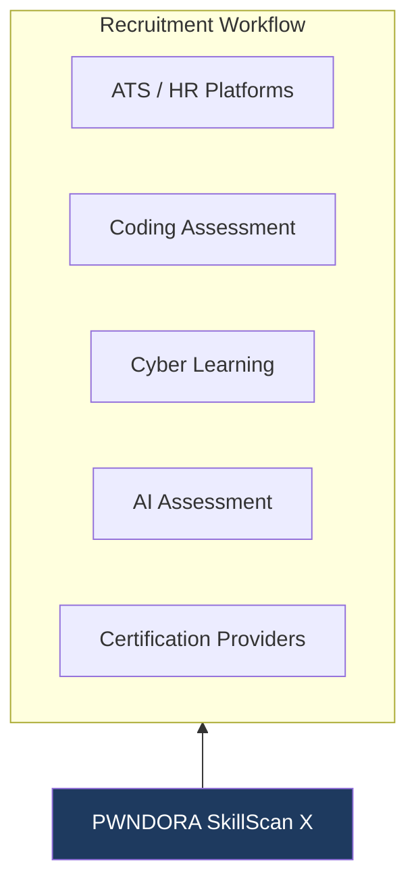

# PWNDORA SkillScan X — Competitor Analysis

| | |
|---|---|
| **Document Version** | 1.0 |
| **Status** | Published |
| **Classification** | Internal |
| **Last Updated** | 2026-07-08 |
| **Owner** | Product Team |

## Revision History

| Version | Date | Author | Changes |
|---|---|---|---|
| 1.0 | 2026-07-08 | PWNDORA SkillScan X Team | Initial release |

---

## 1. Executive Summary

The cybersecurity hiring ecosystem contains numerous assessment platforms, coding assessment systems, and AI-powered recruitment tools. However, most solutions focus on generic interview automation, coding evaluation, or resume screening.

PWNDORA SkillScan X occupies a distinct position by combining adaptive cybersecurity assessments, explainable AI, cybersecurity-specific reasoning, and structured capability evaluation into a single platform. Rather than replacing assessors, PWNDORA SkillScan X provides standardized technical assessment and decision support.

This document analyzes the competitive landscape by category, identifies gaps in existing solutions, and establishes PWNDORA SkillScan X's unique positioning.

---

## 2. Introduction

The market contains several categories of assessment platforms, each solving part of the hiring process but none addressing the full scope of cybersecurity capability evaluation:

| Category | Primary Function | Cybersecurity Depth | Explainability |
|---|---|---|---|
| AI Assessment Platforms | Automated Q&A and conversation analysis | Low | Low |
| Coding Assessment Platforms | Programming skill evaluation | None | Medium |
| Cybersecurity Learning Platforms | Hands-on lab training | High | Low |
| Applicant Tracking Systems | Recruitment workflow management | None | None |
| Certification Exam Providers | Theoretical knowledge validation | Medium | Low |
| **PWNDORA SkillScan X** | **Adaptive cyber reasoning assessment** | **High** | **High** |

---

## 3. Competitive Landscape

PWNDORA SkillScan X sits at the intersection of cybersecurity depth, AI-powered assessment, technical evaluation, and learning support — a position no single category occupies.

---

## 4. Competitor Categories

### 4.1 AI Assessment Platforms

| Aspect | Assessment |
|---|---|
| **Strengths** | Automated question generation, conversation analysis, voice support, scalable |
| **Limitations** | Generic evaluation models with no cybersecurity domain depth; black-box scoring with limited explainability; evaluate language quality, not technical reasoning |
| **Cybersecurity fit** | Low — designed for general interviewing, not domain-specific assessment |

### 4.2 Coding Assessment Platforms

| Aspect | Assessment |
|---|---|
| **Strengths** | Rigorous programming evaluation, automated grading, anti-cheating measures |
| **Limitations** | No incident response assessment; no cybersecurity reasoning evaluation; limited communication and decision analysis |
| **Cybersecurity fit** | None — focused on software engineering skills, not security operations |

### 4.3 Cybersecurity Learning Platforms

| Aspect | Assessment |
|---|---|
| **Strengths** | Hands-on labs, practical exercises, skill development pathways |
| **Limitations** | Designed for training, not assessment; limited scoring rubrics; no standardized capability reporting for hiring; no explainability |
| **Cybersecurity fit** | High for training, low for assessment — the two use cases are not interchangeable |

### 4.4 Applicant Tracking Systems

| Aspect | Assessment |
|---|---|
| **Strengths** | Candidate management, recruitment workflow, pipeline tracking |
| **Limitations** | No technical assessment capability; no cybersecurity evaluation; no reasoning analysis |
| **Cybersecurity fit** | None — workflow management, not capability evaluation |

### 4.5 Certification Exam Providers

| Aspect | Assessment |
|---|---|
| **Strengths** | Standardized content, industry recognition, well-defined domains |
| **Limitations** | Theoretical focus (multiple choice); infrequent scheduling; expensive; no adaptive difficulty; no practical reasoning assessment |
| **Cybersecurity fit** | Medium — validates knowledge, not operational capability |

---

## 5. Direct Competitors

Direct competitors are platforms that organizations might consider as an alternative to PWNDORA SkillScan X for cybersecurity technical assessment.

| Category | Primary Capability | Limitation PWNDORA SkillScan X Addresses |
|---|---|---|
| AI Assessment Platforms | Interview automation | Generic domain knowledge — no cyber-specific reasoning evaluation |
| Cybersecurity Assessment Tools | Skills testing | Limited explainability — scores without evidence or rationale |
| Technical Screening Platforms | Candidate filtering | Minimal adaptive reasoning — static question banks, no incident evolution |

These competitors address pieces of the problem but none combine cybersecurity depth, adaptive assessment, explainable AI, and framework alignment.

---

## 6. Indirect Competitors

Indirect competitors address adjacent needs but are not direct substitutes:

| Category | Purpose | Why Not a Substitute |
|---|---|---|
| Cybersecurity learning platforms | Skill development and training | Training platforms assess progress; they do not produce standardized capability reports for hiring decisions |
| Coding platforms | Programming evaluation | Cybersecurity roles require incident response and decision-making skills that coding tests cannot measure |
| Certification providers | Knowledge validation | Certifications validate theoretical knowledge on a fixed date; they do not measure adaptive reasoning |
| ATS platforms | Recruitment workflow | ATS platforms manage candidates; they do not evaluate them technically |
| Video interview tools | Candidate interviews | Video tools record and analyze presentation; they do not assess cybersecurity reasoning |

---

## 7. Comparison Matrix

| Capability | AI Assessment Platforms | Coding Assessment | Cyber Learning | Certification | ATS | **PWNDORA SkillScan X** |
|---|---|---|---|---|---|---|
| JD Analysis | Limited | No | No | No | Limited | **Yes** |
| Adaptive Difficulty | Limited | Yes | No | No | No | **Yes** |
| Cybersecurity Domain | No | No | Yes | Yes | No | **Yes** |
| Incident Missions | No | No | Partial | No | No | **Yes** |
| Voice Assessment | Yes | No | No | No | No | **Yes** |
| Explainable AI | Limited | No | No | No | No | **Yes** |
| Evidence-Based Scoring | No | Yes (code) | No | No | No | **Yes** |
| Framework Mapping | No | No | Limited | Yes | No | **Yes** |
| Career Compass | Limited | No | Yes | No | No | **Yes** |
| Analyst Decision Support | Limited | Limited | No | No | Yes | **Yes** |
| Reasoning Evaluation | No | No | No | No | No | **Yes** |

---

## 8. Gap Analysis

### 8.1 What Current Solutions Evaluate

### 8.2 What Is Missing

| Missing Capability | Why It Matters |
|---|---|
| Cyber reasoning evaluation | Cannot distinguish between memorized answers and genuine understanding |
| Operational decision analysis | Cannot assess how a professional prioritizes under pressure |
| Explainable cybersecurity scoring | Professionals and capability analysts cannot trust or audit scores |
| Incident workflow validation | Cannot verify the professional follows proper IR methodology |
| Adaptive mission generation | Cannot measure the true skill ceiling |
| Structured capability profiling | Single scores lose multi-dimensional skill information |

### 8.3 The Fundamental Gap

Most platforms evaluate **answers**. None adequately evaluate **thinking** in a cybersecurity context. The difference is critical: in incident response, there is rarely one correct answer. There are good decisions, better decisions, and decisions that miss critical context. Evaluating that requires domain-specific reasoning analysis, not answer-key matching.

---

## 9. Unique Selling Proposition

PWNDORA SkillScan X differentiates itself through five specific capabilities no single competitor combines:

### 9.1 Adaptive Incident Missions

Professionals solve realistic, evolving cybersecurity scenarios rather than answering disconnected questions. Each mission builds on the previous, and difficulty adjusts in real-time based on performance.

### 9.2 Capability Reasoning Engine

Evaluation focuses on investigative thinking, prioritization, and operational decisions — not answer recall. The engine validates workflow, analyzes decisions, assesses risk awareness, and maps responses to MITRE ATT&CK.

### 9.3 Explainable AI

Every score is supported by evidence citations from the professional's own responses. Strengths, missing concepts, and recommendations are identified in natural language. No black boxes.

### 9.4 Capability Profiling

The platform builds multi-dimensional capability profiles (Capability Heatmap charts, domain scores, framework coverage) instead of providing a single overall score.

### 9.5 Decision Support

Outputs help capability analysts and hiring managers conduct better-informed follow-up interviews. The platform augments human judgment — it does not replace it.

---

## 10. Positioning Strategy

### 10.1 Do Not Position PWNDORA SkillScan X As

| Incorrect Positioning | Why It Hurts |
|---|---|
| AI Interview Bot | Commoditizes the product; judges will compare to free ChatGPT |
| ChatGPT Wrapper | Undermines the domain engineering in the reasoning pipeline |
| Resume Analyzer | Misses the entire assessment capability |
| Coding Assessment Tool | Ignores cybersecurity-specific evaluation |
| ATS Replacement | Creates unnecessary competition with established platforms |

### 10.2 Correct Positioning

> **Adaptive Cybersecurity Capability Intelligence Platform**

| Supporting Pillar | Description |
|---|---|
| Adaptive Assessments | Missions that evolve with professional performance |
| Explainable AI | Evidence-backed scores with natural language rationale |
| Capability Reasoning | Domain-specific evaluation of investigative thinking |
| Capability Analytics | Multi-dimensional profiling across frameworks |
| Decision Support | Augments human hiring decisions with structured data |

### 10.3 Positioning Statement

PWNDORA SkillScan X is not an interview platform. It is an Adaptive Cybersecurity Capability Intelligence Platform. The assessment is the interface; the product is the reasoning engine that evaluates cybersecurity thinking through adaptive incident missions and produces explainable, evidence-backed capability profiles.

---

## 11. Competitive Advantages

### 11.1 Technical Advantages

| Advantage | Description | Defensibility |
|---|---|---|
| Modular agent architecture | Six specialized agents with typed interfaces; independently replaceable | High — enables rapid improvement of individual components |
| Structured evaluation workflow | Rubric-first evaluation constrains LLM output to validated dimensions | High — reduces hallucination risk |
| Explainable scoring pipeline | Every score is built from evidence citations, not model intuition | Medium — architectural choice, but hard to retrofit |
| Cybersecurity domain specialization | Ontology, frameworks, and rubrics built for cyber, not adapted from IT | High — requires domain expertise to replicate |

### 11.2 Business Advantages

| Advantage | Description |
|---|---|
| Dual-sided value | Serves both professionals (improvement) and organizations (assessment) |
| Standardized methodology | Same rubric across all professionals enables defensible comparisons |
| Extensible architecture | Skill DNA Profile model accepts input from JD, frameworks, or manual configuration |
| Reusable assessment framework | Assessments can be adapted for training, certification, and workforce planning |

### 11.3 User Experience Advantages

| Advantage | Description |
|---|---|
| Adaptive missions | Realistic scenarios that feel like actual incident response |
| Interactive assessment | Conversational flow with dynamic follow-ups |
| Transparent feedback | Every score explained with evidence |
| Personalized learning | Career Compass built from actual skill gaps |

---

## 12. Future Competitive Edge

| Capability | Category Impact | Phase |
|---|---|---|
| Enterprise capability analyst dashboard | Extends value from individual to organizational buyers | 2 |
| Team capability analytics | Enables SOC readiness benchmarking | 2 |
| Hands-on cyber lab integration | Adds live environment assessment to reasoning evaluation | 2 |
| SIEM log replay missions | Real log data for investigation scenarios | 3 |
| Cloud security mission library | Expands coverage to fastest-growing domain | 3 |
| Active Directory attack simulations | Addresses most common enterprise attack surface | 3 |
| Workforce readiness benchmarking | Organization-level skill gap analysis | 3 |
| LMS integration | Embeds assessment into existing learning workflows | 3 |

These additions extend PWNDORA SkillScan X from a single-use assessment tool into an **organizational cyber talent intelligence platform** that supports workforce development across the entire talent lifecycle.

---

## 13. Conclusion

PWNDORA SkillScan X is positioned in a relatively underserved space where cybersecurity expertise, explainable AI, and capability assessment intersect. Rather than competing head-to-head with ATS platforms, coding assessment tools, or general AI assessment platforms, it complements existing recruitment workflows by providing structured, transparent, and cybersecurity-specific technical evaluation.

The key distinction is not feature-by-feature superiority over any single competitor. It is that no existing category — AI interviews, coding tests, cyber labs, certifications, or ATS platforms — provides the combination of adaptive incident assessment, explainable AI scoring, cybersecurity reasoning evaluation, and structured capability profiling that PWNDORA SkillScan X delivers. That gap is the product's competitive moat.

## Related Documents

- [Market Analysis](06-market-analysis.md)
- [User Personas](08-user-personas.md)
- [User Journeys](09-user-journey.md)
- [Solution Overview](../docs/01-product/03-solution-overview.md)
