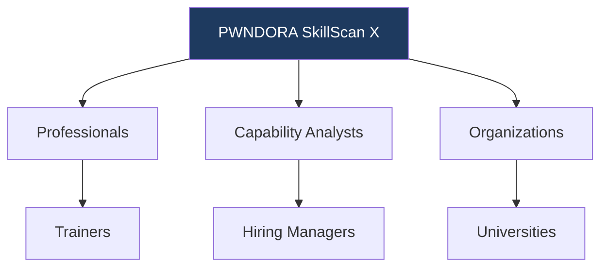

# PWNDORA SkillScan X — User Personas

| | |
|---|---|
| **Document Version** | 1.0 |
| **Status** | Published |
| **Classification** | Internal |
| **Last Updated** | 2026-07-08 |
| **Owner** | Product Team |

## Revision History

| Version | Date | Author | Changes |
|---|---|---|---|
| 1.0 | 2026-07-08 | PWNDORA SkillScan X Team | Initial release |

---

## 1. Executive Summary

### Purpose

This document defines every stakeholder who interacts with PWNDORA SkillScan X. Understanding users allows the platform to be designed around real operational needs rather than assumptions. The personas described here guide product design, UX, AI design, assessment design, feature prioritization, and the future roadmap.

Every feature in PWNDORA SkillScan X should trace back to at least one persona. If a feature serves none of them, it should be questioned before being built.

---

## 2. Persona Framework



PWNDORA SkillScan X supports multiple user groups with distinct needs. Professionals complete assessments to validate and improve their skills. Capability analysts and hiring managers use assessment outputs to inform their hiring decisions. Organizations (trainers, universities) use platform data to measure and improve workforce readiness.

---

## 3. Stakeholder Classification

| Stakeholder | Category | Priority | Primary Interaction |
|---|---|---|---|
| Professional | Primary | P0 | Completes assessments, views reports |
| Capability Analyst | Primary | P0 | Creates assessments, reviews professional reports |
| Hiring Manager | Primary | P0 | Evaluates professional capability, makes hiring decisions |
| Trainer | Secondary | P1 | Assigns assessments, monitors cohort progress |
| University Administrator | Secondary | P1 | Measures program outcomes, reviews aggregate analytics |
| Platform Administrator | Internal | P2 | Manages users, blueprints, and system configuration |

---

## 4. Primary Personas

### Persona 1: Cybersecurity Student

| Attribute | Detail |
|---|---|
| **Title** | Cybersecurity Student |
| **Experience** | Beginner (0-1 years) |
| **Background** | CS/IT degree in progress, bootcamp participant, or self-taught |
| **Certifications** | None in progress, or preparing for Security+ |
| **Platform Experience** | TryHackMe, HackTheBox, CTF platforms |
| **Primary Goal** | Secure first cybersecurity internship or entry-level role |

#### Objectives

| Objective | Success Signal |
|---|---|
| Practice realistic assessments | Complete 3+ full assessments |
| Build confidence for technical capability assessments | Self-rated confidence improves 2+ points (1-5 scale) |
| Identify knowledge gaps | Clear visibility into domain-level strengths and weaknesses |
| Track progress over time | Score improvement across multiple assessment attempts |

#### Pain Points

| Pain Point | Impact |
|---|---|
| Does not know what to expect in technical capability assessments | Anxious and underprepared; cannot target study effectively |
| Memorizes answers instead of learning reasoning | Cracks under pressure when questions deviate from expected |
| Receives generic feedback from courses | Scores without explanation offer no improvement path |
| Limited practical experience with incident response | Cannot articulate decision-making process under pressure |

#### Platform Value

| Feature | How It Serves This Persona |
|---|---|
| Adaptive missions | Practice at appropriate difficulty; progress as skills improve |
| Explainable reports | Understand exactly why each score was assigned |
| Career Compass | Clear path from current skill level to assessment-ready |
| Role-specific scenarios | Practice for the specific role they are targeting |

### Persona 2: Fresh Graduate

| Attribute | Detail |
|---|---|
| **Title** | Cybersecurity Graduate |
| **Experience** | 0-2 years |
| **Background** | Recent cybersecurity or CS graduate |
| **Certifications** | Security+, Google Cybersecurity Certificate, or equivalent |
| **Platform Experience** | TryHackMe (Top 5-10%), HackTheBox (Intermediate) |
| **Primary Goal** | Land first SOC Analyst or Security Engineer role |

#### Objectives

| Objective | Success Signal |
|---|---|
| Validate technical skills to employers | Assessment report demonstrates capability to capability analysts |
| Improve ability to explain reasoning under pressure | Communication score improves across attempts |
| Practice incident response workflow | Missions completed with proper IR methodology |
| Stand out from other entry-level professionals | Capability profile differentiates from certification-only applicants |

#### Pain Points

| Pain Point | Impact |
|---|---|
| Weak assessment confidence | Good technical skills not reflected in assessment performance |
| Difficulty explaining decisions clearly | Assessors cannot assess depth of understanding |
| Limited industry exposure | No frame of reference for how real SOC teams operate |
| No feedback loop between assessment attempts | Same mistakes repeated across multiple assessments |

#### Platform Value

| Feature | How It Serves This Persona |
|---|---|
| Realistic incident scenarios | Experience that mirrors actual SOC analyst responsibilities |
| Reasoning evaluation | Learn to articulate decision-making process |
| Capability-analyst-ready report | Share capability profile with potential employers |
| Mission variety | Exposure to phishing, malware, credential theft, ransomware scenarios |

### Persona 3: SOC Analyst

| Attribute | Detail |
|---|---|
| **Title** | SOC Analyst (Tier 1-2) |
| **Experience** | 1-4 years in security operations |
| **Background** | Currently working in a SOC environment |
| **Certifications** | Security+, CySA+, or preparing for advanced certs |
| **Primary Goal** | Career advancement (Tier 2→3, or new role) |

#### Objectives

| Objective | Success Signal |
|---|---|
| Benchmark skills against industry standards | Compare domain scores against role requirements |
| Identify blind spots in current knowledge | Gap analysis reveals areas not encountered in current role |
| Practice advanced scenarios | Missions match difficulty of senior-level roles |
| Build evidence for promotion or job switch | Assessment report demonstrates capability beyond current title |

#### Pain Points

| Pain Point | Impact |
|---|---|
| Hard to find assessments matching actual job complexity | Beginner tools are too easy; no intermediate option |
| Current role may not cover all domains | Skills atrophy in areas not used daily |
| Wants technical feedback relevant to experienced professionals | Generic feedback is useless for someone with years of experience |
| No way to objectively prove capability for promotion | Subjective manager evaluation is the only metric |

#### Platform Value

| Feature | How It Serves This Persona |
|---|---|
| Advanced missions | Challenging scenarios that match senior role complexity |
| Multi-domain assessment | Evaluates breadth across SOC, DFIR, threat hunting, cloud |
| Skill benchmarking | Compare against NICE framework standards for target role |
| Detailed gap analysis | Identifies specific techniques and concepts to study |

### Persona 4: Capability Analyst

| Attribute | Detail |
|---|---|
| **Title** | Technical Capability Analyst / HR Business Partner |
| **Technical Knowledge** | Low to Medium |
| **Hiring Volume** | High (10-50+ professionals per role) |
| **Stakeholders** | Hiring manager, HR team |
| **Primary Goal** | Screen technical professionals efficiently and consistently |

#### Objectives

| Objective | Success Signal |
|---|---|
| Screen professionals without deep cybersecurity knowledge | Report clearly indicates readiness without technical interpretation |
| Reduce time-to-interview for qualified professionals | Fewer hours spent on initial technical screening |
| Standardize evaluation across all professionals | Same rubric applied to every applicant |
| Provide defensible rationale for hiring decisions | Evidence-backed scores that can be audited |

#### Pain Points

| Pain Point | Impact |
|---|---|
| Cannot personally judge technical cybersecurity ability | Must forward all professionals to busy hiring manager |
| Resumes and certifications are unreliable signals | Certified professionals fail interview; non-certified professionals excel |
| Subjective evaluations lead to inconsistent hiring | Same professional rated differently by different screeners |
| High volume makes deep screening impossible | Must choose between speed and accuracy |

#### Platform Value

| Feature | How It Serves This Persona |
|---|---|
| Capability-analyst-ready report | Clear readiness level and capability profile without cyber expertise needed |
| Capability dashboard | At-a-glance professional comparison |
| Assessment focus recommendations | Guides follow-up human interview on specific areas |
| Evidence-based scoring | Defensible rationale for every professional decision |

### Persona 5: Hiring Manager (SOC Manager)

| Attribute | Detail |
|---|---|
| **Title** | SOC Manager / Security Director |
| **Experience** | 5-15 years in cybersecurity |
| **Technical Knowledge** | High |
| **Team Size** | 5-20 analysts |
| **Primary Goal** | Hire analysts who can handle real incidents |

#### Objectives

| Objective | Success Signal |
|---|---|
| Evaluate operational readiness, not theoretical knowledge | Assessment measures how professionals respond to live incidents |
| Reduce bad hires that waste team training time | New hires contribute faster with less remediation |
| Standardize interview process across the team | Same evaluation criteria for every professional |
| Get visibility into professional reasoning process | Understand how professionals think, not just what they know |

#### Pain Points

| Pain Point | Impact |
|---|---|
| Inconsistent interviews across different team members | No standard for comparison across professionals |
| Professionals who interview well but struggle on the job | Interview signal does not predict job performance |
| Hard to assess operational judgment and trade-off awareness | Critical skill that standard interviews miss |
| No standardized scoring rubric for technical interviews | Every interviewer uses their own criteria |

#### Platform Value

| Feature | How It Serves This Persona |
|---|---|
| Capability reasoning evaluation | See how the professional thinks through incidents |
| Explainable evidence | Every score backed by specific professional statements |
| Decision quality analysis | Assess justification strength and risk awareness |
| Standardized rubric | Same criteria for every professional, every time |

---

## 5. Secondary Personas

### Persona 6: Cybersecurity Trainer

| Attribute | Detail |
|---|---|
| **Role** | Bootcamp instructor, corporate trainer, workshop facilitator |
| **Class Size** | 15-50 students per cohort |
| **Primary Goal** | Measure student progress and improve learning outcomes |

#### Objectives

| Objective | Success Signal |
|---|---|
| Assign standardized assessments at key milestones | Consistent evaluation across all students |
| Identify concepts students struggle with collectively | Curriculum adjustment based on aggregate gap analysis |
| Track individual student progress over time | Score improvement visible across the program |
| Demonstrate training outcomes to stakeholders | Placement rate improvement after program adoption |

#### Needs

| Need | Feature |
|---|---|
| Cohort analytics | Aggregate scores, completion rates, skill distribution |
| Individual progress tracking | Per-student score history and improvement |
| Curriculum gap identification | Domains where cohort scores are lowest |
| Assessment customization | Align missions to current curriculum topics |

### Persona 7: University Administrator

| Attribute | Detail |
|---|---|
| **Role** | Program director, department head, career services |
| **Stakeholders** | Faculty, employers hiring graduates, accreditation bodies |
| **Primary Goal** | Improve graduate placement rates in cybersecurity roles |

#### Objectives

| Objective | Success Signal |
|---|---|
| Measure student readiness against industry standards | Benchmark scores against NICE framework requirements |
| Demonstrate program outcomes to employer partners | Share aggregate capability data with recruiting partners |
| Identify curriculum strengths and gaps | Domain-level analysis across cohorts |
| Provide students with practical assessment experience | Students enter job market with assessment practice |

#### Needs

| Need | Feature |
|---|---|
| Program-level analytics | Cohort-wide capability distribution |
| Outcome reporting | Placement rate correlation with assessment scores |
| Skill trend analysis | Capability changes across semesters |
| Employer-ready reports | Shareable student capability profiles |

---

## 6. Enterprise Personas

Future platform users as the product scales beyond individual and team use:

| Persona | Use Case | When |
|---|---|---|
| SOC Team Lead | Assess readiness of entire team; identify training priorities | Phase 2 |
| MSSP Manager | Benchmark analysts across multiple client environments | Phase 2 |
| Security Consultant | Validate skills before client engagements | Phase 3 |
| Enterprise Learning Manager | Track workforce skill development at organizational scale | Phase 3 |
| Government Training Center | Standardized assessment for cleared professionals | Phase 3 |
| Certification Body | Validate exam readiness through practical assessment | Phase 3 |

---

## 7. Persona Goals Summary

| Persona | Primary Goal | Secondary Goal |
|---|---|---|
| Student | Become job-ready | Build confidence for assessments |
| Graduate | Secure first cybersecurity role | Differentiate from other professionals |
| SOC Analyst | Advance career | Benchmark against industry standards |
| Capability Analyst | Standardize professional screening | Reduce time-to-interview |
| Hiring Manager | Hire capable analysts | Evaluate reasoning, not recall |
| Trainer | Improve learner outcomes | Identify curriculum gaps |
| University | Increase graduate employability | Demonstrate program outcomes |

---

## 8. Pain Point Matrix

| Pain Point | Student | Graduate | Analyst | Capability Analyst | Manager |
|---|---|---|---|---|---|
| Generic interview questions | ✓ | ✓ | ✓ | ✓ | ✓ |
| Inconsistent evaluation | ✓ | ✓ | ✓ | ✓ | ✓ |
| Limited actionable feedback | ✓ | ✓ | | | |
| Cannot judge technical ability | | | | ✓ | |
| Screening does not scale | | | | ✓ | |
| Poor visibility into reasoning | ✓ | ✓ | | ✓ | ✓ |
| No standardized rubric | | | | ✓ | ✓ |
| Hard to find right difficulty level | ✓ | ✓ | ✓ | | |
| No skill benchmarking | ✓ | ✓ | ✓ | | |

---

## 9. User Journeys

### Professional Journey

```
Sign Up → Select Role → Upload JD → Review Blueprint →
Start Assessment → Complete Missions → Receive Report →
Review Career Compass → Practice → Reassessment
```

### Capability Analyst Journey

```
Create Assessment → Upload JD → Generate Blueprint →
Invite Professional → Professional Completes → Review Report →
Schedule Interview → Make Hiring Decision
```

### Trainer Journey

```
Create Cohort → Assign Assessment → Monitor Progress →
Review Analytics → Identify Curriculum Gaps → Recommend Learning
```

### University Administrator Journey

```
Define Program Outcomes → Select Assessment Template →
Assign to Cohort → Track Completion → Review Analytics →
Report Outcomes to Employer Partners
```

---

## 10. Decision Matrix

| Decision / Action | Student | Graduate | Analyst | Capability Analyst | Manager | Trainer | University |
|---|---|---|---|---|---|---|---|
| Selects role or uploads JD | ✓ | ✓ | ✓ | ✓ | | | |
| Completes assessment | ✓ | ✓ | ✓ | | | | |
| Views own report | ✓ | ✓ | ✓ | | | | |
| Views professional report | | | | ✓ | ✓ | ✓ | ✓ |
| Creates assessment | | | | ✓ | | ✓ | ✓ |
| Invites professionals | | | | ✓ | | | |
| Reviews cohort analytics | | | | | | ✓ | ✓ |
| Configures blueprints | | | | | | | ✓ |
| Manages users | | | | | | | |

---

## 11. Product Mapping

| Module | Student | Graduate | Analyst | Capability Analyst | Manager | Trainer | University |
|---|---|---|---|---|---|---|---|
| Role Intelligence | ✓ | ✓ | ✓ | ✓ | | | |
| Skill DNA Profile | ✓ | ✓ | ✓ | ✓ | | ✓ | ✓ |
| Assessment Execution | ✓ | ✓ | ✓ | | | | |
| Capability Reasoning | ✓ | ✓ | ✓ | ✓ | ✓ | ✓ | ✓ |
| MITRE Mapping | ✓ | ✓ | ✓ | ✓ | ✓ | ✓ | |
| Evidence Intelligence | ✓ | ✓ | ✓ | ✓ | ✓ | | |
| Career Compass | ✓ | ✓ | ✓ | | | ✓ | |
| Professional Report | ✓ | ✓ | ✓ | | | | |
| Capability Analyst Report | | | | ✓ | ✓ | | |
| Cohort Analytics | | | | | | ✓ | ✓ |
| Session Transcript | ✓ | ✓ | ✓ | ✓ | ✓ | | |

---

## 12. Success Criteria by Persona

### Professionals (Student, Graduate, Analyst)

| Criterion | Target |
|---|---|
| Complete assessment without external help | First attempt, no guidance needed |
| Understand strengths and weaknesses from report | Self-reported understanding > 4/5 |
| Improve score across reassessments | +15% by 3rd attempt |
| Report usefulness rating | > 4.0 / 5.0 |

### Capability Analysts

| Criterion | Target |
|---|---|
| Screening time per professional | < 30 minutes |
| Confidence in report accuracy | > 4.0 / 5.0 |
| Evaluation consistency across professionals | Same rubric, same standards |

### Hiring Managers

| Criterion | Target |
|---|---|
| Score correlation with on-job performance | r > 0.7 (calibration study) |
| Report provides sufficient evidence for decision | Self-reported sufficiency > 4/5 |

### Trainers and Universities

| Criterion | Target |
|---|---|
| Cohort analytics provide actionable insights | Identified curriculum gaps align with instructor observation |
| Student score improvement over program | +25% from first to last assessment |

---

## 13. Future Personas

| Persona | Use Case | Enabling Feature | Phase |
|---|---|---|---|
| Certification Body | Validate exam readiness through practical assessment | Certification pathway alignment | 3 |
| Government Agency | Clearance-aligned assessments with compliance requirements | Custom rubric engine | 3 |
| MSSP | Benchmark analysts across multiple client environments | Team analytics dashboard | 2 |
| Enterprise Cyber Academy | Track workforce skill development at organizational scale | Workforce intelligence | 3 |
| Career Changer | Transition from adjacent field (IT, networking) into security | Foundation-level assessment track | 2 |
| Security Consultant | Validate skills before client engagements | Skill certification profiles | 3 |

---

## 14. Persona Summary

```
Professional (Student / Graduate / Analyst)
        │
        ▼
  Assessment — Complete adaptive cyber missions
        │
        ▼
  Report — Receive explainable capability profile
        │
        ▼
  Career Compass — Actionable improvement path

────────────────────────────────────────────────

Capability Analyst
        │
        ▼
  Create Assessment — Configure from JD or template
        │
        ▼
  Review Reports — Evaluate professionals with evidence
        │
        ▼
  Decide — Informed hiring decision

────────────────────────────────────────────────

Hiring Manager
        │
        ▼
  Evaluate Reasoning — Read cyber analysis, not just scores
        │
        ▼
  Trust Evidence — Evidence-backed rationale for each dimension
        │
        ▼
  Hire Confidently — Defensible, standardized process

────────────────────────────────────────────────

Trainer / University
        │
        ▼
  Assign Assessments — Standardized evaluation for cohort
        │
        ▼
  Review Analytics — Aggregate skill distribution and gaps
        │
        ▼
  Improve Outcomes — Data-driven curriculum decisions
```

Every feature in PWNDORA SkillScan X should trace back to at least one of these personas. If a feature serves no persona, it does not belong in the MVP.

## Related Documents

- [User Journeys](09-user-journey.md)
- [Market Analysis](06-market-analysis.md)
- [Product Requirements](../docs/01-product/05-product-requirements.md)
- [Use Case Specification](../docs/03-functional-design/14-use-case-specification.md)
