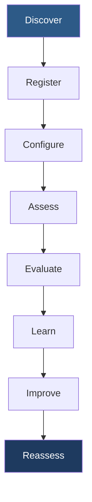
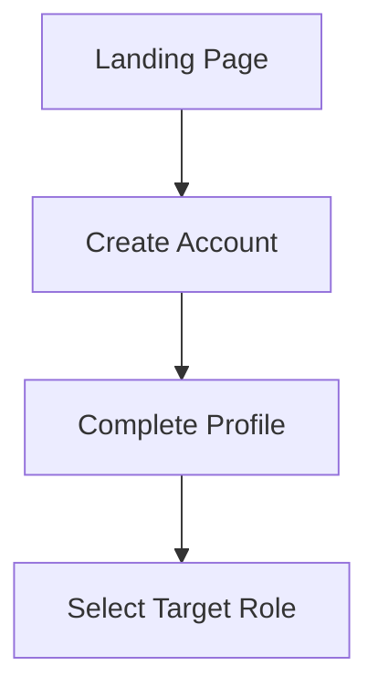
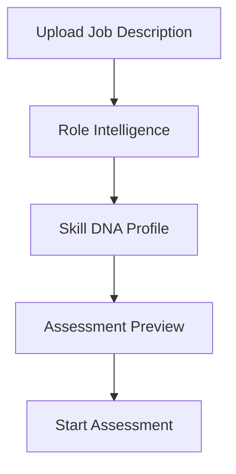
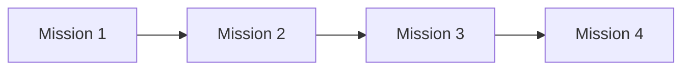
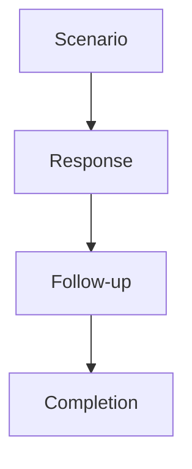
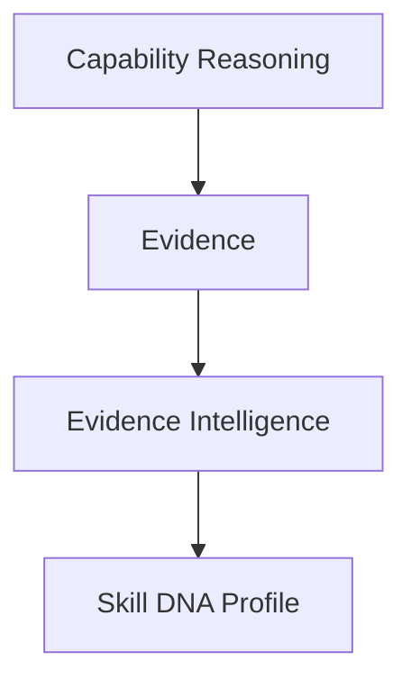
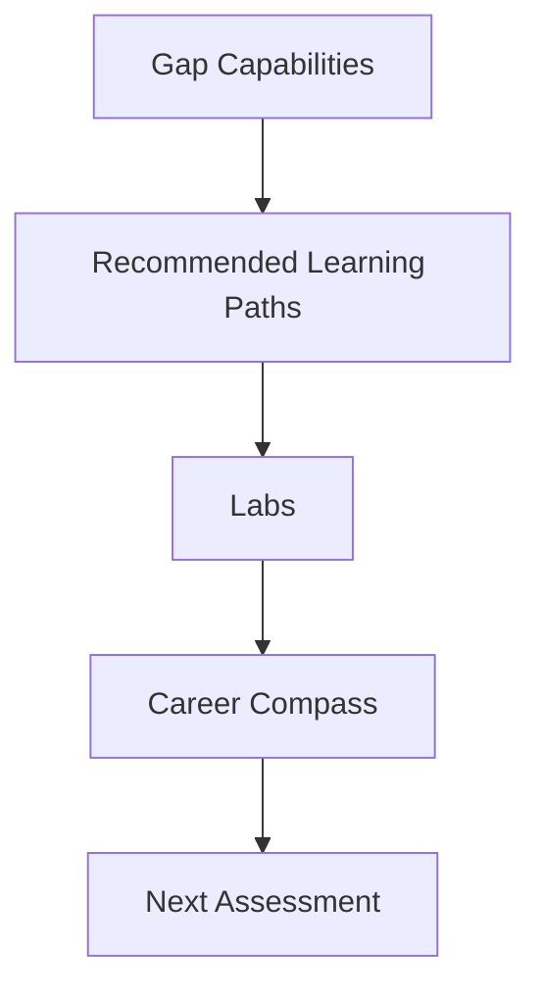
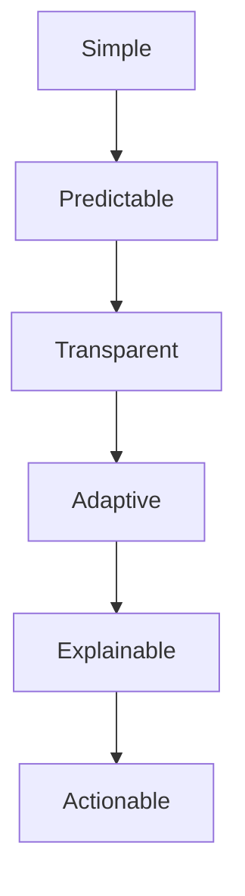

# PWNDORA SkillScan X — User Journeys

| | |
|---|---|
| **Document Version** | 1.0 |
| **Status** | Published |
| **Classification** | Internal |
| **Last Updated** | 2026-07-08 |
| **Owner** | Product Team |

## Revision History

| Version | Date | Author | Changes |
|---|---|---|---|
| 1.0 | 2026-07-08 | PWNDORA SkillScan X Team | Initial release |

---

## 1. Executive Summary

This document defines every major interaction a user performs within PWNDORA SkillScan X. It ensures the platform delivers a consistent, intuitive, and explainable experience across all user types.

**Core message:** We do not assess resumes. We assess cybersecurity capability.

---

## 2. Journey Overview

Every user journey follows the same high-level lifecycle.



---

## 3. User Types

Supported journeys:

- Professional
- Capability Analyst
- Hiring Manager
- Trainer
- University

---

## 4. Professional Journey

### Stage 1 — Registration



### Stage 2 — Assessment Preparation



Before the first mission, show the professional:

- Extracted role
- Required capabilities
- Estimated duration
- Mission overview
- Evaluation criteria
- Tips for the assessment

This reduces uncertainty, improves trust, and makes the experience feel more professional.

### Stage 3 — Assessment



Each mission:



### Stage 4 — Evaluation



### Stage 5 — Learning



---

## 5. Capability Analyst Journey

```
Login
     ↓
Create Assessment
     ↓
Upload JD
     ↓
Generate Assessment
     ↓
Invite Professional
     ↓
Professional Completes Assessment
     ↓
Review Report
     ↓
Schedule Technical Capability Assessment
```

---

## 6. Hiring Manager Journey

```
Receive Report
     ↓
Review Capabilities
     ↓
Analyze Evidence
     ↓
Identify Weak Areas
     ↓
Conduct Technical Capability Assessment
     ↓
Hiring Decision
```

---

## 7. Trainer Journey

```
Create Cohort
     ↓
Assign Assessment
     ↓
Monitor Progress
     ↓
Review Analytics
     ↓
Recommend Learning
     ↓
Reassessment
```

---

## 8. University Journey

```
Import Students
     ↓
Assign Assessments
     ↓
Review Cohort Analytics
     ↓
Placement Readiness
     ↓
Continuous Improvement
```

---

## 9. AI Interaction Journey

```
Job Description
     ↓
Skill DNA Profile
     ↓
Capability Blueprint
     ↓
Practical Challenge Generation
     ↓
Adaptive Questions
     ↓
Reasoning Evaluation
     ↓
Report Generation
     ↓
Learning Recommendations
```

---

## 10. Error Journeys

### Voice Recognition Failure

```
Voice Error
     ↓
Retry
     ↓
Manual Text Input
     ↓
Continue Assessment
```

### AI Evaluation Failure

```
Retry
     ↓
Fallback Message
     ↓
Preserve Session
     ↓
Continue
```

---

## 11. Success Journey

Ideal assessment flow:

```
Start
     ↓
Complete Missions
     ↓
Generate Report
     ↓
Review Career Compass
     ↓
Share Results
     ↓
Practice
     ↓
Improve
     ↓
Reassess
```

---

## 12. Journey Maps

### Professional

```
Register
     ↓
Upload JD
     ↓
Assessment
     ↓
Capability Reasoning
     ↓
Report
     ↓
Learning
```

### Capability Analyst

```
Create Assessment
     ↓
Invite Professional
     ↓
Receive Report
     ↓
Capability Assessment
```

---

## 13. Journey Metrics

| Metric | Description |
|---|---|
| Assessment completion rate | Percentage of started assessments that are submitted |
| Mission completion rate | Average missions completed per assessment |
| Average assessment duration | Mean time from start to submission |
| Drop-off rate | Percentage of users who leave at each stage |
| Report downloads | Number of times reports are exported |
| Reassessment rate | Percentage of professionals who take a second assessment |
| Career Compass usage | Percentage of professionals who view their learning plan |

---

## 14. Future Journey

```
Assessment
     ↓
Cyber Labs
     ↓
Certification
     ↓
Skill Tracking
     ↓
Career Growth
```

---

## 15. Conclusion

Every journey within PWNDORA SkillScan X should minimize friction while maximizing transparency, learning, and confidence. Users should always understand where they are, what happens next, and why the platform reached its conclusions.

### UX Principles

Every journey should satisfy:



---

## 16. References

| Reference | Document |
|---|---|
| User personas | `../02-research/08-user-personas.md` |
| Use cases | `../03-functional-design/14-use-case-specification.md` |
| Product requirements | `../01-product/05-product-requirements.md` |

## Related Documents

- [User Personas](08-user-personas.md)
- [Use Case Specification](../docs/03-functional-design/14-use-case-specification.md)
- [User Workflows](../docs/03-functional-design/13-user-workflows.md)
- [UI/UX Specification](../docs/03-functional-design/15-ui-ux-specification.md)
