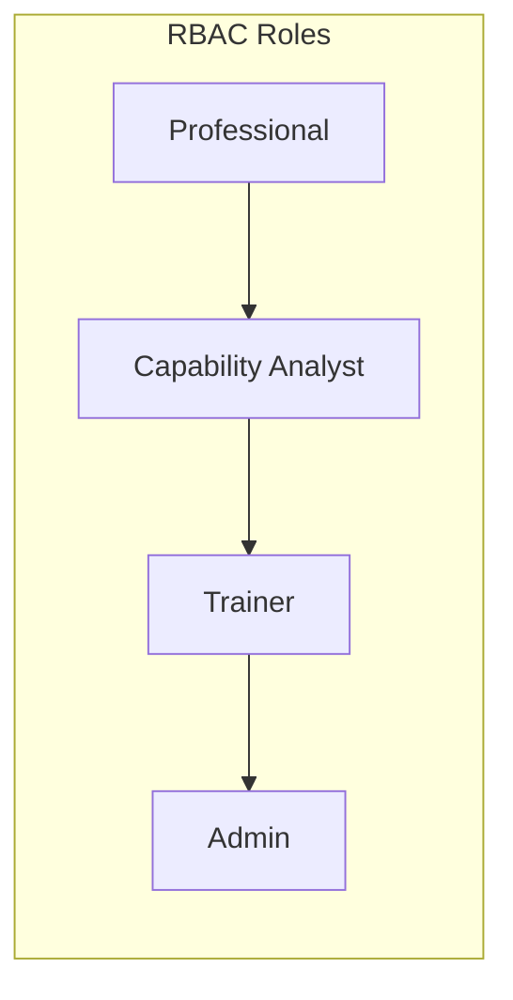

# PWNDORA SkillScan X — Functional Requirements

| | |
|---|---|
| **Document Version** | 1.0 |
| **Status** | Published |
| **Classification** | Internal |
| **Last Updated** | 2026-07-08 |
| **Owner** | Engineering Team |

## Revision History

| Version | Date | Author | Changes |
|---|---|---|---|
| 1.0 | 2026-07-08 | PWNDORA SkillScan X Team | Initial release |

---

## 1. Executive Summary

### Purpose

This document specifies every functional capability required for the PWNDORA SkillScan X platform. Each requirement is uniquely identified, testable, measurable, and traceable throughout the software lifecycle. This document serves as the contract between product, design, backend, frontend, AI, and QA teams.

### Scope

Requirements cover the complete MVP scope for the hackathon delivery, with priority levels guiding scope decisions. P0 requirements are critical for demo functionality; P1-P3 items are deferred based on time constraints.

### Priority Definitions

| Priority | Meaning | Action if Time-Constrained |
|---|---|---|
| **P0** | Critical. Demo cannot function without it. | Must ship. No exceptions. |
| **P1** | High. Essential for a polished MVP. | Ship if time permits after P0. |
| **P2** | Medium. Valuable but can be deferred. | Defer to Phase 2. |
| **P3** | Low. Post-hackathon enhancement. | Document for roadmap. |

---

## 2. Functional Requirement Overview

### 2.1 Module Prefixes

| Module | Prefix |
|---|---|
| Authentication | AUTH |
| User Management | USER |
| Role Intelligence | JD |
| Skill DNA Profile | RB |
| Assessment Planning | ASM |
| Mission Engine | MSN |
| Voice Processing | VOC |
| Capability Reasoning Engine | CRE |
| Evidence Intelligence Engine | EXP |
| Learning Path Engine | LRN |
| Report Generation | REP |
| Capability Analyst Dashboard | REC |
| Administration | ADM |
| System / Notifications | SYS |

### 2.2 Requirement Specification Format

Each requirement follows this structure:

```
ID: [Prefix-NNN]
Title: [Short description]
Description: [Detailed specification]
Input: [Expected input format]
Output: [Expected output format]
Preconditions: [What must be true before execution]
Postconditions: [What must be true after execution]
Priority: [P0/P1/P2/P3]
```

---

## 3. User Management

### USER-001: Account Registration

| Field | Value |
|---|---|
| **Description** | System shall allow a new user to create an account with email, password, and display name |
| **Input** | Email (validated format), password (min 8 chars, hashed with bcrypt), display name |
| **Output** | User record created, JWT issued, welcome email sent (async) |
| **Preconditions** | Email not already registered |
| **Postconditions** | User authenticated and redirected to role selection |
| **Priority** | P0 |

### USER-002: User Login

| Field | Value |
|---|---|
| **Description** | System shall authenticate returning users with email and password |
| **Input** | Email, password |
| **Output** | JWT token (24-hour expiry), user profile object |
| **Preconditions** | Account exists and is active |
| **Postconditions** | User authenticated, session initialized |
| **Priority** | P0 |

### USER-003: Password Reset

| Field | Value |
|---|---|
| **Description** | System shall allow users to request a password reset email |
| **Input** | Registered email address |
| **Output** | Password reset link sent to email |
| **Preconditions** | Account exists |
| **Postconditions** | Reset token generated, email queued |
| **Priority** | P2 |

### USER-004: User Profile Management

| Field | Value |
|---|---|
| **Description** | System shall allow authenticated users to update their profile information |
| **Input** | Updated fields (name, title, bio, preferences) |
| **Output** | Updated user profile |
| **Preconditions** | User is authenticated |
| **Postconditions** | Profile changes persisted |
| **Priority** | P1 |

### USER-005: Assessment History

| Field | Value |
|---|---|
| **Description** | System shall maintain a persistent history of all assessments completed by a user |
| **Input** | User ID |
| **Output** | List of assessments with dates, scores, role, status |
| **Preconditions** | User has completed at least one assessment |
| **Postconditions** | History displayed on dashboard |
| **Priority** | P0 |

---

## 4. Authentication

### AUTH-001: Secure Authentication

| Field | Value |
|---|---|
| **Description** | System shall authenticate requests using JWT Bearer tokens with HS256 signing |
| **Input** | JWT in Authorization header |
| **Output** | Authenticated user context or 401 |
| **Preconditions** | Valid token issued by system |
| **Postconditions** | Request authenticated for downstream processing |
| **Priority** | P0 |

### AUTH-002: Session Management

| Field | Value |
|---|---|
| **Description** | System shall maintain session state for authenticated users with configurable expiry |
| **Input** | JWT token |
| **Output** | Session context |
| **Preconditions** | Valid token |
| **Postconditions** | Session active until token expiry (24h) |
| **Priority** | P0 |

### AUTH-003: Logout

| Field | Value |
|---|---|
| **Description** | System shall invalidate the current session on logout |
| **Input** | Logout request with valid token |
| **Output** | Token invalidated, session ended |
| **Preconditions** | User is authenticated |
| **Postconditions** | Token no longer valid |
| **Priority** | P1 |

### AUTH-004: Role-Based Permissions

| Field | Value |
|---|---|
| **Description** | System shall support four user roles with distinct permissions: Professional, Capability Analyst, Trainer, Admin |
| **Input** | Role assignment at registration or by admin |
| **Output** | Role-appropriate UI and API access |
| **Preconditions** | User authenticated |
| **Postconditions** | Access controlled by role |
| **Priority** | P1 |

### Role Definitions



---

## 5. Role Intelligence

### JD-001: JD Upload

| Field | Value |
|---|---|
| **Description** | System shall accept job description uploads in PDF, DOCX, and TXT formats |
| **Input** | File upload (PDF/DOCX/TXT, max 2MB) or text paste |
| **Output** | Parsed text content ready for extraction |
| **Preconditions** | User is authenticated |
| **Postconditions** | JD content stored and queued for extraction |
| **Priority** | P0 |

### JD-002: JD Parsing and Extraction

| Field | Value |
|---|---|
| **Description** | System shall extract structured fields from unstructured job description text |
| **Input** | Raw job description text |
| **Output** | Structured extraction: job title, required skills (list), experience level (years), certifications (list), responsibilities (list) |
| **Preconditions** | JD content available |
| **Postconditions** | Structured extraction persisted |
| **Priority** | P0 |

### JD-003: Role Classification

| Field | Value |
|---|---|
| **Description** | System shall classify the role into a cybersecurity domain category |
| **Input** | Structured extraction from JD-002 |
| **Output** | Classification: SOC, DFIR, Threat Hunting, Cloud Security, IAM, Malware Analysis, General Security |
| **Preconditions** | JD extraction complete |
| **Postconditions** | Classification stored on Skill DNA Profile |
| **Priority** | P0 |

### JD-004: Difficulty Estimation

| Field | Value |
|---|---|
| **Description** | System shall estimate the appropriate assessment difficulty level from the experience requirement |
| **Input** | Experience level (years) and seniority title from extraction |
| **Output** | Difficulty level: Junior (0-2yr), Intermediate (2-5yr), Senior (5-10yr), Lead (10+yr) |
| **Preconditions** | JD extraction complete |
| **Postconditions** | Difficulty level stored on Skill DNA Profile |
| **Priority** | P0 |

### JD-005: Capability Profile Generation

| Field | Value |
|---|---|
| **Description** | System shall generate a capability profile mapping extracted skills to NICE framework domains |
| **Input** | Structured extraction, role classification, difficulty level |
| **Output** | Capability profile with domain mappings (3-6 NICE domains) |
| **Preconditions** | JD-003 and JD-004 complete |
| **Postconditions** | Capability profile available for Assessment Planner |
| **Priority** | P0 |

---

## 6. Skill DNA Profile

### RB-001: Profile Generation

| Field | Value |
|---|---|
| **Description** | System shall generate a canonical Skill DNA Profile from JD extraction and capability profile |
| **Input** | JD extraction, capability profile, domain classification |
| **Output** | Skill DNA Profile: skills, NICE roles, MITRE knowledge areas, capabilities, responsibilities, assessment objectives |
| **Preconditions** | JD-005 complete |
| **Postconditions** | Skill DNA Profile persisted as reusable artifact |
| **Priority** | P0 |

### RB-002: Framework Mapping

| Field | Value |
|---|---|
| **Description** | System shall map the Skill DNA Profile to NICE framework work roles and MITRE ATT&CK tactics |
| **Input** | Skill DNA Profile |
| **Output** | Mapped NICE work roles (1-3), relevant MITRE tactics (3-8) |
| **Preconditions** | RB-001 complete |
| **Postconditions** | Mappings stored on Skill DNA Profile |
| **Priority** | P0 |

### RB-003: Reusable Templates

| Field | Value |
|---|---|
| **Description** | System shall support saving Skill DNA Profiles as reusable templates for future assessments |
| **Input** | Skill DNA Profile ID |
| **Output** | Saved template available in role library |
| **Preconditions** | RB-001 complete |
| **Postconditions** | Template available for selection without JD upload |
| **Priority** | P1 |

### RB-004: Profile Versioning

| Field | Value |
|---|---|
| **Description** | System shall version Skill DNA Profiles to track changes over time |
| **Input** | Updated Skill DNA Profile |
| **Output** | New version created; previous version retained |
| **Preconditions** | RB-001 exists |
| **Postconditions** | Version history available |
| **Priority** | P2 |

---

## 7. Assessment Planning

### ASM-001: Capability Blueprint Generation

| Field | Value |
|---|---|
| **Description** | System shall generate a Capability Blueprint from the Skill DNA Profile, defining mission count, topics, difficulty, and evaluation criteria |
| **Input** | Skill DNA Profile |
| **Output** | Capability Blueprint: mission count (3-5), topic areas, difficulty range, estimated duration (20-45 min), NICE evaluation domains |
| **Preconditions** | RB-001 complete |
| **Postconditions** | Capability Blueprint ready for Mission Generator |
| **Priority** | P0 |

### ASM-002: Dynamic Parameters

| Field | Value |
|---|---|
| **Description** | System shall determine mission difficulty based on professional performance history |
| **Input** | Skill DNA Profile difficulty, professional past performance (if available) |
| **Output** | Starting difficulty level for mission 1 |
| **Preconditions** | ASM-001 complete |
| **Postconditions** | Difficulty calibrated per professional |
| **Priority** | P1 |

### ASM-003: Adaptive Progression

| Field | Value |
|---|---|
| **Description** | System shall define adaptive progression rules (difficulty adjustment, branching criteria) |
| **Input** | Capability Blueprint |
| **Output** | Progression rules: ±2 sigma adjustment thresholds, minimum turns per mission, completion criteria |
| **Preconditions** | ASM-001 complete |
| **Postconditions** | Progression rules available to Assessment Engine |
| **Priority** | P0 |

### ASM-004: Interrupted Session Resume

| Field | Value |
|---|---|
| **Description** | System shall allow professionals to resume an interrupted assessment from the last completed turn |
| **Input** | Session ID |
| **Output** | Restored session state at interruption point |
| **Preconditions** | Session exists with incomplete status, timeout < 24 hours |
| **Postconditions** | Assessment continues from interruption point |
| **Priority** | P1 |

### ASM-005: Assessment State Persistence

| Field | Value |
|---|---|
| **Description** | System shall persist complete assessment state to the database after every turn |
| **Input** | Turn data (message, score, session context) |
| **Output** | Persisted session snapshot |
| **Preconditions** | Active assessment session |
| **Postconditions** | Session recoverable on interruption |
| **Priority** | P0 |

---

## 8. Mission Engine

### MSN-001: Mission Generation

| Field | Value |
|---|---|
| **Description** | System shall generate realistic cybersecurity incident missions based on the Capability Blueprint |
| **Input** | Capability Blueprint |
| **Output** | Mission: incident description, role context, available tools/environment, expected decision points (3-5 per mission) |
| **Preconditions** | ASM-001 complete |
| **Postconditions** | Missions available for professional |
| **Priority** | P0 |

### MSN-002: Domain Coverage

| Field | Value |
|---|---|
| **Description** | System shall support mission generation across multiple cybersecurity domains |
| **Input** | Capability Blueprint domain specification |
| **Output** | Missions in specified domains: SOC Operations, DFIR, Threat Hunting, Cloud Security, Malware Analysis, IAM |
| **Preconditions** | ASM-001 complete |
| **Postconditions** | Missions aligned to domain coverage |
| **Priority** | P0 |

### MSN-003: Follow-up Question Generation

| Field | Value |
|---|---|
| **Description** | System shall generate context-aware follow-up questions that probe the depth of professional reasoning |
| **Input** | Current mission context, professional's previous response |
| **Output** | Follow-up question targeting reasoning depth, alternative consideration, or risk awareness |
| **Preconditions** | Active mission turn |
| **Postconditions** | Follow-up presented to professional |
| **Priority** | P0 |

### MSN-004: Dynamic Difficulty Adjustment

| Field | Value |
|---|---|
| **Description** | System shall increase or decrease mission difficulty within a ±2 sigma range based on response quality |
| **Input** | Current difficulty level, recent response scores (last 3 turns) |
| **Output** | Adjusted difficulty level for next turn |
| **Preconditions** | Minimum 2 turns completed |
| **Postconditions** | Difficulty adjusted for appropriate challenge |
| **Priority** | P0 |

### MSN-005: Branching Missions

| Field | Value |
|---|---|
| **Description** | System shall branch mission outcomes based on professional decisions (e.g., containment vs. investigation-first) |
| **Input** | Professional's decision at a branch point |
| **Output** | Branch-specific scenario continuation |
| **Preconditions** | Branch point defined in mission |
| **Postconditions** | Mission follows decision-appropriate path |
| **Priority** | P1 |

---

## 9. Assessment Session

### ASM-006: Mission Display

| Field | Value |
|---|---|
| **Description** | System shall display mission briefings with sufficient operational context for the professional to make informed decisions |
| **Input** | Mission content |
| **Output** | Formatted mission briefing in chat interface |
| **Preconditions** | Session started |
| **Postconditions** | Professional can read and respond |
| **Priority** | P0 |

### ASM-007: Response Recording

| Field | Value |
|---|---|
| **Description** | System shall capture professional responses with millisecond-precision timestamps |
| **Input** | Text or transcribed voice input |
| **Output** | Stored response with timestamp, turn number, mission ID |
| **Preconditions** | Mission displayed |
| **Postconditions** | Response persisted |
| **Priority** | P0 |

### ASM-008: Transcript Storage

| Field | Value |
|---|---|
| **Description** | System shall store the complete conversation transcript per session |
| **Input** | All messages (system + professional) with metadata |
| **Output** | Full transcript with turn order, timestamps, scores per turn |
| **Preconditions** | Session exists |
| **Postconditions** | Transcript available for review and report generation |
| **Priority** | P0 |

### ASM-009: Progress Tracking

| Field | Value |
|---|---|
| **Description** | System shall display real-time progress indicators during assessment (mission N of M, estimated time remaining) |
| **Input** | Session state |
| **Output** | Progress bar, mission counter, time indicator |
| **Preconditions** | Session active |
| **Postconditions** | Professional aware of progress |
| **Priority** | P1 |

### ASM-010: Session Pause/Resume

| Field | Value |
|---|---|
| **Description** | System shall allow the professional to pause the assessment and resume within the timeout window |
| **Input** | Pause command |
| **Output** | Session marked paused, state persisted |
| **Preconditions** | Session active |
| **Postconditions** | Session resumable within 24 hours |
| **Priority** | P1 |

---

## 10. Voice Processing

### VOC-001: Speech Recognition

| Field | Value |
|---|---|
| **Description** | System shall capture professional speech using browser Web Speech API |
| **Input** | Microphone audio (browser permission required) |
| **Output** | Transcribed text |
| **Preconditions** | Browser supports Web Speech API, microphone permission granted |
| **Postconditions** | Transcribed text available as response |
| **Priority** | P1 |

### VOC-002: Live Transcription Display

| Field | Value |
|---|---|
| **Description** | System shall display real-time transcription as the professional speaks |
| **Input** | Streaming speech recognition events |
| **Output** | Live-updating text in input area |
| **Preconditions** | VOC-001 active |
| **Postconditions** | Professional sees transcription in real-time |
| **Priority** | P1 |

### VOC-003: Manual Text Fallback

| Field | Value |
|---|---|
| **Description** | System shall provide a text input fallback when voice is unavailable or the professional prefers typing |
| **Input** | Text input from keyboard |
| **Output** | Same format as VOC-001 output |
| **Preconditions** | Professional selects text mode |
| **Postconditions** | Response processed identically to voice |
| **Priority** | P0 |

### VOC-004: Transcript Cleanup

| Field | Value |
|---|---|
| **Description** | System shall clean up speech recognition artifacts (filler words, false starts, repeated phrases) |
| **Input** | Raw transcription text |
| **Output** | Cleaned transcript |
| **Preconditions** | VOC-001 or VOC-003 complete |
| **Postconditions** | Cleaned version stored alongside raw version |
| **Priority** | P2 |

### VOC-005: Timestamp Storage

| Field | Value |
|---|---|
| **Description** | System shall store utterance-level timestamps to enable response latency analysis |
| **Input** | Speech start and end events |
| **Output** | Start time, end time, duration per utterance |
| **Preconditions** | VOC-001 active |
| **Postconditions** | Timing data available for analytics |
| **Priority** | P2 |

---

## 11. Capability Reasoning Engine

### CRE-001: Concept Extraction

| Field | Value |
|---|---|
| **Description** | System shall extract cybersecurity concepts and techniques mentioned in professional responses |
| **Input** | Professional response text, mission context |
| **Output** | Extracted concepts list with relevance confidence scores |
| **Preconditions** | Response received |
| **Postconditions** | Concepts available for downstream evaluation |
| **Priority** | P0 |

### CRE-002: Workflow Validation

| Field | Value |
|---|---|
| **Description** | System shall validate whether the professional's response follows proper incident response workflow (Prepare, Identify, Contain, Eradicate, Recover, Lessons) |
| **Input** | Extracted concepts, response text |
| **Output** | Workflow stage identification, completeness score, sequence correctness |
| **Preconditions** | CRE-001 complete |
| **Postconditions** | Workflow evaluation available for scoring |
| **Priority** | P0 |

### CRE-003: Decision Quality Evaluation

| Field | Value |
|---|---|
| **Description** | System shall evaluate the quality of professional decisions including justification strength and alternative consideration |
| **Input** | Response text, mission context, assessment rubrics |
| **Output** | Decision quality score (0-100), justification assessment (strong/moderate/weak), alternatives considered (list) |
| **Preconditions** | CRE-001 complete |
| **Postconditions** | Decision quality score available |
| **Priority** | P0 |

### CRE-004: Gap Identification

| Field | Value |
|---|---|
| **Description** | System shall identify relevant cybersecurity concepts the professional did not address |
| **Input** | Skill DNA Profile capabilities, professional extracted concepts |
| **Output** | Missing concepts list with relevance weighting |
| **Preconditions** | CRE-001 complete |
| **Postconditions** | Gap list available for explainability and learning |
| **Priority** | P0 |

### CRE-005: Communication Evaluation

| Field | Value |
|---|---|
| **Description** | System shall evaluate the clarity, structure, and technical precision of professional communication |
| **Input** | Response text |
| **Output** | Communication score (0-100), clarity assessment, technical precision notes |
| **Preconditions** | Response received |
| **Postconditions** | Communication score available |
| **Priority** | P1 |

### CRE-006: MITRE ATT&CK Mapping

| Field | Value |
|---|---|
| **Description** | System shall map extracted concepts to MITRE ATT&CK technique IDs and tactics |
| **Input** | Extracted concepts from CRE-001 |
| **Output** | Technique IDs with tactic classification, coverage percentage per tactic |
| **Preconditions** | CRE-001 complete |
| **Postconditions** | MITRE mapping available for report |
| **Priority** | P0 |

### CRE-007: Confidence Scoring

| Field | Value |
|---|---|
| **Description** | System shall generate a confidence score alongside each assessment dimension |
| **Input** | All evaluation results per dimension |
| **Output** | Confidence level (high/medium/low) per score dimension |
| **Preconditions** | CRE-001 through CRE-006 complete |
| **Postconditions** | Confidence levels available for report |
| **Priority** | P0 |

### CRE-008: Capability Score Aggregation

| Field | Value |
|---|---|
| **Description** | System shall aggregate per-turn and per-mission scores into overall capability domain scores |
| **Input** | All per-dimension scores across all turns and missions |
| **Output** | Domain scores (0-100), overall capability score (0-100), per-domain breakdown |
| **Preconditions** | All missions complete |
| **Postconditions** | Aggregated scores available for report |
| **Priority** | P0 |

---

## 12. Evidence Intelligence Engine

### EXP-001: Score Explanation Generation

| Field | Value |
|---|---|
| **Description** | System shall generate natural language explanations for each score dimension |
| **Input** | Score dimension, evidence items, mission context |
| **Output** | Natural language explanation (2-4 sentences) per dimension |
| **Preconditions** | CRE-001 through CRE-008 complete |
| **Postconditions** | Explanations available for display |
| **Priority** | P0 |

### EXP-002: Strength Identification

| Field | Value |
|---|---|
| **Description** | System shall identify the professional's top strengths with supporting evidence |
| **Input** | All scores, all evidence items |
| **Output** | Top 3-5 strengths with evidence citations |
| **Preconditions** | CRE complete |
| **Postconditions** | Strengths available for report |
| **Priority** | P0 |

### EXP-003: Weakness Identification

| Field | Value |
|---|---|
| **Description** | System shall identify the professional's primary improvement areas with supporting evidence |
| **Input** | All scores, gap list from CRE-004 |
| **Output** | Top 3-5 weaknesses with specific evidence |
| **Preconditions** | CRE complete |
| **Postconditions** | Weaknesses available for report |
| **Priority** | P0 |

### EXP-004: Evidence Generation

| Field | Value |
|---|---|
| **Description** | System shall cite specific professional statements that support each score |
| **Input** | Score dimension, professional transcript |
| **Output** | Evidence citations: quoted statements per score dimension |
| **Preconditions** | CRE complete |
| **Postconditions** | Evidence citations attached to scores |
| **Priority** | P0 |

### EXP-005: Improvement Recommendations

| Field | Value |
|---|---|
| **Description** | System shall generate specific, actionable improvement recommendations based on identified gaps |
| **Input** | Gap list from CRE-004, weakness list from EXP-003 |
| **Output** | 3-5 actionable recommendations with priority order |
| **Preconditions** | EXP-003 complete |
| **Postconditions** | Recommendations available for Career Compass |
| **Priority** | P0 |

---

## 13. Learning Path Engine

### LRN-001: Skill Gap Analysis

| Field | Value |
|---|---|
| **Description** | System shall identify skill gaps by comparing demonstrated scores against Skill DNA Profile requirements |
| **Input** | Domain scores, Skill DNA Profile capability requirements |
| **Output** | Gap list ranked by delta (requirement - performance) |
| **Preconditions** | Assessment complete with scores |
| **Postconditions** | Gap list available for topic recommendation |
| **Priority** | P0 |

### LRN-002: Topic Recommendation

| Field | Value |
|---|---|
| **Description** | System shall recommend learning topics ranked by gap impact and prerequisite order |
| **Input** | Gap list from LRN-001 |
| **Output** | Ranked topic list (minimum 3) with relevance explanation |
| **Preconditions** | LRN-001 complete |
| **Postconditions** | Topic list available for Career Compass |
| **Priority** | P0 |

### LRN-003: Resource Association

| Field | Value |
|---|---|
| **Description** | System shall associate curated learning resources (articles, labs, courses) with each recommended topic |
| **Input** | Topic list |
| **Output** | Resource links with type classification (article/video/lab/course) |
| **Preconditions** | LRN-002 complete |
| **Postconditions** | Resources attached to Career Compass |
| **Priority** | P0 |

### LRN-004: Career Compass Generation

| Field | Value |
|---|---|
| **Description** | System shall format learning recommendations into a structured, actionable Career Compass |
| **Input** | Topic list with resources |
| **Output** | Formatted roadmap: priority order, topic name, relevance, time estimate, resources, next assessment recommendation |
| **Preconditions** | LRN-003 complete |
| **Postconditions** | Career Compass displayed in professional report |
| **Priority** | P0 |

### LRN-005: Reassessment Suggestion

| Field | Value |
|---|---|
| **Description** | System shall suggest an appropriate timeframe for reassessment based on gap severity |
| **Input** | Gap severity, topic count, estimated study time |
| **Output** | Reassessment recommendation (immediate / 2 weeks / 1 month / 3 months) |
| **Preconditions** | LRN-004 complete |
| **Postconditions** | Reassessment suggestion displayed |
| **Priority** | P1 |

---

## 14. Report Generation

### REP-001: Professional Report

| Field | Value |
|---|---|
| **Description** | System shall generate a comprehensive professional-facing assessment report |
| **Input** | All scores, evidence, explanations, Career Compass |
| **Output** | Professional report: overall score, domain breakdown, Capability Heatmap, strengths/weaknesses, transcript, Career Compass |
| **Preconditions** | Assessment complete |
| **Postconditions** | Report displayed on results page |
| **Priority** | P0 |

### REP-002: Capability Analyst Report

| Field | Value |
|---|---|
| **Description** | System shall generate a capability-analyst-facing summary report with readiness level and interview guidance |
| **Input** | All scores, evidence, strengths, weaknesses |
| **Output** | Capability Analyst report: readiness level, domain scores, technical summary, assessment focus recommendations |
| **Preconditions** | Assessment complete |
| **Postconditions** | Report available for capability analyst view |
| **Priority** | P0 |

### REP-003: Capability Heatmap

| Field | Value |
|---|---|
| **Description** | System shall render a radar chart visualizing scores across assessed capability domains |
| **Input** | Domain scores (3-6 dimensions) |
| **Output** | Radar chart with labeled axes, score values, role benchmark overlay |
| **Preconditions** | At least 3 domains scored |
| **Postconditions** | Heatmap displayed in report |
| **Priority** | P0 |

### REP-004: Mission Timeline

| Field | Value |
|---|---|
| **Description** | System shall display a chronological mission timeline with per-mission scores and key decisions |
| **Input** | Mission-level scores, professional responses |
| **Output** | Timeline: mission label, score, key decisions, duration |
| **Preconditions** | Assessment complete |
| **Postconditions** | Timeline displayed in report |
| **Priority** | P1 |

### REP-005: Assessment Summary

| Field | Value |
|---|---|
| **Description** | System shall generate a one-page assessment summary with key metrics |
| **Input** | Overall score, domain scores, readiness level, MITRE coverage |
| **Output** | Summary card: role, date, duration, overall score, top strength, top weakness, readiness level |
| **Preconditions** | Assessment complete |
| **Postconditions** | Summary displayed on dashboard |
| **Priority** | P0 |

### REP-006: PDF Export

| Field | Value |
|---|---|
| **Description** | System shall support PDF export of assessment reports |
| **Input** | Report data |
| **Output** | PDF document with formatted report content |
| **Preconditions** | Report generated |
| **Postconditions** | PDF available for download |
| **Priority** | P2 |

---

## 15. Capability Analyst Dashboard

### REC-001: Assessment Creation

| Field | Value |
|---|---|
| **Description** | System shall allow capability analysts to create new assessments based on job descriptions or role templates |
| **Input** | JD upload or role template selection |
| **Output** | Assessment created with unique invite link |
| **Preconditions** | User has capability analyst role |
| **Postconditions** | Assessment available for professional invitation |
| **Priority** | P1 |

### REC-002: Professional Invitation

| Field | Value |
|---|---|
| **Description** | System shall generate unique assessment invitation links for professionals |
| **Input** | Professional email |
| **Output** | Invitation email with unique link |
| **Preconditions** | Assessment created |
| **Postconditions** | Invitation sent, professional record created |
| **Priority** | P1 |

### REC-003: Report Review

| Field | Value |
|---|---|
| **Description** | System shall display professional assessment reports in capability analyst view |
| **Input** | Assessment ID |
| **Output** | Full capability analyst report (REP-002) |
| **Preconditions** | Assessment completed by professional |
| **Postconditions** | Report displayed |
| **Priority** | P1 |

### REC-004: Professional Comparison

| Field | Value |
|---|---|
| **Description** | System shall support side-by-side comparison of multiple professionals |
| **Input** | 2-5 professional assessment IDs |
| **Output** | Comparison table: overall score, domain scores, strengths, weaknesses |
| **Preconditions** | Multiple completed assessments available |
| **Postconditions** | Comparison view rendered |
| **Priority** | P2 |

### REC-005: Progress Tracking

| Field | Value |
|---|---|
| **Description** | System shall display the status of all invited professionals (pending, in-progress, completed) |
| **Input** | Capability Analyst ID |
| **Output** | Professional list with status indicators |
| **Preconditions** | Capability Analyst has invited professionals |
| **Postconditions** | Status dashboard displayed |
| **Priority** | P2 |

---

## 16. Administration

### ADM-001: User Management

| Field | Value |
|---|---|
| **Description** | System shall allow admins to view, create, disable, and manage user accounts |
| **Input** | Admin action + user identifier |
| **Output** | User record created/updated/disabled |
| **Preconditions** | User has admin role |
| **Postconditions** | User state changed |
| **Priority** | P2 |

### ADM-002: Blueprint Management

| Field | Value |
|---|---|
| **Description** | System shall allow admins to create, edit, and version Skill DNA Profiles |
| **Input** | Blueprint editor actions |
| **Output** | Updated Skill DNA Profile library |
| **Preconditions** | User has admin role |
| **Postconditions** | Blueprint changes available for assessments |
| **Priority** | P2 |

### ADM-003: Rubric Version Management

| Field | Value |
|---|---|
| **Description** | System shall allow admins to manage scoring rubric versions |
| **Input** | Rubric editor actions |
| **Output** | Updated rubric with version tag |
| **Preconditions** | User has admin role |
| **Postconditions** | Rubric changes applied to future assessments |
| **Priority** | P3 |

### ADM-004: Assessment Template Management

| Field | Value |
|---|---|
| **Description** | System shall allow admins to manage assessment templates |
| **Input** | Template editor actions |
| **Output** | Updated template library |
| **Preconditions** | User has admin role |
| **Postconditions** | Templates available for capability analyst use |
| **Priority** | P2 |

### ADM-005: System Logs

| Field | Value |
|---|---|
| **Description** | System shall provide read-only access to system logs for debugging and monitoring |
| **Input** | Filter parameters (date range, severity, module) |
| **Output** | Log entries with correlation IDs |
| **Preconditions** | User has admin role |
| **Postconditions** | Logs displayed |
| **Priority** | P2 |

---

## 17. Notifications

### SYS-001: Assessment Completion Notification

| Field | Value |
|---|---|
| **Description** | System shall notify the capability analyst when a professional completes an assessment |
| **Input** | Assessment completion event |
| **Output** | Notification to capability analyst (in-app + email) |
| **Preconditions** | Professional has capability analyst assignment |
| **Postconditions** | Capability analyst notified |
| **Priority** | P1 |

### SYS-002: Report Available Notification

| Field | Value |
|---|---|
| **Description** | System shall notify the professional when their assessment report is ready |
| **Input** | Report generation event |
| **Output** | In-app notification + optional email |
| **Preconditions** | Assessment complete, report generated |
| **Postconditions** | Professional notified |
| **Priority** | P1 |

### SYS-003: Assessment Invitation

| Field | Value |
|---|---|
| **Description** | System shall send assessment invitation emails with unique access links |
| **Input** | Professional email, assessment ID |
| **Output** | Email with invitation link |
| **Preconditions** | Capability analyst initiates invitation |
| **Postconditions** | Invitation sent |
| **Priority** | P1 |

### SYS-004: Reminder Notification

| Field | Value |
|---|---|
| **Description** | System shall send reminder notifications for incomplete assessments after 48 hours |
| **Input** | Incomplete assessment older than 48h |
| **Output** | Reminder email to professional |
| **Preconditions** | Assessment invited but not started |
| **Postconditions** | Reminder sent |
| **Priority** | P2 |

---

## 18. Logging

### LOG-001: Assessment Lifecycle Logging

| Field | Value |
|---|---|
| **Description** | System shall log all assessment lifecycle events: created, started, turn_completed, paused, resumed, completed, timed_out |
| **Input** | Assessment lifecycle event |
| **Output** | Log entry with assessment ID, event type, timestamp, metadata |
| **Preconditions** | Assessment exists |
| **Postconditions** | Lifecycle traceable |
| **Priority** | P0 |

### LOG-002: AI Agent Performance Logging

| Field | Value |
|---|---|
| **Description** | System shall log each AI agent invocation: start time, end time, success/failure, token count, latency |
| **Input** | Agent execution event |
| **Output** | Log entry with agent name, session ID, timing, token usage, result status |
| **Preconditions** | Agent invoked |
| **Postconditions** | Agent performance traceable |
| **Priority** | P0 |

### LOG-003: API Request Logging

| Field | Value |
|---|---|
| **Description** | System shall log all API requests with method, path, status code, duration, and correlation ID |
| **Input** | HTTP request/response |
| **Output** | Log entry with request metadata |
| **Preconditions** | API endpoint called |
| **Postconditions** | API usage traceable |
| **Priority** | P1 |

### LOG-004: Error Logging

| Field | Value |
|---|---|
| **Description** | System shall log all errors with stack trace, context, and correlation ID |
| **Input** | Exception or error event |
| **Output** | Log entry with error details |
| **Preconditions** | Error occurred |
| **Postconditions** | Error traceable for debugging |
| **Priority** | P0 |

### LOG-005: Session Event Logging

| Field | Value |
|---|---|
| **Description** | System shall log session events: create, authenticate, expire, terminate |
| **Input** | Session event |
| **Output** | Log entry with session ID, event type, timestamp |
| **Preconditions** | Session action occurs |
| **Postconditions** | Session lifecycle traceable |
| **Priority** | P1 |

---

## 19. Error Handling

### ERR-001: Transient AI Failure Retry

| Field | Value |
|---|---|
| **Description** | System shall retry transient AI API failures with exponential backoff (3 attempts) |
| **Input** | Failed AI API call |
| **Output** | Retry attempt or graceful degradation after max retries |
| **Preconditions** | AI API call fails with retryable error |
| **Postconditions** | Call succeeds or partial results returned |
| **Priority** | P0 |

### ERR-002: Input Validation

| Field | Value |
|---|---|
| **Description** | System shall validate all user inputs before processing (type, format, length, range) |
| **Input** | User input to any endpoint |
| **Output** | Validated input or 422 with field-level error details |
| **Preconditions** | Request received |
| **Postconditions** | Invalid input rejected with clear error |
| **Priority** | P0 |

### ERR-003: Session State Preservation

| Field | Value |
|---|---|
| **Description** | System shall preserve session state on any error to prevent data loss |
| **Input** | Error during assessment |
| **Output** | Session state committed before error response |
| **Preconditions** | Error occurs during assessment |
| **Postconditions** | Session recoverable after error resolution |
| **Priority** | P0 |

### ERR-004: User-Friendly Error Messages

| Field | Value |
|---|---|
| **Description** | System shall display user-friendly error messages instead of technical error details |
| **Input** | Error event |
| **Output** | User-facing message (no stack traces, no technical jargon) |
| **Preconditions** | Error occurs |
| **Postconditions** | User sees actionable message |
| **Priority** | P0 |

### ERR-005: Correlation ID Logging

| Field | Value |
|---|---|
| **Description** | System shall attach a unique correlation ID to every request for end-to-end tracing |
| **Input** | HTTP request |
| **Output** | Correlation ID in response header and all log entries |
| **Preconditions** | Request received |
| **Postconditions** | Request traceable across services |
| **Priority** | P1 |

### Error Response Schema

```json
{
  "error": {
    "code": "SESSION_NOT_FOUND",
    "message": "The assessment session could not be found. It may have expired.",
    "correlation_id": "req_abc123",
    "timestamp": "2026-07-08T12:00:00Z"
  }
}
```

---

## 20. Functional Requirement Traceability Matrix

| Requirement | Module | Priority | MVP | Dependency |
|---|---|---|---|---|
| USER-001 | User Management | P0 | Yes | None |
| USER-002 | User Management | P0 | Yes | USER-001 |
| USER-005 | User Management | P0 | Yes | USER-001 |
| AUTH-001 | Authentication | P0 | Yes | USER-001 |
| AUTH-002 | Authentication | P0 | Yes | AUTH-001 |
| AUTH-003 | Authentication | P1 | Yes | AUTH-001 |
| JD-001 | Role Intelligence | P0 | Yes | AUTH-001 |
| JD-002 | Role Intelligence | P0 | Yes | JD-001 |
| JD-003 | Role Intelligence | P0 | Yes | JD-002 |
| JD-004 | Role Intelligence | P0 | Yes | JD-002 |
| JD-005 | Role Intelligence | P0 | Yes | JD-003, JD-004 |
| RB-001 | Skill DNA Profile | P0 | Yes | JD-005 |
| RB-002 | Skill DNA Profile | P0 | Yes | RB-001 |
| RB-003 | Skill DNA Profile | P1 | No | RB-001 |
| ASM-001 | Assessment Planning | P0 | Yes | RB-001 |
| ASM-003 | Assessment Planning | P0 | Yes | ASM-001 |
| ASM-005 | Assessment Planning | P0 | Yes | ASM-003 |
| MSN-001 | Mission Engine | P0 | Yes | ASM-001 |
| MSN-002 | Mission Engine | P0 | Yes | ASM-001 |
| MSN-003 | Mission Engine | P0 | Yes | MSN-001 |
| MSN-004 | Mission Engine | P0 | Yes | MSN-001 |
| VOC-003 | Voice Processing | P0 | Yes | None (text mode) |
| ASM-006 | Assessment Session | P0 | Yes | MSN-001 |
| ASM-007 | Assessment Session | P0 | Yes | ASM-006 |
| ASM-008 | Assessment Session | P0 | Yes | ASM-007 |
| CRE-001 | Capability Reasoning | P0 | Yes | ASM-007 |
| CRE-002 | Capability Reasoning | P0 | Yes | CRE-001 |
| CRE-003 | Capability Reasoning | P0 | Yes | CRE-001 |
| CRE-004 | Capability Reasoning | P0 | Yes | CRE-001 |
| CRE-006 | Capability Reasoning | P0 | Yes | CRE-001 |
| CRE-007 | Capability Reasoning | P0 | Yes | CRE-002, CRE-003 |
| CRE-008 | Capability Reasoning | P0 | Yes | CRE-007 |
| EXP-001 | Evidence Intelligence | P0 | Yes | CRE-008 |
| EXP-002 | Evidence Intelligence | P0 | Yes | CRE-008 |
| EXP-003 | Evidence Intelligence | P0 | Yes | CRE-008 |
| EXP-004 | Evidence Intelligence | P0 | Yes | CRE-008 |
| EXP-005 | Evidence Intelligence | P0 | Yes | EXP-003 |
| LRN-001 | Learning Path Engine | P0 | Yes | CRE-008 |
| LRN-002 | Learning Path Engine | P0 | Yes | LRN-001 |
| LRN-003 | Learning Path Engine | P0 | Yes | LRN-002 |
| LRN-004 | Learning Path Engine | P0 | Yes | LRN-003 |
| REP-001 | Report Generation | P0 | Yes | CRE-008, EXP-005 |
| REP-002 | Report Generation | P0 | Yes | CRE-008, EXP-005 |
| REP-003 | Report Generation | P0 | Yes | REP-001 |
| REP-005 | Report Generation | P0 | Yes | REP-001 |
| LOG-001 | Logging | P0 | Yes | None |
| LOG-002 | Logging | P0 | Yes | None |
| LOG-004 | Logging | P0 | Yes | None |
| ERR-001 | Error Handling | P0 | Yes | None |
| ERR-002 | Error Handling | P0 | Yes | None |
| ERR-003 | Error Handling | P0 | Yes | None |
| ERR-004 | Error Handling | P0 | Yes | None |

### MVP Scope Summary

| Priority | Count | Categories |
|---|---|---|
| P0 | 41 | Core assessment pipeline, auth, scoring, reporting |
| P1 | 12 | Voice, resume, capability analyst dashboard, notifications |
| P2 | 10 | Admin, PDF export, comparison, versioning |
| P3 | 2 | Rubric management, advanced analytics |
| **Total** | **65** | |

The P0 requirements define the minimum viable demo. If the team delivers all P0 items, the platform demonstrates the complete core value proposition: JD → assessment → reasoning evaluation → explainable report → Career Compass. P1-P3 items should only be pursued after all P0 items are stable and tested.

## Related Documents

- [Product Requirements](../docs/01-product/05-product-requirements.md)
- [Non-Functional Requirements](../docs/03-functional-design/11-non-functional-requirements.md)
- [System Features](../docs/03-functional-design/12-system-features.md)
- [Database Design](../docs/05-data-api/21-database-design.md)
