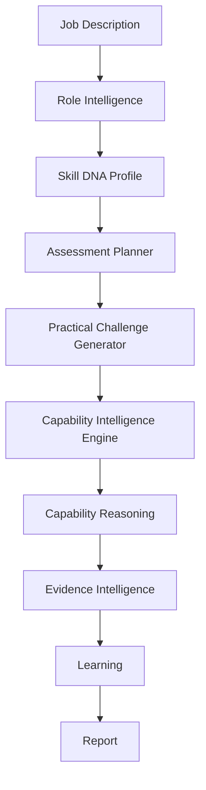
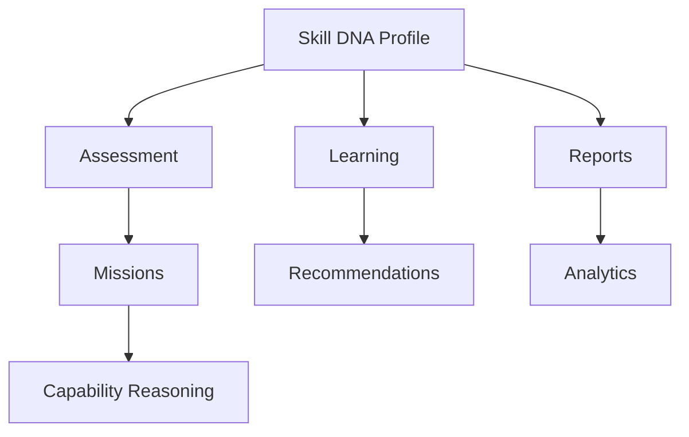
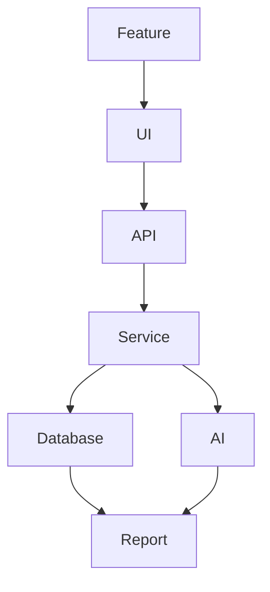

# PWNDORA SkillScan X — System Features

| | |
|---|---|
| **Document Version** | 1.0 |
| **Status** | Published |
| **Classification** | Internal |
| **Last Updated** | 2026-07-08 |
| **Owner** | Product Team |

## Revision History

| Version | Date | Author | Changes |
|---|---|---|---|
| 1.0 | 2026-07-08 | PWNDORA SkillScan X Team | Initial release |

---

## 1. Executive Summary

This document specifies every major product feature within PWNDORA SkillScan X. Each feature includes business purpose, functional behavior, UI expectations, backend responsibilities, AI workflow, database interactions, validation rules, API requirements, and success criteria.

This is where the project stops being a collection of ideas and becomes an engineering specification.

---

## 2. Feature Classification

| ID | Feature | Priority | MVP |
|---|---|---|---|
| F-001 | Authentication | P1 | No |
| F-002 | Role Intelligence | P0 | Yes |
| F-003 | Skill DNA Profile | P0 | Yes |
| F-004 | Capability Intelligence Engine | P0 | Yes |
| F-005 | Practical Challenge Generator | P0 | Yes |
| F-006 | Voice Assessment | P0 | Yes |
| F-007 | Capability Reasoning | P0 | Yes |
| F-008 | Evidence Intelligence | P0 | Yes |
| F-009 | Career Compass | P1 | Yes |
| F-010 | Reports | P0 | Yes |
| F-011 | Capability Analyst Dashboard | P2 | No |

---

## 3. Platform Feature Map



---

## 4. Feature F-001: User Authentication

### Objective

Allow users to securely access PWNDORA SkillScan X.

**Frontend**
- Login page
- Register page
- Forgot password
- Session handling

**Backend**
- Authentication service
- JWT generation
- Password hashing
- Session validation

**Database**

Tables: `users`, `sessions`

**API**

```
POST /auth/register
POST /auth/login
POST /auth/logout
GET  /auth/me
```

---

## 5. Feature F-002: Role Intelligence

### Purpose

Transform an uploaded job description into structured assessment requirements.

**Input**
- PDF, DOCX, TXT

**AI Processing — Extract:**
- Role
- Experience
- Skills
- Responsibilities
- Certifications
- Seniority

**Output:** Skill DNA Profile

**Backend Flow:**
```
Parser → AI Extraction → Validation → Storage
```

**Database:** `job_descriptions`, `skill_dna_profiles`

---

## 6. Feature F-003: Skill DNA Profile

### Purpose

Create a canonical representation of the target role's capability fingerprint.

**Contains:**
- Capabilities
- Skills
- Knowledge Areas
- Responsibilities
- Learning Objectives
- Assessment Objectives

**UI:** Role summary, Skill DNA Graph, assessment overview

**Backend:** Skill DNA Profile generation, validation, persistence

The Skill DNA Profile is the central domain model:



Assessments consume the Skill DNA Profile. Learning recommendations consume the same Skill DNA Profile. Reports reference it. Analytics aggregate across it. Future features can reuse it without redesigning the platform.

---

## 7. Feature F-004: Capability Intelligence Engine

### Purpose

Manage the complete assessment lifecycle.

**Workflow:**
```
Skill DNA Profile → Assessment Plan → Mission Flow → Evaluation → Completion
```

**Responsibilities:**
- Session state
- Timing
- Progress
- Adaptive flow
- Retry handling

---

## 8. Feature F-005: Practical Challenge Generator

### Purpose

Generate adaptive cybersecurity practical challenges.

**Mission Structure:**
```
Scenario → Question → Response → Follow-up → Completion
```

**Mission Types:**
- SOC
- DFIR
- Threat Hunting
- Cloud
- Malware
- IAM

**AI — Generate:**
- Context
- Objectives
- Questions
- Expected reasoning
- Rubrics

---

## 9. Feature F-006: Voice Assessment

### Purpose

Capture spoken responses.

**Frontend:**
- Microphone
- Live transcript
- Retry
- Text fallback

**Backend:**
- Transcript cleanup
- Timestamping
- Session storage

**Failure Flow:**
```
Voice Error → Retry → Text Input → Continue
```

---

## 10. Feature F-007: Capability Reasoning Engine

### Purpose

Evaluate cybersecurity thinking and capability.

**Pipeline:**
```
Transcript
     ↓
Concept Extraction
     ↓
Workflow Validation
     ↓
Decision Analysis
     ↓
Risk Evaluation
     ↓
MITRE Mapping
     ↓
Capability Scoring
```

**Outputs:**
- Capabilities
- Missing concepts
- Evidence
- Confidence
- Readiness

---

## 11. Feature F-008: Evidence Intelligence Engine

### Purpose

Explain every assessment score with traceable evidence.

**Outputs:**
- Why score was assigned
- Covered concepts
- Missing concepts
- Decision quality
- Improvement recommendations

**Report Example:**
```
Strengths
     ↓
Weaknesses
     ↓
Evidence
     ↓
Recommendations
```

---

## 12. Feature F-009: Learning Path Engine

### Purpose

Generate personalized improvement plans via the Career Compass.

**Pipeline:**
```
Assessment → Weak Capabilities → Learning Topics → Labs → Career Compass → Reassessment
```

**Outputs:**
- Learning plan
- Practice Career Compass
- Suggested reassessment date

---

## 13. Feature F-010: Reporting Engine

### Professional Report

- Capability profile
- Capability Heatmap
- Timeline
- Career Compass

### Capability Analyst Report

- Capability matrix
- Evidence summary
- Capability Assessment focus
- Role alignment

### Export Formats

- PDF
- JSON

---

## 14. Feature F-011: Capability Analyst Dashboard

### Capabilities

```
Upload JD → Create Assessment → Invite Professionals → Review Reports → Compare Results
```

### Future

- Analytics
- Hiring pipeline
- Organization dashboard

---

## 15. Feature Dependencies

```
Authentication
     ↓
Role Intelligence
     ↓
Skill DNA Profile
     ↓
Capability Intelligence Engine
     ↓
Practical Challenge Generator
     ↓
Capability Reasoning
     ↓
Evidence Intelligence
     ↓
Learning
     ↓
Reports
```

A downstream feature cannot function correctly if an upstream dependency fails.

---

## 16. MVP Scope

### Included in Hackathon

- JD upload
- Skill DNA Profile generation
- Adaptive mission generation
- Voice/text responses
- Capability Reasoning Engine
- Evidence Intelligence Engine
- Professional report
- Career Compass

### Excluded

- Capability Analyst management
- Team analytics
- Enterprise administration
- ATS integration
- Multi-tenant support

---

## 17. Future Features

- NICE Workforce Framework alignment
- Hands-on cyber ranges
- SIEM replay assessments
- Threat intelligence integration
- Cloud security simulations
- Certification preparation
- Organization benchmarking
- AI model selection
- Multi-language assessments

---

## 18. Acceptance Criteria

A feature is complete when:

- Functional requirements are implemented.
- UI matches the design specification.
- API contracts are satisfied.
- Database schema supports the feature.
- AI outputs conform to the expected schema.
- Unit and integration tests pass.
- User acceptance criteria are met.
- Documentation is updated.

---

## Feature Relationship Diagram



Every feature should be independently testable while integrating cleanly into the overall platform.

## Related Documents

- [User Workflows](13-user-workflows.md)
- [Use Case Specification](14-use-case-specification.md)
- [Functional Requirements](../docs/02-research/10-functional-requirements.md)
- [System Architecture](../docs/04-architecture/16-system-architecture.md)

---

## 19. References

| Reference | Document |
|---|---|
| User stories | `../03-functional-design/13-user-workflows.md` |
| Use cases | `../03-functional-design/14-use-case-specification.md` |
| Functional requirements | `../02-research/10-functional-requirements.md` |
| Product requirements | `../01-product/05-product-requirements.md` |
