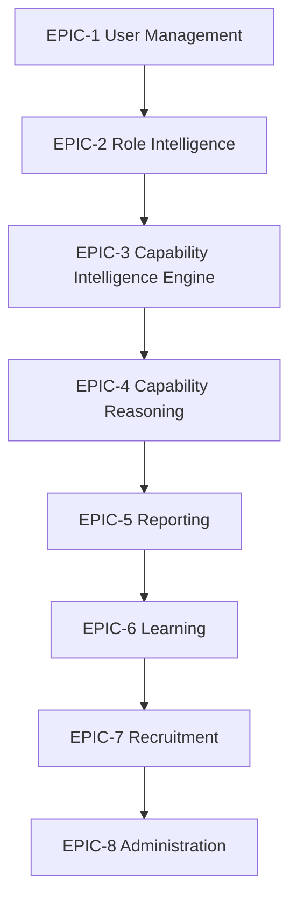
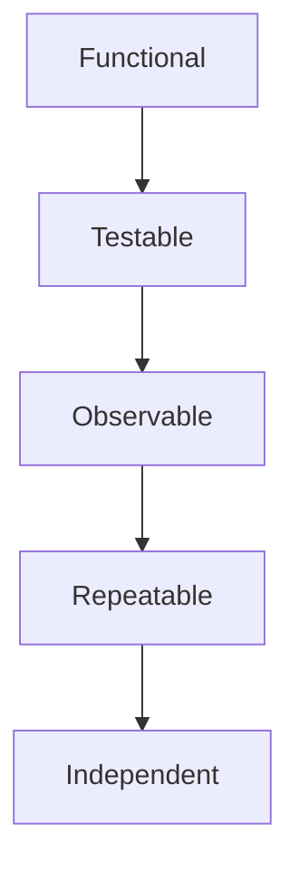
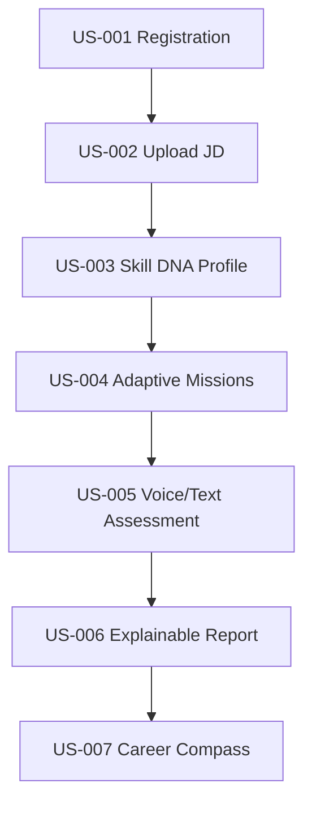
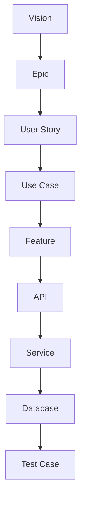

# PWNDORA SkillScan X — User Workflows

| | |
|---|---|
| **Document Version** | 1.0 |
| **Status** | Published |
| **Classification** | Internal |
| **Last Updated** | 2026-07-08 |
| **Owner** | Product Team |

## Revision History

| Version | Date | Author | Changes |
|---|---|---|---|
| 1.0 | 2026-07-08 | PWNDORA SkillScan X Team | Initial release |

---

## 1. Executive Summary

This document defines user stories for PWNDORA SkillScan X using Agile methodology. Each story represents a user need and includes measurable acceptance criteria. Stories connect the user to the engineering team and become backlog items in Jira, GitHub Projects, or Linear.

---

## 2. Story Framework

Each story follows the format:

> **As a** `<persona>`
>
> **I want** `<goal>`
>
> **So that** `<value>`

Stories are grouped into Epics.

---

## 3. Product Epics

---

## 4. Professional Stories

### EPIC-1: User Management

---

#### US-001: Account Creation

**As a** professional

**I want** to create an account

**So that** I can save my assessments and progress.

| Field | Value |
|---|---|
| **Priority** | P0 |
| **Epic** | User Management |

**Acceptance Criteria**

- Registration succeeds with valid input.
- Invalid data is rejected with meaningful errors.
- User is redirected to the dashboard after successful registration.

---

#### US-002: Upload Job Description

**As a** professional

**I want** to upload a job description

**So that** my assessment is tailored to the role.

| Field | Value |
|---|---|
| **Priority** | P0 |
| **Epic** | Role Intelligence |

**Acceptance Criteria**

- PDF, DOCX, and TXT uploads are supported.
- Skill DNA Profile is generated successfully.
- Upload validation errors are displayed.

---

#### US-003: Review Skill DNA Profile

**As a** professional

**I want** to review the generated Skill DNA Profile

**So that** I understand what capabilities will be assessed.

| Field | Value |
|---|---|
| **Priority** | P0 |
| **Epic** | Role Intelligence |

---

### EPIC-3: Capability Intelligence Engine

---

#### US-004: Adaptive Missions

**As a** professional

**I want** adaptive cyber missions

**So that** the assessment reflects my responses instead of asking static questions.

| Field | Value |
|---|---|
| **Priority** | P0 |
| **Epic** | Capability Intelligence Engine |

---

#### US-005: Voice or Text Input

**As a** professional

**I want** to answer using voice or text

**So that** I can choose the interaction method that suits me.

| Field | Value |
|---|---|
| **Priority** | P0 |
| **Epic** | Capability Intelligence Engine |

---

#### US-006: Explainable Feedback

**As a** professional

**I want** detailed explainable feedback

**So that** I understand my strengths and weaknesses.

| Field | Value |
|---|---|
| **Priority** | P0 |
| **Epic** | Capability Reasoning |

---

### EPIC-6: Learning

---

#### US-007: Career Compass

**As a** professional

**I want** a personalized Career Compass

**So that** I know how to improve before my next assessment.

| Field | Value |
|---|---|
| **Priority** | P1 |
| **Epic** | Learning |

---

#### US-008: Assessment Comparison

**As a** professional

**I want** to compare my previous assessments

**So that** I can measure improvement over time.

| Field | Value |
|---|---|
| **Priority** | P2 |
| **Epic** | Learning |

---

## 5. Capability Analyst Stories

### EPIC-7: Recruitment

---

#### US-101: Upload JD for Screening

**As a** capability analyst

**I want** to upload a job description

**So that** role-specific assessments are generated.

| Field | Value |
|---|---|
| **Priority** | P1 |
| **Epic** | Recruitment |

---

#### US-102: Invite Professionals

**As a** capability analyst

**I want** to invite professionals

**So that** they can complete assessments remotely.

| Field | Value |
|---|---|
| **Priority** | P2 |
| **Epic** | Recruitment |

---

#### US-103: Capability Reports

**As a** capability analyst

**I want** capability reports

**So that** I can screen professionals consistently.

| Field | Value |
|---|---|
| **Priority** | P1 |
| **Epic** | Reporting |

---

#### US-104: Capability Assessment Focus Recommendations

**As a** capability analyst

**I want** capability assessment focus recommendations

**So that** technical capability assessments become more efficient.

| Field | Value |
|---|---|
| **Priority** | P1 |
| **Epic** | Reporting |

---

#### US-105: Export Reports

**As a** capability analyst

**I want** to export reports

**So that** I can share them with hiring managers.

| Field | Value |
|---|---|
| **Priority** | P2 |
| **Epic** | Reporting |

---

## 6. Hiring Manager Stories

---

#### US-201: Evidence-Backed Assessments

**As a** hiring manager

**I want** evidence-backed assessments

**So that** I can make informed hiring decisions.

| Field | Value |
|---|---|
| **Priority** | P1 |
| **Epic** | Capability Reasoning |

---

#### US-202: Capability Heatmap Visualizations

**As a** hiring manager

**I want** Capability Heatmap visualizations

**So that** I quickly understand professional strengths.

| Field | Value |
|---|---|
| **Priority** | P2 |
| **Epic** | Reporting |

---

#### US-203: AI-Generated Discussion Points

**As a** hiring manager

**I want** AI-generated discussion points

**So that** I can explore weak areas during capability assessments.

| Field | Value |
|---|---|
| **Priority** | P2 |
| **Epic** | Reporting |

---

## 7. Trainer Stories

---

#### US-301: Assign Assessments

**As a** trainer

**I want** to assign assessments

**So that** I can evaluate learners consistently.

| Field | Value |
|---|---|
| **Priority** | P2 |
| **Epic** | Recruitment |

---

#### US-302: Cohort Analytics

**As a** trainer

**I want** cohort analytics

**So that** I understand common learning gaps.

| Field | Value |
|---|---|
| **Priority** | P3 |
| **Epic** | Administration |

---

#### US-303: Progress Tracking

**As a** trainer

**I want** progress tracking

**So that** I can measure long-term improvement.

| Field | Value |
|---|---|
| **Priority** | P3 |
| **Epic** | Administration |

---

## 8. Administrator Stories

---

#### US-401: Manage Skill DNA Profiles

**As an** administrator

**I want** to manage Skill DNA Profiles

**So that** assessment templates remain accurate.

| Field | Value |
|---|---|
| **Priority** | P2 |
| **Epic** | Administration |

---

#### US-402: Version Assessment Rubrics

**As an** administrator

**I want** to version assessment rubrics

**So that** evaluations remain consistent across updates.

| Field | Value |
|---|---|
| **Priority** | P2 |
| **Epic** | Administration |

---

#### US-403: System Monitoring

**As an** administrator

**I want** system monitoring

**So that** operational issues can be identified quickly.

| Field | Value |
|---|---|
| **Priority** | P2 |
| **Epic** | Administration |

---

## 9. AI Stories

---

#### US-501: JD Capability Extraction

**As the** AI engine

**I must** extract capabilities from a job description.

---

#### US-502: Adaptive Mission Generation

**As the** AI engine

**I must** generate adaptive cyber missions.

---

#### US-503: Reasoning Evaluation

**As the** AI engine

**I must** evaluate cybersecurity reasoning.

---

#### US-504: Score Explainability

**As the** AI engine

**I must** explain every assessment score.

---

#### US-505: Learning Recommendations

**As the** AI engine

**I must** generate learning recommendations.

---

## 10. Acceptance Criteria Standards

Every story must satisfy:

Stories are complete only when all acceptance criteria pass.

---

## 11. Story Prioritization

| Priority | Meaning |
|---|---|
| **P0** | Critical for MVP |
| **P1** | High value, should be included if possible |
| **P2** | Useful but can be deferred |
| **P3** | Post-MVP enhancement |

---

## 12. MVP Story Set

The MVP consists of these stories:

These stories alone demonstrate the platform's core value.

---

## 13. Product Backlog

| Epic | Story Count | MVP Stories |
|---|---|---|
| User Management | 2 | 2 |
| Role Intelligence | 1 | 1 |
| Capability Intelligence Engine | 2 | 2 |
| Capability Reasoning | 2 | 1 |
| Reporting | 2 | 1 |
| Learning | 2 | 1 |
| Recruitment | 5 | 0 |
| Administration | 3 | 0 |

---

## 14. Story Traceability

This ensures every implementation can be traced back to a user need.

---

## 15. Future Stories

Future releases may include:

- Enterprise team management
- ATS synchronization
- Cyber range integration
- Multi-language assessments
- Organization-wide capability benchmarking
- AI-assisted capability assessment coaching
- Certification preparation tracks
- Workforce readiness analytics

---

## 16. Definition of Ready

A story is ready for development when:

- Business value is clear.
- Acceptance criteria are defined.
- Dependencies are identified.
- UI expectations are understood.
- API impact is documented.

---

## 17. Definition of Done

A story is complete when:

- Code is implemented.
- Unit tests pass.
- Integration tests pass.
- Documentation is updated.
- UX review is complete.
- Acceptance criteria are satisfied.
- Product owner approves the outcome.

---

## 18. Development Milestones

| Milestone | Stories |
|---|---|
| **Sprint 1** | Authentication, JD Upload, Skill DNA Profile |
| **Sprint 2** | Capability Intelligence Engine, Mission Generation |
| **Sprint 3** | Capability Reasoning, Evidence Intelligence |
| **Sprint 4** | Reports, Career Compass |
| **Sprint 5** | Capability Analyst Dashboard, Polish, Demo |

---

## Related Documents

- [Functional Requirements](../docs/02-research/10-functional-requirements.md)
- [Use Case Specification](14-use-case-specification.md)
- [System Features](12-system-features.md)
- [User Personas](../docs/02-research/08-user-personas.md)

---

## 19. References

| Reference | Document |
|---|---|
| User journeys | `../02-research/09-user-journey.md` |
| Use cases | `../03-functional-design/14-use-case-specification.md` |
| Feature specification | `../03-functional-design/12-system-features.md` |
| Personas | `../02-research/08-user-personas.md` |
