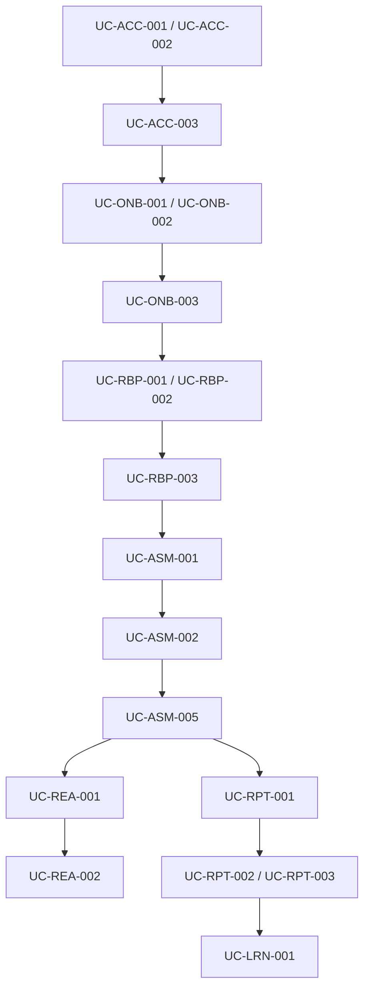

# PWNDORA SkillScan X — Use Case Specification

| | |
|---|---|
| **Document Version** | 1.0 |
| **Status** | Published |
| **Classification** | Internal |
| **Last Updated** | 2026-07-08 |
| **Owner** | Product Team |

## Revision History

| Version | Date | Author | Changes |
|---|---|---|---|
| 1.0 | 2026-07-08 | PWNDORA SkillScan X Team | Initial release |

---

## 1. Executive Summary

This document defines every use case for PWNDORA SkillScan X. Each use case describes a specific interaction between an actor and the system to achieve a concrete outcome. Use cases are organized by domain module and priority to guide implementation sequencing.

Every use case traces to a persona and to functional requirements.

---

## 2. Use Case Convention

```
UC-[Module]-[Number]: [Title]
  Actor:         [Primary stakeholder]
  Trigger:       [What starts this use case]
  Precondition:  [State required before execution]
  Postcondition: [State after successful execution]
  Priority:      [P0 / P1 / P2]
  Linked To:     [Personas, FR IDs]
  Main Flow:     [Numbered steps]
  Extensions:    [Alternative flows and edge cases]
```

---

## 3. Use Case Catalog

### 3.1 Module: Account and Identity

| ID | Use Case | Actor | Priority |
|---|---|---|---|
| UC-ACC-001 | Register as professional | Professional | P0 |
| UC-ACC-002 | Register as capability analyst | Capability Analyst | P0 |
| UC-ACC-003 | Verify email address | All | P0 |
| UC-ACC-004 | Log in | All | P0 |
| UC-ACC-005 | Reset password | All | P0 |
| UC-ACC-006 | Manage profile | All | P1 |
| UC-ACC-007 | Delete account | All | P2 |

---

#### UC-ACC-001: Register as Professional

| Field | Value |
|---|---|
| **ID** | UC-ACC-001 |
| **Actor** | Professional |
| **Trigger** | Professional visits sign-up page |
| **Precondition** | No existing account with same email |
| **Postcondition** | Unverified account created; verification email sent |
| **Priority** | P0 |
| **Linked To** | Personas 1-3; FR-ACC-001 through FR-ACC-005 |

**Main Flow**

1. Professional navigates to /signup
2. System renders registration form (email, password, name)
3. Professional submits credentials
4. System validates format and uniqueness
5. System creates unverified account
6. System sends verification email
7. System redirects to verification-pending screen

**Extensions**

- 4a. Email already registered: Show login prompt
- 4b. Weak password: Show strength requirements
- 6a. Email delivery fails: Show resend button

---

#### UC-ACC-002: Register as Capability Analyst

| Field | Value |
|---|---|
| **ID** | UC-ACC-002 |
| **Actor** | Capability Analyst |
| **Trigger** | Capability Analyst visits sign-up page |
| **Precondition** | Corporate email domain recognized or verifiable |
| **Postcondition** | Capability Analyst account created; pending verification |
| **Priority** | P0 |
| **Linked To** | Persona 4; FR-ACC-001 through FR-ACC-005 |

**Main Flow**

1. Capability Analyst navigates to /signup?type=analyst
2. System renders registration form with company field
3. Capability Analyst enters work email, password, company name
4. System validates email domain
5. System creates capability analyst account (unverified)
6. System sends verification email + admin notification
7. System redirects to onboarding

**Extensions**

- 4a. Domain unrecognized: Queue for manual verification

---

#### UC-ACC-003: Verify Email

| Field | Value |
|---|---|
| **ID** | UC-ACC-003 |
| **Actor** | All |
| **Trigger** | User clicks verification link |
| **Precondition** | Unverified account exists; token valid |
| **Postcondition** | Account verified; redirected to onboarding |
| **Priority** | P0 |

**Main Flow**

1. User clicks link in verification email
2. System validates token and expiration
3. System marks account as verified
4. System redirects to onboarding

**Extensions**

- 2a. Token expired: Show resend prompt
- 2b. Invalid token: Show error with request new link

---

### 3.2 Module: Onboarding

| ID | Use Case | Actor | Priority |
|---|---|---|---|
| UC-ONB-001 | Complete professional onboarding | Professional | P0 |
| UC-ONB-002 | Complete capability analyst onboarding | Capability Analyst | P0 |
| UC-ONB-003 | Select target role | Professional | P0 |
| UC-ONB-004 | Upload job description | Professional, Capability Analyst | P1 |
| UC-ONB-005 | Configure company profile | Capability Analyst | P1 |

---

#### UC-ONB-001: Complete Professional Onboarding

| Field | Value |
|---|---|
| **ID** | UC-ONB-001 |
| **Actor** | Professional |
| **Trigger** | Email verified |
| **Precondition** | Account exists and verified |
| **Postcondition** | Profile configured; ready for role selection |
| **Priority** | P0 |

**Main Flow**

1. System redirects to onboarding wizard
2. Professional selects experience tier (Student / Graduate / Analyst)
3. Professional lists certifications (optional)
4. Professional sets availability (optional)
5. System saves profile; transitions to role selection

**Extensions**

- 2a. Unsure of tier: Show descriptions; allow skip
- 4a. Availability not set: Default to no limit

---

#### UC-ONB-003: Select Target Role

| Field | Value |
|---|---|
| **ID** | UC-ONB-003 |
| **Actor** | Professional |
| **Trigger** | Onboarding complete |
| **Precondition** | Professional profile exists |
| **Postcondition** | Target role selected; Skill DNA Profile generation available |
| **Priority** | P0 |

**Main Flow**

1. System displays role catalog filtered by experience tier
2. System shows per-role details (domains, difficulty, typical titles)
3. Professional browses and selects a role
4. System records selection

**Extensions**

- 3a. No suitable role: Show custom role builder

---

### 3.3 Module: Skill DNA Profile

| ID | Use Case | Actor | Priority |
|---|---|---|---|
| UC-RBP-001 | Generate Skill DNA Profile from role | Professional, Capability Analyst | P0 |
| UC-RBP-002 | Generate Skill DNA Profile from JD | Professional, Capability Analyst | P1 |
| UC-RBP-003 | Review and customize Skill DNA Profile | Professional, Capability Analyst | P1 |
| UC-RBP-004 | Save Skill DNA Profile as template | Capability Analyst | P2 |
| UC-RBP-005 | Compare Skill DNA Profiles | Capability Analyst | P2 |

---

#### UC-RBP-001: Generate Skill DNA Profile from Role

| Field | Value |
|---|---|
| **ID** | UC-RBP-001 |
| **Actor** | Professional |
| **Trigger** | Role selected from catalog |
| **Precondition** | Onboarding complete |
| **Postcondition** | Skill DNA Profile generated; ready for review |
| **Priority** | P0 |
| **Linked To** | FR-RBP-001 through FR-RBP-008 |

**Main Flow**

1. System loads role definition from repository
2. System maps role to NICE framework capabilities with targets
3. System generates Skill DNA Profile (capabilities, weights, targets)
4. System renders Skill DNA Profile for review
5. Professional confirms or customizes

**Extensions**

- 2a. Role not found: Fall back to manual builder
- 5a. Customize: Transition to UC-RBP-003

---

#### UC-RBP-002: Generate Skill DNA Profile from JD

| Field | Value |
|---|---|
| **ID** | UC-RBP-002 |
| **Actor** | Professional, Capability Analyst |
| **Trigger** | User uploads a job description |
| **Precondition** | JD text or document available |
| **Postcondition** | Skill DNA Profile generated from parsed JD |
| **Priority** | P1 |

**Main Flow**

1. User uploads JD (paste or PDF/DOCX/TXT)
2. System parses JD for skills, certifications, responsibilities
3. System maps requirements to NICE capabilities
4. System generates Skill DNA Profile with confidence scores
5. System flags unmappable requirements
6. User resolves conflicts and confirms

---

### 3.4 Module: Assessment

| ID | Use Case | Actor | Priority |
|---|---|---|---|
| UC-ASM-001 | Start assessment | Professional | P0 |
| UC-ASM-002 | Complete mission | Professional | P0 |
| UC-ASM-003 | Respond to probe | Professional | P0 |
| UC-ASM-004 | Pause and resume | Professional | P0 |
| UC-ASM-005 | Submit assessment | Professional | P0 |
| UC-ASM-006 | Adaptive difficulty | Professional | P1 |
| UC-ASM-007 | Handle timeout | Professional | P1 |
| UC-ASM-008 | Save and exit | Professional | P1 |

---

#### UC-ASM-001: Start Assessment

| Field | Value |
|---|---|
| **ID** | UC-ASM-001 |
| **Actor** | Professional |
| **Trigger** | Professional selects Start Assessment |
| **Precondition** | Skill DNA Profile confirmed; assessment configured |
| **Postcondition** | Session initialized; first mission loaded |
| **Priority** | P0 |

**Main Flow**

1. Professional reviews overview (missions, time, domains)
2. Professional confirms start
3. System initializes session, starts timer, loads first mission
4. System renders mission prompt

**Extensions**

- 2a. Incomplete session exists: Offer resume

---

#### UC-ASM-002: Complete Mission

| Field | Value |
|---|---|
| **ID** | UC-ASM-002 |
| **Actor** | Professional |
| **Trigger** | Professional provides final response |
| **Precondition** | Mission active |
| **Postcondition** | Responses recorded; next mission loaded or assessment ends |
| **Priority** | P0 |

**Main Flow**

1. Professional reads incident scenario with artifacts
2. Professional submits response
3. System records response, evaluates in real-time
4. System generates follow-up probe
5. Professional responds to probe
6. System repeats for configured rounds
7. System marks mission complete; transitions to next

---

#### UC-ASM-004: Pause and Resume

| Field | Value |
|---|---|
| **ID** | UC-ASM-004 |
| **Actor** | Professional |
| **Trigger** | Professional pauses assessment |
| **Precondition** | Assessment in progress |
| **Postcondition** | Session persisted; timer paused |
| **Priority** | P0 |

**Main Flow**

1. Professional selects Pause
2. System persists session state
3. System stops timer
4. System redirects to dashboard with Resume banner

---

#### UC-ASM-005: Submit Assessment

| Field | Value |
|---|---|
| **ID** | UC-ASM-005 |
| **Actor** | Professional |
| **Trigger** | All missions complete or manual submit |
| **Precondition** | At least one mission completed |
| **Postcondition** | Assessment locked; async report generation triggered |
| **Priority** | P0 |

**Main Flow**

1. System displays completion summary
2. Professional confirms submission
3. System locks assessment
4. System triggers async report generation
5. System redirects to Report Pending screen

**Extensions**

- 1a. No missions completed: Allow submit but warn

---

### 3.5 Module: Capability Reasoning

| ID | Use Case | Actor | Priority |
|---|---|---|---|
| UC-REA-001 | Evaluate response reasoning | System | P0 |
| UC-REA-002 | Generate evidence trace | System | P0 |
| UC-REA-003 | Assess decision quality | System | P1 |
| UC-REA-004 | Compute confidence score | System | P1 |
| UC-REA-005 | Detect cheating | System | P1 |

---

#### UC-REA-001: Evaluate Response Reasoning

| Field | Value |
|---|---|
| **ID** | UC-REA-001 |
| **Actor** | AI Decision Engine |
| **Trigger** | Professional submits mission response |
| **Precondition** | Response text captured |
| **Postcondition** | Evaluation produced (accuracy, completeness, justification) |
| **Priority** | P0 |

**Main Flow**

1. System receives response text
2. System evaluates factual accuracy against ground truth
3. System evaluates completeness (missing steps)
4. System evaluates justification quality (evidence, logic)
5. System assigns dimension scores
6. System stores evaluation results

---

#### UC-REA-002: Generate Evidence Trace

| Field | Value |
|---|---|
| **ID** | UC-REA-002 |
| **Actor** | AI Decision Engine |
| **Trigger** | Reasoning evaluation complete |
| **Precondition** | UC-REA-001 produced scores |
| **Postcondition** | Evidence trace linking scores to specific statements |
| **Priority** | P0 |

**Main Flow**

1. System loads response and evaluation
2. System identifies statements supporting or reducing each score
3. System generates trace document
4. System stores trace for report inclusion

---

### 3.6 Module: Reporting

| ID | Use Case | Actor | Priority |
|---|---|---|---|
| UC-RPT-001 | Generate professional report | System | P0 |
| UC-RPT-002 | View professional report | Professional | P0 |
| UC-RPT-003 | View capability analyst report | Capability Analyst | P0 |
| UC-RPT-004 | Compare professionals | Capability Analyst | P1 |
| UC-RPT-005 | Download report as PDF | All | P1 |
| UC-RPT-006 | Share report with employer | Professional | P1 |

---

#### UC-RPT-001: Generate Professional Report

| Field | Value |
|---|---|
| **ID** | UC-RPT-001 |
| **Actor** | System |
| **Trigger** | Assessment submitted (UC-ASM-005) |
| **Precondition** | All mission evaluations complete |
| **Postcondition** | Report generated and available |
| **Priority** | P0 |

**Main Flow**

1. System aggregates all mission evaluations
2. System computes domain-level scores
3. System generates capability profile vs. Skill DNA Profile targets
4. System identifies strengths and gaps
5. System produces learning recommendations
6. System generates capability analyst summary section
7. System stores report; notifies user

---

#### UC-RPT-002: View Professional Report

| Field | Value |
|---|---|
| **ID** | UC-RPT-002 |
| **Actor** | Professional |
| **Trigger** | Professional opens report |
| **Precondition** | Report generated (UC-RPT-001) |
| **Postcondition** | Report displayed with all sections |
| **Priority** | P0 |

**Main Flow**

1. System loads report data
2. System renders sections (scores, reasoning, evidence, gaps, Career Compass)
3. Professional navigates between sections
4. Professional expands detail views

---

#### UC-RPT-003: View Capability Analyst Report

| Field | Value |
|---|---|
| **ID** | UC-RPT-003 |
| **Actor** | Capability Analyst |
| **Trigger** | Capability Analyst opens professional report |
| **Precondition** | Professional completed assessment; capability analyst has access |
| **Postcondition** | Capability Analyst-friendly report displayed |
| **Priority** | P0 |

**Main Flow**

1. System loads report for professional
2. System renders capability analyst view (readiness, pass/fail, capability assessment focus)
3. Capability Analyst reviews readiness level
4. Capability Analyst expands domain details as needed

---

### 3.7 Module: Learning

| ID | Use Case | Actor | Priority |
|---|---|---|---|
| UC-LRN-001 | Generate Career Compass | System | P0 |
| UC-LRN-002 | View Career Compass | Professional | P1 |
| UC-LRN-003 | Update Career Compass progress | Professional | P2 |
| UC-LRN-004 | Schedule reassessment | Professional | P1 |

---

#### UC-LRN-001: Generate Career Compass

| Field | Value |
|---|---|
| **ID** | UC-LRN-001 |
| **Actor** | System |
| **Trigger** | Report generation complete (UC-RPT-001) |
| **Precondition** | Gap analysis available |
| **Postcondition** | Prioritized Career Compass generated |
| **Priority** | P0 |

**Main Flow**

1. System identifies gaps sorted by severity
2. System maps gaps to learning resources
3. System orders by dependency (foundational first)
4. System adds effort estimates
5. System stores Career Compass linked to professional

---

### 3.8 Module: Capability Analyst Pipeline

| ID | Use Case | Actor | Priority |
|---|---|---|---|
| UC-PPL-001 | Create assessment invite | Capability Analyst | P0 |
| UC-PPL-002 | View professional pipeline | Capability Analyst | P1 |
| UC-PPL-003 | Update professional status | Capability Analyst | P1 |
| UC-PPL-004 | Compare professionals | Capability Analyst | P1 |
| UC-PPL-005 | Export pipeline report | Capability Analyst | P2 |

---

#### UC-PPL-001: Create Assessment Invite

| Field | Value |
|---|---|
| **ID** | UC-PPL-001 |
| **Actor** | Capability Analyst |
| **Trigger** | Capability Analyst selects Invite Professional |
| **Precondition** | Assessment template configured |
| **Postcondition** | Unique invite link generated and sent |
| **Priority** | P0 |

**Main Flow**

1. Capability Analyst selects assessment template
2. Capability Analyst enters professional email
3. System generates unique invite link with expiration
4. System sends invite email
5. System adds professional to pipeline

**Extensions**

- 2a. Bulk professionals: Support CSV upload

---

### 3.9 Module: Trainer Cohort

| ID | Use Case | Actor | Priority |
|---|---|---|---|
| UC-TRN-001 | Create cohort | Trainer | P1 |
| UC-TRN-002 | Add students | Trainer | P1 |
| UC-TRN-003 | Assign assessment | Trainer | P1 |
| UC-TRN-004 | Monitor progress | Trainer | P1 |
| UC-TRN-005 | View analytics | Trainer | P1 |
| UC-TRN-006 | Export cohort report | Trainer | P2 |

---

#### UC-TRN-001: Create Cohort

| Field | Value |
|---|---|
| **ID** | UC-TRN-001 |
| **Actor** | Trainer |
| **Trigger** | Trainer selects Create Cohort |
| **Precondition** | Trainer account exists |
| **Postcondition** | Cohort created; ready for student addition |
| **Priority** | P1 |

**Main Flow**

1. Trainer enters cohort name, description, date range
2. Trainer configures assessment schedule
3. System validates parameters
4. System creates cohort
5. System redirects to student management

---

#### UC-TRN-004: Monitor Cohort Progress

| Field | Value |
|---|---|
| **ID** | UC-TRN-004 |
| **Actor** | Trainer |
| **Trigger** | Trainer opens cohort dashboard |
| **Precondition** | Cohort has students with assessments |
| **Postcondition** | Progress dashboard displayed |
| **Priority** | P1 |

**Main Flow**

1. System loads cohort data (completion, scores, time)
2. System renders aggregate view
3. Trainer identifies students below threshold
4. Trainer drills into individual report

---

### 3.10 Module: Administration

| ID | Use Case | Actor | Priority |
|---|---|---|---|
| UC-ADM-001 | Manage users | Admin | P2 |
| UC-ADM-002 | Configure Skill DNA Profile library | Admin | P2 |
| UC-ADM-003 | View system health | Admin | P2 |

---

## 4. Use Case Dependency Graph



---

## 5. Use Case to Persona Mapping

| Module | Professional | Capability Analyst | Manager | Trainer | University |
|---|---|---|---|---|---|
| Account | UC-ACC-001 | UC-ACC-002 | — | — | — |
| Onboarding | UC-ONB-001,003 | UC-ONB-002 | — | — | — |
| Skill DNA Profile | UC-RBP-001-003 | UC-RBP-001-005 | — | — | — |
| Assessment | UC-ASM-001-008 | — | — | — | — |
| Reasoning | — | — | — | — | — |
| Report | UC-RPT-002 | UC-RPT-003-005 | UC-RPT-003 | — | — |
| Learning | UC-LRN-001-004 | — | — | — | — |
| Pipeline | — | UC-PPL-001-005 | — | — | — |
| Cohort | — | — | — | UC-TRN-001-006 | UC-TRN-001-006 |
| Admin | — | — | — | — | UC-ADM-001-003 |

---

## 6. Use Case to Requirement Traceability

| Use Case | Functional Requirements |
|---|---|
| UC-ACC-001 | FR-ACC-001 through FR-ACC-003 |
| UC-ACC-002 | FR-ACC-001, FR-ACC-004 |
| UC-ACC-003 | FR-ACC-005 |
| UC-RBP-001 | FR-RBP-001 through FR-RBP-008 |
| UC-RBP-002 | FR-RBP-009 through FR-RBP-015 |
| UC-ASM-001 | FR-ASM-001 through FR-ASM-010 |
| UC-ASM-002 | FR-ASM-011 through FR-ASM-020 |
| UC-ASM-004 | FR-ASM-021, FR-ASM-022 |
| UC-ASM-005 | FR-ASM-023 through FR-ASM-025 |
| UC-REA-001 | FR-REA-001, FR-REA-002 |
| UC-REA-002 | FR-REA-003 |
| UC-RPT-001 | FR-RPT-001 through FR-RPT-005 |
| UC-RPT-002 | FR-RPT-006, FR-RPT-007 |
| UC-RPT-003 | FR-RPT-008, FR-RPT-009 |
| UC-LRN-001 | FR-LRN-001, FR-LRN-002 |
| UC-PPL-001 | FR-PPL-001 through FR-PPL-004 |
| UC-TRN-001 | FR-TRN-001, FR-TRN-002 |

---

## 7. Implementation Priority

| Priority | Use Cases | Scope |
|---|---|---|
| P0 | UC-ACC-001-005, UC-ONB-001-003, UC-RBP-001, UC-ASM-001-005, UC-REA-001-002, UC-RPT-001-003, UC-LRN-001 | Core platform |
| P1 | UC-ONB-004, UC-RBP-002-003, UC-ASM-006-008, UC-REA-003-005, UC-PPL-001-004, UC-TRN-001-005 | Extended workflows |
| P2 | UC-ACC-006-007, UC-RBP-004-005, UC-PPL-005, UC-TRN-006, UC-ADM-001-003 | Advanced |

---

## 8. Success Criteria

| Criterion | Target |
|---|---|
| P0 use cases covered | 100 percent |
| Each persona has matching use cases | All primary goals covered |
| Each main flow has at least one extension | All P0 use cases |
| No circular dependencies | Graph cycle check |

---

## Related Documents

- [System Features](12-system-features.md)
- [User Workflows](13-user-workflows.md)
- [Functional Requirements](../docs/02-research/10-functional-requirements.md)
- [Product Requirements](../docs/01-product/05-product-requirements.md)
- [UI/UX Specification](15-ui-ux-specification.md)

---

## 9. References

| Reference | Document |
|---|---|
| Personas | `../02-research/08-user-personas.md` |
| User journeys | `../02-research/09-user-journey.md` |
| Functional requirements | `../02-research/10-functional-requirements.md` |
| Product requirements | `../01-product/05-product-requirements.md` |
