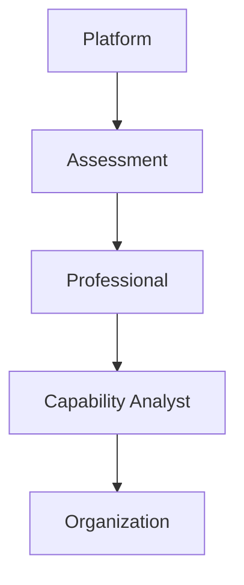
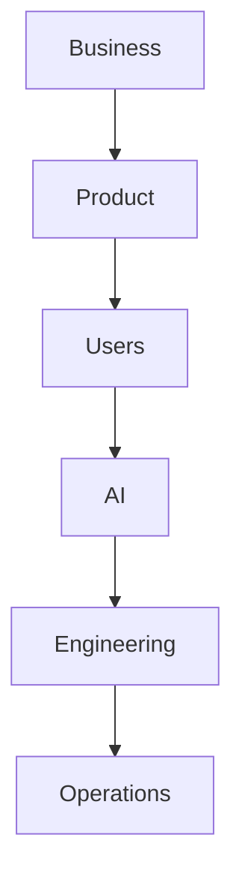
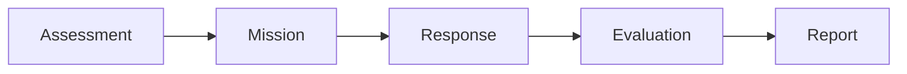
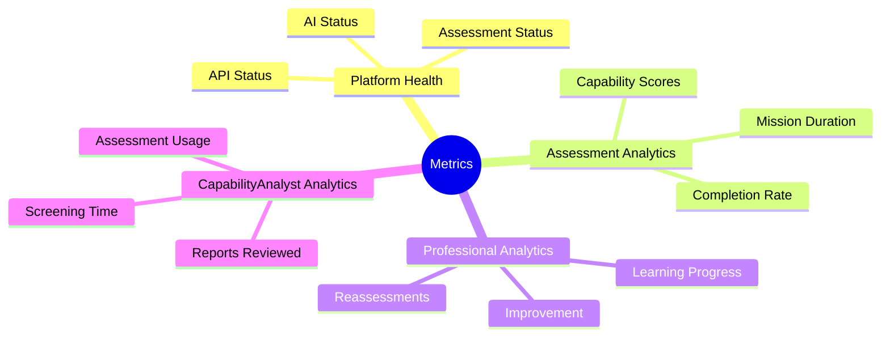
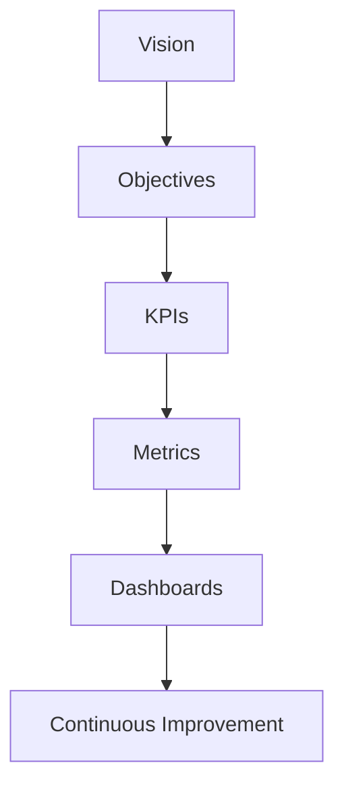

# PWNDORA SkillScan X — UI/UX Specification

| | |
|---|---|
| **Document Version** | 1.0 |
| **Status** | Published |
| **Classification** | Internal |
| **Last Updated** | 2026-07-08 |
| **Owner** | Product Team |

## Revision History

| Version | Date | Author | Changes |
|---|---|---|---|
| 1.0 | 2026-07-08 | PWNDORA SkillScan X Team | Initial release |

---

## 1. Executive Summary

This document defines the measurable indicators used to evaluate the success of the PWNDORA SkillScan X platform. Without it, PWNDORA SkillScan X becomes another demo that looks cool but has no measurable outcomes. Judges, investors, and engineering teams all ask the same question: **How do you know it's working?**

Metrics are grouped into Product, User, AI, Cybersecurity Assessment, Engineering, Business, and Operations. Every feature should contribute to at least one measurable outcome.

**Core message:** We do not assess resumes. We assess cybersecurity capability.

---

## 2. Success Philosophy

PWNDORA SkillScan X measures success at multiple layers.

Success is not a single score. It is the combined improvement across technical quality, user experience, assessment reliability, and operational efficiency.

---

## 3. Success Framework

Each layer contains specific Key Performance Indicators (KPIs).

---

## 4. Product KPIs

| Metric | Target (MVP) |
|---|---|
| Assessment Completion Rate | ≥ 90% |
| Report Generation Success | ≥ 95% |
| Reassessment Rate | ≥ 30% |
| Average Assessment Duration | 20-30 minutes |
| Professional Satisfaction | ≥ 4/5 |

---

## 5. User Success Metrics

### Professional

- Assessment completion rate
- Average capability improvement
- Career Compass usage
- Reassessment frequency
- Report downloads

### Capability Analyst

- Time to review report
- Screening time reduction
- Assessment consistency
- Report usefulness rating

### Trainer

- Cohort completion rate
- Skill improvement across cohorts
- Learning engagement

---

## 6. AI Performance Metrics

| Metric | Target |
|---|---|
| Valid JSON Responses | ≥ 99% |
| Prompt Success Rate | ≥ 98% |
| Retry Rate | < 5% |
| Structured Output Compliance | ≥ 99% |
| Average Generation Time | < 15 s |

Track: LLM latency, token usage, evaluation consistency, failure rate, recovery rate.

---

## 7. Assessment Metrics

Measure:

- Assessment completion
- Mission completion
- Question completion
- Average mission duration
- Adaptive branching frequency
- Pause/resume usage

Each stage should be measurable.

---

## 8. Capability Reasoning Metrics

Evaluate:

- Concept coverage
- Workflow correctness
- Decision quality
- Risk identification
- Communication clarity
- Evidence completeness
- MITRE ATT&CK alignment

Example capability breakdown:

| Capability | Score |
|---|---|
| Incident Response | 82 |
| Threat Hunting | 74 |
| Windows Security | 88 |
| Network Analysis | 79 |
| Communication | 85 |

---

## 9. Business Metrics

Track:

- Active users
- Assessments created
- Assessments completed
- University partnerships
- Capability Analyst adoption
- Professional retention
- Organization adoption

For the MVP, these are illustrative goals rather than contractual targets.

---

## 10. Technical Metrics

| Metric | Target |
|---|---|
| API Success Rate | ≥ 99% |
| Average API Latency | < 500 ms (excluding AI calls) |
| Error Rate | < 1% |
| Report Generation Time | < 5 s |
| Session Recovery Success | ≥ 95% |

Monitor: CPU usage, memory usage, database query time, API response time, AI response time.

---

## 11. UX Metrics

Measure:

- Time to first assessment
- Average clicks to start assessment
- Assessment abandonment rate
- User navigation efficiency
- Accessibility compliance

Goal: Users should complete an assessment without external guidance.

---

## 12. Security Metrics

Track:

- Authentication failures
- Invalid request rate
- Prompt injection attempts detected
- API abuse events
- Session timeout frequency
- Sensitive data exposure incidents (target: 0)

---

## 13. Operational Metrics

Track:

- System uptime
- Error recovery success
- AI retry success
- Backup success
- Log completeness
- Deployment success rate

---

## 14. Success Dashboard

---

## 15. Objectives and Key Results (OKRs)

### Objective 1: Deliver a reliable MVP

- ≥ 90% successful assessment completion
- ≥ 95% report generation success
- Zero critical demo failures

### Objective 2: Provide explainable evaluations

- Every score includes evidence.
- Every report includes strengths and weaknesses.
- Every recommendation is linked to an identified capability gap.

### Objective 3: Improve professional readiness

- Career Compass generated for every assessment.
- Reassessment supported.
- Capability improvements visible over time.

---

## 16. MVP Success Criteria

The hackathon MVP is successful if it demonstrates:

- Job Description Intelligence
- Skill DNA Profile generation
- Adaptive capability assessment flow
- Capability Reasoning evaluation
- Explainable reports
- Career Compass
- Stable end-to-end demo

It does **not** need enterprise dashboards or organization-wide analytics.

---

## 17. Future Metrics

As the platform grows, measure:

- Enterprise adoption
- Team capability trends
- Workforce readiness
- Certification completion
- Benchmark performance
- AI evaluation consistency across releases
- Long-term learner improvement

---

## 18. Conclusion

PWNDORA SkillScan X should be evaluated not only by technical correctness but by its ability to provide transparent, consistent, and actionable cybersecurity capability assessments.

A successful platform:

- Helps professionals improve.
- Helps capability analysts make informed decisions.
- Helps organizations standardize assessments.
- Provides measurable evidence for every evaluation.

---

## Platform KPI Hierarchy

Every metric should support a business objective, and every objective should reinforce the product vision.

---

## Related Documents

- [Use Case Specification](14-use-case-specification.md)
- [System Features](12-system-features.md)
- [Product Requirements](../docs/01-product/05-product-requirements.md)
- [Analytics Concept](../docs/concepts/analytics.md)

---

## 19. References

| Reference | Document |
|---|---|
| User journeys | `../02-research/09-user-journey.md` |
| Use cases | `../03-functional-design/14-use-case-specification.md` |
| Feature specification | `../03-functional-design/12-system-features.md` |
| Product requirements | `../01-product/05-product-requirements.md` |
