# PWNDORA SkillScan X — System Architecture

| | |
|---|---|
| **Document Version** | 1.0 |
| **Status** | Published |
| **Classification** | Internal |
| **Last Updated** | 2026-07-08 |
| **Owner** | Architecture Team |

## Revision History

| Version | Date | Author | Changes |
|---|---|---|---|
| 1.0 | 2026-07-08 | PWNDORA SkillScan X Team | Initial release |

---

## 1. Executive Summary

This document defines the complete system architecture of PWNDORA SkillScan X, including all major layers, communication patterns, deployment boundaries, security considerations, and architectural principles.

The architecture is designed around modularity, explainability, scalability, and maintainability.

**Core message:** We do not assess resumes. We assess cybersecurity capability.

---

## 2. Architecture Goals

The architecture must achieve the following objectives:

- Modular design
- Clear separation of concerns
- AI-first workflow orchestration
- Explainable assessment pipeline
- Independent component evolution
- Easy deployment
- Secure processing
- Future scalability

---

## 3. Design Principles

PWNDORA SkillScan X follows these principles:

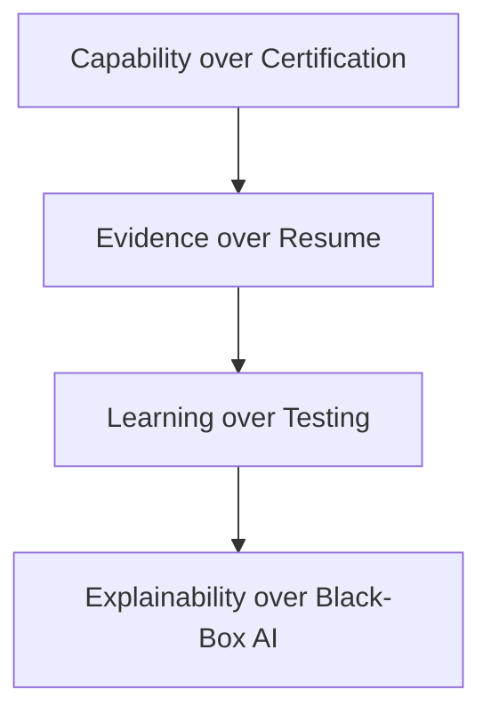

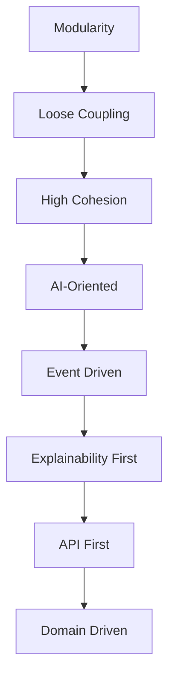

**AI Principle:** AI MUST NEVER answer assessments — only mentor and explain.

---

## 4. High-Level Architecture

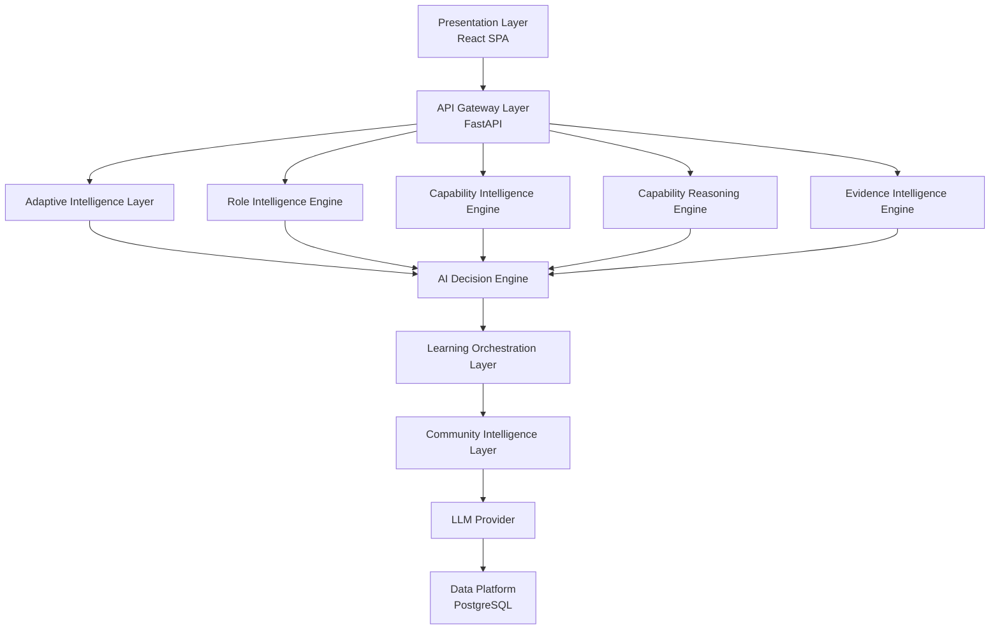

---

## 5. Architectural Layers (7-Layer Stack)

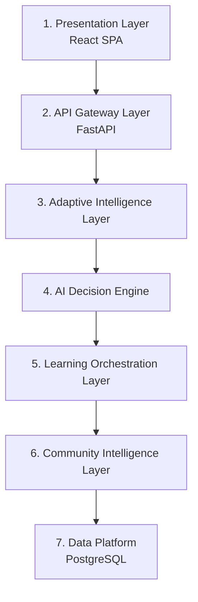

Each layer has one responsibility.

---

## 6. Core Components

| Component | Responsibility |
|---|---|
| Presentation Layer | User interaction, SPA |
| API Gateway | Request routing, auth |
| Adaptive Intelligence Layer | Session management, adaptive capability assessment flow |
| Role Intelligence Engine | Parse and analyze job descriptions |
| Capability Intelligence Engine | Assessment lifecycle orchestration |
| Practical Challenge Engine | Scenario and mission generation |
| Capability Reasoning Engine | Evaluation of responses |
| Evidence Intelligence Engine | Evidence generation and explainability |
| Learning Path Engine | Recommendations and Career Compass |
| AI Decision Engine | AI orchestration, prompt management, LLM routing |
| Learning Orchestration Layer | Learning path sequencing, progress tracking |
| Community Intelligence Layer | Skill DNA Graph, cross-user analytics, benchmarking |
| Data Platform | Persistent storage, PostgreSQL |

---

## 7. Component Responsibilities

### Presentation Layer (React SPA)

Responsible for: UI, forms, voice recording, Capability Heatmap visualization, reports.

### API Gateway Layer (FastAPI)

Responsible for: APIs, authentication, request routing, rate limiting.

### Adaptive Intelligence Layer

Responsible for: adaptive capability assessment session management, real-time difficulty adjustment, progress tracking.

### AI Decision Engine

Responsible for: prompt orchestration, mission generation, capability reasoning evaluation, evidence intelligence, LLM provider abstraction.

### Learning Orchestration Layer

Responsible for: Career Compass generation, learning path sequencing, reassessment scheduling, AI Mentor interactions.

### Community Intelligence Layer

Responsible for: Skill DNA Graph aggregation, cross-professional capability benchmarking, anonymized trend analytics, Cyber Twin profile management.

### Data Platform (PostgreSQL)

Responsible for: user data, assessments, Skill DNA Profiles, reports, logs, evidence traces.

---

## 8. End-to-End Workflow

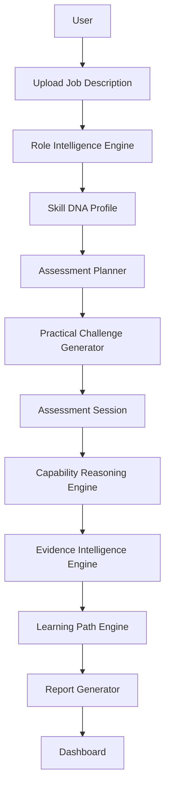

---

## 9. Component Interaction

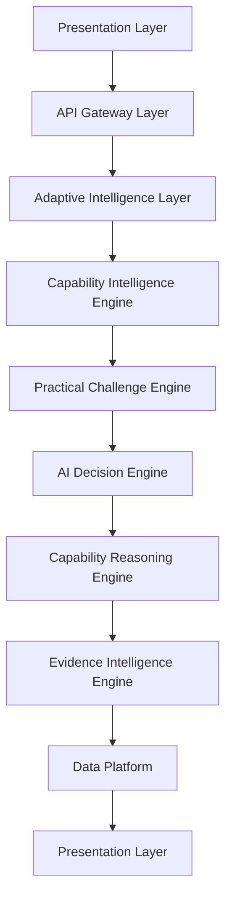

Every request passes through the API layer. Business logic never exists inside the UI.

---

## 10. External Dependencies

| Dependency | Purpose |
|---|---|
| LLM Provider | Mission generation and evaluation |
| Browser Speech API | Voice transcription |
| PostgreSQL | Data persistence |
| Docker | Deployment |
| GitHub | Version control |

---

## 11. Deployment Architecture

### MVP

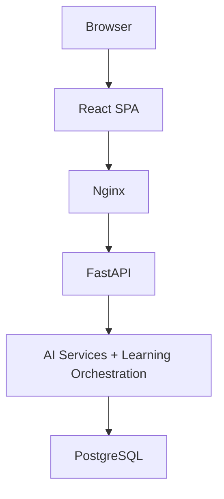

### Future

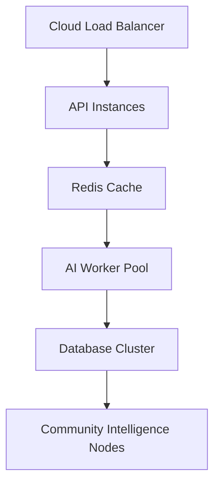

---

## 12. Scalability Strategy

### MVP

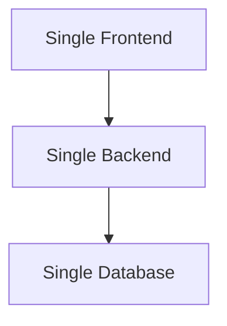

### Future

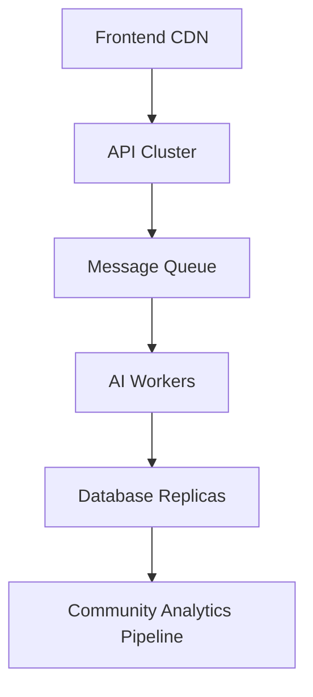

---

## 13. Security Architecture

Security controls include:

- HTTPS
- JWT authentication
- Input validation
- Prompt isolation
- Output validation
- Rate limiting
- Secure secrets management
- Audit logging

Security is enforced at every layer.

---

## 14. Failure Handling

### AI Failure

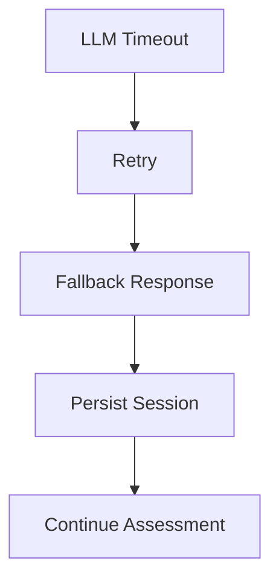

### Database Failure

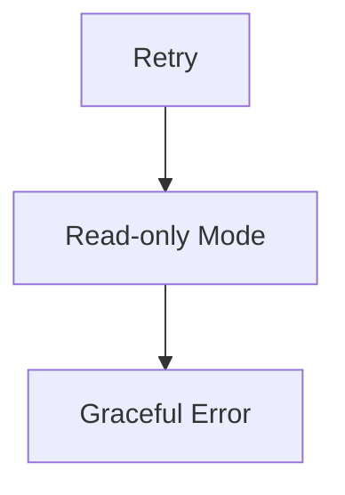

---

## 15. Technology Stack

### Presentation Layer

- React
- TypeScript
- Tailwind CSS
- TanStack Query
- React Router

### API Gateway Layer

- FastAPI
- Python
- SQLAlchemy
- Pydantic

### Data Platform

- PostgreSQL

### AI Decision Engine

- LLM
- Structured JSON
- Prompt orchestration

### Infrastructure

- Docker
- Nginx
- GitHub Actions

---

## 16. Architecture Decision Records (ADRs)

| ADR | Decision | Reason |
|---|---|---|
| ADR-001 | API-first architecture | Clear separation between frontend and backend |
| ADR-002 | Skill DNA Profile as canonical model | Reusable across modules |
| ADR-003 | Modular monolith (MVP) | Faster iteration for small team; extract later |
| ADR-004 | Explainability pipeline | Transparent assessments |
| ADR-005 | Structured AI outputs | Reliable downstream processing |
| ADR-006 | 7-layer architecture | Clear separation of AI, learning, and community concerns |
| ADR-007 | Cyber Twin as aggregated capability profile | Persistent professional capability identity across sessions |

---

## 17. New Concepts

### Cyber Twin

A digital representation of a professional's verified cybersecurity capability profile, built from assessment evidence across multiple sessions and roles. The Cyber Twin persists and evolves as the professional completes more assessments.

### Skill DNA

The unique capability fingerprint derived from assessment evidence. Each professional has a distinct Skill DNA that represents their verified strengths, gaps, and growth trajectory.

### Career Compass

AI-driven career progression pathways mapped from capability gaps. The Career Compass recommends learning resources, labs, and reassessment timing to close identified gaps.

### Capability Heatmap

Multi-dimensional visualization of verified strengths and gaps across cybersecurity domains. Provides an at-a-glance view of a professional's capability landscape.

### AI Mentor

Guided learning companion that explains concepts, provides hints, and offers feedback without ever answering assessment questions. The AI Mentor is strictly a coach, not a test-answerer.

---

## 18. Future Evolution

Future architectural enhancements:

- Microservices (extracted from monolith modules)
- Event bus
- Message queue
- Vector database for knowledge retrieval
- Multi-model AI routing
- Enterprise multi-tenancy
- Kubernetes deployment
- Observability stack
- Distributed caching

---

## 19. Conclusion

The PWNDORA SkillScan X architecture is designed to balance rapid MVP development with long-term extensibility. By centering the system around the **Skill DNA Profile** and separating AI orchestration, learning orchestration, and community intelligence into distinct layers, the platform can evolve from a hackathon prototype into a production-ready Adaptive Cybersecurity Capability Intelligence Platform without fundamental architectural redesign.

---

## Architecture Principles Summary

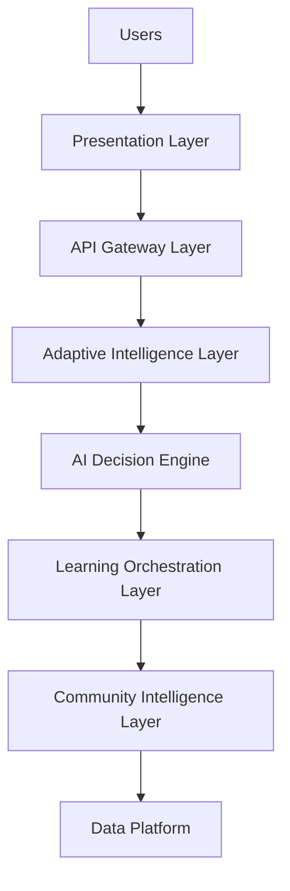

---

## Related Documents

- [AI Cognitive Architecture](17-ai-cognitive-architecture.md)
- [Backend Architecture](18-backend-architecture.md)
- [Frontend Architecture](19-frontend-architecture.md)
- [Data Flow](20-data-flow.md)
- [System Features](../docs/03-functional-design/12-system-features.md)
- [Security Architecture Deep Dive](../docs/07-engineering/35-security-architecture-deep-dive.md)

---

## 20. References

| Reference | Document |
|---|---|
| Feature specification | `../03-functional-design/12-system-features.md` |
| AI architecture | `../04-architecture/17-ai-cognitive-architecture.md` |
| Backend architecture | `../04-architecture/18-backend-architecture.md` |
| Frontend architecture | `../04-architecture/19-frontend-architecture.md` |
| Data flow | `../04-architecture/20-data-flow.md` |
