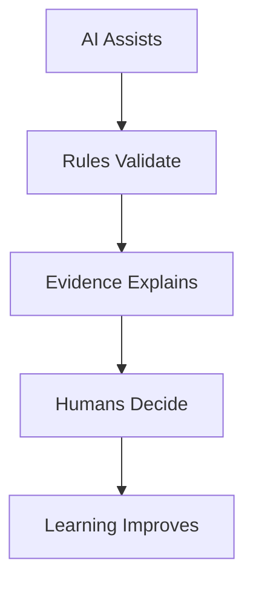
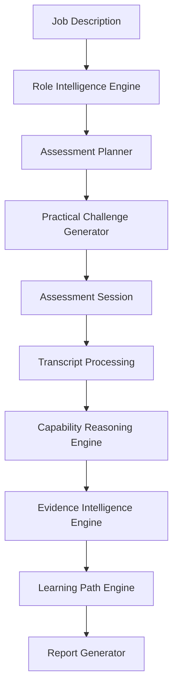
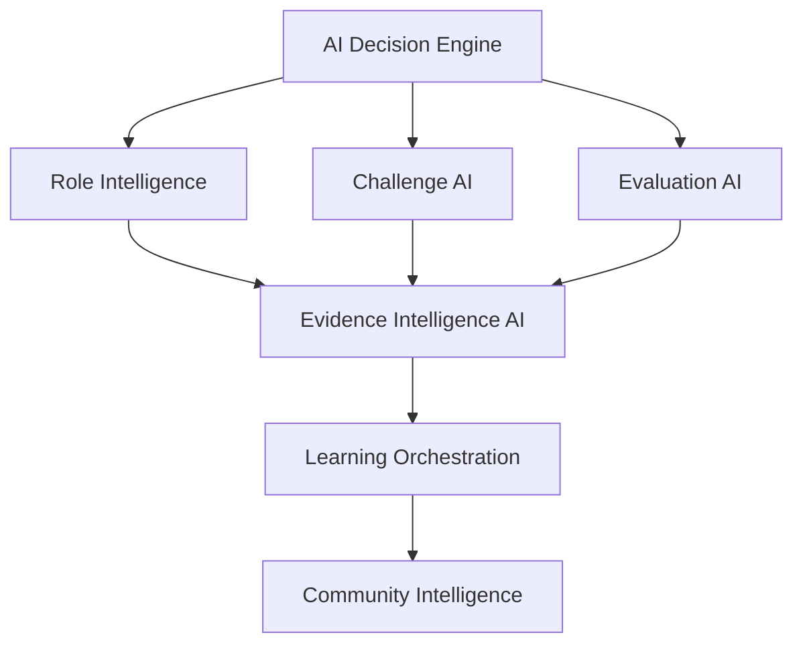
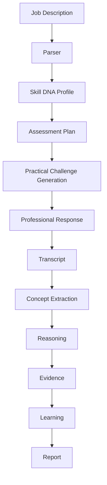
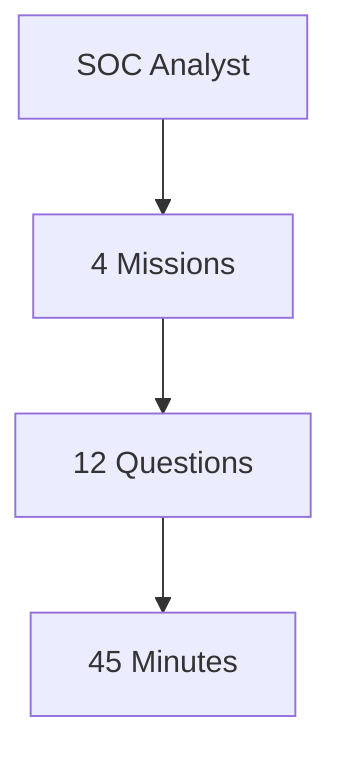
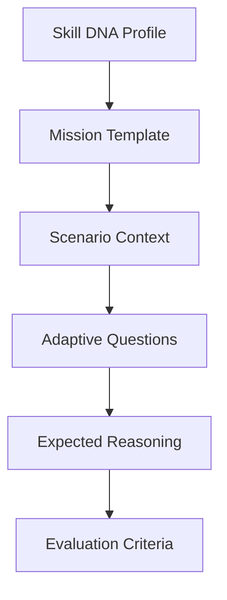
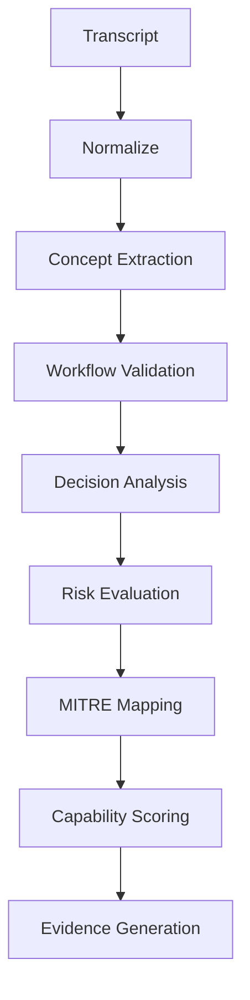
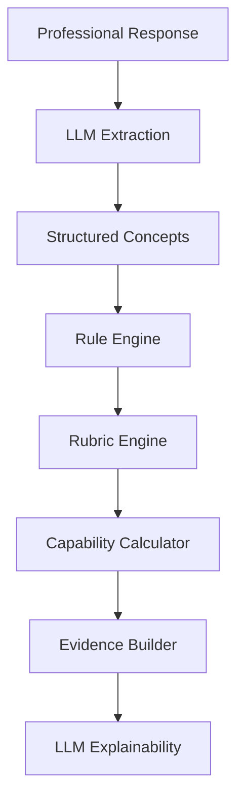
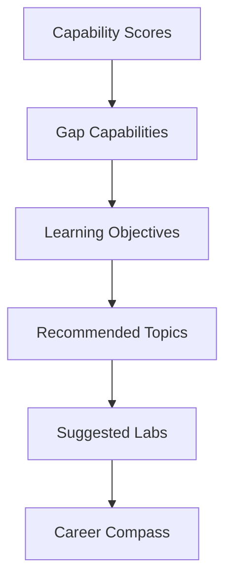
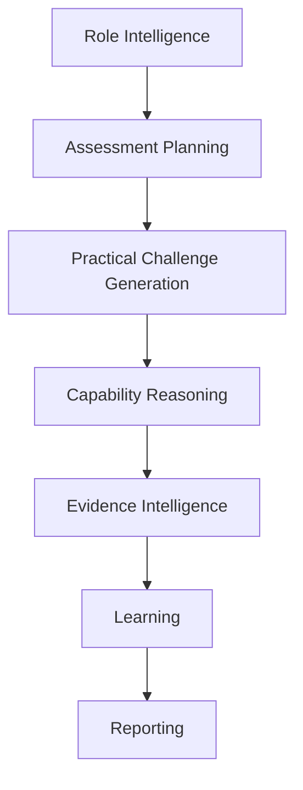

# PWNDORA SkillScan X — AI Cognitive Architecture

| | |
|---|---|
| **Document Version** | 1.0 |
| **Status** | Published |
| **Classification** | Internal |
| **Last Updated** | 2026-07-08 |
| **Owner** | AI Team |

## Revision History

| Version | Date | Author | Changes |
|---|---|---|---|
| 1.0 | 2026-07-08 | PWNDORA SkillScan X Team | Initial release |

---

## 1. Executive Summary

This document defines the AI Cognitive Architecture powering PWNDORA SkillScan X. Unlike traditional AI interview systems that directly ask an LLM to score professionals, PWNDORA SkillScan X separates generation, reasoning, validation, evidence intelligence, and recommendation into independent AI modules.

This architecture improves transparency, consistency, and maintainability.

**AI Principle:** AI MUST NEVER answer assessments — only mentor and explain.

---

## 2. AI Design Philosophy

The AI subsystem follows five principles.



Large Language Models are **reasoning assistants**, not autonomous decision makers.

---

## 3. Cognitive Architecture



---

## 4. AI Layer



The AI Decision Engine coordinates specialized AI tasks rather than relying on a single prompt.

---

## 5. AI Components

| Component | Responsibility |
|---|---|
| Role Intelligence Engine | Parse job descriptions, build Skill DNA Profile |
| Assessment Planner | Build Capability Blueprint |
| Practical Challenge Generator | Generate cyber scenarios |
| Transcript Analyzer | Normalize professional responses |
| Concept Extractor | Identify cybersecurity concepts |
| Capability Reasoning Engine | Evaluate technical reasoning |
| Evidence Intelligence Engine | Generate evidence-backed explanations |
| Learning Path Engine | Produce Career Compass |
| AI Mentor | Guided learning companion, never answers assessments |

---

## 6. End-to-End AI Pipeline



Each stage produces structured output consumed by the next stage.

---

## 7. Role Intelligence Engine

**Inputs:** Job Description, role title, responsibilities, required skills

**Processing — Extract:** Capabilities, seniority, knowledge domains, assessment objectives

**Outputs:** Skill DNA Profile, Skill DNA Graph, Assessment Objectives

---

## 8. Assessment Planning

The planner determines:

- Number of missions
- Difficulty progression
- Capability coverage
- Estimated duration
- Evaluation rubric selection

Example:



---

## 9. Practical Challenge Generation

Challenge creation pipeline:



Mission categories: SOC Operations, Digital Forensics, Incident Response, Threat Hunting, Malware Analysis, Cloud Security, Identity and Access Management.

---

## 10. Capability Reasoning Engine

This is the core intelligence of PWNDORA SkillScan X.



Unlike generic AI scoring, evaluation is constrained by cybersecurity workflows and structured rubrics.

The LLM should extract information, summarize, and generate explanations. The deterministic parts should calculate scores, validate workflows, enforce rubrics, and determine capability levels.

### Hybrid Evaluation Pipeline



---

## 11. Evidence Intelligence Engine

Purpose: Transform evaluation results into transparent explanations with traceable evidence.

**Outputs:** Strengths, weaknesses, missing concepts, supporting evidence, confidence level, improvement recommendations.

Every score must be traceable to observed evidence.

---

## 12. Learning Path Engine

Pipeline:



Recommendations are linked to specific capability gaps. The AI Mentor provides guidance without answering assessment questions.

---

## 13. Prompt Orchestration

Instead of one monolithic prompt, use specialized prompts:

| Prompt | Purpose |
|---|---|
| System Prompt | Global platform rules |
| Role Extraction Prompt | Build Skill DNA Profile |
| Assessment Planning Prompt | Generate assessment plan |
| Challenge Prompt | Create scenarios |
| Evaluation Prompt | Analyze responses |
| Evidence Intelligence Prompt | Produce evidence-backed feedback |
| Learning Prompt | Generate Career Compass |
| AI Mentor Prompt | Provide coaching without answering assessments |

Each prompt returns structured JSON validated before downstream processing.

---

## 14. AI Safety

Controls include:

- Prompt isolation
- Structured output schemas
- Input sanitization
- Output validation
- Hallucination detection
- Confidence thresholds
- Graceful fallback messaging

The AI never directly determines hiring outcomes.

---

## 15. Failure Recovery

### LLM Timeout

```
Retry → Fallback Message → Preserve Session → Continue Assessment
```

### Invalid JSON

```
Validate → Repair Attempt → Retry → Abort with Error
```

### Low Confidence

```
Flag Result → Request Human Review → Continue
```

---

## 16. Model Strategy

### MVP

- Single high-quality LLM
- Structured JSON outputs
- Deterministic post-processing

### Future

- Router model
- Specialized reasoning models
- Evaluation ensemble
- Local inference for sensitive deployments
- Domain-specific fine-tuned models

---

## 17. Future Evolution

Future AI capabilities:

- Retrieval-Augmented Generation (RAG) over cybersecurity knowledge bases
- NICE Workforce Framework alignment
- Multi-agent orchestration
- Continuous rubric learning
- Assessment quality analytics
- Adaptive difficulty calibration
- Enterprise knowledge integration

---

## 18. Conclusion

The PWNDORA SkillScan X AI architecture is intentionally modular. Each stage has a single responsibility, produces structured outputs, and feeds validated information into the next stage. This approach increases transparency, reduces coupling, and makes the platform easier to test, maintain, and evolve.

---

## AI Pipeline Summary



Each module can be tested independently while contributing to the overall assessment workflow.

---

## Related Documents

- [System Architecture](16-system-architecture.md)
- [Backend Architecture](18-backend-architecture.md)
- [Data Flow](20-data-flow.md)
- [Skill DNA Engine](../docs/06-ai-engines/26-skill-dna-engine.md)
- [Capability Reasoning Engine](../docs/06-ai-engines/29-capability-reasoning-engine.md)

---

## 19. References

| Reference | Document |
|---|---|
| System architecture | `../04-architecture/16-system-architecture.md` |
| Feature specification | `../03-functional-design/12-system-features.md` |
| Backend architecture | `../04-architecture/18-backend-architecture.md` |
| Data flow | `../04-architecture/20-data-flow.md` |
