# PWNDORA SkillScan X — Backend Architecture

| | |
|---|---|
| **Document Version** | 1.0 |
| **Status** | Published |
| **Classification** | Internal |
| **Last Updated** | 2026-07-08 |
| **Owner** | Backend Team |

## Revision History

| Version | Date | Author | Changes |
|---|---|---|---|
| 1.0 | 2026-07-08 | PWNDORA SkillScan X Team | Initial release |

---

## 1. Executive Summary

This document defines the backend architecture of PWNDORA SkillScan X. The backend is responsible for business logic, AI orchestration, assessment lifecycle, security, data persistence, and report generation.

The architecture follows a **modular monolith** pattern aligned to the 7-layer stack, allowing future extraction into microservices without changing public APIs.

**Core message:** We do not assess resumes. We assess cybersecurity capability.

---

## 2. Backend Philosophy

The backend follows these principles:

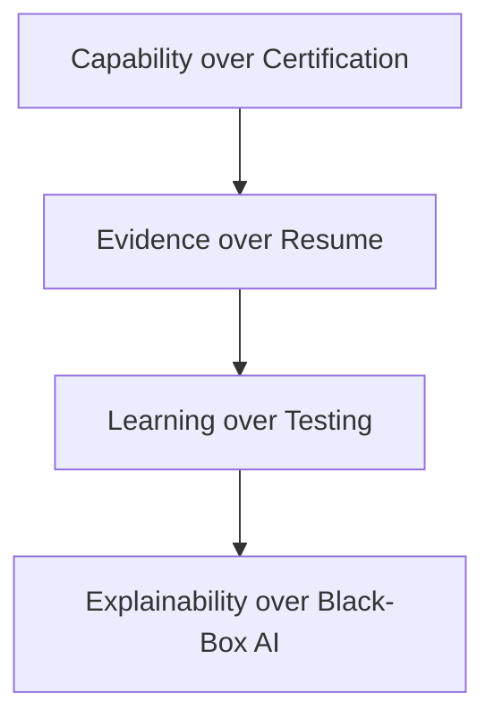

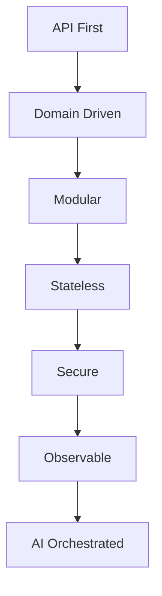

Business rules never exist in the frontend.

---

## 3. High-Level Backend Architecture

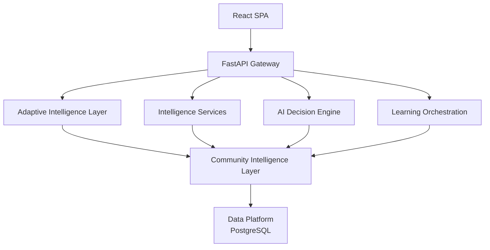

---

## 4. Architectural Layers (7-Layer Context)

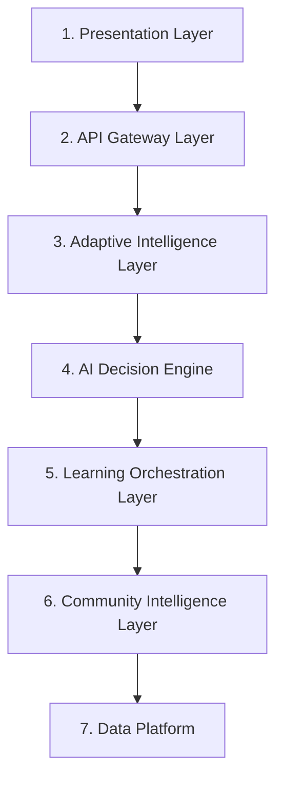

Responsibilities are strictly separated.

---

## 5. Module Architecture

```
backend/
modules/
├── auth/
├── users/
├── jd/
├── skill_dna_profile/
├── assessment/
├── missions/
├── reasoning/
├── evidence_intelligence/
├── learning/
├── community/
├── reports/
├── analytics/
└── common/
```

Each module is independently testable. Each module owns its router, service, repository, models, schemas, and tests.

---

## 6. Request Lifecycle

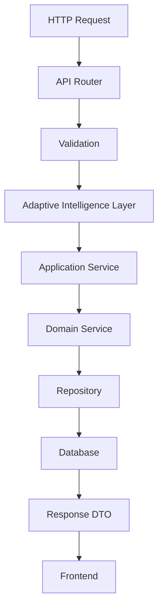

---

## 7. Service Layer

Each module contains its own services.

Example: `assessment/services/`

- `assessment_service.py`
- `mission_service.py`
- `session_service.py`
- `evaluation_service.py`

Service responsibilities: business rules, workflow orchestration, transactions, validation, AI coordination via AI Decision Engine.

---

## 8. Repository Layer

Repositories isolate persistence.

Example:

- `assessment_repository.py`
- `mission_repository.py`
- `report_repository.py`

Responsibilities: CRUD operations, query optimization, transaction boundaries, ORM abstraction.

Services never execute raw SQL.

---

## 9. AI Integration Layer

The backend isolates LLM interaction through the AI Decision Engine.

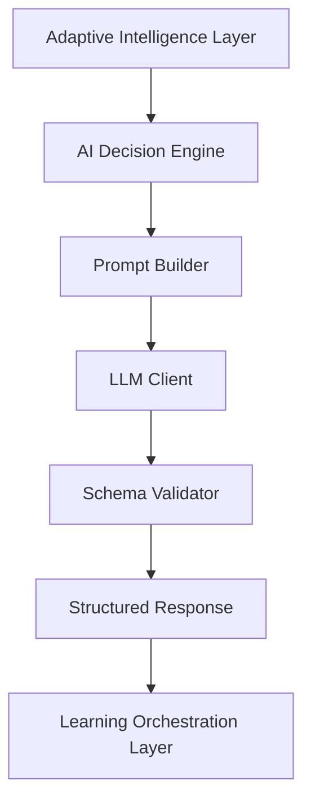

Components: prompt templates, JSON validation, retry logic, rate limiting, model routing, AI Mentor orchestration.

---

## 10. Database Layer

Primary entities:

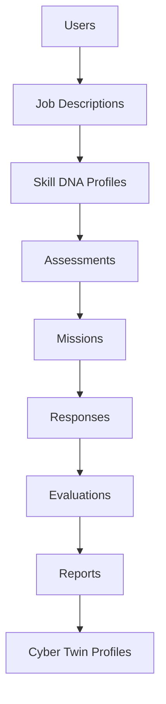

Use SQLAlchemy models with Alembic migrations.

---

## 11. API Layer

Endpoint structure:

```
/api/v1
/auth
/users
/jd
/skill-dna-profiles
/assessments
/missions
/reasoning
/evidence
/reports
/learning
/community
/cyber-twin
```

Guidelines: RESTful design, versioned endpoints, consistent error responses, Pydantic request/response schemas.

---

## 12. Background Processing

Tasks suitable for async execution:

- Report PDF generation
- Email notifications (future)
- Analytics aggregation
- Audit log cleanup
- Long-running AI jobs
- Community Intelligence aggregation

For MVP, FastAPI background tasks are sufficient.

---

## 13. Error Handling

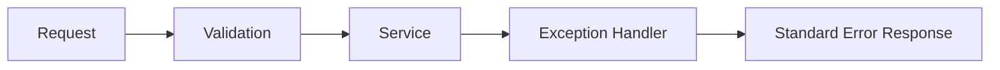

Error response format:

```json
{
  "error": {
    "code": "ASSESSMENT_NOT_FOUND",
    "message": "Assessment could not be located.",
    "request_id": "uuid"
  }
}
```

---

## 14. Security Architecture

Controls: JWT authentication, password hashing, input validation, output encoding, prompt injection protection, CORS configuration, rate limiting, audit logging, secret management through environment variables.

---

## 15. Recommended Folder Structure

```
backend/
app/
├── api/
│   ├── routers/
│   ├── dependencies/
│   └── middleware/
├── core/
│   ├── config.py
│   ├── logging.py
│   ├── security.py
│   └── exceptions.py
├── modules/
│   ├── auth/
│   ├── users/
│   ├── jd/
│   ├── skill_dna_profile/
│   ├── assessment/
│   ├── missions/
│   ├── reasoning/
│   ├── evidence_intelligence/
│   ├── learning/
│   ├── community/
│   ├── reports/
│   └── analytics/
├── layers/
│   ├── adaptive_intelligence/
│   ├── ai_decision_engine/
│   ├── learning_orchestration/
│   └── community_intelligence/
├── database/
│   ├── models/
│   ├── migrations/
│   └── session.py
├── ai/
│   ├── orchestrator/
│   ├── prompts/
│   ├── schemas/
│   ├── mentor/
│   └── providers/
├── tests/
└── main.py
```

---

## 16. Deployment

### MVP

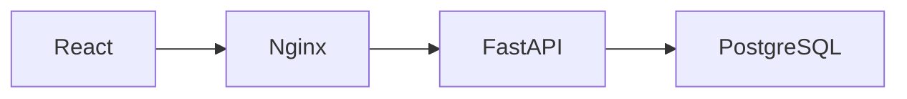

### Future

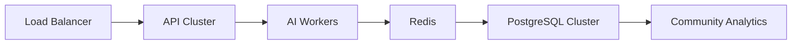

---

## 17. Future Evolution

Future enhancements: CQRS for analytics, event bus for module communication, worker queue (Celery or Dramatiq), distributed tracing, multi-region deployment, multi-tenant architecture, separate AI inference service, Community Intelligence data lake.

---

## 18. Conclusion

The backend architecture is designed to maximize correctness, maintainability, and future extensibility while remaining simple enough for a small team to build within a hackathon timeline. The 7-layer stack gives clean boundaries today and a practical migration path tomorrow.

---

## Backend Dependency Flow

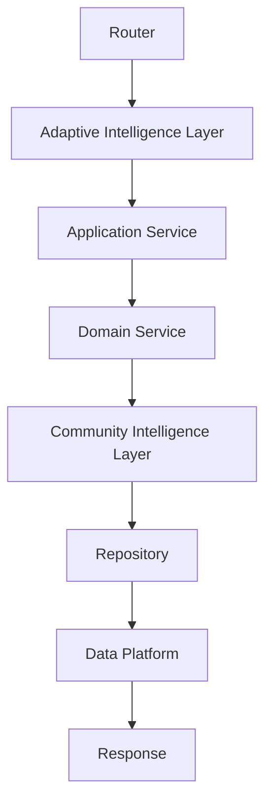

Every dependency points downward. Lower layers never depend on higher layers.

---

## Related Documents

- [System Architecture](16-system-architecture.md)
- [AI Cognitive Architecture](17-ai-cognitive-architecture.md)
- [Frontend Architecture](19-frontend-architecture.md)
- [Data Flow](20-data-flow.md)
- [Database Design](../docs/05-data-api/21-database-design.md)

---

## 19. References

| Reference | Document |
|---|---|
| System architecture | `../04-architecture/16-system-architecture.md` |
| AI architecture | `../04-architecture/17-ai-cognitive-architecture.md` |
| Frontend architecture | `../04-architecture/19-frontend-architecture.md` |
| Data flow | `../04-architecture/20-data-flow.md` |
