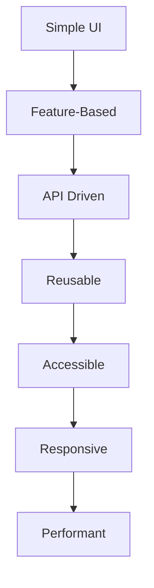
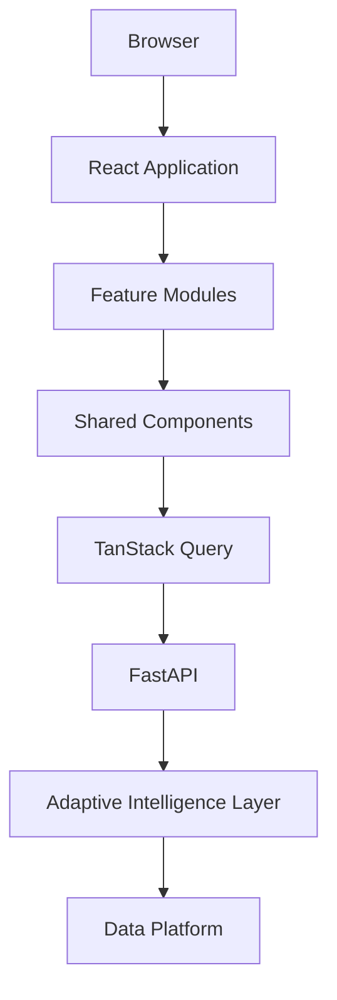
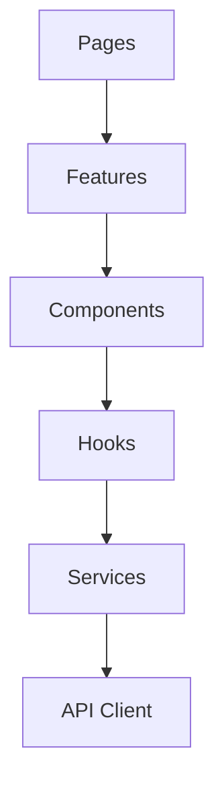
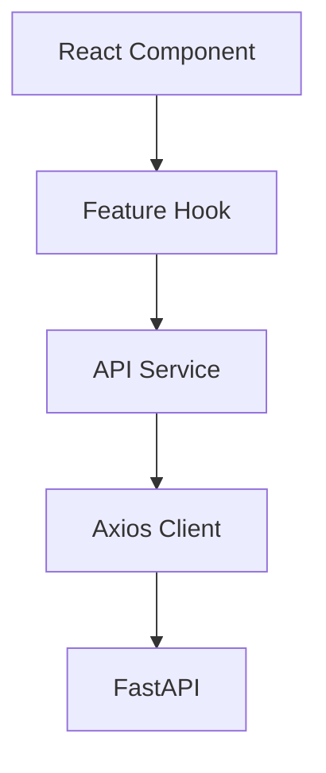
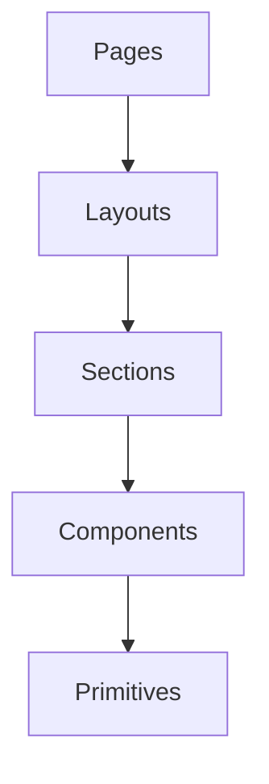
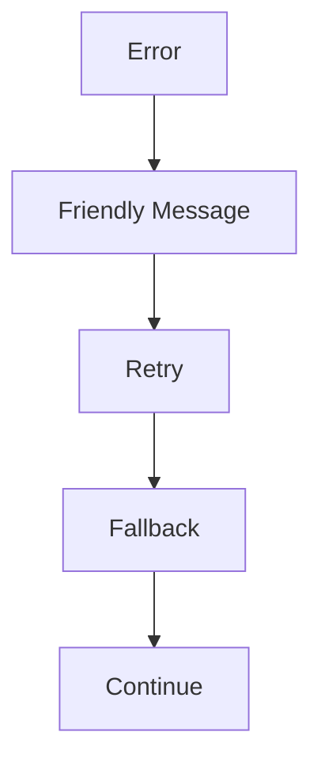

# PWNDORA SkillScan X — Frontend Architecture

## Table of Contents

1. Executive Summary
2. Frontend Philosophy
3. Architecture Goals
4. High-Level Architecture
5. Layered Architecture
6. Feature Modules
7. Routing Architecture
8. State Management
9. API Communication
10. Component Design
11. UI Composition
12. Error Handling
13. Performance Strategy
14. Folder Structure
15. Technology Stack
16. Future Evolution
17. Conclusion

---

# 1. Executive Summary

## Purpose

This document defines the frontend architecture of PWNDORA SkillScan X.

The frontend is responsible for:

- User interaction
- Assessment experience
- Data visualization (Capability Heatmap, Skill DNA Graph)
- Report presentation
- Voice interaction
- Communication with backend APIs

It is **not** responsible for business logic or AI reasoning.

**Core message:** We do not assess resumes. We assess cybersecurity capability.

---

# 2. Frontend Philosophy

Every frontend decision follows these principles.



---

# 3. Architecture Goals

The frontend should:

- Be modular
- Load quickly
- Remain maintainable
- Separate presentation from business logic
- Be accessible
- Scale to future features
- Support offline-safe draft state where practical

---

# 4. High-Level Architecture



---

# 5. Layered Architecture



Each layer has exactly one responsibility.

---

# 6. Feature Modules

```
auth/
dashboard/
job-description/
skill-dna-profile/
assessment/
missions/
reports/
learning/
cyber-twin/
settings/
```

Each feature owns:

- Pages
- Components
- Hooks
- Types
- API services
- Tests

---

# 7. Routing Architecture

```
/login
/dashboard
/job-description
/skill-dna-profile
/assessment
/report
/learning
/cyber-twin
/settings
```

Protected routes

```
Dashboard
Assessment
Reports
Learning
Cyber Twin
```

Public routes

```
Landing
Login
Register
```

---

# 8. State Management

Use local state by default.
Use global state only when necessary.

| State             | Tool            |
| ----------------- | --------------- |
| Server state      | TanStack Query  |
| Form state        | React Hook Form |
| UI state          | React state     |
| Global user state | Zustand         |

Avoid storing server data in global state.

---

# 9. API Communication



Responsibilities:

- Authentication
- Retry
- Error mapping
- Token refresh
- Response typing

---

# 10. Component Design

Component hierarchy



Examples

```
Button
Card
Input
Badge
Modal
Progress
CapabilityHeatmap
SkillDNATree
```

Reusable components belong in a shared UI library.

---

# 11. UI Composition

Assessment screen

```
Assessment Page
├── Header
├── Progress Indicator
├── Mission Panel
├── Voice Recorder
├── Transcript Panel
├── Timer
└── Navigation Controls
```

Report screen

```
Report Page
├── Summary
├── Capability Heatmap
├── Mission Timeline
├── Evidence Panel
├── AI Mentor Feedback
├── Recommendations
└── Career Compass
```

Cyber Twin screen

```
Cyber Twin Page
├── Skill DNA Overview
├── Capability Heatmap
├── Assessment History
├── Career Compass
├── Growth Trajectory
└── AI Mentor Chat
```

---

# 12. Error Handling

Frontend should gracefully handle:

- API failures
- AI processing delays
- Voice recognition failures
- Invalid uploads
- Session expiration

Example flow



---

# 13. Performance Strategy

Guidelines:

- Lazy-load routes
- Code-split feature modules
- Cache API responses
- Memoize expensive visualizations (Capability Heatmap, Skill DNA Graph)
- Virtualize long lists if needed
- Optimize bundle size

Target metrics:

| Metric                   | Target   |
| ------------------------ | -------- |
| Initial load             | < 3 s    |
| Route transition         | < 300 ms |
| Largest Contentful Paint | < 2.5 s  |

---

# 14. Recommended Folder Structure

```
frontend/
src/
├── app/
├── routes/
├── layouts/
├── features/
│   ├── auth/
│   ├── dashboard/
│   ├── job-description/
│   ├── skill-dna-profile/
│   ├── assessment/
│   ├── reports/
│   ├── learning/
│   ├── cyber-twin/
│   └── settings/
├── components/
│   ├── ui/
│   ├── charts/
│   ├── forms/
│   └── feedback/
├── hooks/
├── services/
├── lib/
├── types/
├── assets/
├── styles/
└── main.tsx
```

---

# 15. Technology Stack

| Layer        | Technology      |
| ------------ | --------------- |
| UI           | React 19        |
| Language     | TypeScript      |
| Styling      | Tailwind CSS    |
| Routing      | React Router    |
| Server State | TanStack Query  |
| Forms        | React Hook Form |
| Charts       | Recharts        |
| Icons        | Lucide React    |
| HTTP         | Axios           |
| Build Tool   | Vite            |

---

# 16. Future Evolution

Future improvements:

- Offline assessment support
- Progressive Web App
- Dark/light theme system
- Internationalization
- Accessibility audits
- Real-time collaboration
- Cyber Twin interactive dashboard
- AI Mentor conversation history
- Micro-frontend exploration (only if justified)

---

# 17. Conclusion

The frontend architecture prioritizes modularity, responsiveness, and maintainability. By organizing the application around business features rather than technical layers, PWNDORA SkillScan X remains easier to scale and easier for multiple developers to work on simultaneously.
