# PWNDORA SkillScan X — Data Flow

## Table of Contents

1. Executive Summary
2. Data Flow Philosophy
3. Core Data Objects
4. High-Level Data Flow
5. Job Description Flow
6. Skill DNA Profile Flow
7. Assessment Flow
8. Mission Flow
9. Response Processing
10. Capability Reasoning Flow
11. Evidence Intelligence Flow
12. Learning Flow
13. Reporting Flow
14. Database Flow
15. External Integrations
16. Error Flow
17. Data Lifecycle
18. Conclusion

---

# 1. Executive Summary

## Purpose

This document defines how information moves throughout PWNDORA SkillScan X.

It identifies:

- Data producers
- Data consumers
- Transformations
- Storage locations
- AI processing stages
- Validation checkpoints

**Core message:** We do not assess resumes. We assess cybersecurity capability.

---

# 2. Data Flow Philosophy

Every data object follows the same lifecycle.

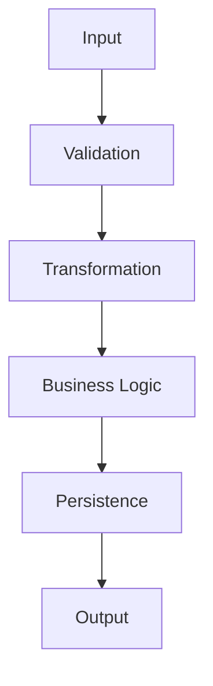

No data bypasses validation.

---

# 3. Core Data Objects

| Object               | Producer                     | Consumer                       |
| -------------------- | ---------------------------- | ------------------------------ |
| Job Description      | Professional                 | Role Intelligence Engine       |
| Skill DNA Profile    | Role Intelligence Engine     | Assessment Planner             |
| Capability Blueprint | Assessment Planner           | Practical Challenge Generator  |
| Mission              | Practical Challenge Generator| Professional                   |
| Response             | Professional                 | Capability Reasoning Engine    |
| Evaluation           | Capability Reasoning Engine  | Evidence Intelligence Engine   |
| Career Compass       | Learning Path Engine         | Professional                   |
| Report               | Reporting Engine             | Professional / Capability Analyst |
| Cyber Twin Profile   | Community Intelligence Layer | Professional                   |

---

# 4. High-Level Data Flow

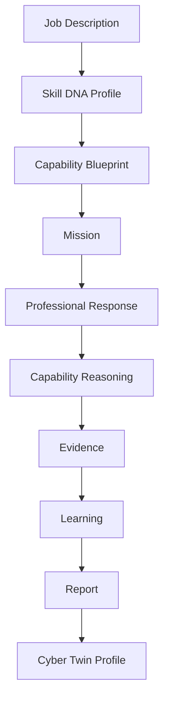

Every downstream object is derived from a validated upstream object.

---

# 5. Job Description Flow

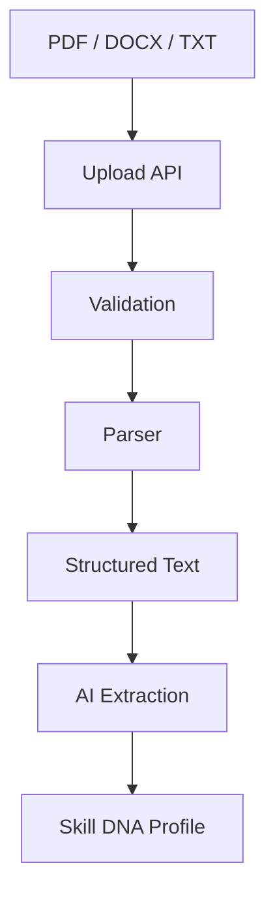

Validation checks:

- Supported file type
- File size
- Readability
- Parsing success

---

# 6. Skill DNA Profile Flow

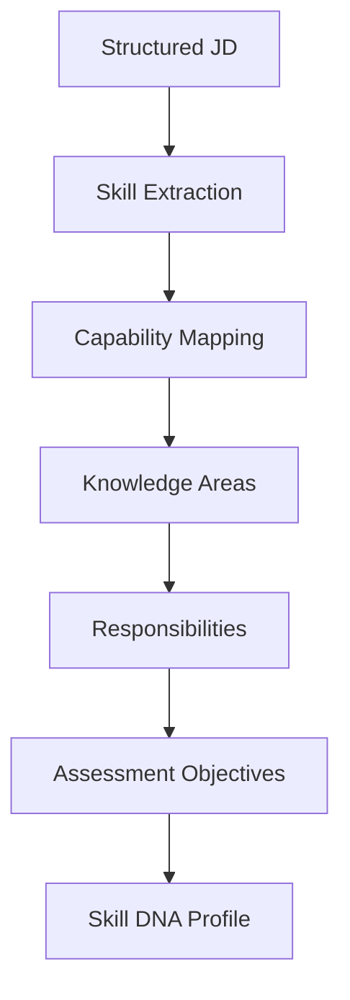

The Skill DNA Profile is persisted and becomes the canonical input for later stages.

---

# 7. Assessment Flow

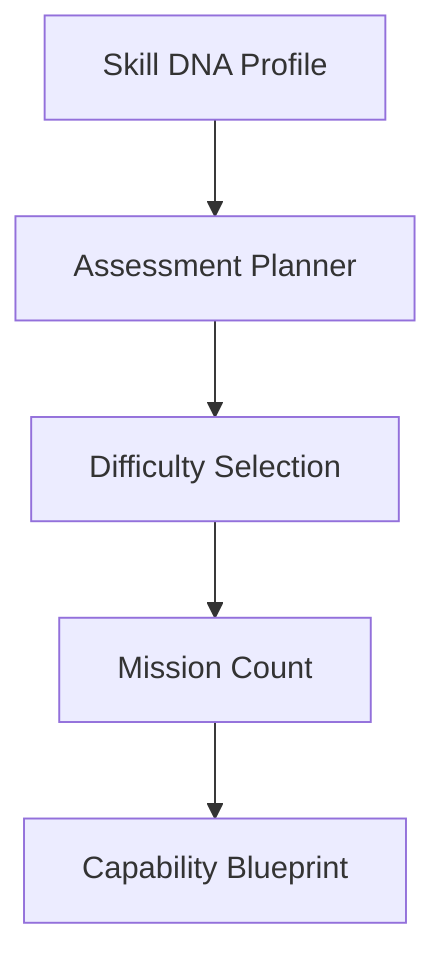

Outputs include:

- Duration
- Capabilities
- Mission order
- Rubric references

---

# 8. Mission Flow

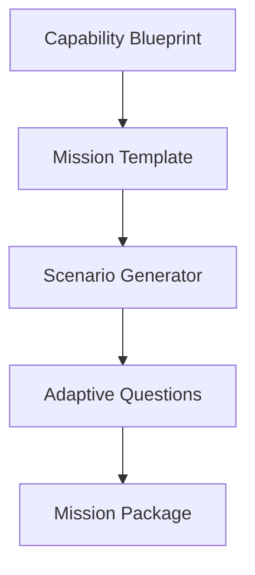

Mission Package contains:

- Scenario
- Objectives
- Questions
- Expected reasoning
- Evaluation rubric

---

# 9. Response Processing

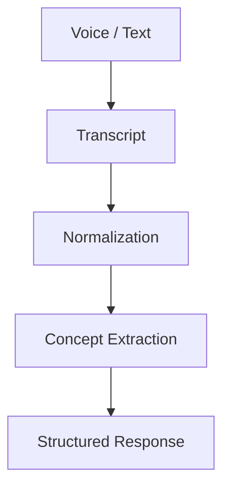

Normalization includes:

- Cleanup
- Formatting
- Language consistency
- Metadata attachment

---

# 10. Capability Reasoning Flow

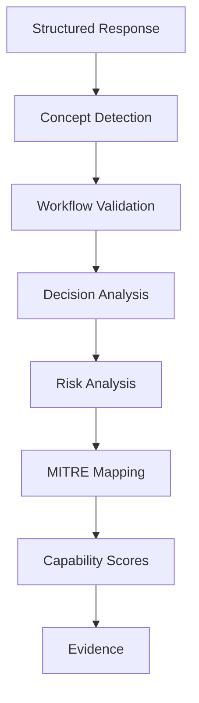

Outputs:

- Scores
- Evidence
- Missing concepts
- Confidence values

---

# 11. Evidence Intelligence Flow

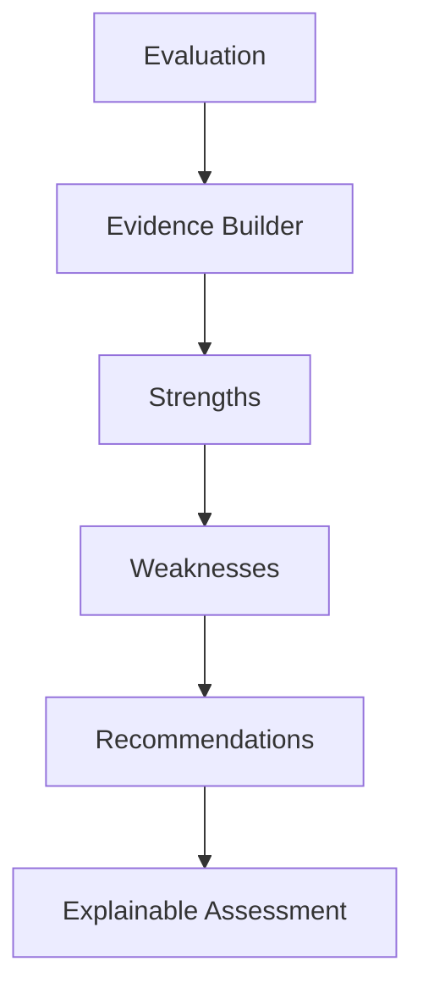

Every explanation references specific observations from the evaluation stage.

---

# 12. Learning Flow

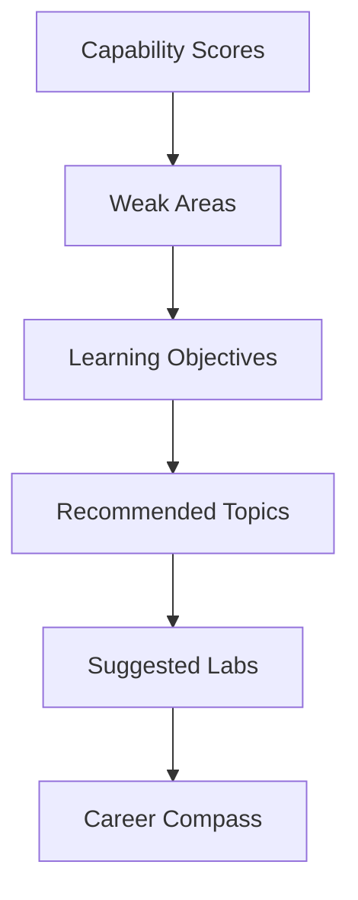

Recommendations remain traceable to capability gaps. The AI Mentor provides coaching guidance.

---

# 13. Reporting Flow

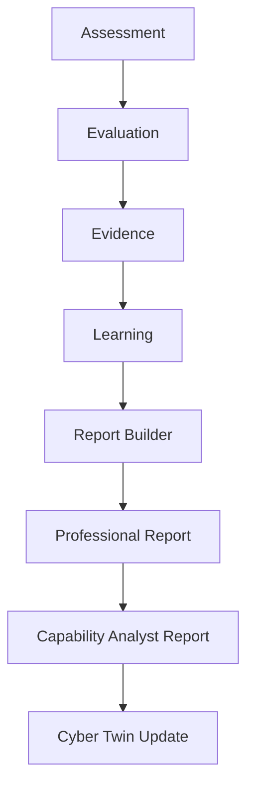

Exports:

- JSON
- PDF

---

# 14. Database Flow

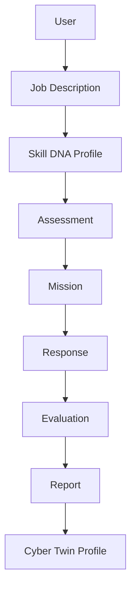

Persistence rules:

- Store immutable assessment snapshots.
- Preserve evaluation history.
- Version Skill DNA Profiles and rubrics.
- Maintain Cyber Twin history for longitudinal analysis.

---

# 15. External Integrations

Current:

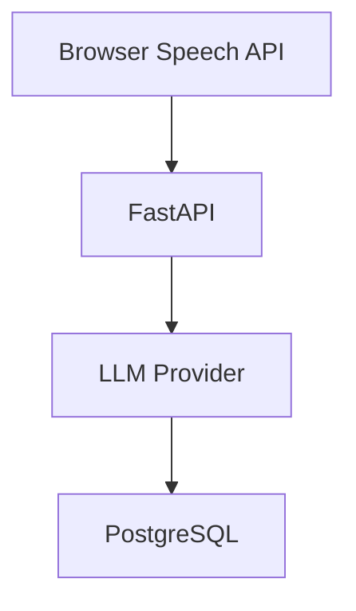

Future:

- LMS integration
- ATS integration
- Enterprise SSO
- Cyber range platforms

---

# 16. Error Flow

### Invalid Upload

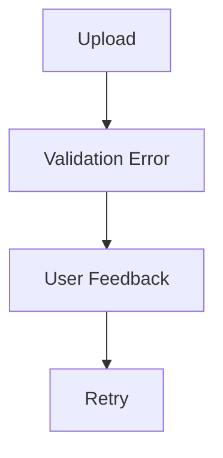

### AI Failure

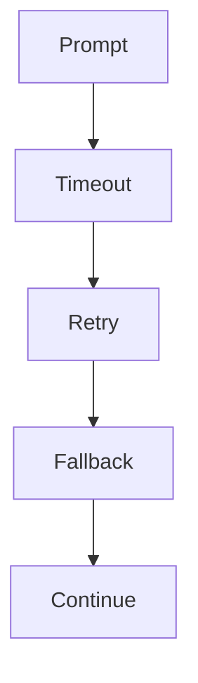

### Database Failure

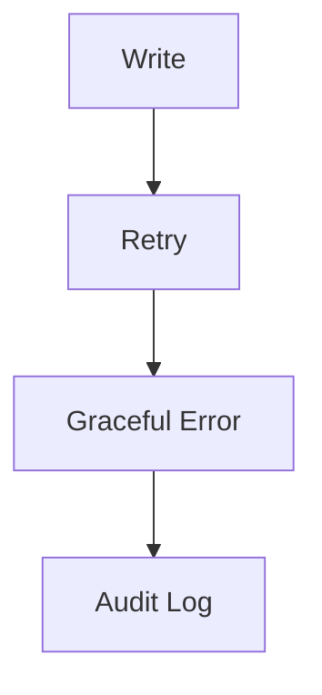

---

# 17. Data Lifecycle

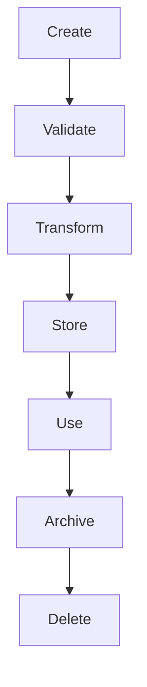

Retention principles:

- Keep assessment history versioned.
- Allow users to delete personal reports where appropriate.
- Avoid storing unnecessary raw voice recordings.
- Archive historical Skill DNA Profiles instead of overwriting them.
- Preserve Cyber Twin profiles as long as the professional account is active.

---

## Related Documents

- [System Architecture](16-system-architecture.md)
- [Backend Architecture](18-backend-architecture.md)
- [AI Cognitive Architecture](17-ai-cognitive-architecture.md)
- [Database Design](../docs/05-data-api/21-database-design.md)
- [Entity Relationship Diagram](../docs/05-data-api/22-entity-relationship-diagram.md)

---

# 18. Conclusion

PWNDORA SkillScan X is built around a deterministic data pipeline where every transformation is explicit, validated, and traceable. The **Skill DNA Profile** acts as the canonical domain object, ensuring consistency across assessment generation, reasoning, reporting, learning recommendations, and the persistent **Cyber Twin** identity.
