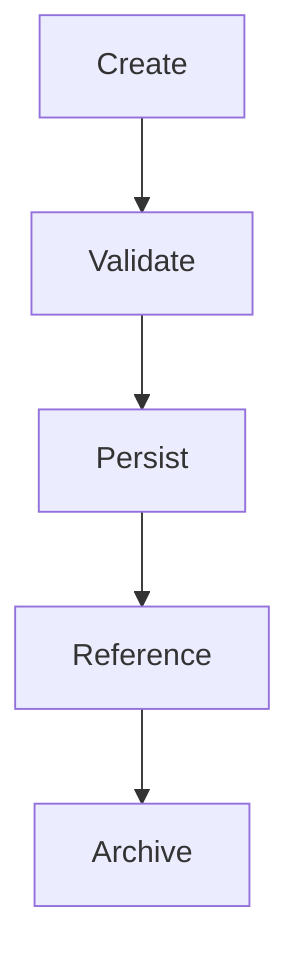
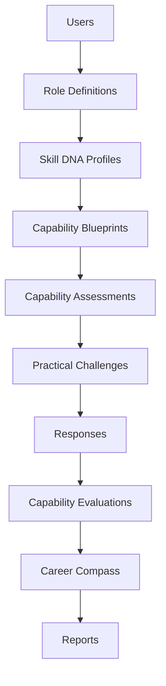
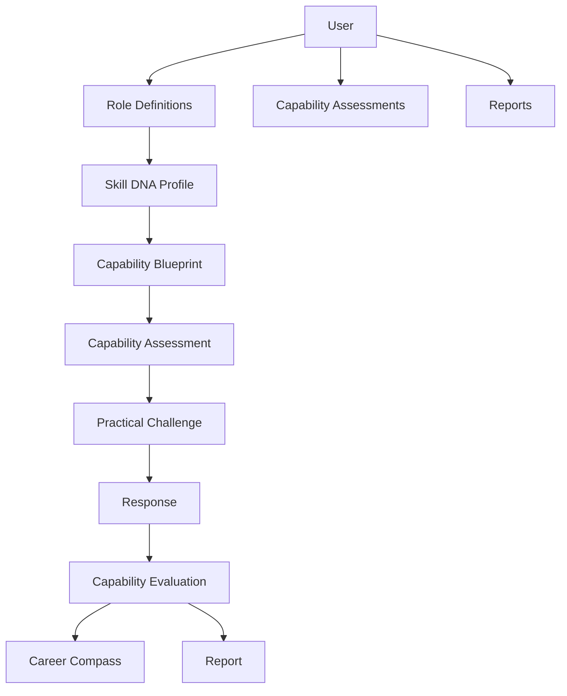

# Database Design

## Table of Contents

1. Executive Summary
2. Database Philosophy
3. Design Principles
4. High-Level Schema
5. Core Entities
6. Entity Relationships
7. Normalization Strategy
8. Schema Overview
9. Table Definitions
10. Indexing Strategy
11. Versioning Strategy
12. Data Integrity
13. Audit Logging
14. Performance Considerations
15. Migration Strategy
16. Backup & Recovery
17. Future Expansion
18. Conclusion

---

# 1. Executive Summary

## Purpose

This document defines the relational database architecture for PWNDORA SkillScan X.

The database stores:

- Users
- Role Definitions
- Skill DNA Profiles
- Capability Assessments
- Practical Challenges
- Responses
- Capability Evaluations
- Career Compass
- Reports

The design emphasizes normalization, immutability, and auditability.

---

# 2. Database Philosophy

Every record follows the lifecycle:



Completed capability assessments are immutable. Updates create new versions instead of overwriting historical data.

---

# 3. Design Principles

The schema follows these principles:

- Third Normal Form (3NF)
- Strong referential integrity
- UUID primary keys
- Soft deletion where appropriate
- Immutable assessment snapshots
- Explicit versioning
- Audit-friendly design

---

# 4. High-Level Schema



Skill DNA Profile is the canonical business entity.

---

# 5. Core Entities

| Entity                  | Purpose                        |
| ----------------------- | ------------------------------ |
| users                   | User accounts                  |
| role_definitions        | Uploaded role definitions      |
| skill_dna_profiles      | Canonical role representation  |
| capabilities            | Normalized capability catalog  |
| capability_blueprints   | Assessment plans               |
| capability_assessments  | Professional assessment sessions|
| practical_challenges    | Individual assessment challenges|
| responses               | Professional responses            |
| capability_evaluations  | Scoring and evidence           |
| career_compasses        | Personalized recommendations   |
| reports                 | Generated assessment reports   |
| audit_logs              | System activity                |

---

# 6. Entity Relationships



---

# 7. Normalization Strategy

Reference data is stored separately.

Examples:

```
capabilities
roles
challenge_types
mitre_techniques
rubric_versions
```

Avoid storing repeated strings across assessment records.

---

# 8. Schema Overview

```
users
role_definitions
skill_dna_profiles
capability_blueprints
capability_assessments
practical_challenges
responses
capability_evaluations
career_compasses
reports
audit_logs
```

Supporting lookup tables:

```
capabilities
skills
knowledge_areas
challenge_templates
rubrics
```

---

# 9. Table Definitions

## users

| Column        | Type      |
| ------------- | --------- |
| id            | UUID      |
| email         | VARCHAR   |
| password_hash | TEXT      |
| full_name     | VARCHAR   |
| role          | VARCHAR   |
| created_at    | TIMESTAMP |
| updated_at    | TIMESTAMP |

---

## role_definitions

| Column      | Type      |
| ----------- | --------- |
| id          | UUID      |
| user_id     | UUID      |
| filename    | TEXT      |
| raw_text    | TEXT      |
| uploaded_at | TIMESTAMP |

---

## skill_dna_profiles

| Column             | Type      |
| ------------------ | --------- |
| id                 | UUID      |
| role_definition_id | UUID      |
| version            | INTEGER   |
| title              | VARCHAR   |
| summary            | TEXT      |
| difficulty         | VARCHAR   |
| created_at         | TIMESTAMP |

---

## capabilities

| Column      | Type    |
| ----------- | ------- |
| id          | UUID    |
| name        | VARCHAR |
| category    | VARCHAR |
| description | TEXT    |

---

## capability_blueprints

| Column                 | Type    |
| ---------------------- | ------- |
| id                     | UUID    |
| skill_dna_profile_id   | UUID    |
| duration_minutes       | INTEGER |
| challenge_count        | INTEGER |
| rubric_version         | UUID    |

---

## capability_assessments

| Column           | Type      |
| ---------------- | --------- |
| id               | UUID      |
| blueprint_id     | UUID      |
| professional_id  | UUID      |
| status           | VARCHAR   |
| started_at       | TIMESTAMP |
| completed_at     | TIMESTAMP |

---

## practical_challenges

| Column           | Type    |
| ---------------- | ------- |
| id               | UUID    |
| assessment_id    | UUID    |
| challenge_type   | VARCHAR |
| scenario         | TEXT    |
| sequence         | INTEGER |

---

## responses

| Column        | Type      |
| ------------- | --------- |
| id            | UUID      |
| challenge_id  | UUID      |
| transcript    | TEXT      |
| response_type | VARCHAR   |
| submitted_at  | TIMESTAMP |

---

## capability_evaluations

| Column      | Type    |
| ----------- | ------- |
| id          | UUID    |
| response_id | UUID    |
| score       | DECIMAL |
| confidence  | DECIMAL |
| evidence    | JSONB   |

---

## career_compasses

| Column          | Type      |
| --------------- | --------- |
| id              | UUID      |
| assessment_id   | UUID      |
| roadmap         | JSONB     |
| generated_at    | TIMESTAMP |

---

## reports

| Column        | Type      |
| ------------- | --------- |
| id            | UUID      |
| assessment_id | UUID      |
| report_json   | JSONB     |
| pdf_path      | TEXT      |
| created_at    | TIMESTAMP |

---

# 10. Indexing Strategy

Create indexes on:

- user_id
- assessment_id
- skill_dna_profile_id
- role_definition_id
- created_at
- status

Composite indexes:

```
(professional_id, status)
(assessment_id, sequence)
(skill_dna_profile_id, version)
```

---

# 11. Versioning Strategy

Version these entities:

- Skill DNA Profiles
- Rubrics
- Capability Blueprints
- Reports

Never overwrite historical records.

---

# 12. Data Integrity

Enforce:

- Foreign keys
- Unique constraints
- Check constraints
- Cascading rules where appropriate
- Transaction boundaries for assessment completion

---

# 13. Audit Logging

Track:

- User login
- Role Definition upload
- Assessment start
- Assessment completion
- Report generation
- Administrative changes

Suggested fields:

```
id
user_id
action
entity
entity_id
metadata
timestamp
```

---

# 14. Performance Considerations

Guidelines:

- Use JSONB only for flexible AI outputs.
- Keep transactional data relational.
- Avoid large joins in report generation by precomputing summaries where needed.
- Paginate dashboard queries.

---

# 15. Migration Strategy

Use:

- Alembic
- Incremental migrations
- Reversible migrations
- Seed scripts for lookup tables

Never edit historical migrations after they have been applied.

---

# 16. Backup & Recovery

For MVP:

- Daily database backup
- Export assessment reports
- Backup migration scripts

Future:

- Point-in-time recovery
- Automated snapshot retention
- Cross-region replication

---

# 17. Future Expansion

Additional tables may include:

- organizations
- teams
- capability_analyst_invites
- assessment_templates
- certification_tracks
- cohort_results
- analytics_events
- ai_model_runs

These should extend the schema without breaking existing relationships.

## Related Documents

- [Entity Relationship Diagram](22-entity-relationship-diagram.md)
- [Data Models](25-data-models.md)
- [Data Flow](../docs/04-architecture/20-data-flow.md)
- [API Specification](23-api-specification.md)

---

# 18. Conclusion

The PWNDORA SkillScan X database is centered around immutable assessment history and the **Skill DNA Profile** as the canonical domain model. This structure supports reproducibility, explainability, and future enterprise capabilities while remaining practical for an MVP.
