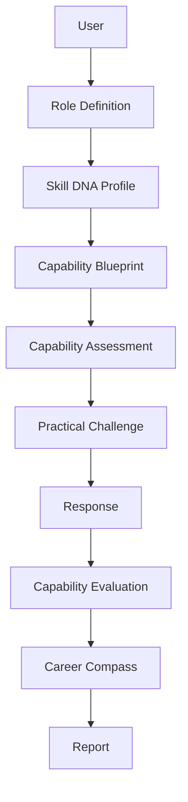
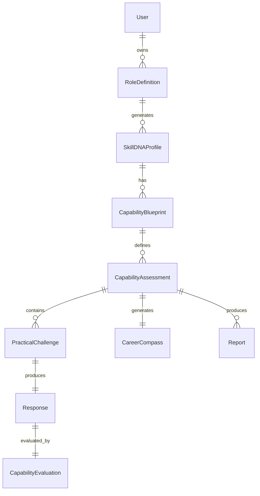
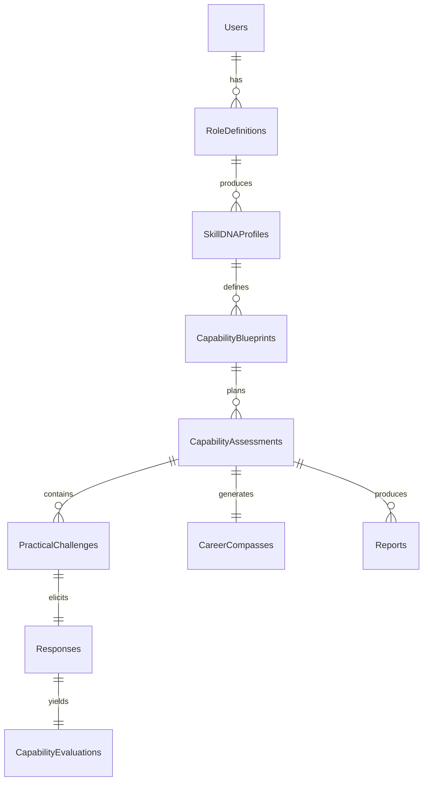
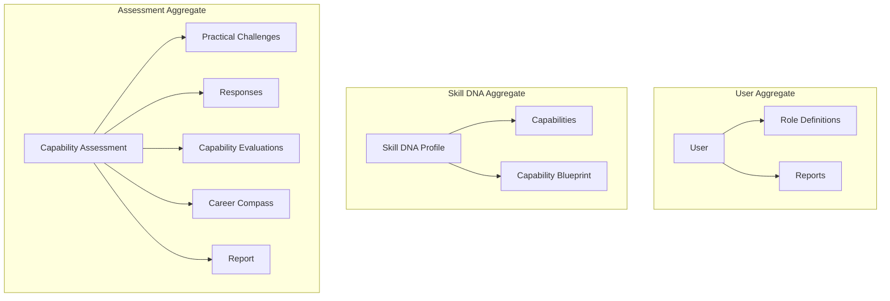

# Entity Relationship Diagram

## Table of Contents

1. Executive Summary
2. Purpose
3. Domain Model
4. Entity Overview
5. Core Relationships
6. Cardinality
7. Primary Keys
8. Foreign Keys
9. Entity Definitions
10. Complete ER Diagram
11. Aggregate Boundaries
12. Versioning Strategy
13. Data Ownership
14. Future Expansion
15. Conclusion

---

# 1. Executive Summary

## Purpose

This document defines the Entity Relationship Model (ERM) for PWNDORA SkillScan X.

It explains:

- Business entities
- Relationships
- Cardinality
- Ownership
- Aggregate boundaries
- Versioning

This serves as the reference for database implementation.

---

# 2. Purpose

The ERD represents the business domain rather than simply database tables.

Goals:

- Model cybersecurity capability assessment workflows
- Preserve historical assessments
- Maintain auditability
- Support future expansion

---

# 3. Domain Model



The **Skill DNA Profile** is the central domain aggregate.

---

# 4. Entity Overview

| Entity                 | Description                   |
| ---------------------- | ----------------------------- |
| User                   | Platform account              |
| Role Definition        | Uploaded role specification   |
| Skill DNA Profile      | Canonical role representation |
| Capability             | Reusable capability catalog   |
| Capability Blueprint   | Generated assessment plan     |
| Capability Assessment  | Professional assessment session|
| Practical Challenge    | Assessment task               |
| Response               | Professional answer           |
| Capability Evaluation  | Scoring and evidence          |
| Career Compass         | Personalized roadmap          |
| Report                 | Final assessment output       |
| Audit Log              | System history                |

---

# 5. Core Relationships



Career Compass entries are generated from Capability Evaluations and linked back to Assessments.

---

# 6. Cardinality

| Relationship                               | Cardinality     |
| ------------------------------------------ | --------------- |
| User → Role Definition                     | 1:N             |
| Role Definition → Skill DNA Profile        | 1:N (versioned) |
| Skill DNA Profile → Capability Blueprint   | 1:N             |
| Capability Blueprint → Capability Assessment| 1:N             |
| Capability Assessment → Practical Challenge | 1:N             |
| Practical Challenge → Response              | 1:1 (MVP)       |
| Response → Capability Evaluation           | 1:1             |
| Capability Assessment → Career Compass     | 1:1             |
| Capability Assessment → Report             | 1:N (versioned) |

---

# 7. Primary Keys

Every entity uses UUID.

| Entity                  | Primary Key |
| ----------------------- | ----------- |
| users                   | id          |
| role_definitions        | id          |
| skill_dna_profiles      | id          |
| capabilities            | id          |
| capability_blueprints   | id          |
| capability_assessments  | id          |
| practical_challenges    | id          |
| responses               | id          |
| capability_evaluations  | id          |
| career_compasses        | id          |
| reports                 | id          |
| audit_logs              | id          |

---

# 8. Foreign Keys

| Child Table              | Foreign Key               |
| ------------------------ | ------------------------- |
| role_definitions         | user_id                   |
| skill_dna_profiles       | role_definition_id        |
| capability_blueprints    | skill_dna_profile_id      |
| capability_assessments   | capability_blueprint_id   |
| capability_assessments   | professional_id           |
| practical_challenges     | assessment_id             |
| responses                | challenge_id              |
| capability_evaluations   | response_id               |
| career_compasses         | assessment_id             |
| reports                  | assessment_id             |

---

# 9. Entity Definitions

## User

Owns:

- Role Definitions
- Capability Assessments
- Reports

## Role Definition

Produces:

- Skill DNA Profile(s)

## Skill DNA Profile

Owns:

- Capabilities
- Capability Blueprints

Acts as the canonical role definition.

## Capability Blueprint

Defines:

- Challenge count
- Rubric version
- Duration
- Difficulty

## Capability Assessment

Contains:

- Practical Challenges
- Status
- Professional
- Progress

## Practical Challenge

Contains:

- Scenario
- Questions
- Evaluation criteria

## Response

Contains:

- Transcript
- Metadata
- Submission time

## Capability Evaluation

Contains:

- Capability scores
- Evidence
- Confidence
- MITRE mapping

## Report

Contains:

- Assessment summary
- Career Compass
- Export data

---

# 10. Complete ER Diagram



---

# 11. Aggregate Boundaries

Define aggregates using Domain-Driven Design.



Each aggregate has one root responsible for consistency.

---

# 12. Versioning Strategy

Version these entities:

- Skill DNA Profile
- Capability Blueprint
- Rubric
- Report

Never update completed assessments in place.
Create a new version instead.

---

# 13. Data Ownership

| Entity                 | Owner                     |
| ---------------------- | ------------------------- |
| User                   | Auth Module               |
| Role Definition        | Role Intelligence Module  |
| Skill DNA Profile      | Skill DNA Engine          |
| Capability Assessment  | Capability Intelligence Engine |
| Practical Challenge    | Practical Challenge Engine|
| Response               | Capability Intelligence Engine |
| Capability Evaluation  | Capability Reasoning Engine |
| Career Compass         | Learning Path Engine      |
| Report                 | Reporting Module          |

Ownership is by backend module, not by frontend screen.

---

# 14. Future Expansion

Additional entities:

```
Organizations
Teams
Capability Analysts
Assessment Templates
Question Banks
Cyber Labs
Certificates
Analytics Events
Model Runs
```

These should extend existing aggregates rather than introduce duplicate concepts.

## Related Documents

- [Database Design](21-database-design.md)
- [Data Models](25-data-models.md)
- [Data Flow](../docs/04-architecture/20-data-flow.md)

---

# 15. Conclusion

The PWNDORA SkillScan X entity model is intentionally centered on immutable assessment history and the **Skill DNA Profile** as the canonical representation of a cybersecurity role. This provides a stable foundation for assessment generation, reasoning, reporting, and future enterprise capabilities.
