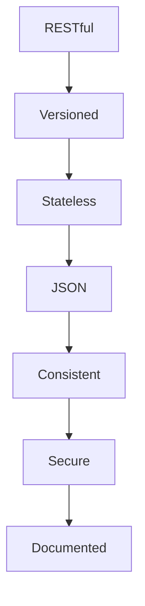
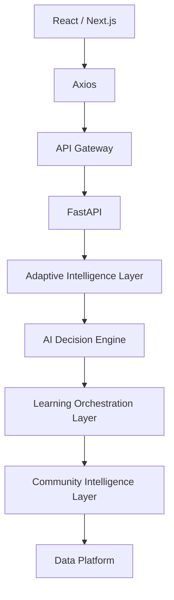

# API Specification

## Table of Contents

1. Executive Summary
2. API Design Principles
3. API Architecture
4. Authentication APIs
5. User APIs
6. Role Definition APIs
7. Skill DNA APIs
8. Capability Assessment APIs
9. Challenge APIs
10. Evaluation APIs
11. Career Compass APIs
12. Report APIs
13. Error Responses
14. Versioning
15. Rate Limiting
16. OpenAPI Standards
17. Future APIs
18. Conclusion

---

# 1. Executive Summary

## Purpose

This document defines the REST API contract for PWNDORA SkillScan X.

Goals:

- Stable API contracts
- Consistent request/response models
- Predictable error handling
- Versioned endpoints
- OpenAPI compatibility

---

# 2. API Design Principles

Every endpoint follows:



---

# 3. API Architecture



Every API should expose business operations, not CRUD for every table.

---

# 4. Authentication APIs

## Register

```
POST /api/v1/auth/register
```

Request:
```json
{
  "name": "John Doe",
  "email": "john@example.com",
  "password": "********"
}
```

Response:
```json
{
  "user_id": "...",
  "message": "Registration successful"
}
```

## Login

```
POST /api/v1/auth/login
```

Response:
```json
{
  "access_token": "...",
  "refresh_token": "...",
  "expires_in": 3600
}
```

## Current User

```
GET /api/v1/auth/me
```

## Logout

```
POST /api/v1/auth/logout
```

---

# 5. User APIs

```
GET    /api/v1/users/me
PATCH  /api/v1/users/me
GET    /api/v1/users/history
```

---

# 6. Role Definition APIs

## Upload Role Definition

```
POST /api/v1/role-definitions
```

Multipart upload

Response:
```json
{
  "role_definition_id": "..."
}
```

## Parse Role Definition

```
POST /api/v1/role-definitions/{id}/parse
```

## Get Role Definition

```
GET /api/v1/role-definitions/{id}
```

---

# 7. Skill DNA APIs

## Generate

```
POST /api/v1/skill-dna
```

Body:
```json
{
  "role_definition_id": "..."
}
```

## Retrieve

```
GET /api/v1/skill-dna/{id}
```

## List Versions

```
GET /api/v1/skill-dna/{id}/versions
```

---

# 8. Capability Assessment APIs

## Generate Assessment

```
POST /api/v1/capability-assessments
```

## Start

```
POST /api/v1/capability-assessments/{id}/start
```

## Get Status

```
GET /api/v1/capability-assessments/{id}
```

## Resume

```
POST /api/v1/capability-assessments/{id}/resume
```

## Complete

```
POST /api/v1/capability-assessments/{id}/complete
```

---

# 9. Challenge APIs

## Get Next Challenge

```
GET /api/v1/capability-assessments/{id}/challenges/next
```

## Submit Response

```
POST /api/v1/challenges/{id}/responses
```

Request:
```json
{
  "response_type": "voice",
  "transcript": "..."
}
```

## Retrieve Challenge

```
GET /api/v1/challenges/{id}
```

---

# 10. Evaluation APIs

## Evaluate

```
POST /api/v1/evaluations
```

## Retrieve Evaluation

```
GET /api/v1/evaluations/{id}
```

## Capability Breakdown

```
GET /api/v1/evaluations/{id}/capabilities
```

---

# 11. Career Compass APIs

## Generate Roadmap

```
POST /api/v1/career-compass
```

## Retrieve

```
GET /api/v1/career-compass/{id}
```

---

# 12. Report APIs

## Generate Report

```
POST /api/v1/reports
```

## Get Report

```
GET /api/v1/reports/{id}
```

## Export PDF

```
GET /api/v1/reports/{id}/pdf
```

## Export JSON

```
GET /api/v1/reports/{id}/json
```

---

# 13. Error Responses

Standard format:
```json
{
  "error": {
    "code": "VALIDATION_ERROR",
    "message": "Invalid request.",
    "request_id": "uuid",
    "details": []
  }
}
```

Common codes:

| Code                | Meaning                    |
| ------------------- | -------------------------- |
| VALIDATION_ERROR    | Invalid input              |
| UNAUTHORIZED        | Authentication required    |
| FORBIDDEN           | Insufficient permissions   |
| NOT_FOUND           | Resource missing           |
| CONFLICT            | Duplicate or invalid state |
| AI_PROCESSING_ERROR | AI request failed          |
| INTERNAL_ERROR      | Unexpected server error    |

---

# 14. Versioning

API prefix:

```
/api/v1
```

Future versions:

```
/api/v2
/api/v3
```

Rules:

- Never introduce breaking changes within the same version.
- Deprecate endpoints before removal.
- Maintain backward compatibility where practical.

---

# 15. Rate Limiting

Suggested limits (MVP):

| Endpoint Type           |              Limit |
| ----------------------- | -----------------: |
| Authentication          | 10 requests/minute |
| Role Definition Upload  |   20 requests/hour |
| Assessment Actions      |  120 requests/hour |
| Report Download         |   60 requests/hour |

Protect AI-heavy endpoints from abuse.

---

# 16. OpenAPI Standards

Requirements:

- OpenAPI 3.1
- Pydantic request/response models
- Automatic Swagger UI
- Automatic ReDoc
- Example payloads
- Response schemas
- Authentication documentation

---

# 17. Future APIs

Future endpoints:

```
/organizations
/teams
/capability-analysts
/templates
/analytics
/certifications
/model-runs
/integrations
```

These should follow the same versioning and response conventions.

## Related Documents

- [Authentication & Authorization](24-authentication-authorization.md)
- [Data Models](25-data-models.md)
- [Backend Architecture](../docs/04-architecture/18-backend-architecture.md)
- [System Features](../docs/03-functional-design/12-system-features.md)

---

# 18. Conclusion

The PWNDORA SkillScan X API is organized around business capabilities rather than database tables. Stable contracts, consistent schemas, and explicit versioning allow the frontend and backend to evolve independently while maintaining compatibility.
