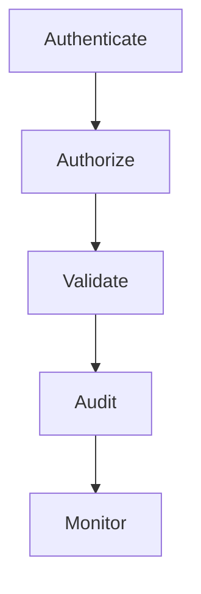
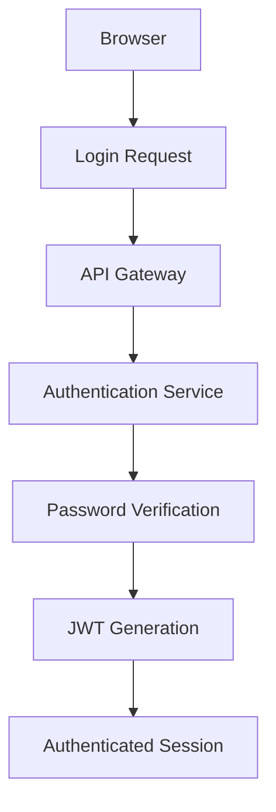
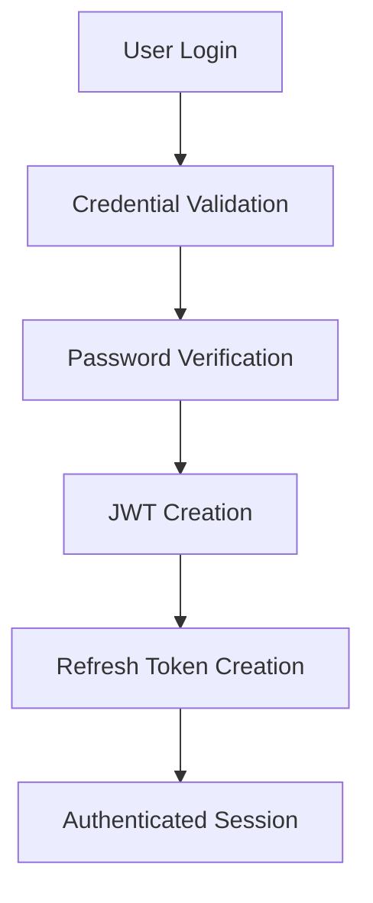
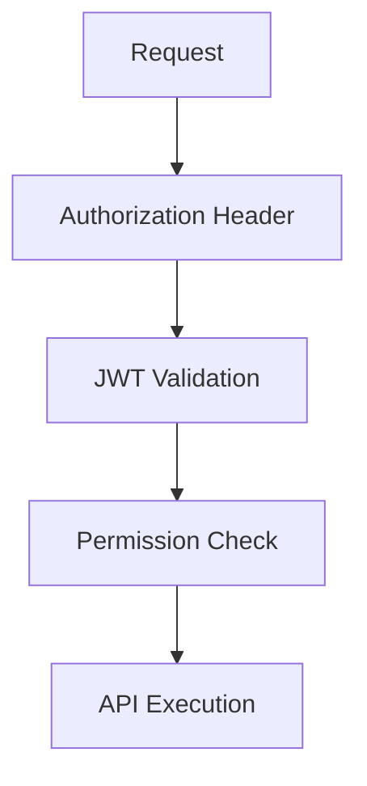

# Authentication & Authorization

## Table of Contents

1. Executive Summary
2. Security Philosophy
3. Authentication Architecture
4. Authorization Model
5. User Roles
6. Permission Matrix
7. Authentication Flow
8. Session Management
9. JWT Design
10. Password Security
11. API Security
12. Route Protection
13. Audit Logging
14. Threat Model
15. Security Controls
16. Future Identity Integrations
17. Conclusion

---

# 1. Executive Summary

## Purpose

This document defines the authentication and authorization architecture for PWNDORA SkillScan X.

It specifies:

- User authentication
- Identity verification
- Authorization rules
- Session lifecycle
- Token management
- Security controls
- Audit logging

---

# 2. Security Philosophy

Security follows the principle of:



Every request is authenticated, authorized, validated, and logged.

---

# 3. Authentication Architecture



Authentication is stateless using JWT access tokens.

---

# 4. Authorization Model

Authorization uses **Role-Based Access Control (RBAC)**.

Future versions may introduce Attribute-Based Access Control (ABAC), but RBAC is sufficient for the MVP.

---

# 5. User Roles

| Role                | Description                                         |
| ------------------- | --------------------------------------------------- |
| Professional        | Completes capability assessments and views reports |
| Capability Analyst  | Creates assessments and reviews professional reports|
| Hiring Manager      | Reviews assessment reports                          |
| Trainer             | Assigns assessments and monitors cohorts            |
| Administrator       | Full platform management                            |

---

# 6. Permission Matrix

| Action                     | Professional | Capability Analyst | Hiring Manager | Trainer | Admin |
| -------------------------- | :----------: | :----------------: | :------------: | :-----: | :---: |
| Register                   |      ✓       |         ✓          |       ✓        |    ✓    |   ✓   |
| Upload Role Definition     |      ✓       |         ✓          |       ✗        |    ✗    |   ✓   |
| Create Assessment          |      ✗       |         ✓          |       ✗        |    ✓    |   ✓   |
| Complete Assessment        |      ✓       |         ✗          |       ✗        |    ✗    |   ✓   |
| View Own Report            |      ✓       |         ✗          |       ✗        |    ✗    |   ✓   |
| View Professional Report   |      ✗       |         ✓          |       ✓        |    ✓    |   ✓   |
| Manage Users               |      ✗       |         ✗          |       ✗        |    ✗    |   ✓   |
| Manage Rubrics             |      ✗       |         ✗          |       ✗        |    ✗    |   ✓   |
| View Audit Logs            |      ✗       |         ✗          |       ✗        |    ✗    |   ✓   |

---

# 7. Authentication Flow



Protected requests:



---

# 8. Session Management

Access Token

- Lifetime: **15 minutes**

Refresh Token

- Lifetime: **7 days**

Rules:

- Rotate refresh tokens after use.
- Revoke refresh token on logout.
- Expire inactive sessions.
- Support multiple device sessions (future).

---

# 9. JWT Design

Claims:

```json
{
  "sub": "user_uuid",
  "email": "user@example.com",
  "role": "professional",
  "iat": 1720435200,
  "exp": 1720436100
}
```

JWT should **not** contain:

- Passwords
- Assessment data
- Personally sensitive information

---

# 10. Password Security

Requirements:

- Minimum 12 characters
- Strong password policy
- Password hashing with Argon2 (preferred) or bcrypt
- Never store plaintext passwords
- Password reset tokens expire after 30 minutes

---

# 11. API Security

Every protected endpoint requires:

```
Authorization: Bearer <access_token>
```

Additional protections:

- HTTPS only
- Input validation
- Output encoding
- Rate limiting
- CORS restrictions
- Request size limits

---

# 12. Route Protection

Public routes:

```
/login
/register
/health
/docs (development only)
```

Protected routes:

```
/dashboard
/role-definitions
/skill-dna
/capability-assessments
/reports
/career-compass
```

Admin routes:

```
/admin
/admin/users
/admin/rubrics
/admin/logs
```

---

# 13. Audit Logging

Record:

- Login
- Logout
- Failed login
- Password reset
- Role Definition upload
- Assessment start
- Assessment completion
- Report generation
- Administrative changes

Suggested schema:

| Field      | Description        |
| ---------- | ------------------ |
| id         | UUID               |
| user_id    | User identifier    |
| action     | Event name         |
| entity     | Target entity      |
| entity_id  | Target identifier  |
| ip_address | Request IP         |
| user_agent | Client information |
| timestamp  | Event time         |

---

# 14. Threat Model

| Threat                | Mitigation                                                     |
| --------------------- | -------------------------------------------------------------- |
| Brute-force login     | Rate limiting and account lockout                              |
| JWT theft             | Short-lived access tokens and HTTPS                            |
| Prompt injection      | Input sanitization and prompt isolation                        |
| SQL injection         | Parameterized queries / ORM                                    |
| XSS                   | Output encoding and CSP                                        |
| CSRF                  | SameSite cookies if cookies are used, or bearer-token strategy |
| Broken access control | Centralized RBAC middleware                                    |

---

# 15. Security Controls

Platform-wide controls:

- HTTPS everywhere
- JWT validation middleware
- Password hashing
- Secure environment variables
- Least privilege access
- Structured audit logs
- Central exception handling
- Dependency vulnerability scanning

---

# 16. Future Identity Integrations

Future authentication methods:

- OAuth 2.0
- OpenID Connect
- Google Sign-In
- GitHub Sign-In
- Microsoft Entra ID
- SAML SSO
- Multi-Factor Authentication (MFA)
- Passkeys (WebAuthn)

These should integrate through a common identity abstraction layer.

## Related Documents

- [API Specification](23-api-specification.md)
- [Security Architecture Deep Dive](../docs/07-engineering/35-security-architecture-deep-dive.md)
- [User Roles](../docs/02-research/08-user-personas.md)

---

# 17. Conclusion

The authentication and authorization design emphasizes secure identity verification, least-privilege access, and auditable operations. RBAC provides sufficient control for the MVP while allowing future expansion toward enterprise identity systems.
