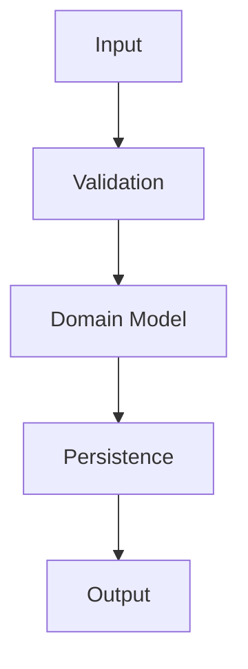
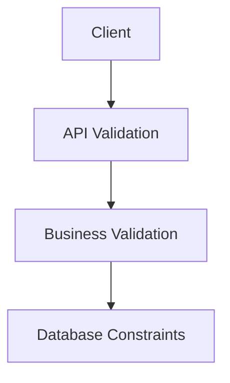

# Data Models

## Table of Contents

1. Executive Summary
2. Modeling Philosophy
3. Model Categories
4. Domain Models
5. Persistence Models
6. API Models
7. AI Models
8. Request Models
9. Response Models
10. Event Models
11. Report Models
12. Validation Rules
13. Versioning
14. Serialization
15. Future Models
16. Conclusion

---

# 1. Executive Summary

## Purpose

This document defines every canonical data model used within PWNDORA SkillScan X.

These models represent the platform's business objects independently of any specific implementation.

---

# 2. Modeling Philosophy

Every model follows this lifecycle:



A single model should have a single responsibility.

---

# 3. Model Categories

| Category           | Purpose                    |
| ------------------ | -------------------------- |
| Domain Models      | Core business entities     |
| Persistence Models | Database representation    |
| API Models         | Request/response contracts |
| AI Models          | Structured AI payloads     |
| Event Models       | Internal system events     |
| Report Models      | Generated reports          |

---

# 4. Domain Models

## User

```
User
- id
- name
- email
- role
- status
```

## Role Definition

```
RoleDefinition
- id
- owner
- filename
- raw_text
- uploaded_at
```

## Skill DNA Profile

```
SkillDNAProfile
- id
- version
- title
- capabilities
- knowledge_areas
- responsibilities
- assessment_objectives
```

This is the canonical domain object.

## Capability Blueprint

```
CapabilityBlueprint
- id
- skill_dna_profile_id
- difficulty
- duration
- challenges
- rubric_version
```

## Capability Assessment

```
CapabilityAssessment
- id
- professional
- status
- started_at
- completed_at
```

## Practical Challenge

```
PracticalChallenge
- id
- type
- scenario
- questions
- sequence
```

## Response

```
Response
- id
- challenge_id
- transcript
- response_type
- submitted_at
```

## Capability Evaluation

```
CapabilityEvaluation
- id
- score
- confidence
- capabilities
- evidence
- mitre_mapping
```

## Career Compass

```
CareerCompass
- id
- weak_skills
- recommendations
- labs
- roadmap
```

## Report

```
Report
- id
- summary
- capability_scores
- recommendations
- generated_at
```

---

# 5. Persistence Models

Database models map directly to relational tables.

Examples:

```
UserEntity
RoleDefinitionEntity
SkillDNAProfileEntity
CapabilityAssessmentEntity
PracticalChallengeEntity
CapabilityEvaluationEntity
```

Persistence models may include database-specific metadata:

- UUIDs
- timestamps
- foreign keys
- version numbers

---

# 6. API Models

## Request DTOs

Examples:

```
RegisterRequest
LoginRequest
UploadRoleDefinitionRequest
StartAssessmentRequest
SubmitResponseRequest
```

## Response DTOs

Examples:

```
LoginResponse
SkillDNAProfileResponse
CapabilityAssessmentResponse
CapabilityEvaluationResponse
ReportResponse
```

DTOs expose only public data and never leak persistence details.

---

# 7. AI Models

Every AI interaction uses structured schemas.

## Role Extraction

```json
{
  "role": "",
  "skills": [],
  "responsibilities": [],
  "capabilities": [],
  "difficulty": ""
}
```

## Challenge Generation

```json
{
  "title": "",
  "scenario": "",
  "questions": [],
  "expected_reasoning": [],
  "rubric": {}
}
```

## Evaluation

```json
{
  "concepts": [],
  "workflow_score": 0,
  "decision_score": 0,
  "communication_score": 0,
  "confidence": 0,
  "evidence": []
}
```

## Learning Recommendation

```json
{
  "weak_skills": [],
  "recommended_topics": [],
  "labs": [],
  "roadmap": []
}
```

All AI outputs must validate against schemas before entering business logic.

---

# 8. Request Models

Examples:

```
CreateCapabilityAssessmentRequest
GenerateSkillDNAProfileRequest
GenerateReportRequest
GenerateCareerCompassRequest
```

Validation includes:

- required fields
- type checking
- enum validation
- length limits

---

# 9. Response Models

Responses follow a consistent structure.

Example:

```json
{
  "success": true,
  "data": {},
  "metadata": {
    "request_id": "uuid",
    "timestamp": "ISO-8601"
  }
}
```

Errors follow the standard error schema defined in the API specification.

---

# 10. Event Models

Internal events:

```
AssessmentStarted
ChallengeCompleted
EvaluationGenerated
CareerCompassGenerated
ReportGenerated
```

Each event contains:

- event_id
- event_type
- aggregate_id
- occurred_at
- payload

These are internal domain events and need not be externally exposed.

---

# 11. Report Models

## Professional Report

Contains:

- Summary
- Capability scores
- Challenge timeline
- Evidence
- Career Compass

## Capability Analyst Report

Contains:

- Professional overview
- Capability matrix
- Capability assessment focus areas
- Assessment summary

## Analytics Report (Future)

Contains:

- Cohort metrics
- Skill trends
- Benchmark comparisons

---

# 12. Validation Rules

Validation hierarchy:



Examples:

- Email format validation
- UUID validation
- Enum validation
- Maximum transcript length
- Required capability lists

Never rely solely on frontend validation.

---

# 13. Versioning

Version the following models:

- SkillDNAProfile
- CapabilityBlueprint
- Rubric
- ReportSchema
- AIOutputSchema

Older assessments always reference the model versions used when they were generated.

---

# 14. Serialization

Preferred formats:

| Purpose  | Format             |
| -------- | ------------------ |
| API      | JSON               |
| Database | Relational + JSONB |
| AI       | Structured JSON    |
| Reports  | JSON + PDF         |

Rules:

- Use ISO-8601 timestamps.
- Use UUIDs for identifiers.
- Avoid nullable fields unless semantically required.

---

# 15. Future Models

Future additions:

```
Organization
Team
AssessmentTemplate
CertificationTrack
QuestionBank
AnalyticsSnapshot
ModelExecution
AuditEvent
```

These should extend the domain without changing existing contracts.

## Related Documents

- [Database Design](21-database-design.md)
- [Entity Relationship Diagram](22-entity-relationship-diagram.md)
- [API Specification](23-api-specification.md)
- [AI Cognitive Architecture](../docs/04-architecture/17-ai-cognitive-architecture.md)

---

# 16. Conclusion

PWNDORA SkillScan X's data model architecture separates domain concepts from persistence, API transport, and AI interaction. This separation ensures consistency across the frontend, backend, database, and AI pipeline while allowing each layer to evolve independently.
