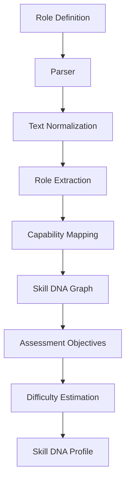
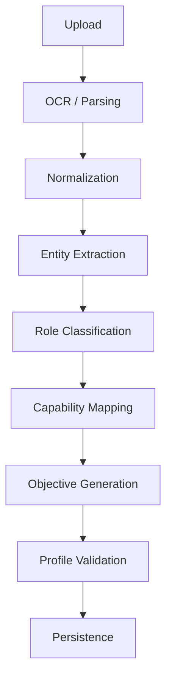

# Skill DNA Engine

## Table of Contents

1. Executive Summary
2. Purpose
3. Design Philosophy
4. Engine Overview
5. Inputs
6. Processing Pipeline
7. Skill DNA Graph Construction
8. Capability Mapping
9. Skill Taxonomy
10. Assessment Objective Generation
11. Difficulty Estimation
12. Output Model
13. Validation
14. Error Handling
15. Versioning
16. AI Mentor Principle
17. Future Evolution
18. Conclusion

---

# 1. Executive Summary

## Engine Name

**Skill DNA Engine (SDE)**

## Purpose

Transform an unstructured cybersecurity role definition into a structured, versioned **Skill DNA Profile** that becomes the canonical representation of the target role.

Every downstream module depends on this output.

---

# 2. Design Philosophy

The engine follows one principle:

> **Role Definitions are unstructured documents. Skill DNA Profiles are structured domain models.**

The engine exists to bridge that gap.

---

# 3. Engine Overview



---

# 4. Inputs

Supported formats:

- PDF
- DOCX
- TXT

Input fields:

- Job title
- Responsibilities
- Required skills
- Preferred skills
- Certifications
- Experience
- Technologies
- Domain

---

# 5. Processing Pipeline



---

# 6. Skill DNA Graph Construction

Extract relationships between:

```
Role
    ↓
Skill
    ↓
Knowledge Area
    ↓
Responsibility
    ↓
Capability
    ↓
Learning Objective
```

Example:

```
SOC Analyst
    ↓
Log Analysis
    ↓
SIEM
    ↓
Threat Detection
    ↓
Incident Investigation
```

---

# 7. Capability Mapping

Capabilities are normalized using a controlled catalog.

Example categories:

| Category          | Examples                                |
| ----------------- | --------------------------------------- |
| Network Security  | Packet analysis, IDS, Firewalls         |
| Incident Response | Triage, Containment, Recovery           |
| Threat Hunting    | IOC analysis, Hypothesis-driven hunting |
| Cloud Security    | IAM, CSPM, Logging                      |
| Malware           | Static and dynamic analysis             |
| Identity          | Authentication, Authorization, MFA      |

Future mappings may include the NICE Workforce Framework.

---

# 8. Skill Taxonomy

Hierarchy:

```
Domain
    ↓
Capability
    ↓
Skill
    ↓
Knowledge Area
    ↓
Learning Objective
```

Example:

```
Cloud Security
    ↓
IAM
    ↓
Privilege Management
    ↓
Least Privilege
    ↓
Implement secure access controls
```

---

# 9. Assessment Objective Generation

Generate measurable objectives such as:

- Investigate security incidents
- Prioritize response actions
- Analyze logs
- Identify attack techniques
- Explain mitigation strategies
- Communicate findings

Objectives should be observable and assessable.

---

# 10. Difficulty Estimation

Inputs:

- Years of experience
- Breadth of skills
- Seniority indicators
- Responsibilities

Output levels:

| Level        | Description               |
| ------------ | ------------------------- |
| Beginner     | Entry-level / internship  |
| Intermediate | SOC L1/L2                 |
| Advanced     | Senior analyst / engineer |
| Expert       | Architect / Lead          |

Difficulty influences challenge complexity and rubric selection.

---

# 11. Output Model

The Skill DNA Profile contains:

```
Role Title
Version
Capabilities
Skills
Knowledge Areas
Responsibilities
Assessment Objectives
Difficulty
Estimated Duration
Recommended Rubric
```

Stored as an immutable, versioned domain object.

---

# 12. Validation

Validation stages:

```
Schema Validation
    ↓
Business Rules
    ↓
Capability Coverage
    ↓
Consistency Checks
    ↓
Version Assignment
```

Checks include:

- Required capabilities exist.
- Objectives align with extracted skills.
- Difficulty is internally consistent.
- Duplicate capabilities are merged.

---

# 13. Error Handling

### Invalid Document

```
Upload
    ↓
Parse Failure
    ↓
User Feedback
    ↓
Retry
```

### Low Confidence Extraction

```
Extraction
    ↓
Confidence Check
    ↓
Manual Review Flag
    ↓
Continue
```

### Missing Information

```
Infer Safely
    ↓
Flag Assumptions
    ↓
Generate Profile
```

Assumptions should be explicitly marked rather than hidden.

---

# 14. Versioning

Version:

- Skill DNA Profile
- Capability mappings
- Assessment objectives

Rules:

- Never overwrite an existing profile.
- Every regeneration creates a new version.
- Downstream assessments reference the exact profile version used.

---

# 15. AI Mentor Principle

The Skill DNA Engine operates under the **AI Mentor** principle:

> **AI MUST NEVER answer assessments — only mentor and explain.**

The engine extracts role capability signals from role definitions but never generates assessment answers or completes challenges on behalf of professionals. Its purpose is to structure capability requirements, not to perform the assessment itself.

---

# 16. Future Evolution

Potential enhancements:

- NICE Workforce Framework mapping
- Organization-specific capability libraries
- Industry-specific role templates
- Multi-language parsing
- RAG over internal capability repositories
- Automatic rubric generation
- Historical role comparison

## Related Documents

- [Capability Assessment Engine](27-capability-assessment-engine.md)
- [Capability Reasoning Engine](29-capability-reasoning-engine.md)
- [Evidence Intelligence Engine](30-evidence-intelligence-engine.md)
- [Skill DNA Profile Concept](../docs/concepts/cyber-twin.md)
- [System Architecture](../docs/04-architecture/16-system-architecture.md)

---

# 17. Conclusion

The Skill DNA Engine transforms inconsistent, free-form role definitions into structured, reusable, and versioned skill profiles. By making the **Skill DNA Profile** the canonical domain object, PWNDORA SkillScan X creates a stable foundation for assessment generation, reasoning, reporting, and learning.
