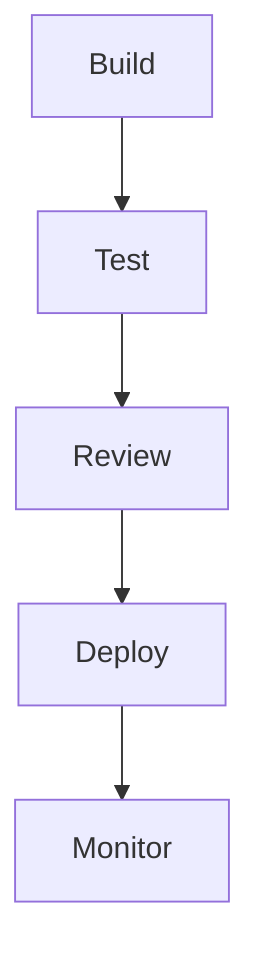
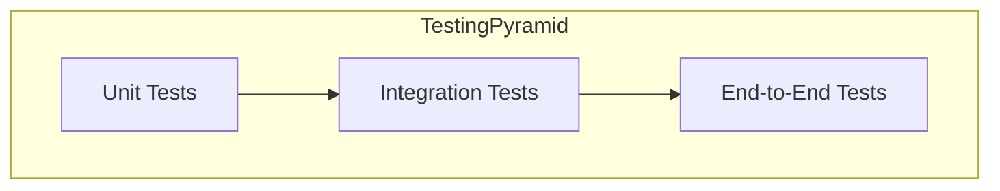
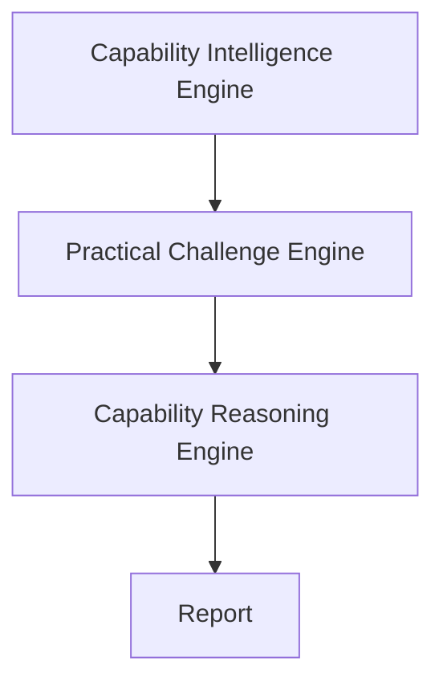
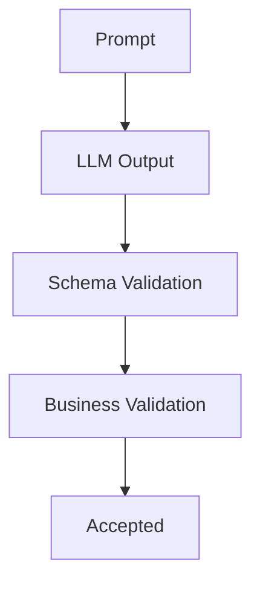
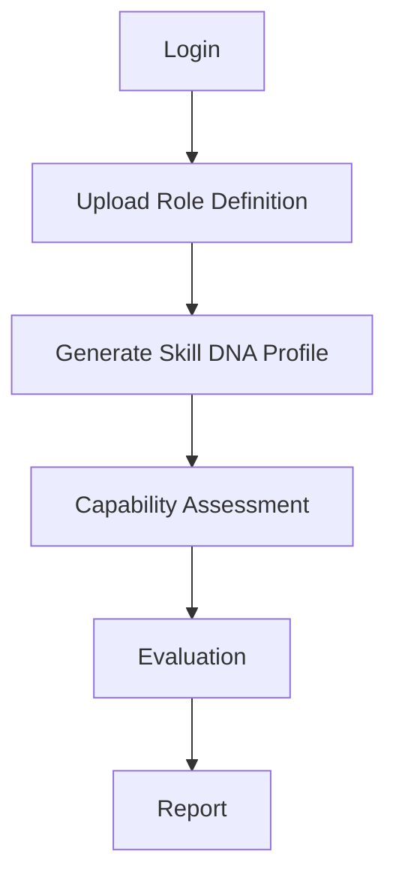
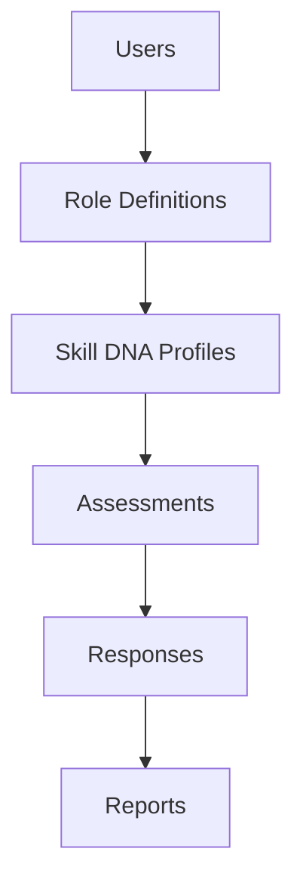
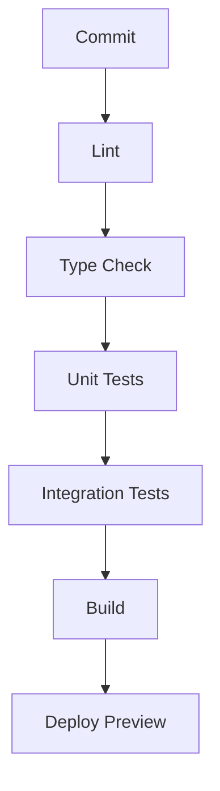

# Testing Strategy

## Table of Contents

1. Executive Summary
2. Testing Philosophy
3. Quality Objectives
4. Testing Pyramid
5. Unit Testing
6. Integration Testing
7. API Testing
8. AI Testing
9. Frontend Testing
10. End-to-End Testing
11. Performance Testing
12. Security Testing
13. Test Data Management
14. CI/CD Testing
15. Coverage Goals
16. Future Testing
17. Conclusion

---

# 1. Executive Summary

## Purpose

This document defines the testing strategy for PWNDORA SkillScan X.

Objectives:

- Prevent regressions
- Verify business logic
- Validate AI outputs
- Ensure API correctness
- Improve deployment confidence

---

# 2. Testing Philosophy

Every feature must satisfy:



Testing is continuous, not a final phase.

---

# 3. Quality Objectives

The platform should provide:

- Correct functionality
- Stable APIs
- Deterministic business logic
- Reliable AI integration
- Secure authentication
- Explainable outputs
- High availability

---

# 4. Testing Pyramid



Approximate distribution:

- Unit: 70%
- Integration: 20%
- End-to-End: 10%

---

# 5. Unit Testing

Test:

- Domain services
- Utility functions
- Validation
- Scoring logic
- State transitions

Example modules:

```
capability/
reasoning/
learning/
reports/
auth/
```

Target:

> Every business rule has at least one unit test.

---

# 6. Integration Testing

Validate interactions between modules.

Examples:



Scenarios:

- Complete capability assessment flow
- Database persistence
- AI orchestration
- Session recovery

---

# 7. API Testing

Verify:

- Request validation
- Authentication
- Authorization
- Response schemas
- Error handling
- Status codes

Example:

```
POST /api/v1/assessments
```

Should verify:

- 201 Created
- Invalid input → 422
- Unauthorized → 401
- Forbidden → 403

---

# 8. AI Testing

AI testing focuses on **contracts**, not wording.

Validate:

- JSON schema compliance
- Required fields
- Confidence ranges
- Rubric alignment
- Deterministic post-processing

Example:



Do **not** test for exact natural-language responses.

---

# 9. Frontend Testing

Test:

- Component rendering
- Forms
- Navigation
- Error boundaries
- Loading states
- Accessibility basics

Recommended tools:

- Vitest
- React Testing Library

---

# 10. End-to-End Testing

Critical user journeys:



Every MVP demo flow should have an E2E test.

Recommended tool:

- Playwright

---

# 11. Performance Testing

Targets:

| Metric              | Target                  |
| ------------------- | ----------------------- |
| API latency         | < 500 ms (excluding AI) |
| Assessment creation | < 3 s                   |
| Report generation   | < 5 s                   |
| Page load           | < 3 s                   |

Stress-test:

- Concurrent capability assessments
- Large Role Definition uploads
- Multiple report generations

---

# 12. Security Testing

Verify:

- JWT validation
- Role permissions
- Rate limiting
- SQL injection resistance
- XSS protection
- Prompt injection handling
- File upload validation

Every release should include a basic security regression pass.

---

# 13. Test Data Management

Create reusable fixtures for:



Use deterministic sample data where possible.

Never use production data in automated tests.

---

# 14. CI/CD Testing

Pipeline:



Pull requests should fail if mandatory tests fail.

---

# 15. Coverage Goals

| Layer               | Target            |
| ------------------- | ----------------- |
| Domain services     | ≥ 90%             |
| API layer           | ≥ 85%             |
| Utility functions   | ≥ 95%             |
| Frontend components | ≥ 80%             |
| Critical workflows  | 100% E2E coverage |

Coverage is a guide, not a substitute for good tests.

---

# 16. Future Testing

Future additions:

- Chaos testing
- Load testing at scale
- Mutation testing
- Accessibility audits
- AI regression benchmark suite
- Synthetic production monitoring

## Related Documents

- [DevOps Architecture](32-devops-architecture.md)
- [Deployment Guide](33-deployment-guide.md)
- [API Specification](../docs/05-data-api/23-api-specification.md)
- [System Architecture](../docs/04-architecture/16-system-architecture.md)

---

# 17. Conclusion

PWNDORA SkillScan X's testing strategy prioritizes business correctness, API stability, and AI reliability over raw coverage numbers. By validating contracts, workflows, and deterministic logic, the platform minimizes regressions while remaining practical for a small engineering team.
