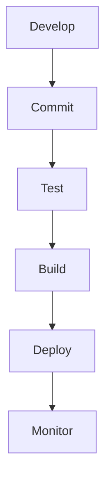
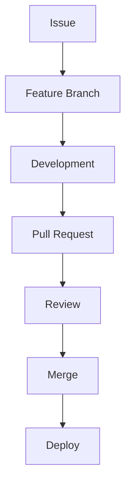
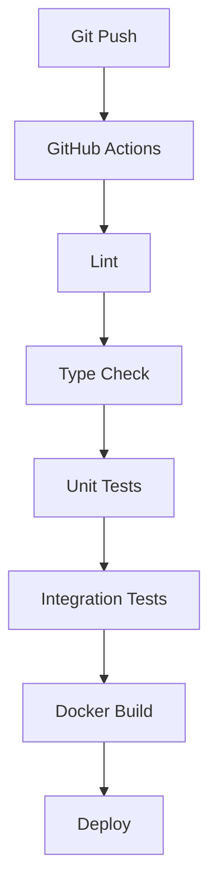
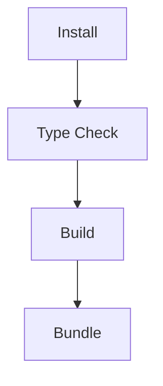
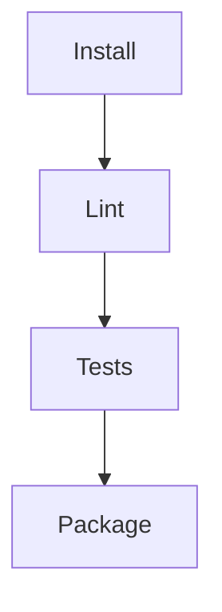
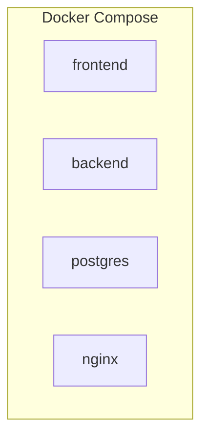
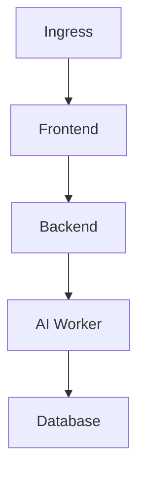
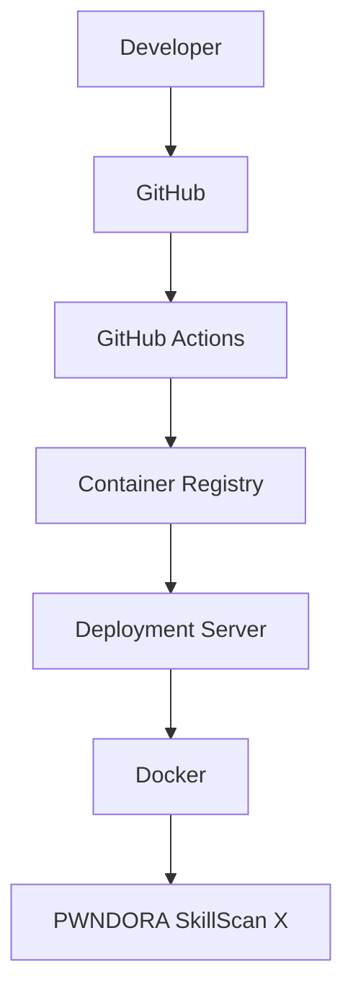
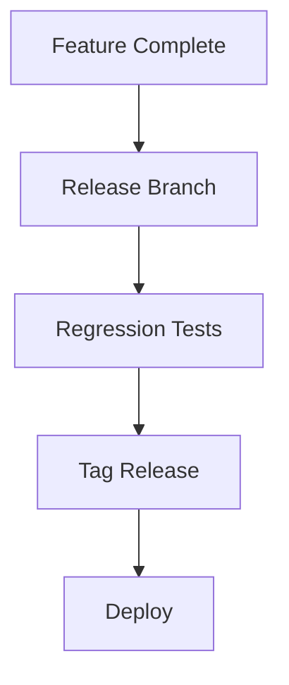
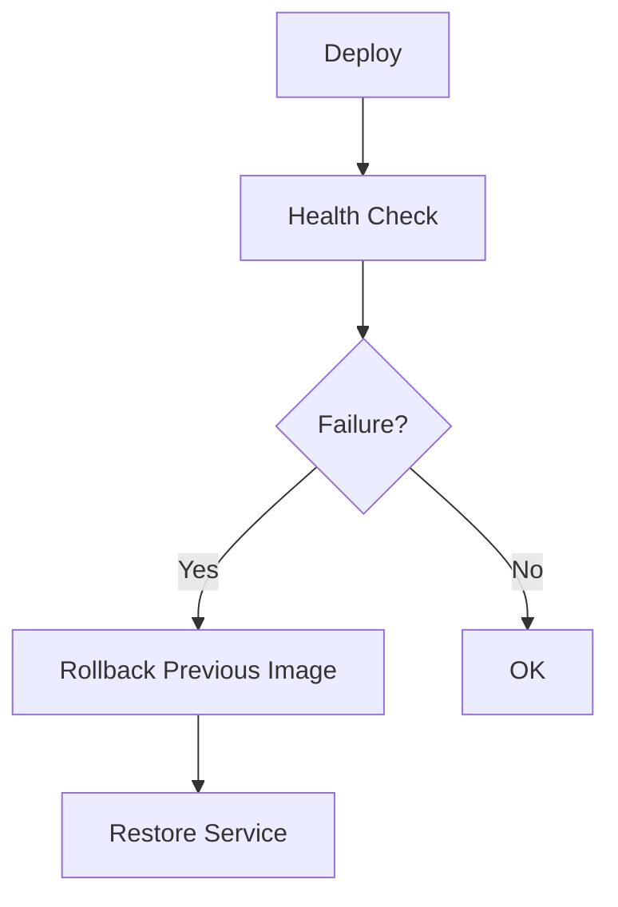

# DevOps Architecture

## Table of Contents

1. Executive Summary
2. DevOps Philosophy
3. Development Workflow
4. Branching Strategy
5. CI/CD Pipeline
6. Build Process
7. Container Architecture
8. Environment Management
9. Secrets Management
10. Infrastructure Layout
11. Release Strategy
12. Rollback Strategy
13. Quality Gates
14. Toolchain
15. Future Evolution
16. Conclusion

---

# 1. Executive Summary

## Purpose

This document defines the DevOps architecture for PWNDORA SkillScan X.

It covers:

- Source control
- CI/CD
- Docker
- Environment configuration
- Secrets
- Deployment workflow
- Release management

---

# 2. DevOps Philosophy

Every change follows:



Automation replaces manual deployment wherever possible.

---

# 3. Development Workflow



No direct commits to `main`.

---

# 4. Branching Strategy

Recommended Git branches:

```
main
develop
feature/*
fix/*
release/*
```

Rules:

| Branch    | Purpose               |
| --------- | --------------------- |
| main      | Production-ready code |
| develop   | Integration branch    |
| feature/* | New features          |
| fix/*     | Bug fixes             |
| release/* | Release stabilization |

---

# 5. CI/CD Pipeline



Every stage must succeed before deployment.

---

# 6. Build Process

Frontend:



Backend:



Artifacts:

- Frontend bundle
- Backend container
- Migration scripts

---

# 7. Container Architecture



Future:



One service per container.

---

# 8. Environment Management

Environments:

| Environment | Purpose                |
| ----------- | ---------------------- |
| local       | Developer workstation  |
| dev         | Shared integration     |
| staging     | Pre-release validation |
| production  | Live deployment        |

Configuration is environment-specific, never code-specific.

---

# 9. Secrets Management

Store securely:

- Database URL
- JWT secret
- API keys
- LLM credentials
- SMTP credentials (future)

Rules:

- Never commit secrets.
- Use environment variables.
- Rotate credentials regularly.
- Different secrets per environment.

---

# 10. Infrastructure Layout



For the MVP, a single deployment host is sufficient.

---

# 11. Release Strategy

Release flow:



Versioning:

```
v1.0.0
v1.1.0
v2.0.0
```

Follow Semantic Versioning.

---

# 12. Rollback Strategy



Keep the previous deployment artifact available until the new release is verified.

---

# 13. Quality Gates

Deployment is blocked if:

- Lint fails
- Tests fail
- Build fails
- Security scan fails
- Docker image fails to build
- Required approvals are missing

---

# 14. Toolchain

| Area            | Tool                                 |
| --------------- | ------------------------------------ |
| Version Control | Git                                  |
| Repository      | GitHub                               |
| CI/CD           | GitHub Actions                       |
| Containers      | Docker                               |
| Reverse Proxy   | Nginx                                |
| Database        | PostgreSQL                           |
| Backend         | FastAPI                              |
| Frontend        | React + Vite                         |
| Package Manager | pnpm (frontend), uv or pip (backend) |

---

# 15. Future Evolution

Potential additions:

- Kubernetes
- Argo CD
- Terraform
- Vault
- Redis
- Object storage
- Multi-region deployment
- Blue/Green deployments
- Canary releases

Only introduce these when they solve a real operational problem.

## Related Documents

- [Testing Strategy](31-testing-strategy.md)
- [Deployment Guide](33-deployment-guide.md)
- [Monitoring & Observability](34-monitoring-observability.md)
- [CI/CD Pipeline](../docs/07-engineering/34-ci-cd-pipeline.md)

---

# 16. Conclusion

The DevOps architecture emphasizes automation, reproducibility, and reliability while remaining appropriately simple for the PWNDORA SkillScan X Team. A modular deployment pipeline with automated testing and containerized services provides a strong foundation for both the hackathon MVP and future production growth.
