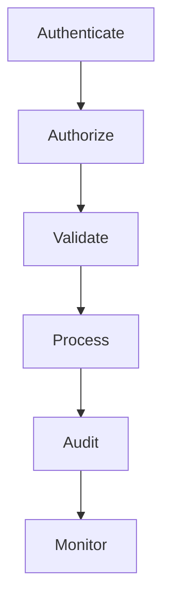
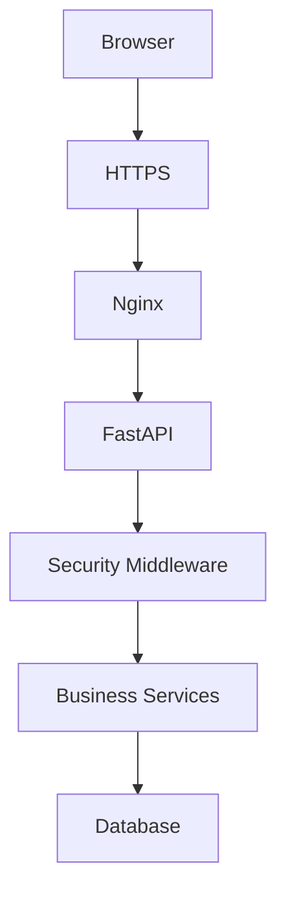
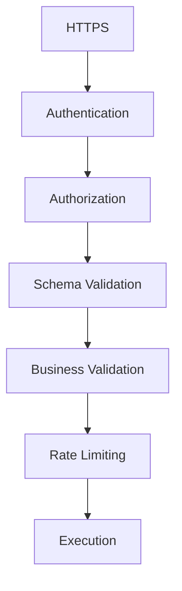
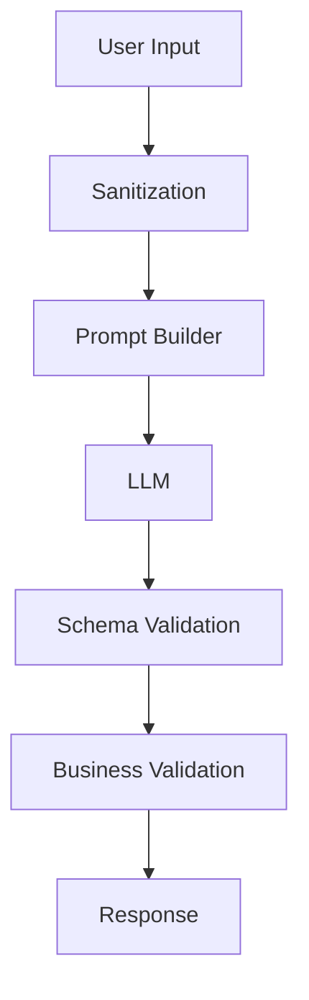
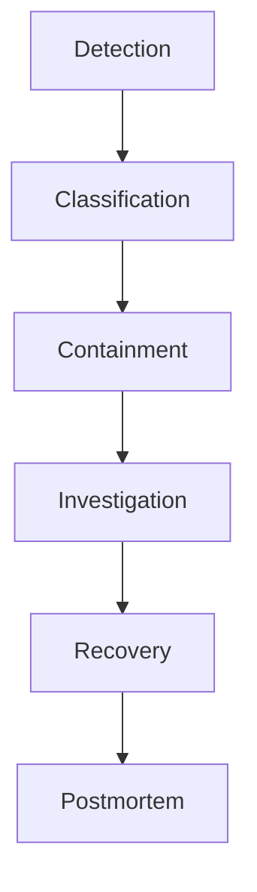
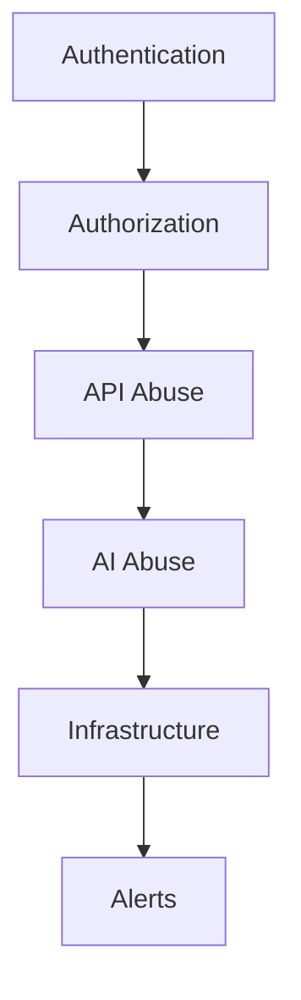

# Security Architecture Deep Dive

## Table of Contents

1. Executive Summary
2. Security Philosophy
3. Security Architecture Overview
4. Threat Model
5. Identity Security
6. API Security
7. AI Security
8. Data Security
9. Infrastructure Security
10. Application Security
11. Audit & Compliance
12. Incident Response
13. Security Monitoring
14. Future Enhancements
15. Conclusion

---

# 1. Executive Summary

## Purpose

This document defines the complete security architecture of PWNDORA SkillScan X.

It covers:

- Identity
- Authorization
- Secure APIs
- AI safety
- Data protection
- Infrastructure security
- Operational security
- Monitoring

Security is treated as a cross-cutting concern affecting every component.

---

# 2. Security Philosophy

Every request follows:



Trust is never assumed.

---

# 3. Security Architecture Overview



Cross-cutting controls:

- Authentication
- Authorization
- Validation
- Logging
- Rate Limiting
- Audit

---

# 4. Threat Model

Primary threats:

| Threat                  | Risk     | Mitigation                                    |
| ----------------------- | -------- | --------------------------------------------- |
| Credential theft        | High     | Strong authentication, Argon2, token rotation |
| SQL Injection           | High     | ORM, parameterized queries                    |
| XSS                     | Medium   | Output encoding, CSP                          |
| CSRF                    | Medium   | SameSite cookies or bearer-token strategy     |
| Prompt Injection        | High     | Prompt isolation and validation               |
| File Upload Abuse       | High     | Validation and scanning                       |
| Broken Access Control   | Critical | Central RBAC middleware                       |
| Sensitive Data Exposure | Critical | Encryption and access control                 |
| Denial of Service       | Medium   | Rate limiting and request limits              |

---

# 5. Identity Security

Authentication:

- JWT access tokens
- Refresh tokens
- Secure password hashing
- Session expiration

Authorization:

- RBAC
- Least privilege
- Ownership validation
- Route guards

Future:

- MFA
- WebAuthn
- Enterprise SSO

---

# 6. API Security

Every API request passes through:



Controls:

- OpenAPI validation
- Pydantic models
- Content-Type validation
- Request size limits
- CORS policy

---

# 7. AI Security

AI introduces additional attack surfaces.

Pipeline:



Protections:

- Prompt isolation
- Structured output schemas
- Hallucination detection
- Confidence thresholds
- Prompt versioning
- Retry limits

AI MUST NEVER answer assessments — only mentor and explain. The AI never executes arbitrary instructions from user input.

---

# 8. Data Security

Sensitive data:

- User profiles
- Capability assessment responses
- Reports
- Audit logs

Controls:

- Encryption in transit (TLS)
- Encryption at rest where supported
- Database access controls
- Backup encryption
- Immutable assessment history

Data retention:

- Minimize stored personal data
- Remove unnecessary raw voice artifacts
- Version assessment reports

---

# 9. Infrastructure Security

Server hardening:

- Ubuntu LTS
- Automatic security updates
- SSH key authentication
- Firewall
- Fail2ban (optional)
- Non-root containers

Docker:

- Minimal base images
- Read-only filesystems where practical
- Image scanning
- Pinned image versions

---

# 10. Application Security

Security controls:

- Input validation
- Output encoding
- Exception handling
- Secure headers
- Dependency scanning
- File upload validation
- UUID-based identifiers
- Audit trails

Recommended headers:

- Content-Security-Policy
- X-Content-Type-Options
- Referrer-Policy
- Permissions-Policy
- Strict-Transport-Security

---

# 11. Audit & Compliance

Log:

- Authentication events
- Authorization failures
- Capability assessment lifecycle
- Administrative actions
- AI failures
- Security events

Audit entries contain:

```
- Timestamp
- User
- Action
- Resource
- Outcome
- Request ID
- IP Address
```

Logs should be immutable after creation.

---

# 12. Incident Response

Security incident flow:



Critical incidents:

- Credential compromise
- Database breach
- Unauthorized access
- AI abuse
- Infrastructure compromise

---

# 13. Security Monitoring

Monitor:

- Failed logins
- Token validation failures
- Rate limit violations
- File upload failures
- Prompt injection attempts
- Privilege escalation attempts
- API abuse
- Unusual traffic spikes

Security dashboard:



---

# 14. Future Enhancements

Future security capabilities:

- MFA
- Hardware security keys
- Secrets manager
- SIEM integration
- Vulnerability management
- Automated penetration testing
- Runtime threat detection
- Zero Trust networking

Adopt these as organizational needs evolve.

## Related Documents

- [Authentication & Authorization](../docs/05-data-api/24-authentication-authorization.md)
- [Deployment Guide](33-deployment-guide.md)
- [Monitoring & Observability](34-monitoring-observability.md)
- [Privacy & Security Model Concept](../docs/concepts/privacy-security-model.md)
- [Risk Analysis](../docs/08-delivery/38-risk-analysis.md)

---

# 15. Conclusion

The PWNDORA SkillScan X security architecture applies defense in depth across identity, application, AI, infrastructure, and operations. Rather than relying on a single security mechanism, multiple independent controls reduce the likelihood and impact of failures while preserving usability for legitimate users.
