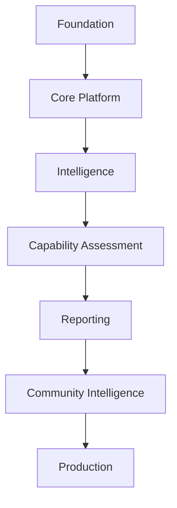

# Implementation Roadmap

## Table of Contents

1. Executive Summary
2. Roadmap Philosophy
3. Development Strategy
4. Phase 0 – Foundation
5. Phase 1 – Core Platform
6. Phase 2 – Intelligence Layer
7. Phase 3 – Capability Assessment System
8. Phase 4 – Reporting & Learning
9. Phase 5 – Community Intelligence
10. Phase 6 – Production Readiness
11. Team Responsibilities
12. Milestones
13. Deliverables
14. Risks
15. Success Criteria
16. Conclusion

---

# 1. Executive Summary

## Purpose

This roadmap defines the implementation strategy for PWNDORA SkillScan X from initial repository setup through a production-ready MVP.

The objective is to maximize delivery while minimizing technical debt and integration risk.

---

# 2. Roadmap Philosophy

Development follows:



Each phase builds on the previous one.

---

# 3. Development Strategy

Engineering priorities:

1. Working architecture
2. Stable APIs
3. Database
4. Business logic
5. AI integration
6. Frontend polish

Never build UI before the API contract exists.

---

# 4. Phase 0 – Foundation

Duration: **Week 1**

Objectives:

- Repository initialization
- Project structure
- CI pipeline
- Docker setup
- PostgreSQL
- FastAPI skeleton
- React application
- Authentication skeleton

Deliverables:

```
- Repository
- Docker
- CI
- Database
- Authentication
- Health Endpoint
```

Success criteria:

- Application boots successfully.
- CI passes.
- Containers run locally.

---

# 5. Phase 1 – Core Platform

Duration: **Week 2**

Modules:

- User Management
- Role Definition Upload
- Skill DNA Profile Storage
- API foundation
- Database migrations

Deliverables:

- Upload Role Definition
- Persist Role Definition
- Generate placeholder Skill DNA Profile
- CRUD APIs

---

# 6. Phase 2 – Intelligence Layer

Duration: **Week 3**

Implement:

- Skill DNA Engine
- Capability extraction
- Skill taxonomy
- Capability Blueprint generation
- AI orchestration

Deliverables:

```
- Skill DNA Engine
- Assessment Planner
- Practical Challenge Planner
- Prompt Library
```

---

# 7. Phase 3 – Capability Assessment System

Duration: **Week 4**

Modules:

- Capability Intelligence Engine
- Practical Challenge Generation
- Session Management
- Adaptive capability assessment flow
- Capability Reasoning Engine

Deliverables:

- Complete capability assessment lifecycle
- Practical challenge execution
- Evaluation pipeline

---

# 8. Phase 4 – Reporting & Learning

Duration: **Week 5**

Implement:

- Evidence Intelligence Engine
- Report generation
- Learning recommendations
- PDF export
- Dashboard
- Career Compass generation

Deliverables:

```
- Professional Report
- Capability Analyst Report
- Career Compass
- Capability Heatmap
```

---

# 9. Phase 5 – Community Intelligence

Duration: **Week 6**

Implement:

- Anonymous benchmarking engine
- Peer group analysis
- Capability Heatmap aggregation
- Skill DNA Graph insights
- Industry trend analytics
- AI Mentor integration

Deliverables:

```
- Community Benchmarking
- Peer Group Comparisons
- Capability Heatmap
- Skill DNA Graph
- AI Mentor Interface
```

---

# 10. Phase 6 – Production Readiness

Duration: **Week 7**

Tasks:

- Performance optimization
- Security review
- Monitoring
- Deployment
- Documentation
- Final testing

Deliverables:

- Production deployment
- Monitoring dashboards
- Release documentation
- Final demo

---

# 11. Team Responsibilities

## Member 1 – Full Stack & Security

Responsibilities:

- React frontend
- FastAPI backend
- Authentication
- API integration
- Security middleware

## Member 2 – DevOps & Platform

Responsibilities:

- Docker
- PostgreSQL
- CI/CD
- Deployment
- Monitoring
- Logging

## Member 3 – Cybersecurity & AI

Responsibilities:

- Skill DNA Engine
- Practical Challenge Engine
- Capability Reasoning
- Evidence Intelligence
- Rubrics

## Member 4 – Integration & QA

Responsibilities:

- Testing
- API validation
- Documentation
- UI integration
- Performance validation

---

# 12. Milestones

| Milestone | Outcome                          |
| --------- | -------------------------------- |
| M1        | Foundation Complete              |
| M2        | Platform Functional              |
| M3        | AI Pipeline Operational          |
| M4        | Capability Assessment Working    |
| M5        | Reporting Complete               |
| M6        | Community Intelligence Launched  |
| M7        | Production Ready                 |

---

# 13. Deliverables

Technical deliverables:

- Source code
- API documentation
- Database schema
- Docker deployment
- Test suite
- Reports
- Presentation
- Demo environment

Documentation deliverables:

- Architecture documents
- README
- API reference
- Deployment guide
- User guide

---

# 14. Risks

| Risk                 | Mitigation                        |
| -------------------- | --------------------------------- |
| AI latency           | Caching, retries, async execution |
| Scope creep          | Freeze MVP scope after Phase 2    |
| Integration failures | Weekly integration milestones     |
| Team conflicts       | Clear module ownership            |
| Time shortage        | Prioritize MVP features           |

---

# 15. Success Criteria

Technical:

- End-to-end capability assessment works
- Stable APIs
- Reliable report generation
- Successful deployment
- Automated tests passing

Product:

- Professional completes capability assessment
- Capability Analyst receives explainable report
- Career Compass generated
- Demo runs without manual intervention

## Related Documents

- [Project Structure](37-project-structure.md)
- [Risk Analysis](38-risk-analysis.md)
- [Future Roadmap](39-future-roadmap.md)
- [Development Guide](../docs/07-engineering/31-development-guide.md)

---

# 16. Conclusion

The roadmap emphasizes incremental delivery, stable integration points, and early validation of core platform capabilities. By completing foundational engineering before advanced AI features, the team reduces implementation risk and increases the likelihood of delivering a polished, working system.
