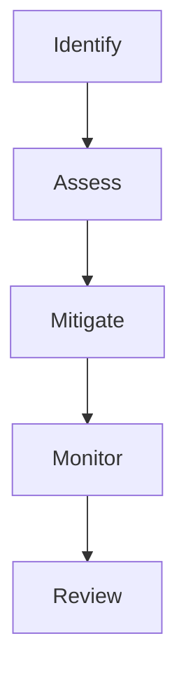
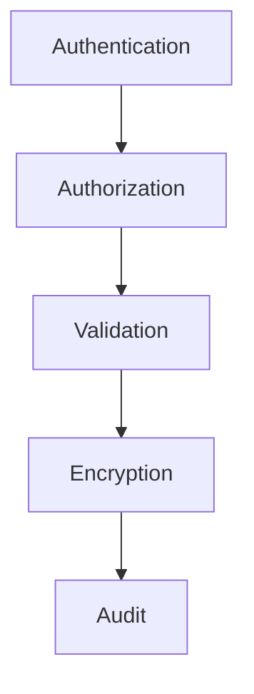
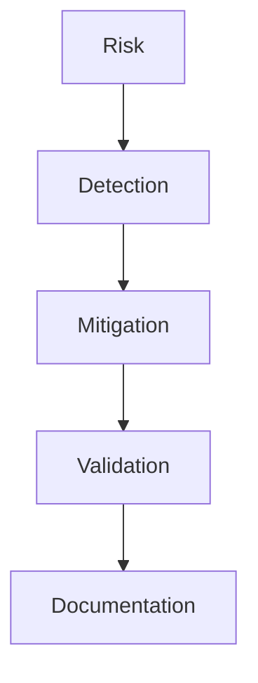
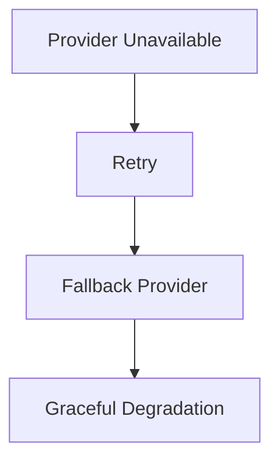
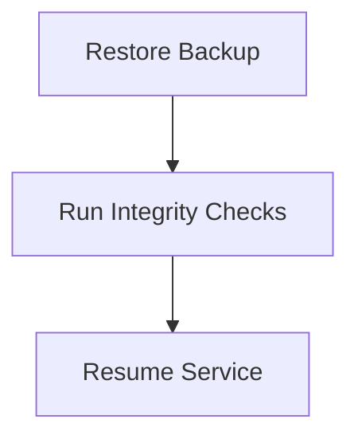
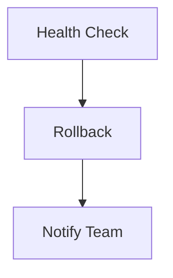
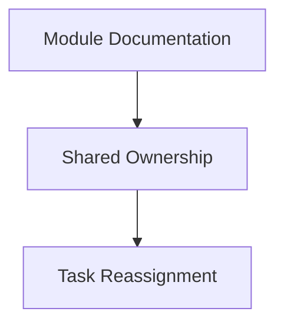

# Risk Analysis

## Table of Contents

1. Executive Summary
2. Risk Management Philosophy
3. Risk Assessment Framework
4. Technical Risks
5. AI Risks
6. Security Risks
7. Operational Risks
8. Team Risks
9. Infrastructure Risks
10. Legal & Compliance Risks
11. Risk Matrix
12. Mitigation Strategy
13. Contingency Plans
14. Continuous Risk Review
15. Conclusion

---

# 1. Executive Summary

## Purpose

This document identifies, evaluates, and mitigates the major risks associated with the development and operation of PWNDORA SkillScan X.

Objectives:

- Reduce implementation risk
- Improve project predictability
- Increase platform reliability
- Prepare contingency plans

---

# 2. Risk Management Philosophy

Every identified risk follows this lifecycle:



Risks should be tracked continuously, not only during planning.

---

# 3. Risk Assessment Framework

Each risk is evaluated using:

- Probability
- Impact
- Detectability
- Mitigation Cost

Priority formula:

```
Priority = Probability × Impact
```

Classification:

| Priority | Meaning              |
| -------- | -------------------- |
| Low      | Monitor              |
| Medium   | Plan mitigation      |
| High     | Immediate mitigation |
| Critical | Blocking risk        |

---

# 4. Technical Risks

| Risk                       | Impact | Mitigation                       |
| -------------------------- | ------ | -------------------------------- |
| AI response schema changes | High   | JSON schema validation           |
| Database migration failure | High   | Versioned migrations and backups |
| API contract drift         | High   | OpenAPI-first development        |
| Poor module boundaries     | Medium | Domain-driven architecture       |
| Performance bottlenecks    | Medium | Profiling and monitoring         |
| Dependency incompatibility | Medium | Version pinning and CI testing   |

---

# 5. AI Risks

Major AI risks:

| Risk                 | Mitigation                               |
| -------------------- | ---------------------------------------- |
| Hallucinations       | Structured outputs and validation        |
| Prompt injection     | Input sanitization and prompt isolation  |
| Inconsistent outputs | Temperature tuning and schema validation |
| High latency         | Async execution and retries              |
| Model outages        | Provider abstraction and fallback        |
| Cost escalation      | Token monitoring and prompt optimization |

Rules:

- AI never bypasses business rules.
- AI outputs are treated as untrusted until validated.
- AI MUST NEVER answer capability assessments — only mentor and explain.

---

# 6. Security Risks

Threats:

- Credential compromise
- JWT theft
- SQL injection
- XSS
- Prompt injection
- Unauthorized access
- Data leakage

Mitigations:



Security is enforced at multiple layers.

---

# 7. Operational Risks

Potential issues:

| Risk                 | Mitigation                      |
| -------------------- | ------------------------------- |
| Deployment failure   | Automated rollback              |
| Server outage        | Backups and documented recovery |
| Monitoring gaps      | Health checks and dashboards    |
| Configuration errors | Startup validation              |
| Log growth           | Rotation and retention policies |

---

# 8. Team Risks

Common risks:

| Risk                       | Mitigation                            |
| -------------------------- | ------------------------------------- |
| Knowledge silos            | Documentation and code reviews        |
| Merge conflicts            | Feature branches and module ownership |
| Scope creep                | Freeze MVP after core features        |
| Uneven workload            | Capability-based ownership            |
| Team member unavailability | Shared documentation and pair reviews |

No feature should depend entirely on one developer.

---

# 9. Infrastructure Risks

Examples:

| Risk                   | Mitigation                         |
| ---------------------- | ---------------------------------- |
| Disk exhaustion        | Monitoring and alerts              |
| Database failure       | Daily backups                      |
| Container crash        | Health checks and restart policies |
| Network interruption   | Retry strategies                   |
| TLS certificate expiry | Automated renewal                  |

---

# 10. Legal & Compliance Risks

Potential concerns:

- Personal data retention
- Uploaded Role Definition ownership
- Professional capability assessment privacy
- Report access control

Mitigations:

- Least-privilege access
- User consent where required
- Data deletion workflow
- Audit logging
- Clear retention policy

---

# 11. Risk Matrix

| Risk                | Probability | Impact   | Priority |
| ------------------- | ----------- | -------- | -------- |
| AI outage           | Medium      | High     | High     |
| Prompt injection    | Medium      | High     | High     |
| Database corruption | Low         | Critical | High     |
| Server outage       | Medium      | Medium   | Medium   |
| Team delay          | High        | Medium   | High     |
| API regression      | Medium      | High     | High     |
| Security breach     | Low         | Critical | Critical |

Review this matrix throughout development.

---

# 12. Mitigation Strategy

General process:



Each high-priority risk should have:

- Owner
- Mitigation plan
- Recovery plan
- Review schedule

---

# 13. Contingency Plans

### AI Provider Failure



### Database Failure



### Deployment Failure



### Team Availability



---

# 14. Continuous Risk Review

Review cadence:

| Frequency | Activity                   |
| --------- | -------------------------- |
| Daily     | Active blockers            |
| Weekly    | High-priority risks        |
| Milestone | Full risk review           |
| Release   | Final readiness assessment |

Track:

- New risks
- Closed risks
- Mitigation effectiveness
- Outstanding actions

---

## Related Documents

- [Implementation Roadmap](36-implementation-roadmap.md)
- [Project Structure](37-project-structure.md)
- [Future Roadmap](39-future-roadmap.md)
- [Security Architecture Deep Dive](../docs/07-engineering/35-security-architecture-deep-dive.md)

---

# 15. Conclusion

PWNDORA SkillScan X adopts proactive risk management by identifying technical, operational, security, AI, and organizational risks early in the development lifecycle. Continuous review and documented mitigation plans reduce uncertainty and improve delivery confidence.
