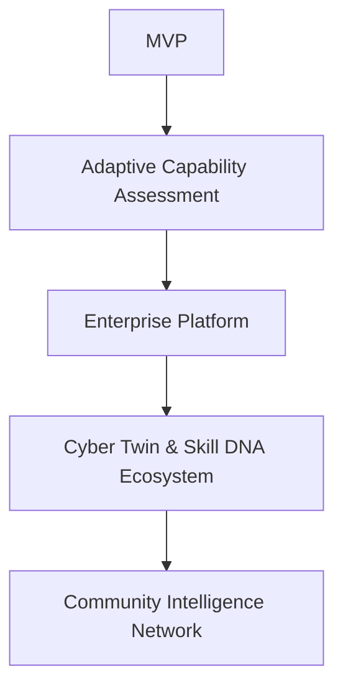
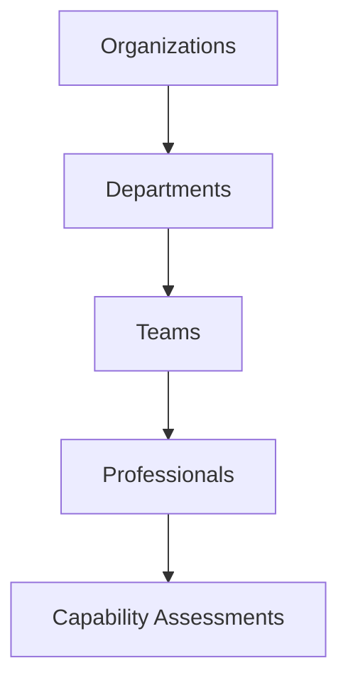
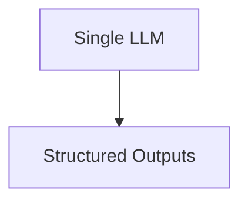
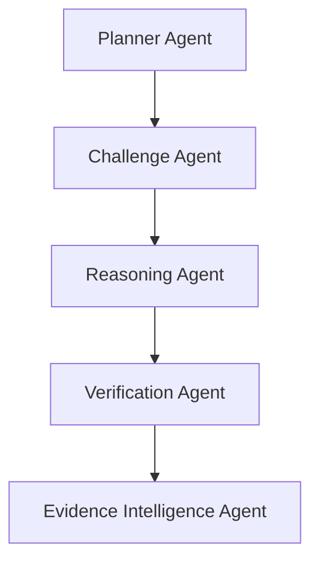
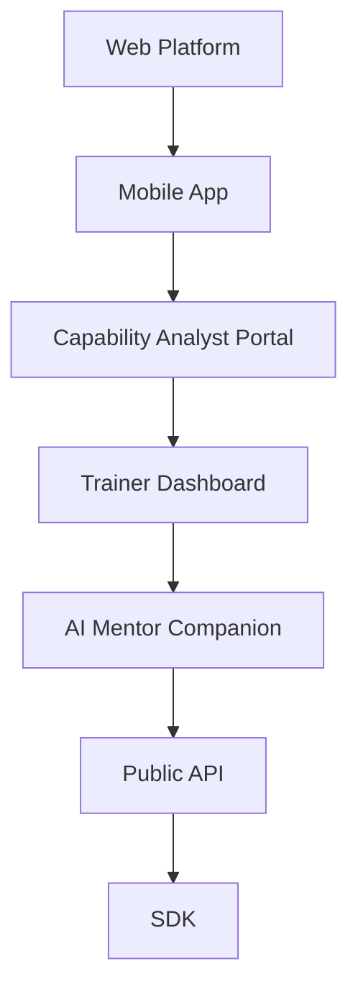

# Future Roadmap

## Table of Contents

1. Executive Summary
2. Vision
3. Product Evolution Strategy
4. Phase 1 – MVP
5. Phase 2 – Adaptive Capability Assessment
6. Phase 3 – Enterprise Platform
7. Phase 4 – Cyber Twin & Skill DNA Ecosystem
8. Phase 5 – Community Intelligence Network
9. Research Directions
10. AI Evolution
11. Platform Expansion
12. Business Opportunities
13. Technical Evolution
14. Success Metrics
15. Conclusion

---

# 1. Executive Summary

## Purpose

This document defines the long-term evolution of PWNDORA SkillScan X beyond the initial MVP.

It outlines:

- Product roadmap
- AI evolution
- Platform expansion
- Research opportunities
- Enterprise capabilities

---

# 2. Vision

## Long-Term Vision

Transform PWNDORA SkillScan X from an AI-powered capability intelligence platform into the definitive global cybersecurity capability verification ecosystem.

Core principles:

- **Capability over Certification**
- **Evidence over Resume**
- **Learning over Testing**
- **Explainability over Black-Box AI**

---

# 3. Product Evolution Strategy



Each stage extends the previous one instead of replacing it.

---

# 4. Phase 1 – MVP

Primary goals:

- Role Definition parsing
- Skill DNA Engine
- Capability Intelligence Engine
- Practical Challenge Generation
- Capability Reasoning
- Evidence Intelligence
- PDF reports

Deliverables:

```
Professional Capability Assessment
Capability Analyst Report
Career Compass
Deployment
```

Target users:

- Students
- Small companies
- Hackathon judges

---

# 5. Phase 2 – Adaptive Capability Assessment

Enhancements:

- Adaptive capability assessment
- Multi-turn conversations
- Better capability mapping
- Organization-specific rubrics
- Historical performance tracking
- Personalized challenge generation

New modules:

```
Benchmark Engine
Skill Gap Engine
Skill DNA Graph
Trend Analysis
AI Mentor
```

---

# 6. Phase 3 – Enterprise Platform

Enterprise capabilities:

- Multi-tenancy
- Organization management
- Team dashboards
- Capability Analyst workspaces
- Capability assessment templates
- Cohort analytics
- Enterprise SSO
- Compliance reporting

Enterprise architecture:



---

# 7. Phase 4 – Cyber Twin & Skill DNA Ecosystem

The Cyber Twin is a digital representation of verified cybersecurity capability — a living profile that grows with every capability assessment.

Capabilities:

- **Cyber Twin**: Portable, verified digital capability profile owned by the professional
- **Skill DNA**: Unique capability fingerprint generated from assessment evidence
- **Career Compass**: AI-driven career pathways derived from capability gaps
- **Capability Heatmap**: Visualization of verified strengths and gaps over time
- **AI Mentor**: Learning companion that explains without ever answering assessments

Potential integrations:

- Learning Management Systems
- Applicant Tracking Systems
- SIEM platforms
- Cyber ranges
- Certification providers
- Professional networking platforms

---

# 8. Phase 5 – Community Intelligence Network

Future vision:

- **Community Intelligence**: Anonymous benchmarking against peer groups
- Continuous skills monitoring
- AI career advisor
- Cyber certification pathways
- Live cyber range integration
- Workforce planning
- Threat-informed learning
- Capability forecasting
- Skill DNA Graph insights
- Industry trend analytics

The platform evolves from a capability assessment tool into a global intelligence network for cybersecurity capability.

---

# 9. Research Directions

Potential research areas:

- Explainable cybersecurity capability assessment
- Multi-agent evaluation
- Graph-based reasoning analysis
- Skill DNA Graph learning
- Behavioral cybersecurity assessment
- Adaptive educational systems
- AI fairness in technical capability assessments

Potential academic outputs:

- Conference papers
- Open datasets
- Benchmark suites
- Reproducible evaluation frameworks

---

# 10. AI Evolution

Current:



Future:



Every agent has a narrow, well-defined responsibility.

---

# 11. Platform Expansion

Future products:



The core capability intelligence engine remains shared.

---

# 12. Business Opportunities

Potential offerings:

| Offering             | Audience              |
| -------------------- | --------------------- |
| SaaS Platform        | Companies             |
| University Edition   | Colleges              |
| Enterprise Edition   | Large organizations   |
| API Platform         | HRTech vendors        |
| White-label Platform | Training providers    |
| Analytics Platform   | Enterprise leadership |

Potential revenue streams:

- Subscription
| Per-assessment pricing
- Enterprise licensing
- API usage
- Professional services

---

# 13. Technical Evolution

Possible architectural improvements:

- Event-driven architecture
- Worker queues
- Vector search
- Graph database for capability relationships
- Real-time collaboration
- Offline capability assessment support
- Federated AI providers

Adopt only when justified by measurable needs.

---

# 14. Success Metrics

Technical:

- Capability assessment completion rate
- Average latency
- Platform availability
- AI validation success rate

Product:

- User retention
- Capability Analyst satisfaction
- Professional satisfaction
- Capability assessment completion time
- Career Compass engagement

Business:

- Active organizations
- Capability assessments completed
- Monthly recurring revenue
- Enterprise adoption

---

## Related Documents

- [Implementation Roadmap](36-implementation-roadmap.md)
- [Risk Analysis](38-risk-analysis.md)
- [Final System Overview](40-final-system-overview.md)
- [Technical Evolution Concept](../docs/concepts/technical-evolution.md)

---

# 15. Conclusion

The future roadmap positions PWNDORA SkillScan X as a long-term cybersecurity capability intelligence ecosystem. Each phase builds upon the previous architecture, ensuring that future capabilities emerge from a stable, modular foundation rather than repeated rewrites.
