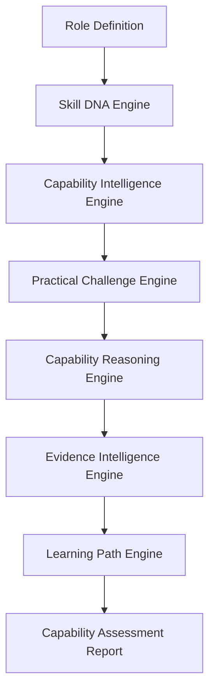
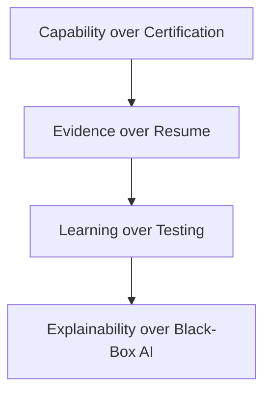
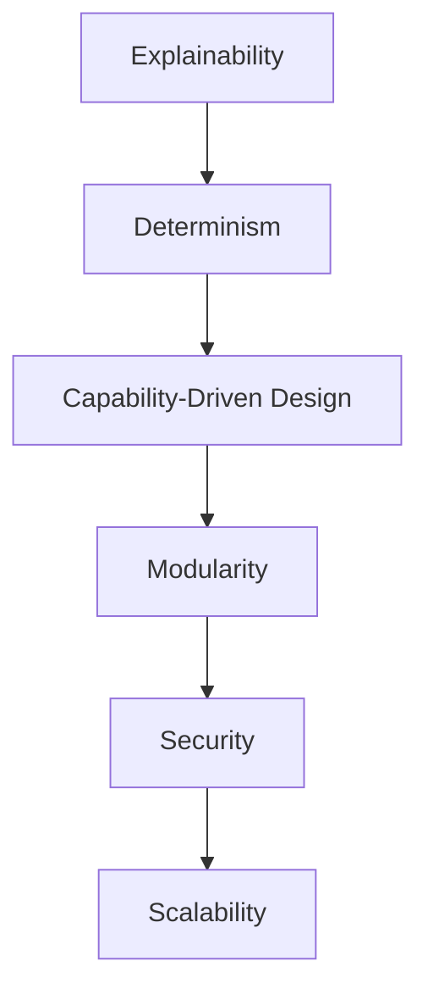
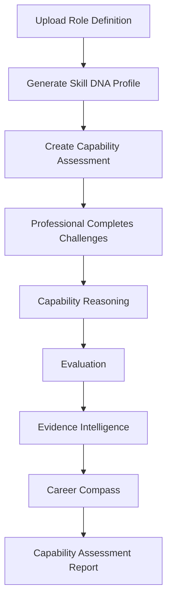
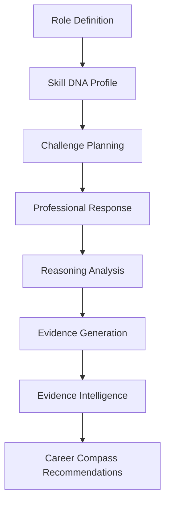
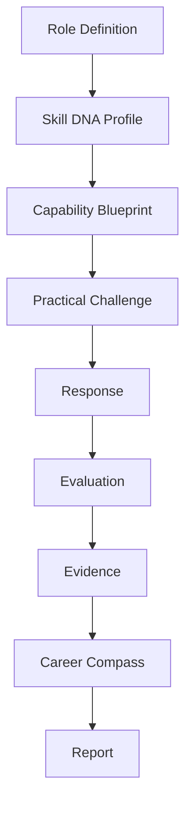
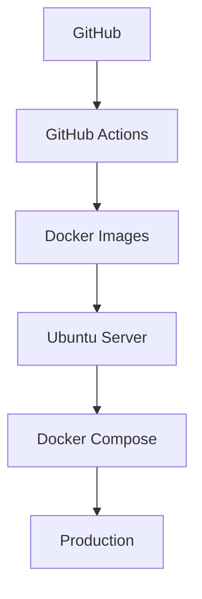

# Final System Overview

## Table of Contents

1. Executive Summary
2. Vision
3. Problem Statement
4. Solution Overview
5. Core Principles
6. System Architecture (7-Layer Stack)
7. Core Engines
8. User Journey
9. Technology Stack
10. Security
11. AI Architecture
12. Data Flow
13. Deployment
14. Engineering Standards
15. Future Vision
16. Conclusion

---

# 1. Executive Summary

## Project

**PWNDORA SkillScan X**

### Tagline

> **Explainable AI for Cybersecurity Capability Intelligence**

## Core Message

> **We do not assess resumes. We assess cybersecurity capability.**

## Purpose

PWNDORA SkillScan X is an Adaptive Cybersecurity Capability Intelligence Platform that transforms traditional capability assessments into structured, evidence-driven evaluations using explainable artificial intelligence.

Instead of evaluating memorized answers or resumes, PWNDORA SkillScan X evaluates how professionals reason through real-world cybersecurity scenarios, producing transparent reports and personalized Career Compass pathways.

---

# 2. Vision

To build the world's most trusted explainable cybersecurity capability intelligence platform by combining structured AI reasoning, Skill DNA modeling, transparent evaluation, and Community Intelligence.

---

# 3. Problem Statement

Traditional cybersecurity hiring suffers from:

- Unstructured capability assessments
- Inconsistent evaluation
- Subjective scoring
- Limited evidence
- Poor professional feedback
- No personalized learning path

Organizations struggle to identify genuine cybersecurity capability beyond resumes and certifications.

PWNDORA SkillScan X solves this by focusing on **capability over certification** and **evidence over resume**.

---

# 4. Solution Overview

PWNDORA SkillScan X addresses these challenges through a structured capability assessment pipeline.



Each engine has a single responsibility and communicates through structured domain models.

---

# 5. Core Principles

The platform is built on four design principles:



And six engineering principles:



Every architectural decision supports these principles.

---

# 6. System Architecture (7-Layer Stack)

```mermaid
flowchart TD
    subgraph L1["1. Presentation Layer"]
        PL[React Frontend + Mobile (future)]
    end
    subgraph L2["2. API Gateway Layer"]
        AG[FastAPI + Nginx + Authentication]
    end
    subgraph L3["3. Adaptive Intelligence Layer"]
        AIL[Assessment Orchestration / Routing]
    end
    subgraph L4["4. AI Decision Engine"]
        ADE[Skill DNA | Reasoning | Evidence]
    end
    subgraph L5["5. Learning Orchestration Layer"]
        LOL[Career Compass | AI Mentor | Pathways]
    end
    subgraph L6["6. Community Intelligence Layer"]
        CIL[Benchmarking | Peer Analysis | Heatmaps]
    end
    subgraph L7["7. Data Platform"]
        DP[PostgreSQL | Skill DNA Graph | Vectors]
    end
    PL --> AG --> AIL --> ADE --> LOL --> CIL --> DP
```

### Layer Descriptions

**1. Presentation Layer**: React-based frontend delivering the professional, capability analyst, and administration interfaces.

**2. API Gateway Layer**: FastAPI backend with Nginx reverse proxy handling authentication, rate limiting, and request routing.

**3. Adaptive Intelligence Layer**: Routes professionals through personalized capability assessment flows based on Skill DNA Profile and past performance.

**4. AI Decision Engine**: The core intelligence — Skill DNA Engine, Capability Reasoning Engine, and Evidence Intelligence Engine process structured AI outputs.

**5. Learning Orchestration Layer**: Generates Career Compass pathways and provides AI Mentor guidance without ever answering assessment challenges.

**6. Community Intelligence Layer**: Provides anonymous benchmarking, Capability Heatmap aggregation, and peer group analysis.

**7. Data Platform**: PostgreSQL for transactional data, vector storage for embeddings, and the Skill DNA Graph for capability relationship modeling.

---

# 7. Core Engines

## Skill DNA Engine

Transforms Role Definitions into structured Skill DNA Profiles — a unique capability fingerprint derived from evidence.

## Capability Intelligence Engine

Coordinates the capability assessment lifecycle and practical challenge execution.

## Practical Challenge Engine

Generates capability-aligned cybersecurity scenarios that test real reasoning, not memorization.

## Capability Reasoning Engine

Evaluates professional reasoning using structured workflows and evidence chains.

## Evidence Intelligence Engine

Produces transparent, evidence-backed explanations for every score and finding.

## Learning Path Engine

Generates personalized Career Compass recommendations based on capability gaps and Skill DNA analysis.

## Role Intelligence Engine

Parses and analyzes Role Definitions to extract capability requirements and generate Skill DNA Profiles.

---

# 8. User Journey



The experience remains traceable from the uploaded Role Definition to the final report.

---

# 9. Technology Stack

| Layer          | Technology                                   |
| -------------- | -------------------------------------------- |
| Frontend       | React + TypeScript + Vite                    |
| Styling        | Tailwind CSS                                 |
| Backend        | FastAPI                                      |
| Database       | PostgreSQL                                   |
| ORM            | SQLAlchemy                                   |
| Migrations     | Alembic                                      |
| Authentication | JWT                                          |
| AI             | Provider abstraction with structured outputs |
| Deployment     | Docker + Docker Compose                      |
| CI/CD          | GitHub Actions                               |
| Reverse Proxy  | Nginx                                        |

---

# 10. Security

Security controls include:

- JWT authentication
- Role-based access control
- Input validation
- Structured AI validation
- Audit logging
- HTTPS
- Secure configuration management
- Defense-in-depth architecture

AI MUST NEVER answer capability assessments — only mentor and explain. The platform assumes that external AI outputs are untrusted until validated.

---

# 11. AI Architecture



AI is used to generate structured information and provide mentorship.

Business rules remain deterministic and application-controlled.

---

# 12. Data Flow



Every object is versioned, validated, and traceable.

---

# 13. Deployment

Deployment pipeline:



Observability includes:

- Structured logs
- Metrics
- Health checks
- Monitoring
- Alerting

---

# 14. Engineering Standards

PWNDORA SkillScan X follows:

- Modular Monolith architecture
- Domain-Driven Design
- Feature-first frontend
- OpenAPI-first APIs
- Immutable assessment history
- Structured AI outputs
- Comprehensive testing
- Automated deployments

Engineering discipline is prioritized over unnecessary complexity.

---

# 15. Future Vision

Future evolution includes:

- **Cyber Twin**: Portable digital representation of verified cybersecurity capability
- **Skill DNA Graph**: Networked capability relationships and trends
- **Community Intelligence**: Anonymous benchmarking against peer groups
- **AI Mentor**: Learning companion that explains without answering
- **Capability Heatmap**: Visualization of verified strengths and gaps
- Enterprise multi-tenancy
- Cyber range integration
- Organization-specific assessment libraries
- Public APIs and SDKs
- AI agent collaboration
- Workforce intelligence analytics

These capabilities extend the platform without changing its core architectural principles.

---

## Related Documents

- [Implementation Roadmap](36-implementation-roadmap.md)
- [Project Structure](37-project-structure.md)
- [Risk Analysis](38-risk-analysis.md)
- [Future Roadmap](39-future-roadmap.md)
- [System Architecture](../docs/04-architecture/16-system-architecture.md)

---

# 16. Conclusion

PWNDORA SkillScan X combines explainable AI, structured Skill DNA modeling, deterministic engineering, Community Intelligence, and a modular 7-layer architecture to modernize cybersecurity capability assessment. By separating reasoning, evaluation, explanation, and learning into independent engines, the platform provides transparent, reproducible, and actionable assessments that are valuable to professionals, capability analysts, trainers, and organizations alike.
