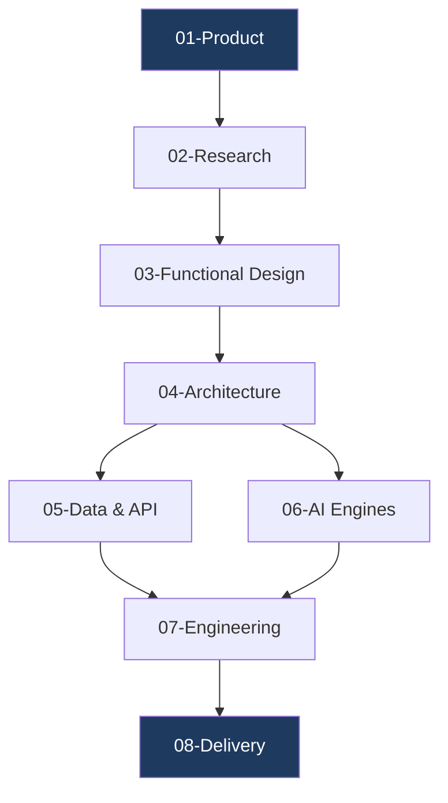

# PWNDORA SkillScan X — Documentation

> Complete architecture and design documentation for the **PWNDORA SkillScan X** Adaptive Cybersecurity Capability Intelligence Platform.

---

## Documentation Map



The documentation is organized into 8 numbered sections (40 documents total) following the product lifecycle: from conception through research, design, architecture, engineering, and delivery.

```
docs/
├── 01-product/           Project overview, problem, solution, vision, requirements
├── 02-research/          Market analysis, competitors, personas, user journey
├── 03-functional-design/ Features, workflows, use cases, UI/UX specification
├── 04-architecture/      System, AI, backend, frontend, data flow
├── 05-data-api/          Database design, ERD, API spec, auth, data models
├── 06-ai-engines/        Skill DNA, capability assessment, practical challenges, reasoning, evidence intelligence
├── 07-engineering/       Testing, devops, deployment, monitoring, security
├── 08-delivery/          Roadmap, project structure, risk, future vision
├── concepts/             Deep-dives: Cyber Twin, Skill Decay, AI Mentor, Gamification +20 more
└── reference/            Glossary, FAQ, Scalability, Observability, Monitoring
```

---

## Document Index

### 01 — Product
*Foundation documents defining the platform's purpose, problem domain, and requirements.*

| # | Document | Description |
|---|---|---|
| 01 | `01-project-overview.md` | High-level project overview |
| 02 | `02-problem-statement.md` | Problem definition |
| 03 | `03-solution-overview.md` | Solution approach |
| 04 | `04-vision-mission.md` | Vision, mission, guiding principles |
| 05 | `05-product-requirements.md` | Product requirements |

### 02 — Research
*Market intelligence, competitive positioning, user understanding, and functional specifications.*

| # | Document | Description |
|---|---|---|
| 06 | `06-market-analysis.md` | Market landscape |
| 07 | `07-competitor-analysis.md` | Competitive analysis |
| 08 | `08-user-personas.md` | User personas |
| 09 | `09-user-journey.md` | User journey maps |
| 10 | `10-functional-requirements.md` | Functional requirements |

### 03 — Functional Design
*Feature definitions, workflows, use cases, and user experience specifications.*

| # | Document | Description |
|---|---|---|
| 11 | `11-non-functional-requirements.md` | NFRs (performance, security, scalability) |
| 12 | `12-system-features.md` | Feature catalog |
| 13 | `13-user-workflows.md` | User workflow diagrams |
| 14 | `14-use-case-specification.md` | Use case specifications |
| 15 | `15-ui-ux-specification.md` | UI/UX design spec |

### 04 — Architecture
*System architecture, AI cognitive pipeline, backend and frontend module design, data flow.*

| # | Document | Description |
|---|---|---|
| 16 | `16-system-architecture.md` | High-level system architecture |
| 17 | `17-ai-cognitive-architecture.md` | AI cognitive pipeline |
| 18 | `18-backend-architecture.md` | Backend module architecture |
| 19 | `19-frontend-architecture.md` | Frontend component architecture |
| 20 | `20-data-flow.md` | End-to-end data flow |

### 05 — Data & API
*Database schema, entity relationships, API contracts, authentication, and data models.*

| # | Document | Description |
|---|---|---|
| 21 | `21-database-design.md` | Database schema design |
| 22 | `22-entity-relationship-diagram.md` | ERD |
| 23 | `23-api-specification.md` | API specification |
| 24 | `24-authentication-authorization.md` | Auth design |
| 25 | `25-data-models.md` | Data model definitions |

### 06 — AI Engines
*Specialized AI modules powering the capability intelligence pipeline.*

| # | Document | Description |
|---|---|---|
| 26 | `26-skill-dna-engine.md` | Skill DNA blueprint generation |
| 27 | `27-capability-assessment-engine.md` | Assessment lifecycle |
| 28 | `28-practical-challenge-engine.md` | Practical challenge scenario generation |
| 29 | `29-capability-reasoning-engine.md` | Capability reasoning & evaluation |
| 30 | `30-evidence-intelligence-engine.md` | Evidence intelligence pipeline |

### 07 — Engineering
*Testing strategy, DevOps, deployment, monitoring, and security architecture.*

| # | Document | Description |
|---|---|---|
| 31 | `31-testing-strategy.md` | Testing approach |
| 32 | `32-devops-architecture.md` | DevOps & CI/CD |
| 33 | `33-deployment-guide.md` | Deployment instructions |
| 34 | `34-monitoring-observability.md` | Monitoring & observability |
| 35 | `35-security-architecture-deep-dive.md` | Security architecture |

### 08 — Delivery
*Implementation roadmap, project structure, risk analysis, and future vision.*

| # | Document | Description |
|---|---|---|
| 36 | `36-implementation-roadmap.md` | Implementation phases |
| 37 | `37-project-structure.md` | Repository organization |
| 38 | `38-risk-analysis.md` | Risk assessment |
| 39 | `39-future-roadmap.md` | Future features |
| 40 | `40-final-system-overview.md` | Complete system overview |

---

## Concepts & Reference

Beyond the 40 numbered specification documents, the documentation includes:

### Concepts (deep-dives)
| Document | Description |
|---|---|
| [Cyber Twin](concepts/cyber-twin.md) | Digital user capability representation |
| [Capability Heatmap](concepts/capability-heatmap.md) | Skill density and gap visualization |
| [AI Mentor](concepts/ai-mentor.md) | AI-powered coaching companion |
| [Career Intelligence](concepts/career-intelligence.md) | AI-driven career pathway generation |
| [Career Compass](concepts/career-compass.md) | Strategic career exploration tool |
| [Learning Path Engine](concepts/learning-path-engine.md) | Dynamic personalized learning paths |
| [Evidence-Based Assessment](concepts/evidence-based-assessment.md) | Core assessment methodology |
| [Confidence Tracking](concepts/confidence-tracking.md) | Statistical certainty in scores |
| [Skill Decay](concepts/skill-decay.md) | Capability attrition modeling |
| [Gamification](concepts/gamification.md) | Engagement and progression systems |
| [Explainable AI](concepts/explainable-ai.md) | AI decision transparency |
| [Privacy & Security Model](concepts/privacy-security-model.md) | Data privacy and security |
| [Community Intelligence](concepts/community-intelligence.md) | Aggregated capability insights |
| ... and 10+ more | See [concepts/](concepts/) |

### Reference
| Document | Description |
|---|---|
| [Glossary](reference/glossary.md) | 40+ terminology definitions |
| [FAQ](reference/faq.md) | Frequently asked questions |
| [Scalability](reference/scalability.md) | Scaling architecture and strategy |
| [Observability](reference/observability.md) | Metrics, logs, traces |
| [Monitoring](reference/monitoring.md) | Alerting and incident response |

---

## Key Documents

| Document | Best For |
|---|---|
| `16-system-architecture.md` | Understanding the full system |
| `17-ai-cognitive-architecture.md` | AI pipeline details |
| `18-backend-architecture.md` | Backend module design |
| `19-frontend-architecture.md` | Frontend component design |
| `23-api-specification.md` | API contracts |
| `31-testing-strategy.md` | Testing approach |
| `35-security-architecture-deep-dive.md` | Security controls |

---

## AI Pipeline Overview


---

## Architecture Decisions

| ADR | Decision | Rationale |
|---|---|---|
| ADR-001 | API-first architecture | Clear frontend/backend separation |
| ADR-002 | Skill DNA as canonical model | Reusable across all modules |
| ADR-003 | Modular monolith (MVP) | Faster iteration, easy extraction later |
| ADR-004 | Evidence intelligence pipeline | Transparent, auditable assessments |
| ADR-005 | Structured AI outputs | Reliable downstream processing |
