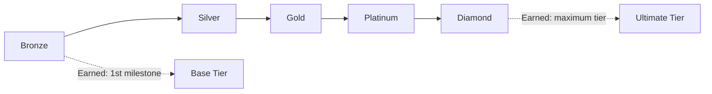

# Achievements

> Recognition system that rewards demonstrated capability milestones, sustained engagement, and platform contributions through badges, titles, and trophies.

## Overview

Achievements provide meaningful recognition for genuine accomplishments — not mere participation. Each achievement is tied to verifiable capability evidence, ensuring that badges represent real skill demonstration.

## Achievement Categories

| Category | Focus | Examples |
|---|---|---|
| **Mastery** | Skill proficiency milestones | "Python Pro", "Threat Modeling Expert" |
| **Growth** | Improvement and progress | "Fastest Improver", "Streak Master" |
| **Exploration** | Breadth and discovery | "Explorer", "Knowledge Seeker" |
| **Challenge** | Difficult accomplishments | "Challenge Conqueror", "Boss Slayer" |
| **Social** | Community contribution | "Mentor", "Community Builder" |
| **Seasonal** | Cyber Season accomplishments | Limited-time seasonal badges |

## Achievement Tiers

| Tier | Criteria | Visual Treatment |
|---|---|---|
| **Bronze** | Entry-level accomplishment | Bronze icon, standard animation |
| **Silver** | Intermediate milestone | Silver icon, shimmer effect |
| **Gold** | Advanced accomplishment | Gold icon, glow effect |
| **Platinum** | Exceptional achievement | Platinum icon, animated particles |
| **Diamond** | Ultimate mastery | Diamond icon, unique animation + title |

## Design Principles

- **Evidence-Gated**: All achievements require verifiable capability evidence
- **Progressive**: Higher tiers require proportionally more effort
- **Discoverable**: Achievement criteria are transparent and trackable
- **Surprise Delight**: Hidden achievements reward unexpected exploration
- **Meaningful**: Achievements represent real skill, not grinding

## Related Documents

- [Gamification](gamification.md)
- [Cyber Seasons](cyber-seasons.md)
- [Weekly Missions](weekly-missions.md)
- [Progress Engine](progress-engine.md)
