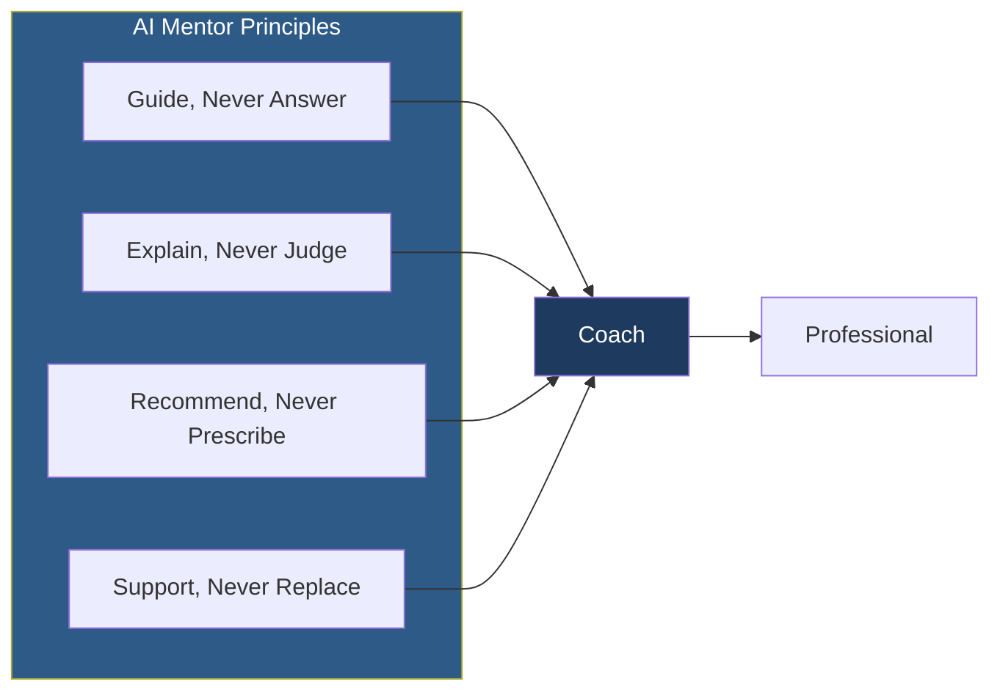
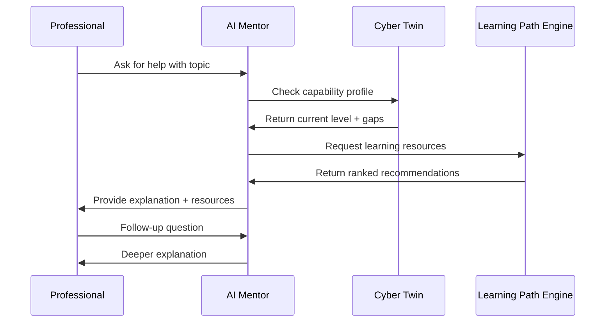

# PWNDORA SkillScan X — AI Mentor

> Guided learning companion for cybersecurity capability development.

---

## Purpose

The AI Mentor is an intelligent guidance engine that helps professionals improve their cybersecurity capability through personalized coaching, explanations, and learning recommendations. The AI Mentor never answers assessment questions — it is strictly a coach, not a test-answerer.

---

## Design Philosophy



### Core Rules

| Rule | Description |
|---|---|
| **Never Answer Assessments** | The AI Mentor will never provide answers to assessment questions |
| **Always Explain** | Every recommendation includes the reasoning behind it |
| **Evidence-Based** | Suggestions trace to specific capability gaps |
| **Professional-Driven** | The professional controls their learning journey |

---

## Interaction Model



---

## Key Capabilities

### 1. Concept Explanation

Explains cybersecurity concepts in the context of the professional's current capability level. A junior analyst gets foundational explanations; a senior analyst gets advanced operational context.

### 2. Gap-Guided Recommendations

Learning recommendations are driven by the professional's actual capability gaps, not generic curriculum:

```
Professional: "What should I learn next?"
AI Mentor: "Based on your assessment, your SOC Operations score is strong (82/100), 
but you have gaps in Cloud Security (45/100). Here are three resources to start..."
```

### 3. Progress Tracking

The AI Mentor tracks which topics the professional has explored and adjusts recommendations accordingly, avoiding repetition and ensuring progressive depth.

### 4. Reassessment Timing

Suggests optimal times for reassessment based on:
- Number of topics studied
- Estimated study time completed
- Gap severity remaining
- Historical improvement rate

---

## Safety Controls

| Control | Implementation |
|---|---|
| Answer prevention | Prompt-level guardrails prevent answer generation |
| Topic boundaries | Mentor stays within cybersecurity domain |
| Confidence thresholds | Low-confidence explanations flagged for human review |
| Feedback loop | Professionals can rate explanation quality |

---

## AI Mentor Prompt Architecture

```
┌─────────────────────────────┐
│    System Prompt            │
│  - Identity: AI Mentor      │
│  - Rules: Never answer      │
│  - Boundaries: Cyber only   │
└─────────────┬───────────────┘
              │
┌─────────────▼───────────────┐
│    Professional Prompt      │
│  - Context from profile     │
│  - Specific question        │
│  - Current capability level │
└─────────────┬───────────────┘
              │
┌─────────────▼───────────────┐
│    Structured Output        │
│  - Explanation              │
│  - Resources                │
│  - Confidence               │
│  - Follow-up suggestions    │
└─────────────────────────────┘
```

---

## Related Documents

| Document | Location |
|---|---|
| Learning Path Engine | `../06-ai-engines/30-evidence-intelligence-engine.md` |
| Cyber Twin | `./cyber-twin.md` |
| Career Compass | `./career-compass.md` |
| Evidence Intelligence | `../06-ai-engines/30-evidence-intelligence-engine.md` |
| Glossary | `../reference/glossary.md` |
