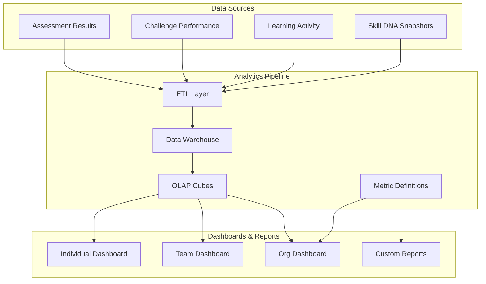

# Analytics

> Comprehensive data analysis and visualization platform for capability intelligence at individual, team, and organizational levels.

## Overview

Analytics provides real-time and historical views into capability data across the platform. It powers dashboards for users, mentors, team leads, and executives — each with role-appropriate granularity and privacy boundaries.

## Analytics Architecture

## Dashboard Types

| Dashboard | Audience | Key Metrics |
|---|---|---|
| **Individual** | Users | Skill scores, progress rate, strengths/gaps, rank, streak |
| **Mentor** | Mentors | Mentee progress, intervention needs, engagement trends |
| **Team** | Team Leads | Team capability heatmap, skill gaps, growth trajectory |
| **Organization** | HR/Exec | Workforce capability inventory, risk areas, benchmarking |

## Key Metrics

- **Capability Score**: Weighted composite of assessment and challenge performance
- **Growth Rate**: Skill score change over configurable time windows
- **Engagement Score**: Composite of frequency, depth, and consistency metrics
- **Confidence Score**: Statistical confidence in capability measurements

## Related Documents

- [Community Intelligence](community-intelligence.md)
- [Capability Heatmap](capability-heatmap.md)
- [Progress Engine](progress-engine.md)
- [Privacy & Security Model](privacy-security-model.md)
