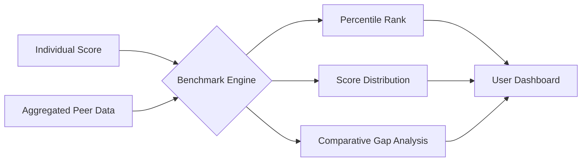

# Benchmarking

> Comparison of individual, team, or organizational capability scores against relevant peer groups, industry standards, or role-specific baselines.

## Overview

Benchmarking provides context for capability scores. Rather than absolute numbers, users see how their capabilities compare to relevant peer groups — enabling informed self-assessment and organizational workforce planning.

## Benchmark Types

| Benchmark | Comparison Group | Use Case |
|---|---|---|
| **Role Benchmark** | All individuals with the same role | Individual career planning |
| **Experience Level** | Individuals with similar experience | Realistic self-assessment |
| **Industry** | Organizations in the same industry | Organizational competitiveness |
| **Geographic** | Same region/market | Regional talent landscape |
| **Custom Cohort** | User-defined peer group | Flexible comparison needs |

## Benchmark Data Flow

## Privacy & Accuracy

- Benchmarks use only anonymized, aggregated data
- Minimum cohort size enforced (n >= 30) before reporting
- Scores are reported as percentiles and distributions, not exact comparisons
- Outliers are automatically excluded from benchmark calculations

## Related Documents

- [Community Intelligence](community-intelligence.md)
- [Analytics](analytics.md)
- [Team Assessment](team-assessment.md)
- [Privacy & Security Model](privacy-security-model.md)
