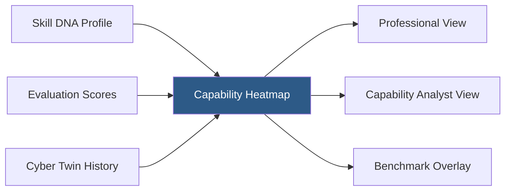
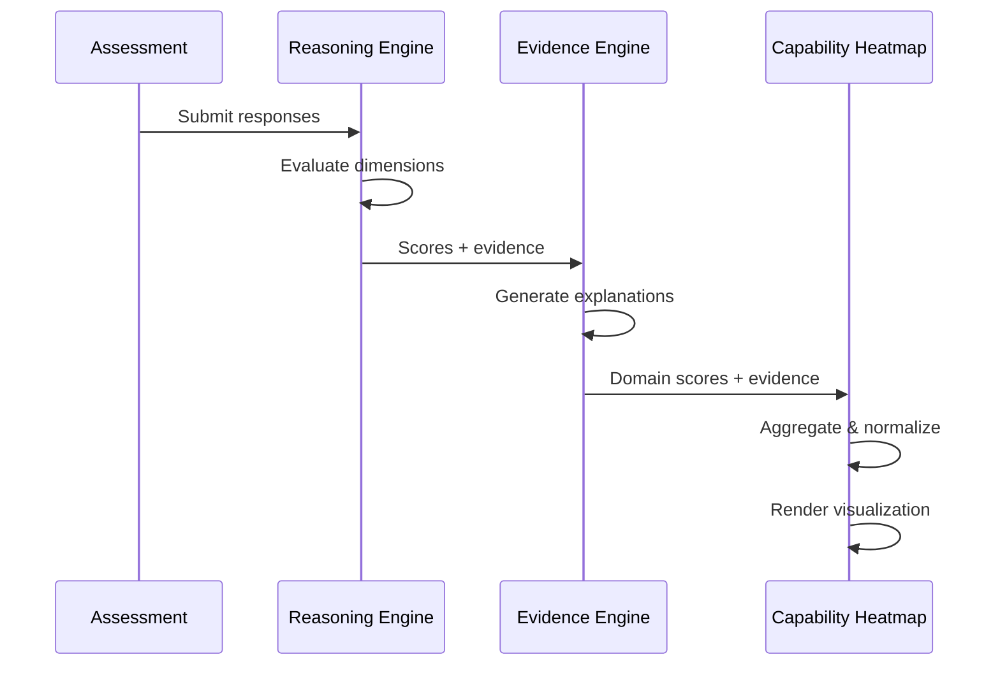

# PWNDORA SkillScan X — Capability Heatmap

> Multi-dimensional visualization of cybersecurity capability across domains.

---

## Purpose

The Capability Heatmap provides an at-a-glance visualization of a professional's verified cybersecurity capability across multiple domains. Unlike a single overall score, the heatmap reveals the multi-dimensional nature of cybersecurity expertise — showing strengths, gaps, and the overall capability landscape.

---

## Overview



---

## Visualization Components

### Radar Chart (Primary)

The primary visualization is a radar chart with axes representing assessed domains:

```
            SOC Operations
                 ▲
                 │
    Threat Hunting│  Incident Response
          │       │       │
          └───────┼───────┘
                 │
    Cloud Sec ───┼─── Digital Forensics
                 │
                 │
            Malware Analysis
```

### Score Breakdown

Each domain displays:

- Numeric score (0–100)
- Confidence level (high / medium / low)
- Trend indicator (improving / stable / declining)
- Evidence count (number of supporting evidence items)

---

## Data Flow



---

## Domain Scoring

### NICE Framework Alignment

| Domain | NICE Work Role Mapping |
|---|---|
| SOC Operations | Cyber Defense Analyst, Cyber Defense Incident Responder |
| Incident Response | Cyber Defense Incident Responder |
| Threat Hunting | Cyber Defense Analyst, Threat/Warning Analyst |
| Digital Forensics | Digital Forensics Analyst |
| Malware Analysis | Cyber Defense Forensics Analyst, Exploitation Analyst |
| Cloud Security | Cloud Security Architect, Systems Security Analyst |
| Identity Security | Systems Security Analyst, Security Control Assessor |

### Score Calculation

```
Domain Score = Σ(Weight_i × Score_i) / Σ(Weight_i)

Where:
- Score_i = score for each assessment dimension in the domain
- Weight_i = difficulty weight × recency weight
```

---

## Views

### Professional View

The professional sees their capability landscape with:
- Radar chart of all assessed domains
- Strengths (top 3 domains)
- Growth areas (bottom 3 domains)
- Trend arrows showing improvement over time
- Career Compass alignment (gap between current and target)

### Capability Analyst View

The capability analyst sees:
- Same radar chart with role benchmark overlay
- Comparison mode (side-by-side professionals)
- Evidence drill-down per domain
- Readiness level summary
- Interview focus recommendations

---

## Related Documents

| Document | Location |
|---|---|
| Cyber Twin | `./cyber-twin.md` |
| Skill DNA Engine | `../06-ai-engines/26-skill-dna-engine.md` |
| Career Compass | `./career-compass.md` |
| Reporting | `../06-ai-engines/30-evidence-intelligence-engine.md` |
| Glossary | `../reference/glossary.md` |
