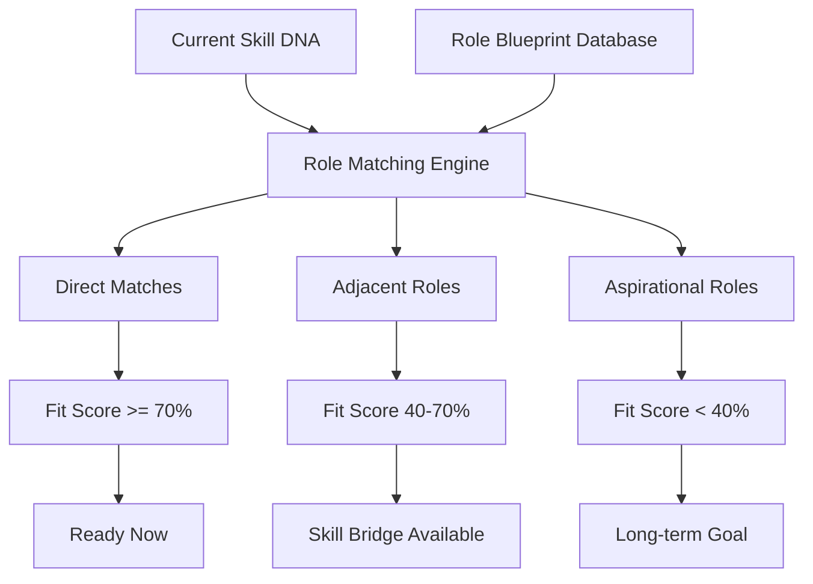

# Career Compass

> Strategic career exploration tool that maps capability profiles to potential career trajectories, adjacent roles, and growth opportunities.

## Overview

Career Compass provides users with a panoramic view of their career possibilities. By analyzing their Skill DNA against a vast landscape of role blueprints, it reveals not just direct career paths but adjacent opportunities the user may not have considered.

## Exploration Model

## Compass Views

| View | Description |
|---|---|
| **Radar View** | Current vs. target role capability comparison |
| **Landscape View** | Map of all reachable roles with proximity indicators |
| **Bridge View** | Specific skill gaps and bridging pathways to target roles |
| **Timeline View** | Estimated time to readiness for each target role |

## Career Insights

- **Adjacent Opportunity Discovery**: Roles 40-70% match that require minimal upskilling
- **Skill Transfer Maps**: How current capabilities transfer across industries and functions
- **Market Demand Overlay**: Real-time labor market data mapped to role blueprints
- **Growth Trajectory**: Historical progression patterns of similar professionals

## Related Documents

- [Career Intelligence](career-intelligence.md)
- [Learning Path Engine](learning-path-engine.md)
- [AI Mentor](ai-mentor.md)
- [Knowledge Graph](knowledge-graph.md)
