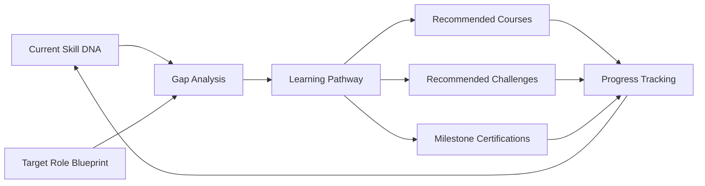

# Career Intelligence

> AI-driven career pathway generation and personalized development planning based on validated capability evidence.

## Overview

Career Intelligence connects current capability profiles to aspirational roles. It analyzes Skill DNA, identifies gaps, and generates actionable learning pathways that close the distance between where a user is and where they want to be.

## Pathway Generation

## Key Capabilities

- **Role Fit Score**: Percentage match between current capabilities and target role requirements
- **Gap Analysis**: Specific capability deficiencies ranked by criticality
- **Learning Path Generation**: Curated sequence of learning activities and challenges
- **Milestone Tracking**: Clear progression markers with evidence checkpoints
- **Adjacent Role Discovery**: Identification of alternative career paths based on capability overlap

## Integration

Career Intelligence draws from [Skill DNA Engine](../docs/06-ai-engines/26-skill-dna-engine.md) for role blueprint data and feeds into [AI Mentor](ai-mentor.md) for personalized coaching. See also [Career Compass](career-compass.md).

## Related Documents

- [Skill DNA Engine](../docs/06-ai-engines/26-skill-dna-engine.md)
- [AI Mentor](ai-mentor.md)
- [Career Compass](career-compass.md)
- [Learning Path Engine](learning-path-engine.md)
