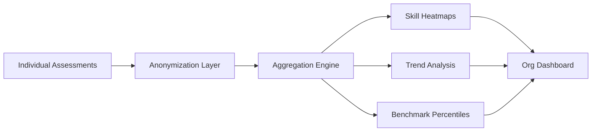

# Community Intelligence

> Aggregated, anonymized capability data that surfaces organizational and industry-wide skill trends.

## Overview

Community Intelligence transforms individual assessment data into collective insight. By aggregating Skill DNA profiles across users, organizations, and industries, it reveals capability patterns that inform workforce planning, learning content creation, and strategic talent decisions.

## Data Flow

## Key Capabilities

- **Skill Heatmaps**: Visual representation of capability density across roles and teams
- **Trend Analysis**: Temporal tracking of skill emergence, growth, and decline
- **Benchmark Percentiles**: Individual and team percentile rankings against peer groups
- **Industry Comparisons**: Cross-organization anonymized benchmarking
- **Gap Analysis**: Identification of critical skill shortages at team, org, and industry levels

## Privacy Controls

All community intelligence features operate on anonymized, aggregated data. No individual assessment results are exposed. Users can opt out of community contribution at any time. See [Privacy & Security Model](privacy-security-model.md) for details.

## Related Documents

- [Capability Heatmap](capability-heatmap.md)
- [Benchmarking](../docs/reference/glossary.md) (glossary)
- [Analytics](analytics.md)
