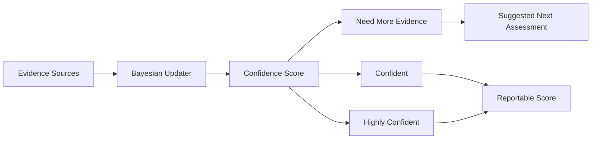

# Confidence Tracking

> Statistical modeling of measurement certainty for every assessed capability, enabling reliable skill inference and informed decision-making.

## Overview

Confidence Tracking quantifies how sure the system is about each capability assessment. Rather than presenting a single score, the platform communicates a confidence interval that reflects the amount and quality of evidence collected.

## Confidence Model

## Factors Affecting Confidence

| Factor | Impact | Description |
|---|---|---|
| **Evidence Count** | Positive | More assessments = higher confidence |
| **Evidence Variety** | Positive | Different assessment types strengthen confidence |
| **Consistency** | Positive | Repeated similar results increase confidence |
| **Recency** | Time-weighted | Recent evidence weighted more heavily |
| **Difficulty Matched** | Positive | Assessments at appropriate difficulty provide stronger signal |
| **Time Since Last** | Negative | Confidence decays over time without new evidence |

## Confidence Levels

| Level | Range | Meaning |
|---|---|---|
| **Insufficient** | 0-30% | More evidence needed before reporting |
| **Low** | 30-50% | Directional indicator, not reliable for decisions |
| **Moderate** | 50-70% | Useful with caveats |
| **High** | 70-90% | Reliable for most decisions |
| **Very High** | 90-100% | Maximum confidence, minimal uncertainty |

## Related Documents

- [Skill Decay](skill-decay.md)
- [Behavior Tracking](behavior-tracking.md)
- [Evidence-Based Assessment](evidence-based-assessment.md)
- [Capability Assessment Engine](../docs/06-ai-engines/27-capability-assessment-engine.md)
