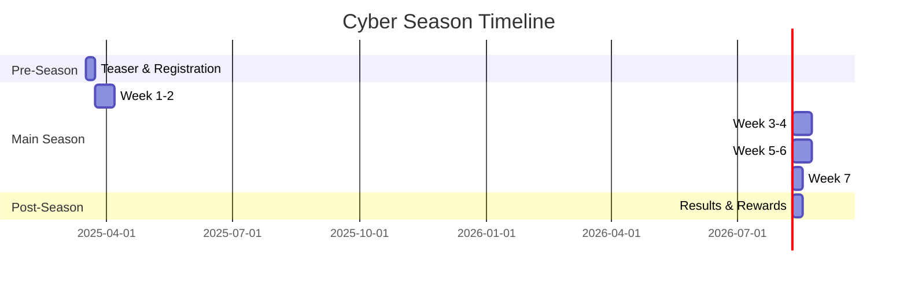

# Cyber Seasons

> Themed competitive cycles that organize platform activity into engaging, time-limited seasons with unique challenges, exclusive rewards, and community competition.

## Overview

Cyber Seasons are the platform's recurring engagement framework — themed competitive cycles (typically quarterly) that organize content, challenges, and community activity around a central narrative or skill focus.

## Season Structure

## Season Components

| Component | Description |
|---|---|
| **Theme** | Central narrative or focus area (e.g., "Cloud Defense Season") |
| **Skill Focus** | Capability clusters emphasized during the season |
| **Weekly Missions** | Themed mission sets aligned to the season narrative |
| **Leaderboards** | Seasonal rankings across individual, team, and org tracks |
| **Exclusive Rewards** | Limited-edition achievements, badges, and titles |
| **Community Events** | Live challenges, webinars, and collaborative activities |

## Season Tiers

| Tier | Entry Requirement | Rewards Level |
|---|---|---|
| **Rookie** | Open to all | Standard |
| **Professional** | Previous season participation or skill threshold | Enhanced |
| **Elite** | Top 10% previous season or invitation | Premium |
| **Champion** | Season winners and title holders | Exclusive |

## Related Documents

- [Gamification](gamification.md)
- [Weekly Missions](weekly-missions.md)
- [Achievements](achievements.md)
- [Community Intelligence](community-intelligence.md)
