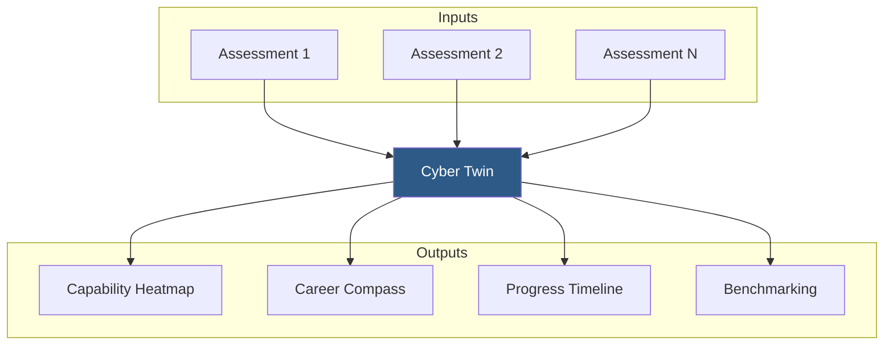
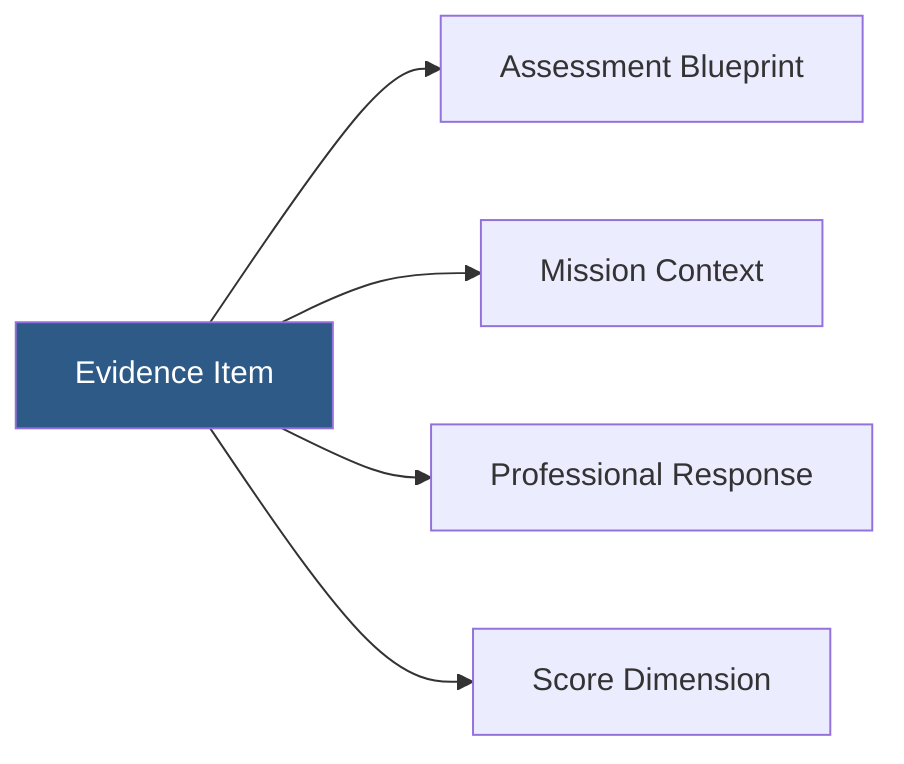
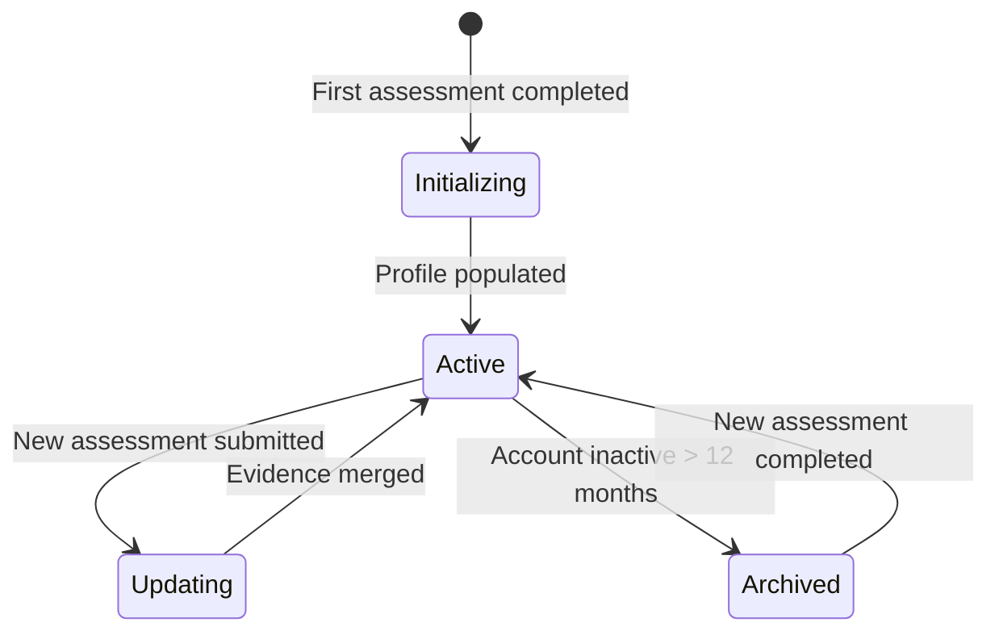
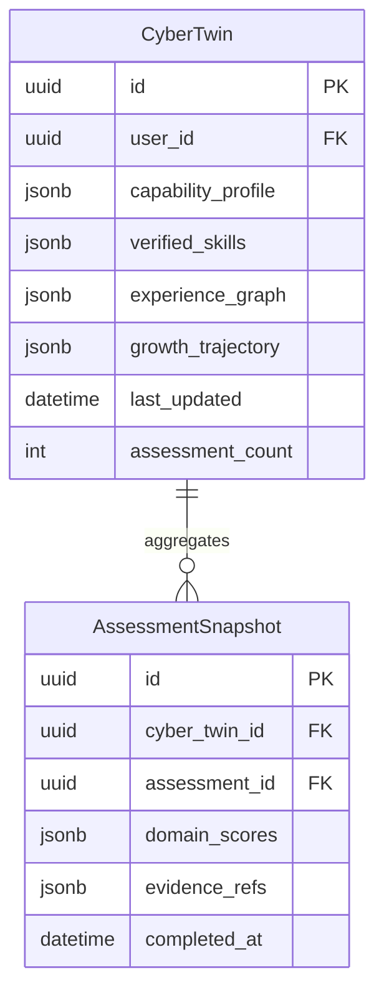

# PWNDORA SkillScan X — Cyber Twin

> Persistent digital representation of verified cybersecurity capability.

---

## Purpose

The Cyber Twin is a persistent digital identity that represents a professional's verified cybersecurity capability profile. Unlike traditional resumes or certifications that capture static credentials, the Cyber Twin is a living artifact that evolves with every assessment the professional completes.

---

## Overview

---

## Core Concepts

### Capability Profile

The Cyber Twin's central data structure contains:

- Verified skill scores across cybersecurity domains
- Demonstrated knowledge areas mapped to NICE framework
- MITRE ATT&CK technique coverage history
- Assessment metadata (dates, roles, difficulty levels)
- Growth trajectory and trend data

### Evidence Graph

Every score in the Cyber Twin traces back to specific assessment evidence:

---

## Lifecycle

### Stages

| Stage | Description |
|---|---|
| **Initializing** | First assessment completed, baseline profile created |
| **Active** | Profile available for queries, heatmap, compass |
| **Updating** | New assessment evidence being merged into profile |
| **Archived** | Profile stored but not actively updated |

---

## Data Model

---

## Capability Score Aggregation

Scores are aggregated across assessments using a weighted model:

| Factor | Weight | Rationale |
|---|---|---|
| Recency | Higher weight for recent assessments | Capability changes over time |
| Difficulty | Higher weight for harder assessments | Stronger signal of capability |
| Consistency | Bonus for consistent scores across assessments | Reduces variance from single outliers |

---

## Key Features

### Cross-Assessment Tracking

The Cyber Twin aggregates evidence from every assessment, building a comprehensive capability picture that no single assessment can provide.

### Growth Visualization

Professionals can view their capability development over time, seeing which domains improved and where gaps persist.

### Benchmarking

The Cyber Twin enables anonymized comparison against peers, role standards, and industry benchmarks.

---

## Related Documents

| Document | Location |
|---|---|
| System Architecture | `../04-architecture/16-system-architecture.md` |
| Skill DNA Engine | `../06-ai-engines/26-skill-dna-engine.md` |
| Capability Heatmap | `./capability-heatmap.md` |
| Career Compass | `./career-compass.md` |
| Glossary | `../reference/glossary.md` |
