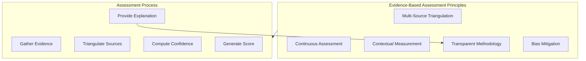

# Evidence-Based Assessment

> Core assessment philosophy and methodology that grounds all capability measurements in verifiable, multi-source evidence rather than self-reporting or proxy indicators.

## Overview

Evidence-Based Assessment (EBA) is the foundational methodology of PWNDORA SkillScan X. Unlike traditional assessments that rely on self-reported proficiency or single-point testing, EBA triangulates capability evidence from multiple sources and formats to produce reliable, defensible measurements.

## Evidence Sources

| Source | Type | Weight |
|---|---|---|
| **Knowledge Assessments** | Direct testing | High |
| **Practical Challenges** | Applied demonstration | Very High |
| **Scenario Responses** | Situational judgment | Medium |
| **Behavioral Analysis** | Inferred from patterns | Medium |
| **Peer Validation** | Social verification | Low |
| **Self-Assessment** | Self-reported | Contextual |

## Assessment Philosophy

## Key Principles

| Principle | Description |
|---|---|
| **Multi-Source** | No single data point determines a score — evidence must converge from multiple sources |
| **Continuous** | Assessment is ongoing, not episodic — every interaction is evidence |
| **Contextual** | Scores are interpreted relative to role requirements, not in isolation |
| **Transparent** | Every score is explainable to the user with evidence attribution |
| **Bias-Mitigated** | Assessment design actively works to reduce demographic and cognitive biases |

## Related Documents

- [Capability Assessment Engine](../docs/06-ai-engines/27-capability-assessment-engine.md)
- [Explainable AI](explainable-ai.md)
- [Confidence Tracking](confidence-tracking.md)
- [Capability Reasoning Engine](../docs/06-ai-engines/29-capability-reasoning-engine.md)
