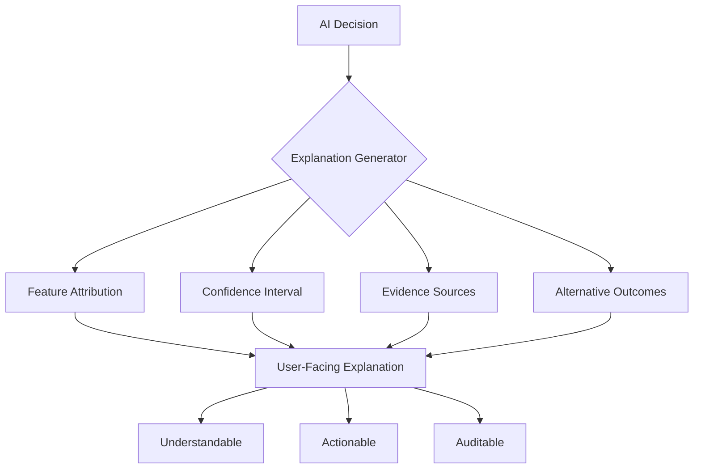

# Explainable AI

> Transparency and interpretability framework for all AI-driven decisions, assessments, and recommendations within the platform.

## Overview

Explainable AI (XAI) ensures that every scoring decision, pathway recommendation, and capability inference is transparent, auditable, and understandable. Users, mentors, and organizations must be able to understand *why* a particular result was produced.

## Explanation Types

| Type | Audience | Example |
|---|---|---|
| **Global** | All users | "This score is based on 3 assessments and 5 challenges completed in the last 60 days" |
| **Local** | Detail-oriented users | "Question 12 was weighted 2x because it targets a core skill" |
| **Contrastive** | Users comparing results | "Your score is 10 points higher than last month because you improved in X and Y" |
| **Counterfactual** | Users seeking improvement | "If you improve Threat Modeling from 60 to 80, your overall score increases by 12 points" |

## Explanation Architecture

## XAI Techniques Used

| Technique | Application |
|---|---|
| **Feature Attribution** | Which evidence contributed most to a score |
| **Confidence Intervals** | Range of plausible scores given available evidence |
| **Counterfactual Explanations** | What would change the outcome |
| **Attention Visualization** | What parts of input the model focused on |
| **Decision Trees** | Transparent rule-based explanations for simple decisions |

## Related Documents

- [Evidence Intelligence Engine](../docs/06-ai-engines/30-evidence-intelligence-engine.md)
- [Confidence Tracking](confidence-tracking.md)
- [Privacy & Security Model](privacy-security-model.md)
- [Capability Reasoning Engine](../docs/06-ai-engines/29-capability-reasoning-engine.md)
