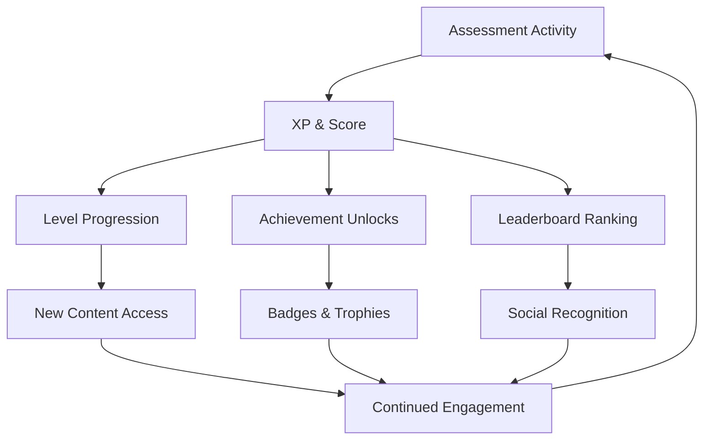

# Gamification

> Motivation mechanics and progression systems that drive sustained engagement through evidence-based capability development.

## Overview

Gamification transforms skill assessment and development into an engaging, rewarding experience. It applies proven game mechanics — points, levels, achievements, leaderboards, seasonal events — to intrinsic motivation drivers: mastery, autonomy, purpose, and social recognition.

## Progression Architecture

## Game Mechanics

| Mechanic | Purpose | Implementation |
|---|---|---|
| **Experience Points (XP)** | Quantify effort and progress | Awarded per completed assessment, challenge, and learning activity |
| **Levels** | Milestone progression | Every N XP unlocks new level with associated benefits |
| **Achievements** | Specific accomplishment recognition | Badges for streaks, mastery, exploration, and social contribution |
| **Leaderboards** | Social comparison and motivation | Per-role, per-org, and global rankings with privacy controls |
| **Streaks** | Consistency rewards | Daily/weekly activity bonuses with multiplier effects |
| **Cyber Seasons** | Themed competitive cycles | Quarterly seasons with unique challenges and exclusive rewards |

## Design Principles

- **Evidence-first**: Rewards are tied to demonstrated capability, not just participation
- **Intrinsic over extrinsic**: Mechanics amplify intrinsic motivation rather than replacing it
- **Privacy-respecting**: Leaderboards and social features respect user visibility preferences
- **Anti-gaming**: Safeguards prevent mechanical exploitation without genuine skill demonstration

## Related Documents

- [Cyber Seasons](cyber-seasons.md)
- [Achievements](achievements.md)
- [Weekly Missions](weekly-missions.md)
- [Progress Engine](progress-engine.md)
