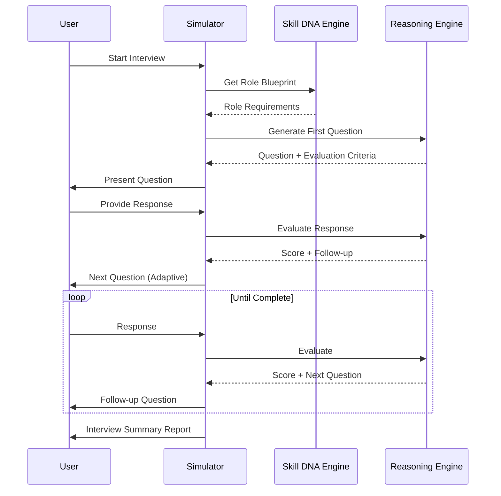

# Interview Simulator

> AI-powered mock interview environment that evaluates candidates through realistic, role-specific interview scenarios with adaptive questioning.

## Overview

The Interview Simulator bridges the gap between assessment scores and real-world interview performance. It provides a low-stakes environment for candidates to practice and demonstrates their capabilities through conversational AI interviews.

## Simulation Flow

## Question Types

| Type | Description | Evaluation Criteria |
|---|---|---|
| **Technical** | Role-specific technical knowledge questions | Accuracy, depth, clarity |
| **Scenario** | Situational problem-solving scenarios | Approach, reasoning, solution quality |
| **Behavioral** | Past experience and behavior questions | STAR method, relevance, impact |
| **Whiteboard** | Live problem-solving with shared canvas | Process, communication, correctness |
| **Coding** | Live coding challenges (technical roles) | Code quality, efficiency, testing |

## Adaptive Strategy

The simulator adjusts question difficulty and focus areas in real-time based on:
- Previous response quality
- Identified skill gaps in the user's Skill DNA
- Role blueprint priority weights
- Time remaining and coverage goals

## Related Documents

- [Capability Assessment Engine](../docs/06-ai-engines/27-capability-assessment-engine.md)
- [Skill DNA Engine](../docs/06-ai-engines/26-skill-dna-engine.md)
- [AI Mentor](ai-mentor.md)
- [Career Intelligence](career-intelligence.md)
