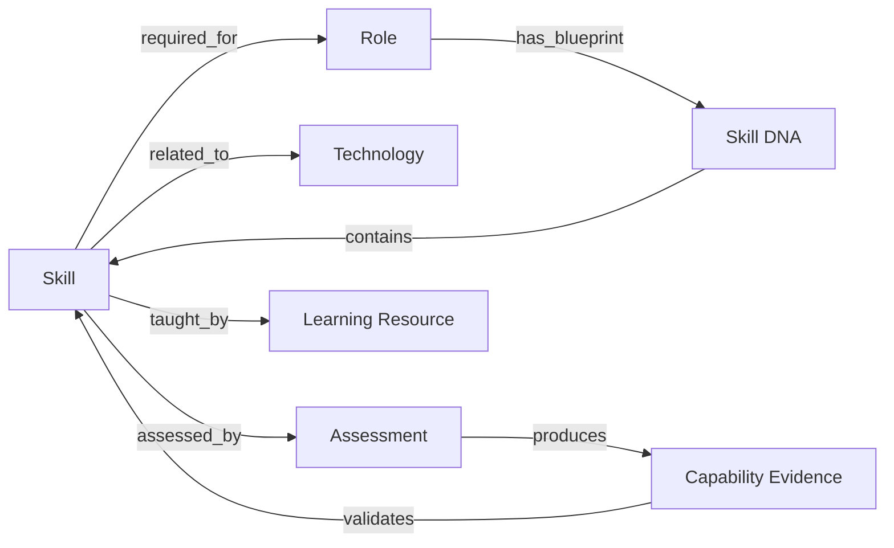

# Knowledge Graph

> A semantic network connecting skills, roles, technologies, learning resources, and capability evidence into a navigable intelligence map.

## Overview

The Knowledge Graph is the semantic backbone of PWNDORA SkillScan X. It models relationships between domain entities — skills, roles, technologies, frameworks, assessments, learning content — enabling intelligent querying, pathway generation, and capability inference.

## Graph Structure

## Entity Types

| Entity | Description | Relationships |
|---|---|---|
| **Skill** | Discrete capability (e.g., "Python", "Threat Modeling") | prerequisite_of, related_to, version_of |
| **Role** | Job function or position | requires_skill, typical_progression |
| **Technology** | Tool, framework, or platform | implements_skill, depends_on |
| **Assessment** | Evaluation method or activity | measures_skill, difficulty_level |
| **Learning Resource** | Course, article, or video | teaches_skill, recommended_for |
| **Skill DNA** | Role-specific capability blueprint | contains_skill, weight, level |

## Inference Capabilities

- **Skill Proximity**: Identify related skills based on graph distance and co-occurrence
- **Transferable Skills**: Surface skills that transfer across seemingly unrelated roles
- **Learning Paths**: Generate optimal sequences of skills to acquire for target roles
- **Gap Impact Analysis**: Determine which role qualifications are affected by specific skill gaps

## Related Documents

- [Skill DNA Engine](../docs/06-ai-engines/26-skill-dna-engine.md)
- [Capability Reasoning Engine](../docs/06-ai-engines/29-capability-reasoning-engine.md)
- [Career Intelligence](career-intelligence.md)
- [Database Design](../docs/05-data-api/21-database-design.md)
