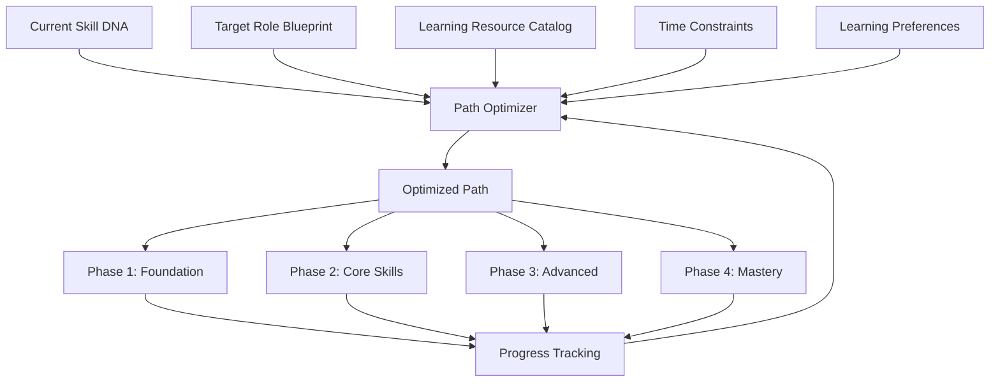

# Learning Path Engine

> Dynamic, personalized learning pathway generation that optimizes skill acquisition sequences based on current capabilities, target roles, and learning preferences.

## Overview

The Learning Path Engine generates optimal sequences of learning activities, assessments, and challenges tailored to each user's current capability profile and aspirational goals. Paths adapt in real-time based on progress and new evidence.

## Path Generation

## Path Optimization Factors

| Factor | Impact | Description |
|---|---|---|
| **Prerequisite Order** | Required | Skills must be learned in dependency order |
| **Capability Gap Size** | Weighted | Larger gaps assigned higher priority |
| **Learning Velocity** | Adaptive | Paths adjust based on observed learning speed |
| **Content Availability** | Constraint | Path uses available learning resources |
| **Time Budget** | Constraint | Path fits within user's available time |
| **Preferred Modality** | Preference | Prioritizes reading, video, or interactive content |

## Path Types

| Type | Description | Best For |
|---|---|---|
| **Fast Track** | Shortest path to target readiness | Time-sensitive goals |
| **Deep Dive** | Most comprehensive coverage | Mastery-oriented learners |
| **Balanced** | Optimized for time × depth | General use case |
| **Maintenance** | Prevent skill decay | Keeping existing skills sharp |

## Related Documents

- [Career Intelligence](career-intelligence.md)
- [Skill DNA Engine](../docs/06-ai-engines/26-skill-dna-engine.md)
- [Weekly Missions](weekly-missions.md)
- [Progress Engine](progress-engine.md)
